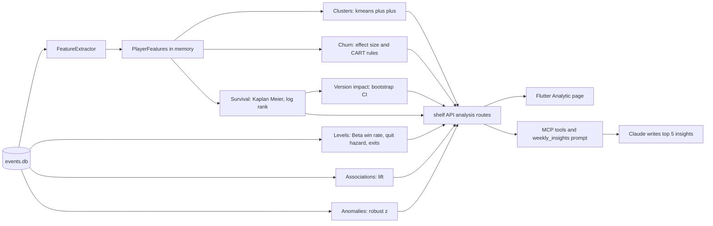
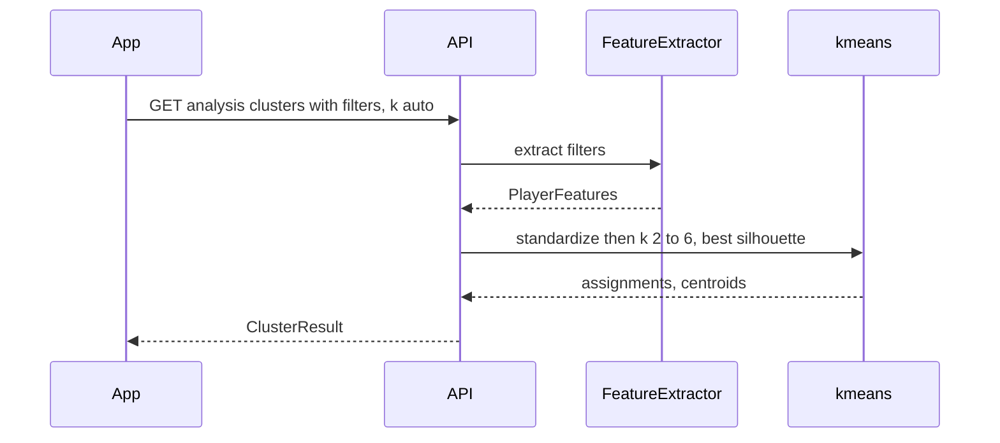
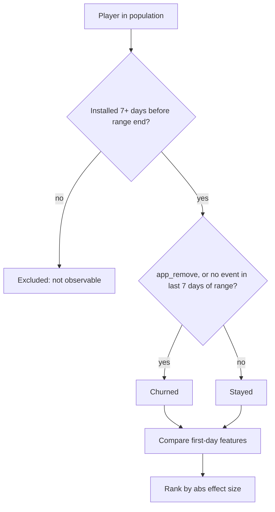
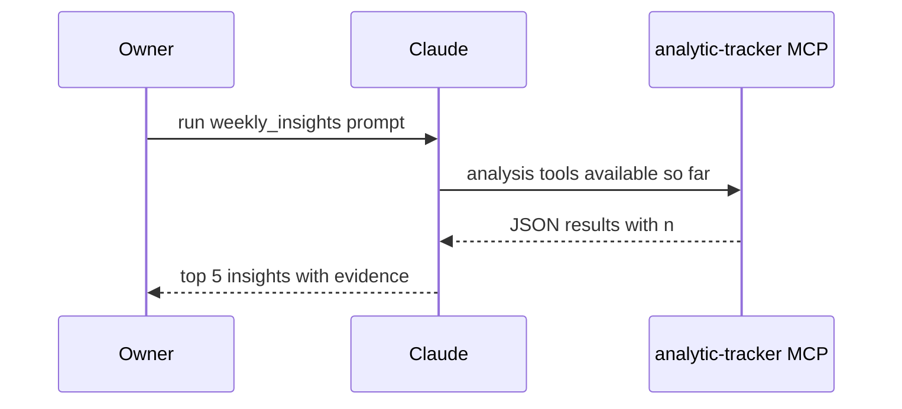
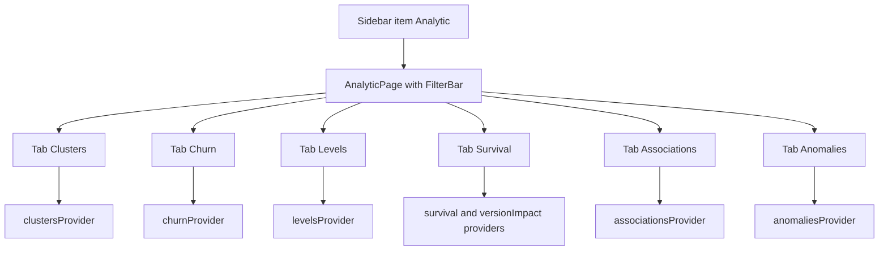

# Analytic tab — design spec (v6)

**Status:** draft for owner review (2026-10-07)
**Related:** `funnel-upgrade-design.md` (v5, in progress), `mcp-server-design.md` (v4), `gameanalytics-dashboard-design.md` (v2 metric rules)

## 1. Goal

A sidebar page **Analytic** that finds patterns nobody asked about ("hidden gems") using lightweight, explainable data-science methods. The page shows findings. It is not a query builder.

| Owner decision (2026-10-07) | Value |
|---|---|
| Methods | **All four**: player clusters, churn drivers, event associations, anomaly alerts |
| Per-player features | **Hybrid**: fixed core set + automatic counts of top N events |
| Where math runs | **A: Dart on server** (new `analysis` module, API routes, MCP tools); app only draws |
| Delivery | Waves (like v5) |
| Added after research (`docs/research/analytic-ml-methods.md`) | **Level difficulty + quit wall**, **churn rules + last actions before quitting**, **survival curves + version impact**, **AI narrative via MCP prompt** |

### Wave order

| Wave | Content | Spec § |
|---|---|---|
| 1 | Player clusters | §4 |
| 2 | Churn drivers + churn rules | §5, §5a |
| 3 | Level difficulty + quit wall, last actions before quitting | §6a, §6b |
| 4 | Survival curves + version impact (shared bootstrap helper) | §6c, §6d |
| 5 | Event associations + anomaly alerts | §6, §7 |
| any time | AI narrative MCP prompt `weekly_insights` (grows with each wave's tools) | §8a |

Predictive per-player models (churn score, XGBoost, Cox, LTV, deep models) are **out of scope** until the data supports them. See research doc §4 for when to revisit.

### Data reality (2026-10-07, `server/data/events.db`)

| Fact | Value | Consequence |
|---|---|---|
| Players / events / days | 282 / 5,002 / 57 (2026-08-07..10-05) | Every method must show `n`; small groups flagged |
| Players active 2+ days | 72 | Churn groups are small; expect "weak" flags |
| Distinct event names | 146 | Auto features need a top-N cut + noise blocklist |
| Level events | `level_N_start/complete/fail` (`stg_*` nearly unused) | Max level parsed from event name |
| Playtime | `user_engagement.params.engagement_time_msec` | Summed per player |

**Honesty rule (all waves):** every finding shows its sample size. A group with < 10 players (cluster, churn side, association support) is shown with a "small sample" badge and is ranked below findings with larger samples.

## 2. Architecture

| Unit | File | Depends on | Pure? |
|---|---|---|---|
| `FeatureExtractor` | `server/lib/src/analysis/features.dart` | `EventStore` SQL | No (reads DB) |
| `kmeans`, `silhouette`, `standardize` | `server/lib/src/analysis/kmeans.dart` | nothing | Yes |
| `churnDrivers` | `server/lib/src/analysis/churn.dart` | `PlayerFeatures` | Yes |
| `cart` (decision tree) | `server/lib/src/analysis/tree.dart` | nothing | Yes |
| `levelStats`, `exits`, `transitions` | `server/lib/src/analysis/levels.dart` | per-player event lists | Yes |
| `kaplanMeier`, `logRank` | `server/lib/src/analysis/survival.dart` | durations + censor flags | Yes |
| `bootstrapCi` | `server/lib/src/analysis/bootstrap.dart` | nothing | Yes |
| `versionImpact` | `server/lib/src/analysis/version_impact.dart` | survival, levels, bootstrap | Yes |
| `associations` | `server/lib/src/analysis/associations.dart` | per-player event sets | Yes |
| `anomalies` | `server/lib/src/analysis/anomalies.dart` | daily series | Yes |
| `weekly_insights` prompt | `server/lib/src/mcp_server.dart` | registered `analysis_*` tools | n/a |
| Result models | `shared/lib/src/analysis_models.dart` | nothing | Yes (JSON) |

Pure units take plain lists/maps and are unit-tested without SQLite, like `FunnelEngine.summarize`.

All routes accept the standard `Filters` (`from`, `to`, `platform?`, `version?`, `test?`). Test devices are excluded by default via the existing `testEventsClause`.

## 3. Shared foundation — per-player features (built in wave 1)

Population = players (non-empty `user_pseudo_id`) with at least one event in the filtered range. Features use only their events in range.

| Feature key | Kind | Definition |
|---|---|---|
| `sessions` | core | count of `session_start` |
| `active_days` | core | distinct `day` |
| `playtime_min` | core | sum `engagement_time_msec` / 60000 |
| `max_level` | core | max N over `^level_(\d+)_(start\|complete)$`, 0 if none |
| `level_fails` | core | count of `^level_\d+_fail$` |
| `tenure_days` | core | days from first to last event in range |
| `ev:<name>` | auto | count of event `<name>` for the top **10** event names by unique players, after the blocklist |

Auto blocklist (never a feature): `screen_view`, `user_engagement`, `session_start`, `first_open`, `app_remove`, `app_clear_data`, `firebase_campaign`, `level_*` (already in core). Constants live in `features.dart` with a `ponytail:` comment (PVM-specific; move to config when a second game arrives).

Clustering preprocessing: `log1p` then z-score per feature. Features with zero variance are dropped and listed in the response as `droppedFeatures`.

## 4. Wave 1 — Player clusters

- k-means++ init, **fixed seed 42**, 10 restarts, max 100 iterations, so the same data always gives the same clusters (stable tests and screenshots).
- `k=auto` (default) tries 2..6 and picks the best mean silhouette. `k=2..8` forces a value. If there are fewer than 20 players, the result is `{clusters: [], reason: "too_few_players"}`.
- Each cluster shows: size `n` and %, the **top 3 distinguishing features** (largest |cluster mean z|) with direction and raw means vs overall (e.g. "level_fails 6.1 vs 1.4 avg"), and an auto label made from the top 2 features ("High level_fails · High sessions").
- Response also includes `silhouette`, `k`, `features` used, `droppedFeatures`, and per cluster the raw mean of every feature (for the heat table).

**App:** cluster cards (one per cluster) + a heat table (clusters × features, cell = mean z, tokens `good`/`bad` color scale) + silhouette shown as "separation: weak / ok / strong" (< 0.25 / < 0.5 / ≥ 0.5).

## 5. Wave 2 — Churn drivers

- **Leakage guard:** compare features from each player's **first 24 h only** (from their first event). Whole-life features such as `active_days` trivially "explain" churn and would hide real drivers.
- Per feature: mean churned, mean stayed, ratio, **Cohen's d** (pooled SD). Binary view too: % of each group that did the thing at all (count > 0).
- Ranked by |d|. A row with either group < 10 players gets the "small sample" badge. Sentence form: "Players who left had 2.4× more `level_fails` on day 1 (d = 0.8)".
- Inactivity threshold **7 days** (constant, `ponytail:` comment).

**App:** the summary line (churned n / stayed n / excluded n), then a ranked table: feature, churned, stayed, ratio, effect bar.

## 5a. Wave 2 — Churn rules

- Same population, label and first-24 h features as §5.
- CART tree: Gini split, threshold candidates = midpoints of sorted distinct values, depth ≤ 3, min leaf **10** players, a split is kept only if it lowers Gini by ≥ 0.01. That gives at most 8 leaves.
- Each leaf becomes a rule: "IF level_fails ≥ 3 AND ev:Reward_request_success = 0 → 82% left (n = 17)". Rules are sorted by n × |leaf churn rate − overall churn rate|.
- Fewer than 20 observable players → `{rules: [], reason: "too_few_players"}`.
- Shown under the drivers table on the same tab (heading "Rules").

## 6a. Wave 3 — Level difficulty + quit wall

- Levels come from `^level_(\d+)_(start|complete|fail)$`, per player in range.
- Win rate per level = complete / (complete + fail) **attempts**, smoothed with an empirical-Bayes Beta prior: α, β fitted by method of moments from all levels with ≥ 5 attempts. Fallback α = β = 1 when fewer than 3 such levels.
- Reached(N) = players with any `level_N_*` event. Stopped(N) = players whose highest level reached is N **and** who are not active in the last 7 days of the range. Quit hazard(N) = Stopped(N) / Reached(N).
- Wall = a level with ≥ 10 players reached and hazard > 2 × the median hazard across such levels.
- Response per level: attempts, completes, fails, raw and smoothed win rate, reached, stopped, hazard, `wall` flag.

**App tab "Levels":** a line chart over level number (smoothed win rate and quit hazard, two token colors), with walls marked, plus a table under it.

## 6b. Wave 3 — Last actions before quitting

- Churned players use the same label as §5 (not limited to first 24 h). Session = `ga_session_id` param. Last session = the session holding the player's final event.
- Exit event = the player's last event after the blocklist (§3) is applied, so `user_engagement` / `screen_view` noise is skipped. Rank exit events by share among churned vs share among stayed players (stayed players' "last event in range"). Lift = churned share / stayed share. Keep exit events with ≥ 5 churned players.
- Transition table: for the top 15 events (after the blocklist) + a `quit` state, P(next | current) from consecutive event pairs per player in `ts_micros` order. Return the top 3 next-steps per event with count ≥ 5.

**App:** on the "Levels" tab under the chart, card "How players leave": exit-event ranking + strongest transitions table.

## 6c. Wave 4 — Survival curves

- Duration = days from a player's first event to their last event in range (inclusive). Event (died) = churned per §5. Censored = everyone else, including players installed less than 7 days before the range end.
- Kaplan–Meier estimate S(t) for t = 0..max days, with Greenwood 95% band. Group by `version` (the player's first version), `platform`, or `cluster` (reuses wave 1). Groups with < 10 players are merged into "Other".
- Two-group or multi-group **log-rank test** → chi-square p-value (k−1 degrees of freedom). Shown as "difference likely real" when p < 0.05, else "could be chance".

**App tab "Survival":** step-line chart, one line per group, band shaded, group picker (version / platform / cluster), p-value sentence.

## 6d. Wave 4 — Version impact

- Groups = players by their first `app_version`. Compare each version with the previous version that has ≥ 20 players.
- Metrics: D1 survival (from §6c), sessions per player, playtime per player, smoothed win rate per level (§6a, levels with ≥ 10 attempts in both versions).
- Difference + 95% CI by percentile bootstrap: 1,000 resamples of players, **seed 42**. Reported only when the CI excludes 0. Each row shows n per version.
- `server/lib/src/analysis/bootstrap.dart` is a pure helper: `bootstrapCi(List<double> a, List<double> b, double Function(List<double>) stat)`.

**App:** on the "Survival" tab, card "What changed in version X": a list of significant differences with CI chips.

## 6. Wave 5 — Event associations

- Per player, the set of events done (auto feature events + core-derived booleans `reached_level_5`, `failed_any_level`). Uses the same blocklist.
- For each ordered pair A, B: support = players with both, confidence = P(B | A), lift = confidence / P(B).
- Keep pairs with support ≥ 5 players and lift ≥ 1.5 (or ≤ 0.67, shown as "less likely"). Sort by lift × log(support). Return the top 20.
- Sentence form: "Players who do `Reward_request_success` are 3.1× more likely to do `pet_buy` (5 players)".

**App:** a ranked list of sentence cards, with support and lift chips.

## 7. Wave 5 — Anomaly alerts

- Daily series in range: DAU, new players (`first_open`), sessions, and daily count of each of the top 15 events, plus completion rate per level (`complete / start`) for levels with ≥ 10 starts.
- Baseline = the previous **14** stored days (rolling, excluding today). Score = robust z = (x − median) / (1.4826 × MAD). A day needs ≥ 7 baseline days. If MAD = 0, flag only when x differs from the median by ≥ 50%.
- Flag |z| ≥ 3. Sort by |z|, latest first on ties. Return ≤ 30 alerts.

**App:** an alert list ("level_5_fail: 23 on 2026-10-03, usual ~4, z = 5.2"). Tapping one opens a small line chart of that series with the flagged day marked (reuses `MetricLineChart`).

## 8. API and MCP

| Route | Wave | Response model |
|---|---|---|
| `GET /analysis/clusters?k=auto` | 1 | `ClusterResult` |
| `GET /analysis/churn` | 2 | `ChurnResult` (drivers + rules) |
| `GET /analysis/levels` | 3 | `LevelResult` (levels + exits + transitions) |
| `GET /analysis/survival?by=version\|platform\|cluster` | 4 | `SurvivalResult` |
| `GET /analysis/version-impact?version=<v>` | 4 | `VersionImpactResult` (default = newest version) |
| `GET /analysis/associations` | 5 | `AssociationResult` |
| `GET /analysis/anomalies` | 5 | `AnomalyResult` |

All take the standard filters. Errors follow the existing 400 `{"error"}`; a bad `by` returns 400 `Invalid by`. Each route has one pass-through MCP tool: `analysis_clusters`, `analysis_churn`, `analysis_levels`, `analysis_survival`, `analysis_version_impact`, `analysis_associations`, `analysis_anomalies`.

## 8a. AI narrative — MCP prompt `weekly_insights`

- An MCP **prompt** (not a tool) registered in `AnalyticMcpServer`. Arguments: `from`, `to` (default last 30 days).
- The prompt text tells Claude to: call every `analysis_*` tool that exists; rank findings by impact × sample size; write the top 5 as one sentence each, plus evidence numbers and `n`; never state a finding that has a small-sample flag without saying so; link related findings across tools (e.g. a cluster that matches a level wall).
- Shipped with wave 1 (clusters only) and extended in text by each later wave. No app code. No API key on the server.
- Later option (not v6): an in-app "Explain" button through the Claude API, after BUG-0010 (auth) is fixed.

## 9. App page

- One file per tab under `app/lib/src/pages/analytic/`. A tab appears only once its wave ships.
- Each tab has a one-line "how to read this" caption. Empty and too-few states use the existing `ErrorRetry` pattern plus a plain message.
- Colors come only from `AnalyticsTokens` (all four styles).

## 10. Errors and edge cases

| Case | Behavior |
|---|---|
| Fewer than 20 players in range | Clusters: empty + `too_few_players`. Other waves: run, with every row flagged small sample |
| All features zero-variance | Clusters empty + `no_variance` |
| Range shorter than 8 days | Churn: everyone excluded → `not_observable`. Anomalies: `too_short` |
| `k` outside 2..8 or not a number | 400 `Invalid k` |
| Event names change between versions | Auto features pick up the new names on their own. No code change |

## 11. Testing

| Layer | Tests |
|---|---|
| Pure math | k-means on 3 obvious blobs → 3 clusters, the same output twice (seed); silhouette known value; Cohen's d hand-computed; CART on a hand-made table → expected split + min-leaf respected; Beta method-of-moments + fallback; Kaplan–Meier + log-rank against a textbook example (e.g. Kleinbaum leukemia data); bootstrap CI deterministic with seed and covering a known difference; lift hand-computed; robust z with MAD = 0 branch |
| MCP | `weekly_insights` prompt listed, and its text names every registered `analysis_*` tool |
| Features | Fixture DB: core features per player match hand counts; blocklist respected; filters + test devices honored |
| API | Each route: 200 on fixture, 400 on bad `k`, filter params passed through |
| App | Widget test per tab: renders cards from fake result, small-sample badge, empty state |
| Runtime | Real DB, last 30 days: owner sanity-checks that cluster labels read like real player types |

## 12. Wave → files

| Wave | Shared | Server | App | MCP |
|---|---|---|---|---|
| 1 | `analysis_models.dart` (cluster part) | `analysis/features.dart`, `analysis/kmeans.dart`, route | sidebar item, `analytic_page.dart`, `clusters_tab.dart`, provider, api call | `analysis_clusters` + prompt `weekly_insights` |
| 2 | churn models (drivers + rules) | `analysis/churn.dart`, `analysis/tree.dart`, first-24h feature variant, route | `churn_tab.dart` | `analysis_churn` |
| 3 | level models | `analysis/levels.dart` (difficulty, hazard, exits, transitions), route | `levels_tab.dart` | `analysis_levels` |
| 4 | survival + version-impact models | `analysis/survival.dart`, `analysis/bootstrap.dart`, `analysis/version_impact.dart`, 2 routes | `survival_tab.dart` | `analysis_survival`, `analysis_version_impact` |
| 5 | association + anomaly models | `analysis/associations.dart`, `analysis/anomalies.dart`, daily series SQL, 2 routes | `associations_tab.dart`, `anomalies_tab.dart` | `analysis_associations`, `analysis_anomalies` |

Each wave also extends the `weekly_insights` prompt text with its new tools.

## 13. Assumptions — owner has not confirmed

| Item | Default in this spec |
|---|---|
| Tab name | "Analytic" (alternative: "Insights", to avoid confusion with the app name) |
| Churn = app_remove **or** 7 days inactive; drivers use first-24h features | Leakage guard; see §5 |
| Top 10 auto events, blocklist in §3 | Constants, PVM-specific |
| Sequencing vs v5 funnel waves 2–4 | Analytic wave 1 starts after v5 wave 1 is reviewed; then alternate or finish funnels first — owner picks |
| No player drill-down from a cluster in v6 | Add once v5 wave 4 (player list + timeline) exists, then reuse it |
| No PCA / scatter plot | Heat table instead; add later if wanted |
| Wall threshold 2× median hazard, min 10 reached | §6a |
| Version impact compares with the previous version that has ≥ 20 players | §6d |
| `weekly_insights` = MCP prompt only, no in-app button | §8a |
