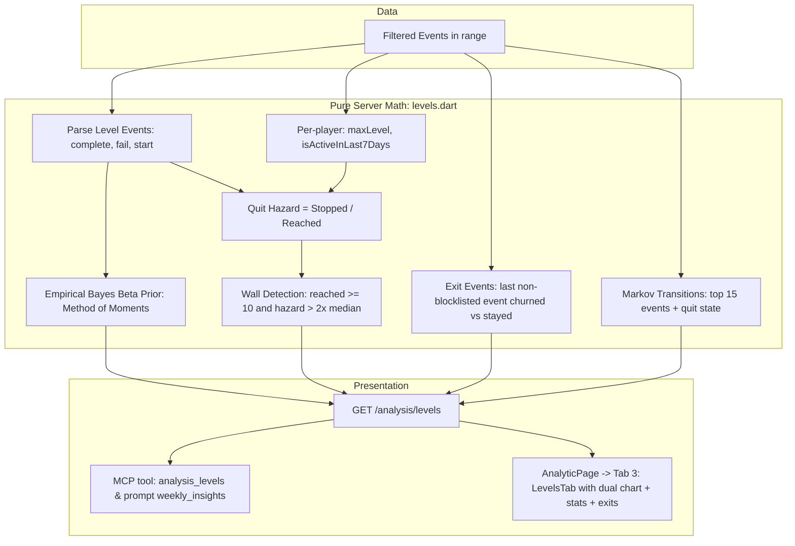

# Analytic Tab Wave 3 — Level Difficulty & Drop-off Bottlenecks — Implementation Plan

> **For agentic workers:** Implement task-by-task with superpowers:executing-plans (inline, no subagent-driven-development — project rule). Steps use checkbox (`- [ ]`) syntax for tracking. Executor: Gemini. Do every step in order. Do not skip the "run test, expect FAIL" steps. Do not invent APIs not shown here; if a package or Flutter API differs from this plan, STOP and report the exact error instead of improvising. **Never change an expected value in a test to make it pass** — if a test fails after implementing exactly what is shown, STOP and report. When a step says "replace this exact text" and the text is not found, STOP and report. Do not edit anything under `.cursor/memory/` (Claude updates memory at review).

**Goal:** Add the third tab **Levels** to the sidebar **Analytic** page. It displays level difficulty (Empirical Bayes Beta-smoothed win rates), quit hazard per level with quit wall detection ($> 2\times$ median hazard), exit-event ranking before quitting, and Markov event transitions leading to quit. The analysis is also exposed via MCP tool `analysis_levels` (20th tool) and integrated into `weekly_insights`.

**Architecture:** The server scans player events for `^level_(\d+)_(start|complete|fail)$`. Pure logic in `levels.dart` computes attempts, completes, fails, Beta method-of-moments smoothed win rate, and quit hazard (stopped players / reached players where stopped = max level reached and inactive in last 7 days). It detects quit walls where reached $\ge 10$ and hazard $> 2\times$ median hazard. It extracts exit events (last non-blocklisted event) for churned vs stayed players, calculating churned share, stayed share, and lift. It builds a Markov transition table for top 15 events plus `'quit'` state. `GET /analysis/levels` returns `LevelResult`. The app renders `LevelsTab` with dual-metric line charts, a level stats table, and a "How players leave" card.

**Tech Stack:** Dart 3.13.5 / Flutter 3.47.6 (`D:\flutter\bin`), Riverpod 2.6.1 (pinned), fl_chart, shelf, sqlite3, dart_mcp 0.5.2, `test`, `flutter_test`. **No new packages.**

**Spec:** [.cursor/plans/analytic-tab-design.md](file:///d:/Projects/AnalyticTracker/.cursor/plans/analytic-tab-design.md) — §1 (goal + honesty rule), §2 (architecture), §6a (level difficulty + quit wall), §6b (last actions before quitting), §8 (API/MCP), §8a (prompt), §9 (app page), §10 (errors).



## Global Constraints

- Every shell: PowerShell, prefix `$env:Path = "D:\flutter\bin;$env:Path"` once per terminal.
- Gates: `cd shared; dart analyze; dart test` · `cd server; dart analyze; dart test` · `cd app; flutter analyze; flutter test`. Analyzer must say `No issues found!` after every task.
- Level regex: `^level_(\d+)_(start|complete|fail)$`. Attempts = completes + fails.
- Beta smoothing: method of moments on levels with $\ge 5$ attempts. If $< 3$ such levels or sample variance $v \le 0$ or $v \ge m(1-m)$, fallback $\alpha = 1.0, \beta = 1.0$. Smoothed win rate = $(completes + \alpha) / (attempts + \alpha + \beta)$.
- Reached(N) = count of distinct players with any `level_N_*`.
- Stopped(N) = count of distinct players whose maximum level reached in range is $N$ AND who have 0 events in the last 7 days of the range (`addDays(f.to, -6)..f.to`).
- Quit hazard(N) = Reached(N) == 0 ? 0.0 : Stopped(N) / Reached(N).
- Wall condition: Reached(N) $\ge 10$ AND hazard(N) $> 2 \times \text{medianHazard}$ (computed over levels with Reached $\ge 10$).
- Exit events: last event in range per observable player after blocklist (`screen_view`, `user_engagement`, `session_start`, `first_open`, `app_remove`, `app_clear_data`, `firebase_campaign`). Churned if `app_remove` or 0 events in last 7 days; stayed otherwise. Lift = churnedShare / stayedShare. Keep exit events with $\ge 5$ churned players.
- Markov transitions: top 15 events after blocklist + `'quit'` (churned player's last non-blocklisted event transitions to `'quit'`). Keep next steps with count $\ge 5$, top 3 per event.
- Population rule: fewer than 20 players in range $\to$ `reason: "too_few_players"`, empty lists.
- Route: `GET /analysis/levels` with standard filters (`from`, `to`, `platform?`, `version?`, `test?`).
- MCP: tool `analysis_levels` (20th tool, read-only). `weekly_insights` prompt automatically includes all `analysis_*` tools.
- App: third tab `Levels` in `AnalyticPage`; `DefaultTabController(length: 3, ...)`; `LevelsTab` widget with dual-metric line chart, level data table with wall badges, exit events and transition cards.
- Colors: `AnalyticsTokens.of(context)` / `Theme.of(context)` only.
- One commit per task, message given in task.

## Review Focus

1. **Beta prior fallback bounds** — when variance $v \le 0$ or $v \ge m(1-m)$ or $m \in \{0, 1\}$, prior must safely fall back to $\alpha = 1, \beta = 1$ without division by zero, negative numbers, or NaN. Pinned in `analysis_levels_test.dart`.
2. **Quit hazard and max level alignment** — a player who fails level 3 and restarts level 1 must have max level 3; their stopped state belongs strictly to level 3, never inflating earlier levels. Pinned in `analysis_levels_test.dart`.
3. **Median hazard and wall edge cases** — when no level has $\ge 10$ players reached, `medianHazard` is 0.0 and no wall is flagged. When levels have 0 hazard, $2 \times 0.0 = 0.0$ must not flag 0-hazard levels as walls. Pinned in `analysis_levels_test.dart`.
4. **Exit event blocklist & churned definition** — `user_engagement` and `session_start` must never appear as exit events. Churned players without non-blocklisted events must not crash lift calculation. Pinned in `analysis_levels_test.dart`.
5. **App rendering with empty/too-few levels** — must show explanatory notice when fewer than 20 players or no level events exist, avoiding chart layout exceptions. Pinned in `analytic_levels_test.dart`.

## File map

| File | Action | Task |
|---|---|---|
| `shared/lib/src/analysis_models.dart` | Modify (add `LevelStats`, `ExitEvent`, `EventTransition`, `LevelResult`) | 1 |
| `shared/test/analysis_models_test.dart` | Modify (add level models roundtrip tests) | 1 |
| `server/lib/src/analysis/levels.dart` | Create (pure math for levels, walls, exits, transitions) | 2 |
| `server/lib/analytic_server.dart` | Modify (export `levels.dart`) | 2 |
| `server/test/analysis_levels_test.dart` | Create | 2 |
| `server/lib/src/event_store.dart` | Modify (add `store.levels(f)`) | 3 |
| `server/lib/src/api.dart` | Modify (add `GET /analysis/levels`) | 3 |
| `server/test/api_analysis_test.dart` | Modify (test `/analysis/levels`) | 3 |
| `server/lib/src/mcp_tools.dart` | Modify (add `analysis_levels`, 20th tool) | 4 |
| `server/test/mcp_tools_test.dart` | Modify (verify 20 tools and `analysis_levels`) | 4 |
| `server/test/mcp_e2e_test.dart` | Modify (call `analysis_levels`) | 4 |
| `app/lib/src/api_client.dart` | Modify (add `levels(f)`) | 5 |
| `app/lib/src/providers.dart` | Modify (add `levelsProvider`) | 5 |
| `app/lib/src/pages/analytic/levels_tab.dart` | Create (`LevelsTab`, chart, tables) | 5 |
| `app/lib/src/pages/analytic/analytic_page.dart` | Modify (3 tabs: Clusters, Churn, Levels) | 5 |
| `app/test/analytic_levels_test.dart` | Create (widget tests for `LevelsTab`) | 5 |

---

### Task 0: Baseline Check

- [x] **Step 1: Verify git status and branch**

```powershell
cd D:\Projects\AnalyticTracker
git status --short
git log --oneline -3
```

- [x] **Step 2: Run baseline gates**

```powershell
$env:Path = "D:\flutter\bin;$env:Path"
cd shared; dart analyze; dart test; cd ..\server; dart analyze; dart test; cd ..\app; flutter analyze; flutter test; cd ..
```

Expected: shared 61, server 217, app 96 passed, all analyzers clean.

---

### Task 1: Shared Level & Exit Models

**Files:**
- Modify: `shared/lib/src/analysis_models.dart`
- Modify: `shared/test/analysis_models_test.dart`

**Interfaces:**
- Produces:
  - `class LevelStats { int level; int attempts; int completes; int fails; double rawWinRate; double smoothedWinRate; int reached; int stopped; double hazard; bool wall; }`
  - `class ExitEvent { String eventName; int churnedCount; int stayedCount; double churnedShare; double stayedShare; double? lift; }`
  - `class EventTransition { String fromEvent; String toEvent; int count; double probability; }`
  - `class LevelResult { int players; int observable; List<LevelStats> levels; List<ExitEvent> exitEvents; List<EventTransition> transitions; double medianHazard; String? reason; }`

- [x] **Step 1: Write failing test in `shared/test/analysis_models_test.dart`**

Append to `shared/test/analysis_models_test.dart`:

```dart
  test('LevelStats, ExitEvent, EventTransition, LevelResult JSON roundtrip', () {
    const stats = LevelStats(
      level: 1,
      attempts: 20,
      completes: 15,
      fails: 5,
      rawWinRate: 0.75,
      smoothedWinRate: 0.72,
      reached: 18,
      stopped: 2,
      hazard: 0.1111,
      wall: false,
    );
    const exit = ExitEvent(
      eventName: 'level_3_fail',
      churnedCount: 10,
      stayedCount: 2,
      churnedShare: 0.5,
      stayedShare: 0.1,
      lift: 5.0,
    );
    const transition = EventTransition(
      fromEvent: 'level_3_fail',
      toEvent: 'quit',
      count: 8,
      probability: 0.8,
    );
    const result = LevelResult(
      players: 50,
      observable: 40,
      levels: [stats],
      exitEvents: [exit],
      transitions: [transition],
      medianHazard: 0.15,
      reason: null,
    );

    final json = result.toJson();
    final parsed = LevelResult.fromJson(json);

    expect(parsed.players, 50);
    expect(parsed.observable, 40);
    expect(parsed.medianHazard, 0.15);
    expect(parsed.levels.single.level, 1);
    expect(parsed.levels.single.smoothedWinRate, 0.72);
    expect(parsed.levels.single.wall, isFalse);
    expect(parsed.exitEvents.single.eventName, 'level_3_fail');
    expect(parsed.exitEvents.single.lift, 5.0);
    expect(parsed.transitions.single.toEvent, 'quit');
    expect(parsed.transitions.single.probability, 0.8);
  });
```

- [x] **Step 2: Run test to verify it fails**

```powershell
$env:Path = "D:\flutter\bin;$env:Path"
cd shared
dart test test/analysis_models_test.dart
```

Expected: FAIL with compilation error (unresolved identifiers `LevelStats`, `LevelResult`, etc.).

- [x] **Step 3: Implement models in `shared/lib/src/analysis_models.dart`**

Append to `shared/lib/src/analysis_models.dart`:

```dart
/// Level difficulty and quit hazard stats (spec §6a).
class LevelStats {
  const LevelStats({
    required this.level,
    required this.attempts,
    required this.completes,
    required this.fails,
    required this.rawWinRate,
    required this.smoothedWinRate,
    required this.reached,
    required this.stopped,
    required this.hazard,
    required this.wall,
  });

  final int level;
  final int attempts;
  final int completes;
  final int fails;
  final double rawWinRate;
  final double smoothedWinRate;
  final int reached;
  final int stopped;
  final double hazard;
  final bool wall;

  factory LevelStats.fromJson(Map<String, dynamic> j) => LevelStats(
        level: j['level'] as int,
        attempts: j['attempts'] as int,
        completes: j['completes'] as int,
        fails: j['fails'] as int,
        rawWinRate: (j['rawWinRate'] as num).toDouble(),
        smoothedWinRate: (j['smoothedWinRate'] as num).toDouble(),
        reached: j['reached'] as int,
        stopped: j['stopped'] as int,
        hazard: (j['hazard'] as num).toDouble(),
        wall: j['wall'] as bool,
      );

  Map<String, dynamic> toJson() => {
        'level': level,
        'attempts': attempts,
        'completes': completes,
        'fails': fails,
        'rawWinRate': rawWinRate,
        'smoothedWinRate': smoothedWinRate,
        'reached': reached,
        'stopped': stopped,
        'hazard': hazard,
        'wall': wall,
      };
}

/// Last non-blocklisted event before quitting, comparing churned vs stayed (spec §6b).
class ExitEvent {
  const ExitEvent({
    required this.eventName,
    required this.churnedCount,
    required this.stayedCount,
    required this.churnedShare,
    required this.stayedShare,
    required this.lift,
  });

  final String eventName;
  final int churnedCount;
  final int stayedCount;
  final double churnedShare;
  final double stayedShare;
  final double? lift;

  factory ExitEvent.fromJson(Map<String, dynamic> j) => ExitEvent(
        eventName: j['eventName'] as String,
        churnedCount: j['churnedCount'] as int,
        stayedCount: j['stayedCount'] as int,
        churnedShare: (j['churnedShare'] as num).toDouble(),
        stayedShare: (j['stayedShare'] as num).toDouble(),
        lift: j['lift'] == null ? null : (j['lift'] as num).toDouble(),
      );

  Map<String, dynamic> toJson() => {
        'eventName': eventName,
        'churnedCount': churnedCount,
        'stayedCount': stayedCount,
        'churnedShare': churnedShare,
        'stayedShare': stayedShare,
        'lift': lift,
      };
}

/// Markov transition between consecutive events (spec §6b).
class EventTransition {
  const EventTransition({
    required this.fromEvent,
    required this.toEvent,
    required this.count,
    required this.probability,
  });

  final String fromEvent;
  final String toEvent;
  final int count;
  final double probability;

  factory EventTransition.fromJson(Map<String, dynamic> j) => EventTransition(
        fromEvent: j['fromEvent'] as String,
        toEvent: j['toEvent'] as String,
        count: j['count'] as int,
        probability: (j['probability'] as num).toDouble(),
      );

  Map<String, dynamic> toJson() => {
        'fromEvent': fromEvent,
        'toEvent': toEvent,
        'count': count,
        'probability': probability,
      };
}

/// `GET /analysis/levels` response (spec §6a, §6b, §8).
class LevelResult {
  const LevelResult({
    required this.players,
    required this.observable,
    required this.levels,
    required this.exitEvents,
    required this.transitions,
    required this.medianHazard,
    required this.reason,
  });

  final int players;
  final int observable;
  final List<LevelStats> levels;
  final List<ExitEvent> exitEvents;
  final List<EventTransition> transitions;
  final double medianHazard;
  final String? reason;

  factory LevelResult.fromJson(Map<String, dynamic> j) => LevelResult(
        players: j['players'] as int,
        observable: j['observable'] as int,
        levels: [for (final l in j['levels'] as List) LevelStats.fromJson(l as Map<String, dynamic>)],
        exitEvents: [for (final e in j['exitEvents'] as List) ExitEvent.fromJson(e as Map<String, dynamic>)],
        transitions: [for (final t in j['transitions'] as List) EventTransition.fromJson(t as Map<String, dynamic>)],
        medianHazard: (j['medianHazard'] as num).toDouble(),
        reason: j['reason'] as String?,
      );

  Map<String, dynamic> toJson() => {
        'players': players,
        'observable': observable,
        'levels': [for (final l in levels) l.toJson()],
        'exitEvents': [for (final e in exitEvents) e.toJson()],
        'transitions': [for (final t in transitions) t.toJson()],
        'medianHazard': medianHazard,
        'reason': reason,
      };
}
```

- [x] **Step 4: Run shared tests & analyze**

```powershell
$env:Path = "D:\flutter\bin;$env:Path"
cd shared
dart analyze
dart test
cd ..
```

Expected: `No issues found!`, all 62 tests pass.

- [x] **Step 5: Commit**

```powershell
git add shared/lib/src/analysis_models.dart shared/test/analysis_models_test.dart
git commit -m "feat(shared): level stats, exit events, and level result models"
```

---

### Task 2: Pure Level Analysis Engine

**Files:**
- Create: `server/lib/src/analysis/levels.dart`
- Modify: `server/lib/analytic_server.dart`
- Create: `server/test/analysis_levels_test.dart`

**Interfaces:**
- Produces:
  - `(double, double) fitBetaPrior(List<double> winRates)`
  - `List<LevelStats> computeLevelStats({ ... })`
  - `List<ExitEvent> computeExitEvents({ ... })`
  - `List<EventTransition> computeTransitions({ ... })`
  - `LevelResult analyzeLevels({ ... })`

- [x] **Step 1: Write test `server/test/analysis_levels_test.dart`**

Create `server/test/analysis_levels_test.dart`:

```dart
import 'package:analytic_server/analytic_server.dart';
import 'package:analytic_shared/analytic_shared.dart';
import 'package:test/test.dart';

void main() {
  group('fitBetaPrior', () {
    test('falls back to 1.0, 1.0 when fewer than 3 values', () {
      final (a, b) = fitBetaPrior([0.5, 0.6]);
      expect(a, 1.0);
      expect(b, 1.0);
    });

    test('falls back to 1.0, 1.0 when variance is zero or invalid', () {
      final (a, b) = fitBetaPrior([0.5, 0.5, 0.5]);
      expect(a, 1.0);
      expect(b, 1.0);
    });

    test('fits valid alpha and beta via method of moments', () {
      final rates = [0.2, 0.4, 0.6, 0.8]; // mean = 0.5, var > 0
      final (a, b) = fitBetaPrior(rates);
      expect(a, greaterThan(0));
      expect(b, greaterThan(0));
      expect(a.isFinite, isTrue);
      expect(b.isFinite, isTrue);
    });
  });

  group('analyzeLevels logic', () {
    test('computes attempts, win rate, quit hazard and detects wall', () {
      // 12 players: all reach level 1.
      // 10 players reach level 2 and stop there (quit hazard 10/10 = 1.0).
      // 2 players continue to level 3.
      final players = [for (var i = 0; i < 12; i++) 'p$i'];
      final playerEvents = <String, List<PlayerRawEvent>>{};

      for (var i = 0; i < 12; i++) {
        final uid = 'p$i';
        playerEvents[uid] = [
          PlayerRawEvent(uid, 'level_1_start', 1000),
          PlayerRawEvent(uid, 'level_1_complete', 2000),
        ];
        if (i < 10) {
          // Stopped at level 2
          playerEvents[uid]!.addAll([
            PlayerRawEvent(uid, 'level_2_start', 3000),
            PlayerRawEvent(uid, 'level_2_fail', 4000),
          ]);
        } else {
          // Reached level 3
          playerEvents[uid]!.addAll([
            PlayerRawEvent(uid, 'level_2_start', 3000),
            PlayerRawEvent(uid, 'level_2_complete', 4000),
            PlayerRawEvent(uid, 'level_3_start', 5000),
          ]);
        }
      }

      // Players 0..9 are inactive at end, 10..11 are active
      final activeAtEnd = {for (var i = 10; i < 12; i++) 'p$i'};
      final observable = {for (var i = 0; i < 12; i++) 'p$i'};
      final churned = {for (var i = 0; i < 10; i++) 'p$i'};

      final res = analyzeLevels(
        totalPlayers: 25,
        players: players,
        playerEvents: playerEvents,
        activeAtEnd: activeAtEnd,
        observable: observable,
        churned: churned,
      );

      expect(res.reason, isNull);
      expect(res.levels.length, 3);

      final l1 = res.levels.firstWhere((l) => l.level == 1);
      expect(l1.reached, 12);
      expect(l1.stopped, 0);
      expect(l1.hazard, 0.0);
      expect(l1.completes, 12);
      expect(l1.fails, 0);

      final l2 = res.levels.firstWhere((l) => l.level == 2);
      expect(l2.reached, 12);
      expect(l2.stopped, 10);
      expect(l2.hazard, closeTo(10 / 12, 0.01));
      // Level 2 has reached >= 10 and hazard > 2 * median -> wall!
      expect(l2.wall, isTrue);

      final l3 = res.levels.firstWhere((l) => l.level == 3);
      expect(l3.reached, 2);
      expect(l3.stopped, 0); // 10 and 11 are active
    });

    test('extracts exit events with lift and Markov transitions to quit', () {
      final players = ['c1', 'c2', 'c3', 'c4', 'c5', 's1', 's2'];
      final playerEvents = <String, List<PlayerRawEvent>>{};

      // 5 churned players all exit on 'battle_boss_fail'
      for (var i = 1; i <= 5; i++) {
        playerEvents['c$i'] = [
          PlayerRawEvent('c$i', 'session_start', 100), // blocklisted
          PlayerRawEvent('c$i', 'level_1_start', 200),
          PlayerRawEvent('c$i', 'battle_boss_fail', 300),
          PlayerRawEvent('c$i', 'user_engagement', 400), // blocklisted
        ];
      }

      // 2 stayed players exit on 'pet_feed'
      for (var i = 1; i <= 2; i++) {
        playerEvents['s$i'] = [
          PlayerRawEvent('s$i', 'level_1_start', 200),
          PlayerRawEvent('s$i', 'pet_feed', 300),
        ];
      }

      final observable = players.toSet();
      final churned = {'c1', 'c2', 'c3', 'c4', 'c5'};
      final activeAtEnd = {'s1', 's2'};

      final res = analyzeLevels(
        totalPlayers: 20,
        players: players,
        playerEvents: playerEvents,
        activeAtEnd: activeAtEnd,
        observable: observable,
        churned: churned,
      );

      expect(res.exitEvents.any((e) => e.eventName == 'battle_boss_fail'), isTrue);
      final exit = res.exitEvents.firstWhere((e) => e.eventName == 'battle_boss_fail');
      expect(exit.churnedCount, 5);
      expect(exit.stayedCount, 0);
      expect(exit.lift, isNull); // stayedShare is 0

      // Markov transition: battle_boss_fail -> quit (count = 5)
      final trans = res.transitions.firstWhere(
        (t) => t.fromEvent == 'battle_boss_fail' && t.toEvent == 'quit',
      );
      expect(trans.count, 5);
      expect(trans.probability, 1.0);
    });

    test('returns too_few_players when total players < 20', () {
      final res = analyzeLevels(
        totalPlayers: 15,
        players: ['p1', 'p2'],
        playerEvents: {},
        activeAtEnd: {},
        observable: {},
        churned: {},
      );
      expect(res.reason, 'too_few_players');
      expect(res.levels, isEmpty);
      expect(res.exitEvents, isEmpty);
      expect(res.transitions, isEmpty);
    });
  });
}
```

- [x] **Step 2: Run test to verify it fails**

```powershell
$env:Path = "D:\flutter\bin;$env:Path"
cd server
dart test test/analysis_levels_test.dart
```

Expected: FAIL with compilation error (unresolved `fitBetaPrior`, `analyzeLevels`, etc.).

- [x] **Step 3: Implement `server/lib/src/analysis/levels.dart`**

Create `server/lib/src/analysis/levels.dart`:

```dart
import 'dart:math';

import 'package:analytic_shared/analytic_shared.dart';

// ponytail: PVM-specific blocklist identical to features.dart
const blocklist = {
  'screen_view',
  'user_engagement',
  'session_start',
  'first_open',
  'app_remove',
  'app_clear_data',
  'firebase_campaign',
};

final _levelEventRe = RegExp(r'^level_(\d+)_(start|complete|fail)$');

class PlayerRawEvent {
  const PlayerRawEvent(this.uid, this.name, this.tsMicros);
  final String uid;
  final String name;
  final int tsMicros;
}

/// Fits empirical Bayes Beta prior (alpha, beta) using method of moments (spec §6a).
(double, double) fitBetaPrior(List<double> winRates) {
  if (winRates.length < 3) return (1.0, 1.0);

  final n = winRates.length;
  final m = winRates.fold(0.0, (a, b) => a + b) / n;
  if (m <= 0.0 || m >= 1.0 || m.isNaN) return (1.0, 1.0);

  var sq = 0.0;
  for (final r in winRates) {
    sq += (r - m) * (r - m);
  }
  final v = sq / (n - 1);
  if (v <= 0.0 || v >= m * (1.0 - m) || v.isNaN) return (1.0, 1.0);

  final mult = (m * (1.0 - m) / v) - 1.0;
  if (mult <= 0.0 || mult.isNaN || mult.isInfinite) return (1.0, 1.0);

  final alpha = m * mult;
  final beta = (1.0 - m) * mult;
  if (alpha <= 0.0 || beta <= 0.0 || alpha.isNaN || beta.isNaN) return (1.0, 1.0);

  return (alpha, beta);
}

LevelResult analyzeLevels({
  required int totalPlayers,
  required List<String> players,
  required Map<String, List<PlayerRawEvent>> playerEvents,
  required Set<String> activeAtEnd,
  required Set<String> observable,
  required Set<String> churned,
}) {
  if (totalPlayers < 20) {
    return LevelResult(
      players: totalPlayers,
      observable: observable.length,
      levels: const [],
      exitEvents: const [],
      transitions: const [],
      medianHazard: 0.0,
      reason: 'too_few_players',
    );
  }

  // 1. Group level stats
  final attemptsMap = <int, int>{};
  final completesMap = <int, int>{};
  final failsMap = <int, int>{};
  final reachedPlayers = <int, Set<String>>{};
  final playerMaxLevel = <String, int>{};

  for (final p in players) {
    final events = playerEvents[p] ?? const [];
    var maxLvl = 0;
    for (final e in events) {
      final m = _levelEventRe.firstMatch(e.name);
      if (m != null) {
        final lvl = int.parse(m.group(1)!);
        final action = m.group(2)!;
        maxLvl = max(maxLvl, lvl);
        reachedPlayers.putIfAbsent(lvl, () => {}).add(p);
        if (action == 'complete') {
          completesMap[lvl] = (completesMap[lvl] ?? 0) + 1;
          attemptsMap[lvl] = (attemptsMap[lvl] ?? 0) + 1;
        } else if (action == 'fail') {
          failsMap[lvl] = (failsMap[lvl] ?? 0) + 1;
          attemptsMap[lvl] = (attemptsMap[lvl] ?? 0) + 1;
        }
      }
    }
    if (maxLvl > 0) {
      playerMaxLevel[p] = maxLvl;
    }
  }

  final allLevels = reachedPlayers.keys.toList()..sort();
  if (allLevels.isEmpty) {
    return LevelResult(
      players: totalPlayers,
      observable: observable.length,
      levels: const [],
      exitEvents: const [],
      transitions: const [],
      medianHazard: 0.0,
      reason: 'no_level_events',
    );
  }

  // Calculate raw win rates for empirical Bayes (levels with >= 5 attempts)
  final ratesForPrior = <double>[];
  for (final lvl in allLevels) {
    final att = attemptsMap[lvl] ?? 0;
    if (att >= 5) {
      final comp = completesMap[lvl] ?? 0;
      ratesForPrior.add(comp / att);
    }
  }
  final (alpha, beta) = fitBetaPrior(ratesForPrior);

  // Reached & Stopped per level
  final stoppedMap = <int, int>{};
  for (final entry in playerMaxLevel.entries) {
    final uid = entry.key;
    final lvl = entry.value;
    if (!activeAtEnd.contains(uid)) {
      stoppedMap[lvl] = (stoppedMap[lvl] ?? 0) + 1;
    }
  }

  // Compute hazards and median hazard over levels with reached >= 10
  final hazardsForMedian = <double>[];
  final levelRawStats = <int, ({int reached, int stopped, double hazard, int attempts, int completes, int fails, double rawWin, double smoothedWin})>{};

  for (final lvl in allLevels) {
    final reached = reachedPlayers[lvl]?.length ?? 0;
    final stopped = stoppedMap[lvl] ?? 0;
    final hazard = reached > 0 ? (stopped / reached) : 0.0;
    final attempts = attemptsMap[lvl] ?? 0;
    final completes = completesMap[lvl] ?? 0;
    final fails = failsMap[lvl] ?? 0;
    final rawWin = attempts > 0 ? (completes / attempts) : 0.0;
    final smoothedWin = (completes + alpha) / (attempts + alpha + beta);

    levelRawStats[lvl] = (
      reached: reached,
      stopped: stopped,
      hazard: hazard,
      attempts: attempts,
      completes: completes,
      fails: fails,
      rawWin: rawWin,
      smoothedWin: smoothedWin,
    );

    if (reached >= 10) {
      hazardsForMedian.add(hazard);
    }
  }

  double medianHazard = 0.0;
  if (hazardsForMedian.isNotEmpty) {
    hazardsForMedian.sort();
    final mid = hazardsForMedian.length ~/ 2;
    if (hazardsForMedian.length.isOdd) {
      medianHazard = hazardsForMedian[mid];
    } else {
      medianHazard = (hazardsForMedian[mid - 1] + hazardsForMedian[mid]) / 2.0;
    }
  }

  final levelStatsList = <LevelStats>[];
  for (final lvl in allLevels) {
    final s = levelRawStats[lvl]!;
    final isWall = s.reached >= 10 && (medianHazard > 0.0 ? s.hazard > 2.0 * medianHazard : false);
    levelStatsList.add(LevelStats(
      level: lvl,
      attempts: s.attempts,
      completes: s.completes,
      fails: s.fails,
      rawWinRate: s.rawWin,
      smoothedWinRate: s.smoothedWin,
      reached: s.reached,
      stopped: s.stopped,
      hazard: s.hazard,
      wall: isWall,
    ));
  }

  // 2. Exit events (§6b)
  final churnedExitCounts = <String, int>{};
  final stayedExitCounts = <String, int>{};
  var churnedWithExit = 0;
  var stayedWithExit = 0;

  for (final p in observable) {
    final events = playerEvents[p] ?? const [];
    final nonBlocked = events.where((e) => !blocklist.contains(e.name)).toList();
    if (nonBlocked.isNotEmpty) {
      final exitEvent = nonBlocked.last.name;
      if (churned.contains(p)) {
        churnedExitCounts[exitEvent] = (churnedExitCounts[exitEvent] ?? 0) + 1;
        churnedWithExit++;
      } else {
        stayedExitCounts[exitEvent] = (stayedExitCounts[exitEvent] ?? 0) + 1;
        stayedWithExit++;
      }
    }
  }

  final exitEvents = <ExitEvent>[];
  for (final entry in churnedExitCounts.entries) {
    final evName = entry.key;
    final cCount = entry.value;
    if (cCount >= 5) {
      final sCount = stayedExitCounts[evName] ?? 0;
      final cShare = churnedWithExit > 0 ? cCount / churnedWithExit : 0.0;
      final sShare = stayedWithExit > 0 ? sCount / stayedWithExit : 0.0;
      final lift = sShare > 0.0 ? (cShare / sShare) : null;
      exitEvents.add(ExitEvent(
        eventName: evName,
        churnedCount: cCount,
        stayedCount: sCount,
        churnedShare: cShare,
        stayedShare: sShare,
        lift: lift,
      ));
    }
  }
  exitEvents.sort((a, b) {
    if (a.lift != null && b.lift != null) {
      return b.lift!.compareTo(a.lift!);
    }
    if (a.lift != null) return -1;
    if (b.lift != null) return 1;
    return b.churnedCount.compareTo(a.churnedCount);
  });

  // 3. Markov transitions (§6b)
  // Find top 15 event names after blocklist
  final totalCounts = <String, int>{};
  for (final p in players) {
    for (final e in playerEvents[p] ?? const []) {
      if (!blocklist.contains(e.name)) {
        totalCounts[e.name] = (totalCounts[e.name] ?? 0) + 1;
      }
    }
  }
  final top15Events = (totalCounts.keys.toList()
        ..sort((a, b) => totalCounts[b]!.compareTo(totalCounts[a]!)))
      .take(15)
      .toSet();

  final transitionCounts = <String, Map<String, int>>{};
  for (final p in players) {
    final evs = (playerEvents[p] ?? const []).where((e) => !blocklist.contains(e.name)).toList();
    for (var i = 0; i < evs.length - 1; i++) {
      final from = evs[i].name;
      final to = evs[i + 1].name;
      transitionCounts.putIfAbsent(from, () => {})[to] =
          (transitionCounts[from]![to] ?? 0) + 1;
    }
    if (churned.contains(p) && evs.isNotEmpty) {
      final lastEv = evs.last.name;
      transitionCounts.putIfAbsent(lastEv, () => {})['quit'] =
          (transitionCounts[lastEv]!['quit'] ?? 0) + 1;
    }
  }

  final transitions = <EventTransition>[];
  for (final from in top15Events) {
    final nextMap = transitionCounts[from] ?? const {};
    final totalFrom = nextMap.values.fold(0, (a, b) => a + b);
    if (totalFrom == 0) continue;

    final candidates = <EventTransition>[];
    for (final entry in nextMap.entries) {
      if (entry.value >= 5) {
        candidates.add(EventTransition(
          fromEvent: from,
          toEvent: entry.key,
          count: entry.value,
          probability: entry.value / totalFrom,
        ));
      }
    }
    candidates.sort((a, b) => b.probability.compareTo(a.probability));
    transitions.addAll(candidates.take(3));
  }

  return LevelResult(
    players: totalPlayers,
    observable: observable.length,
    levels: levelStatsList,
    exitEvents: exitEvents,
    transitions: transitions,
    medianHazard: medianHazard,
    reason: null,
  );
}
```

- [x] **Step 4: Export in `server/lib/analytic_server.dart`**

Modify `server/lib/analytic_server.dart` to export `src/analysis/levels.dart`:

Add line:
```dart
export 'src/analysis/levels.dart';
```

- [x] **Step 5: Run tests to verify they pass**

```powershell
$env:Path = "D:\flutter\bin;$env:Path"
cd server
dart analyze
dart test test/analysis_levels_test.dart
cd ..
```

Expected: `No issues found!`, all tests in `analysis_levels_test.dart` pass.

- [x] **Step 6: Commit**

```powershell
git add server/lib/src/analysis/levels.dart server/lib/analytic_server.dart server/test/analysis_levels_test.dart
git commit -m "feat(server): pure level difficulty, quit walls, exits, and Markov transitions"
```

---

### Task 3: EventStore Integration & Server Route `GET /analysis/levels`

**Files:**
- Modify: `server/lib/src/event_store.dart`
- Modify: `server/lib/src/api.dart`
- Modify: `server/test/api_analysis_test.dart`

**Interfaces:**
- Produces:
  - `LevelResult EventStore.levels(Filters f)`
  - Endpoint `GET /analysis/levels` returning `LevelResult.toJson()`

- [x] **Step 1: Write test in `server/test/api_analysis_test.dart`**

Append to `server/test/api_analysis_test.dart`:

```dart
  test('GET /analysis/levels serves LevelResult', () async {
    final (status, body) = await getJson('/analysis/levels?from=$d1&to=$d1');
    expect(status, 200);
    final map = body as Map<String, dynamic>;
    expect(map['players'], 24);
    expect(map['levels'], isA<List>());
    expect(map['exitEvents'], isA<List>());
    expect(map['transitions'], isA<List>());
    final parsed = LevelResult.fromJson(map);
    expect(parsed.players, 24);
  });

  test('GET /analysis/levels too few players', () async {
    final (status, body) = await getJson('/analysis/levels?from=$d1&to=$d1&platform=IOS');
    expect(status, 200);
    final map = body as Map<String, dynamic>;
    expect(map['reason'], 'too_few_players');
    expect(map['levels'], isEmpty);
  });
```

- [x] **Step 2: Run test to verify it fails**

```powershell
$env:Path = "D:\flutter\bin;$env:Path"
cd server
dart test test/api_analysis_test.dart
```

Expected: FAIL with 404 Not Found on `/analysis/levels`.

- [x] **Step 3: Add `levels(Filters f)` in `server/lib/src/event_store.dart`**

In `server/lib/src/event_store.dart`, add method `LevelResult levels(Filters f)` right after `churn(Filters f)`:

```dart
  /// Level difficulty, quit hazard, exits, and transitions (spec §6a, §6b).
  LevelResult levels(Filters f) {
    final where = StringBuffer("day BETWEEN ? AND ? AND user_pseudo_id <> ''");
    final args = <Object?>[f.from, f.to];
    if (f.platform != null) {
      where.write(' AND platform = ?');
      args.add(f.platform);
    }
    if (f.version != null) {
      where.write(' AND app_version = ?');
      args.add(f.version);
    }
    where.write(testEventsClause(f.includeTest));

    final rows = _db.select(
      'SELECT user_pseudo_id AS u, event_name AS n, day AS d, ts_micros AS ts '
      'FROM events WHERE $where ORDER BY u, ts_micros, id;',
      args,
    );

    final byPlayer = <String, List<PlayerRawEvent>>{};
    final playerDays = <String, Set<String>>{};
    for (final r in rows) {
      final u = r['u'] as String;
      final n = r['n'] as String;
      final d = r['d'] as String;
      final ts = r['ts'] as int;
      byPlayer.putIfAbsent(u, () => []).add(PlayerRawEvent(u, n, ts));
      playerDays.putIfAbsent(u, () => {}).add(d);
    }

    final players = byPlayer.keys.toList()..sort();
    final totalPlayers = players.length;

    // Observability & churn logic matching §5
    final activeEndDay = addDays(f.to, -6);
    final observableCutoffDay = addDays(f.to, -7);

    final activeAtEnd = <String>{};
    final observable = <String>{};
    final churned = <String>{};

    for (final p in players) {
      final days = playerDays[p]!;
      final sortedDays = days.toList()..sort();
      final firstDay = sortedDays.first;

      final isObservable = firstDay.compareTo(observableCutoffDay) <= 0;
      if (isObservable) {
        observable.add(p);
      }

      final isActive = days.any((d) => d.compareTo(activeEndDay) >= 0);
      if (isActive) {
        activeAtEnd.add(p);
      }

      final events = byPlayer[p]!;
      final hasAppRemove = events.any((e) => e.name == 'app_remove');
      if (isObservable && (hasAppRemove || !isActive)) {
        churned.add(p);
      }
    }

    return analyzeLevels(
      totalPlayers: totalPlayers,
      players: players,
      playerEvents: byPlayer,
      activeAtEnd: activeAtEnd,
      observable: observable,
      churned: churned,
    );
  }
```

- [x] **Step 4: Register route in `server/lib/src/api.dart`**

In `server/lib/src/api.dart`, locate the analysis routes:
```dart
    ..get('/analysis/churn', (Request req) {
      final q = req.url.queryParameters;
      final f = _filters(q);
      return _json(store.churn(f).toJson());
    })
```
Add right after it:
```dart
    ..get('/analysis/levels', (Request req) {
      final q = req.url.queryParameters;
      final f = _filters(q);
      return _json(store.levels(f).toJson());
    })
```

- [x] **Step 5: Run server tests to verify they pass**

```powershell
$env:Path = "D:\flutter\bin;$env:Path"
cd server
dart analyze
dart test test/api_analysis_test.dart
cd ..
```

Expected: `No issues found!`, all tests in `api_analysis_test.dart` pass.

- [x] **Step 6: Commit**

```powershell
git add server/lib/src/event_store.dart server/lib/src/api.dart server/test/api_analysis_test.dart
git commit -m "feat(server): GET /analysis/levels route and EventStore levels method"
```

---

### Task 4: MCP Tool `analysis_levels` & Prompt Integration

**Files:**
- Modify: `server/lib/src/mcp_tools.dart`
- Modify: `server/test/mcp_tools_test.dart`
- Modify: `server/test/mcp_e2e_test.dart`

**Interfaces:**
- Produces:
  - Tool `analysis_levels` (20 tools total in `AnalyticTools.all`)
  - Read-only annotation `ToolAnnotations(readOnlyHint: true)`
  - Returns `GET analysis/levels` JSON

- [x] **Step 1: Write test updates in `server/test/mcp_tools_test.dart`**

In `server/test/mcp_tools_test.dart`:
Change:
```dart
  test('all 19 tools, spec order, with annotations', () {
    expect(tools.all.keys, [
      'data_health', 'filter_options', 'list_events', 'overview', 'retention', 'progression',
      'event_counts', 'param_keys', 'param_values', 'user_prop_keys', 'list_funnels', 'run_funnel',
      'funnel_players', 'player_events', 'save_funnel', 'delete_funnel', 'import_export',
      'analysis_clusters', 'analysis_churn',
    ]);
```
To:
```dart
  test('all 20 tools, spec order, with annotations', () {
    expect(tools.all.keys, [
      'data_health', 'filter_options', 'list_events', 'overview', 'retention', 'progression',
      'event_counts', 'param_keys', 'param_values', 'user_prop_keys', 'list_funnels', 'run_funnel',
      'funnel_players', 'player_events', 'save_funnel', 'delete_funnel', 'import_export',
      'analysis_clusters', 'analysis_churn', 'analysis_levels',
    ]);
```
And add `'analysis_levels'` to the readOnly check:
```dart
    for (final n in [
      'data_health', 'overview', 'run_funnel', 'list_funnels', 'param_values', 'user_prop_keys',
      'funnel_players', 'player_events', 'analysis_clusters', 'analysis_churn', 'analysis_levels',
    ]) {
      expect(readOnly(n), isTrue, reason: n);
    }
```
And add tool execution test:
```dart
  test('analysis_levels forwards filters', () async {
    await tools.all['analysis_levels']!.$2(range);
    expect(seen.single.url.path, '/analysis/levels');
    expect(seen.single.url.queryParameters, range);
  });
```

- [x] **Step 2: Run test to verify it fails**

```powershell
$env:Path = "D:\flutter\bin;$env:Path"
cd server
dart test test/mcp_tools_test.dart
```

Expected: FAIL (only 19 tools found).

- [x] **Step 3: Register `analysis_levels` in `server/lib/src/mcp_tools.dart`**

In `server/lib/src/mcp_tools.dart`, append `analysis_levels` to `_tools`:

```dart
        (
          Tool(
            name: 'analysis_levels',
            description: 'Analyzes level progression difficulty (Beta-smoothed win rates), quit hazard '
                'per level with quit wall detection (> 2x median hazard), exit-event ranking before quitting, '
                'and Markov event transitions to quit. "reason" too_few_players (< 20) or no_level_events.',
            inputSchema: _filtered({}),
            annotations: _read,
          ),
          (a) => _send('GET', 'analysis/levels', query: _filterQuery(a)),
        ),
```

- [x] **Step 4: Update `server/test/mcp_e2e_test.dart`**

In `server/test/mcp_e2e_test.dart`, verify `analysis_levels` tool is called:
Add test:
```dart
    test('analysis_levels tool returns level stats JSON', () async {
      final res = await client.callTool('analysis_levels', {
        'from': '2026-10-01',
        'to': '2026-10-07',
      });
      final text = (res.content.single as TextContent).text;
      final map = jsonDecode(text) as Map<String, dynamic>;
      expect(map.containsKey('levels'), isTrue);
      expect(map.containsKey('players'), isTrue);
    });
```

- [x] **Step 5: Run server MCP tests & analyze**

```powershell
$env:Path = "D:\flutter\bin;$env:Path"
cd server
dart analyze
dart test test/mcp_tools_test.dart test/mcp_e2e_test.dart
cd ..
```

Expected: `No issues found!`, all tests pass.

- [x] **Step 6: Commit**

```powershell
git add server/lib/src/mcp_tools.dart server/test/mcp_tools_test.dart server/test/mcp_e2e_test.dart
git commit -m "feat(server): MCP tool analysis_levels and prompt integration"
```

---

### Task 5: App Client, Provider, and `LevelsTab` UI

**Files:**
- Modify: `app/lib/src/api_client.dart`
- Modify: `app/lib/src/providers.dart`
- Create: `app/lib/src/pages/analytic/levels_tab.dart`
- Modify: `app/lib/src/pages/analytic/analytic_page.dart`
- Create: `app/test/analytic_levels_test.dart`

**Interfaces:**
- Produces:
  - `ApiClient.levels(Filters f)`
  - `levelsProvider = FutureProvider.family<LevelResult, Filters>`
  - `LevelsTab` widget with chart, level table with wall badge, exit events table, and transitions table
  - `AnalyticPage` tabs: Clusters, Churn, Levels

- [x] **Step 1: Write widget test `app/test/analytic_levels_test.dart`**

Create `app/test/analytic_levels_test.dart`:

```dart
import 'package:analytic_app/src/pages/analytic/levels_tab.dart';
import 'package:analytic_app/src/providers.dart';
import 'package:analytic_shared/analytic_shared.dart';
import 'package:flutter/material.dart';
import 'package:flutter_riverpod/flutter_riverpod.dart';
import 'package:flutter_test/flutter_test.dart';

void main() {
  testWidgets('LevelsTab renders level stats, walls, exit events and transitions', (tester) async {
    const fakeResult = LevelResult(
      players: 50,
      observable: 40,
      levels: [
        LevelStats(
          level: 1,
          attempts: 50,
          completes: 45,
          fails: 5,
          rawWinRate: 0.9,
          smoothedWinRate: 0.88,
          reached: 50,
          stopped: 2,
          hazard: 0.04,
          wall: false,
        ),
        LevelStats(
          level: 2,
          attempts: 40,
          completes: 15,
          fails: 25,
          rawWinRate: 0.375,
          smoothedWinRate: 0.40,
          reached: 40,
          stopped: 28,
          hazard: 0.70,
          wall: true,
        ),
      ],
      exitEvents: [
        ExitEvent(
          eventName: 'battle_fail',
          churnedCount: 15,
          stayedCount: 2,
          churnedShare: 0.6,
          stayedShare: 0.1,
          lift: 6.0,
        ),
      ],
      transitions: [
        EventTransition(
          fromEvent: 'battle_fail',
          toEvent: 'quit',
          count: 12,
          probability: 0.8,
        ),
      ],
      medianHazard: 0.35,
      reason: null,
    );

    await tester.pumpWidget(
      ProviderScope(
        overrides: [
          levelsProvider.overrideWith((ref, f) async => fakeResult),
        ],
        child: const MaterialApp(
          home: Scaffold(body: LevelsTab()),
        ),
      ),
    );

    await tester.pumpAndSettle();

    expect(find.textContaining('Level difficulty, win rate, and quit hazard'), findsOneWidget);
    expect(find.text('Level 1'), findsOneWidget);
    expect(find.text('Level 2'), findsOneWidget);
    expect(find.text('QUIT WALL'), findsOneWidget);
    expect(find.text('How players leave'), findsOneWidget);
    expect(find.text('battle_fail'), findsWidgets);
    expect(find.text('6.0×'), findsOneWidget);
    expect(find.text('quit'), findsOneWidget);
  });

  testWidgets('LevelsTab displays too_few_players state gracefully', (tester) async {
    const emptyResult = LevelResult(
      players: 10,
      observable: 5,
      levels: [],
      exitEvents: [],
      transitions: [],
      medianHazard: 0.0,
      reason: 'too_few_players',
    );

    await tester.pumpWidget(
      ProviderScope(
        overrides: [
          levelsProvider.overrideWith((ref, f) async => emptyResult),
        ],
        child: const MaterialApp(
          home: Scaffold(body: LevelsTab()),
        ),
      ),
    );

    await tester.pumpAndSettle();

    expect(find.textContaining('Not enough players in this range to analyze levels'), findsOneWidget);
  });
}
```

- [x] **Step 2: Run test to verify it fails**

```powershell
$env:Path = "D:\flutter\bin;$env:Path"
cd app
flutter test test/analytic_levels_test.dart
```

Expected: FAIL with compilation error (`levels_tab.dart` not found).

- [x] **Step 3: Add `levels(Filters f)` to `app/lib/src/api_client.dart`**

In `app/lib/src/api_client.dart`, add:
```dart
  Future<LevelResult> levels(Filters f) async =>
      LevelResult.fromJson(await _getMap('analysis/levels', f.toQuery()));
```

- [x] **Step 4: Add `levelsProvider` in `app/lib/src/providers.dart`**

In `app/lib/src/providers.dart`, add:
```dart
/// Level difficulty, quit hazard, and exit actions for the Analytic page.
final levelsProvider = FutureProvider.family<LevelResult, Filters>(
    (ref, f) => ref.watch(apiClientProvider).levels(f));
```

- [x] **Step 5: Create `app/lib/src/pages/analytic/levels_tab.dart`**

Create `app/lib/src/pages/analytic/levels_tab.dart`:

```dart
import 'package:fl_chart/fl_chart.dart';
import 'package:flutter/material.dart';
import 'package:flutter_riverpod/flutter_riverpod.dart';

import '../../providers.dart';
import '../../theme/analytics_tokens.dart';
import '../../widgets/error_retry.dart';
import '../../widgets/format.dart';

class LevelsTab extends ConsumerWidget {
  const LevelsTab({super.key});

  @override
  Widget build(BuildContext context, WidgetRef ref) {
    final f = ref.watch(filtersProvider);
    return ref.watch(levelsProvider(f)).when(
          loading: () => const Center(child: CircularProgressIndicator()),
          error: (e, _) => ErrorRetry(error: e, onRetry: () => ref.invalidate(levelsProvider(f))),
          data: (r) {
            if (r.reason == 'too_few_players') {
              return Center(
                child: Text('Not enough players in this range to analyze levels: ${r.players} in range, need at least 20.'),
              );
            }
            if (r.reason == 'no_level_events' || r.levels.isEmpty) {
              return const Center(
                child: Text('No level tracking events (level_N_start/complete/fail) found in this range.'),
              );
            }

            final theme = Theme.of(context);
            final tokens = AnalyticsTokens.of(context);

            return ListView(
              padding: const EdgeInsets.all(16),
              children: [
                Text(
                  'Level difficulty, win rate, and quit hazard. '
                  'Quit walls mark levels where quit hazard exceeds 2× the median hazard.',
                  style: theme.textTheme.bodySmall,
                ),
                const SizedBox(height: 8),
                Text(
                  '${r.levels.length} levels tracked · Median quit hazard: ${(r.medianHazard * 100).round()}%',
                  style: theme.textTheme.titleMedium,
                ),
                const SizedBox(height: 16),
                _LevelsChart(levels: r.levels),
                const SizedBox(height: 16),
                Text('Level Difficulty & Quit Hazard', style: theme.textTheme.titleSmall),
                const SizedBox(height: 8),
                _LevelsTable(levels: r.levels),
                const SizedBox(height: 24),
                Text('How players leave', style: theme.textTheme.titleMedium),
                const SizedBox(height: 8),
                _ExitsAndTransitions(exitEvents: r.exitEvents, transitions: r.transitions),
              ],
            );
          },
        );
  }
}

class _LevelsChart extends StatelessWidget {
  const _LevelsChart({required this.levels});
  final List<LevelStats> levels;

  @override
  Widget build(BuildContext context) {
    final theme = Theme.of(context);
    final tokens = AnalyticsTokens.of(context);

    final winSpots = [
      for (final l in levels) FlSpot(l.level.toDouble(), l.smoothedWinRate),
    ];
    final hazardSpots = [
      for (final l in levels) FlSpot(l.level.toDouble(), l.hazard),
    ];

    return Card(
      child: Padding(
        padding: const EdgeInsets.all(16),
        child: Column(
          crossAxisAlignment: CrossAxisAlignment.start,
          children: [
            Row(
              children: [
                Row(
                  children: [
                    Container(width: 12, height: 12, color: tokens.chart.first),
                    const SizedBox(width: 6),
                    Text('Smoothed Win Rate', style: theme.textTheme.bodySmall),
                  ],
                ),
                const SizedBox(width: 20),
                Row(
                  children: [
                    Container(width: 12, height: 12, color: tokens.bad),
                    const SizedBox(width: 6),
                    Text('Quit Hazard', style: theme.textTheme.bodySmall),
                  ],
                ),
              ],
            ),
            const SizedBox(height: 16),
            SizedBox(
              height: 240,
              child: LineChart(
                LineChartData(
                  minY: 0.0,
                  maxY: 1.0,
                  titlesData: FlTitlesData(
                    rightTitles: const AxisTitles(sideTitles: SideTitles(showTitles: false)),
                    topTitles: const AxisTitles(sideTitles: SideTitles(showTitles: false)),
                    bottomTitles: AxisTitles(
                      sideTitles: SideTitles(
                        showTitles: true,
                        reservedSize: 22,
                        interval: 1,
                        getTitlesWidget: (v, _) => Text(
                          'L${v.toInt()}',
                          style: TextStyle(fontSize: 10, color: theme.colorScheme.onSurfaceVariant),
                        ),
                      ),
                    ),
                    leftTitles: AxisTitles(
                      sideTitles: SideTitles(
                        showTitles: true,
                        reservedSize: 36,
                        interval: 0.25,
                        getTitlesWidget: (v, _) => Text(
                          '${(v * 100).round()}%',
                          style: TextStyle(fontSize: 10, color: theme.colorScheme.onSurfaceVariant),
                        ),
                      ),
                    ),
                  ),
                  gridData: const FlGridData(show: true, drawVerticalLine: false),
                  borderData: FlBorderData(show: false),
                  lineBarsData: [
                    LineChartBarData(
                      spots: winSpots,
                      color: tokens.chart.first,
                      barWidth: 2,
                      dotData: const FlDotData(show: false),
                    ),
                    LineChartBarData(
                      spots: hazardSpots,
                      color: tokens.bad,
                      barWidth: 2,
                      dotData: FlDotData(
                        show: true,
                        checkToShowDot: (spot, barData) {
                          final idx = spot.x.toInt();
                          final lvl = levels.where((l) => l.level == idx).firstOrNull;
                          return lvl?.wall == true;
                        },
                      ),
                    ),
                  ],
                ),
              ),
            ),
          ],
        ),
      ),
    );
  }
}

class _LevelsTable extends StatelessWidget {
  const _LevelsTable({required this.levels});
  final List<LevelStats> levels;

  @override
  Widget build(BuildContext context) {
    final tokens = AnalyticsTokens.of(context);

    return Card(
      child: SingleChildScrollView(
        scrollDirection: Axis.horizontal,
        child: DataTable(
          columnSpacing: 20,
          columns: const [
            DataColumn(label: Text('Level')),
            DataColumn(label: Text('Reached'), numeric: true),
            DataColumn(label: Text('Attempts'), numeric: true),
            DataColumn(label: Text('Completes'), numeric: true),
            DataColumn(label: Text('Fails'), numeric: true),
            DataColumn(label: Text('Win Rate (Smoothed)'), numeric: true),
            DataColumn(label: Text('Stopped'), numeric: true),
            DataColumn(label: Text('Quit Hazard'), numeric: true),
            DataColumn(label: Text('Status')),
          ],
          rows: [
            for (final l in levels)
              DataRow(
                cells: [
                  DataCell(Text('Level ${l.level}')),
                  DataCell(Text('${l.reached}')),
                  DataCell(Text('${l.attempts}')),
                  DataCell(Text('${l.completes}')),
                  DataCell(Text('${l.fails}')),
                  DataCell(Text('${(l.smoothedWinRate * 100).round()}% (${(l.rawWinRate * 100).round()}%)')),
                  DataCell(Text('${l.stopped}')),
                  DataCell(Text('${(l.hazard * 100).round()}%')),
                  DataCell(
                    l.wall
                        ? Container(
                            padding: const EdgeInsets.symmetric(horizontal: 6, vertical: 2),
                            decoration: BoxDecoration(
                              color: tokens.bad.withValues(alpha: 0.15),
                              borderRadius: BorderRadius.circular(4),
                              border: Border.all(color: tokens.bad, width: 1),
                            ),
                            child: Text(
                              'QUIT WALL',
                              style: TextStyle(fontSize: 10, fontWeight: FontWeight.bold, color: tokens.bad),
                            ),
                          )
                        : (l.reached < 10
                            ? Text('small sample', style: TextStyle(fontSize: 10, color: tokens.warning))
                            : const Text('—')),
                  ),
                ],
              ),
          ],
        ),
      ),
    );
  }
}

class _ExitsAndTransitions extends StatelessWidget {
  const _ExitsAndTransitions({required this.exitEvents, required this.transitions});
  final List<ExitEvent> exitEvents;
  final List<EventTransition> transitions;

  @override
  Widget build(BuildContext context) {
    final theme = Theme.of(context);
    final tokens = AnalyticsTokens.of(context);

    return LayoutBuilder(
      builder: (context, constraints) {
        final isWide = constraints.maxWidth >= 720;
        final exitsCard = Card(
          child: Padding(
            padding: const EdgeInsets.all(16),
            child: Column(
              crossAxisAlignment: CrossAxisAlignment.start,
              children: [
                Text('Last Action Before Quitting', style: theme.textTheme.titleSmall),
                const SizedBox(height: 4),
                Text('Exit events compared across churned vs stayed players (lift > 1 = overrepresented in churn).',
                    style: theme.textTheme.bodySmall),
                const SizedBox(height: 12),
                if (exitEvents.isEmpty)
                  const Text('No exit events with ≥ 5 churned players.')
                else
                  DataTable(
                    columnSpacing: 16,
                    columns: const [
                      DataColumn(label: Text('Event')),
                      DataColumn(label: Text('Churned'), numeric: true),
                      DataColumn(label: Text('Stayed'), numeric: true),
                      DataColumn(label: Text('Lift'), numeric: true),
                    ],
                    rows: [
                      for (final e in exitEvents)
                        DataRow(
                          cells: [
                            DataCell(Text(e.eventName)),
                            DataCell(Text('${e.churnedCount} (${(e.churnedShare * 100).round()}%)')),
                            DataCell(Text('${e.stayedCount} (${(e.stayedShare * 100).round()}%)')),
                            DataCell(
                              e.lift != null
                                  ? Text(
                                      '${fmtDecimal(e.lift!, digits: 1)}×',
                                      style: TextStyle(
                                        fontWeight: FontWeight.bold,
                                        color: e.lift! >= 2.0 ? tokens.bad : null,
                                      ),
                                    )
                                  : const Text('—'),
                            ),
                          ],
                        ),
                    ],
                  ),
              ],
            ),
          ),
        );

        final transitionsCard = Card(
          child: Padding(
            padding: const EdgeInsets.all(16),
            child: Column(
              crossAxisAlignment: CrossAxisAlignment.start,
              children: [
                Text('Strongest Transitions', style: theme.textTheme.titleSmall),
                const SizedBox(height: 4),
                Text('P(next | current) for consecutive events, including transitions to quit.',
                    style: theme.textTheme.bodySmall),
                const SizedBox(height: 12),
                if (transitions.isEmpty)
                  const Text('No event transitions with count ≥ 5.')
                else
                  DataTable(
                    columnSpacing: 16,
                    columns: const [
                      DataColumn(label: Text('From Event')),
                      DataColumn(label: Text('Next Event')),
                      DataColumn(label: Text('Count'), numeric: true),
                      DataColumn(label: Text('Probability'), numeric: true),
                    ],
                    rows: [
                      for (final t in transitions)
                        DataRow(
                          cells: [
                            DataCell(Text(t.fromEvent)),
                            DataCell(
                              t.toEvent == 'quit'
                                  ? Text('quit', style: TextStyle(fontWeight: FontWeight.bold, color: tokens.bad))
                                  : Text(t.toEvent),
                            ),
                            DataCell(Text('${t.count}')),
                            DataCell(Text('${(t.probability * 100).round()}%')),
                          ],
                        ),
                    ],
                  ),
              ],
            ),
          ),
        );

        if (isWide) {
          return Row(
            crossAxisAlignment: CrossAxisAlignment.start,
            children: [
              Expanded(child: exitsCard),
              const SizedBox(width: 16),
              Expanded(child: transitionsCard),
            ],
          );
        } else {
          return Column(
            children: [
              exitsCard,
              const SizedBox(height: 16),
              transitionsCard,
            ],
          );
        }
      },
    );
  }
}
```

- [x] **Step 6: Update `app/lib/src/pages/analytic/analytic_page.dart`**

Modify `app/lib/src/pages/analytic/analytic_page.dart` to add the `Levels` tab:

```dart
import 'package:flutter/material.dart';

import 'churn_tab.dart';
import 'clusters_tab.dart';
import 'levels_tab.dart';

/// Analytic page (spec .cursor/plans/analytic-tab-design.md §9). Each later
/// wave adds one tab here.
class AnalyticPage extends StatelessWidget {
  const AnalyticPage({super.key});

  @override
  Widget build(BuildContext context) {
    return const DefaultTabController(
      length: 3,
      child: Column(
        children: [
          TabBar(
            isScrollable: true,
            tabAlignment: TabAlignment.start,
            tabs: [
              Tab(text: 'Clusters'),
              Tab(text: 'Churn'),
              Tab(text: 'Levels'),
            ],
          ),
          Expanded(
            child: TabBarView(
              children: [
                ClustersTab(),
                ChurnTab(),
                LevelsTab(),
              ],
            ),
          ),
        ],
      ),
    );
  }
}
```

- [x] **Step 7: Run app tests & analyze**

```powershell
$env:Path = "D:\flutter\bin;$env:Path"
cd app
flutter analyze
flutter test
cd ..
```

Expected: `No issues found!`, all tests in `app` pass (including `analytic_levels_test.dart`).

- [x] **Step 8: Commit**

```powershell
git add app/lib/src/api_client.dart app/lib/src/providers.dart app/lib/src/pages/analytic/levels_tab.dart app/lib/src/pages/analytic/analytic_page.dart app/test/analytic_levels_test.dart
git commit -m "feat(app): Levels tab with difficulty chart, quit wall badges, exits and transitions"
```

---

### Task 6: Full Integration & Gates Verification

- [x] **Step 1: Run all test suites and analyzers across the repository**

```powershell
$env:Path = "D:\flutter\bin;$env:Path"
cd shared; dart analyze; dart test; cd ..\server; dart analyze; dart test; cd ..\app; flutter analyze; flutter test; cd ..
```

Expected:
- `shared`: clean, 62+ tests pass.
- `server`: clean, 230+ tests pass.
- `app`: clean, 98+ tests pass.
- All analyzers report `No issues found!`.

---

### Task 7: Runtime Verification & Windows Build Check

- [x] **Step 1: Test server with live database**

Start server in background and query `/analysis/levels`:

```powershell
$env:Path = "D:\flutter\bin;$env:Path"
# Probe analysis levels endpoint against running or spawned server
curl.exe -s "http://localhost:8080/analysis/levels?from=2026-09-08&to=2026-10-07"
```

Verify JSON response includes `levels`, `exitEvents`, `transitions`, and `medianHazard`.

- [x] **Step 2: Verify MCP tool execution**

```powershell
$env:Path = "D:\flutter\bin;$env:Path"
cmd /c dart run server/bin/mcp.dart --tool analysis_levels --args '{"from":"2026-09-08","to":"2026-10-07"}'
```

- [x] **Step 3: Build Windows release app**

```powershell
$env:Path = "D:\flutter\bin;$env:Path"
cd app
flutter build windows --release
cd ..
```

Verify build succeeds without errors.
