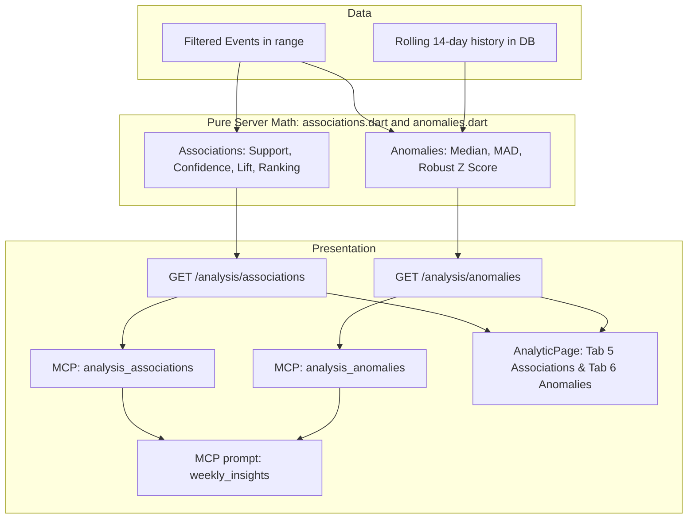

# Analytic Tab Wave 5 — Event Associations & Anomaly Alerts — Implementation Plan

> **For agentic workers:** Implement task-by-task with superpowers:executing-plans (inline, no subagent-driven-development — project rule). Steps use checkbox (`- [ ]`) syntax for tracking. Executor: Gemini. Do every step in order. Do not skip the "run test, expect FAIL" steps. Do not invent APIs not shown here; if a package or Flutter API differs from this plan, STOP and report the exact error instead of improvising. **Never change an expected value in a test to make it pass** — if a test fails after implementing exactly what is shown, STOP and report. When a step says "replace this exact text" and the text is not found, STOP and report. Do not edit anything under `.cursor/memory/` (Claude updates memory at review).

**Goal:** Complete the final wave of the Analytic feature by adding the 5th and 6th tabs (**Associations** and **Anomalies**) to the sidebar **Analytic** page. Associations discover co-occurring player actions with support, confidence, and lift. Anomalies flag daily spikes or drops across DAU, new players, sessions, top 15 events, and level completion rates using a rolling 14-day robust z-score (median + MAD). The analysis is exposed via MCP tools `analysis_associations` (23rd tool) and `analysis_anomalies` (24th tool), and integrated into the `weekly_insights` MCP prompt.

**Architecture:** Pure mathematical routines in `server/lib/src/analysis/` handle computations. `associations.dart` analyzes sets of player behaviors (auto-detected candidate events and core booleans `reached_level_5`, `failed_any_level`), filtering by support $\ge 5$ and lift $\ge 1.5$ (or $\le 0.67$), ranked by $lift \times \ln(support)$. `anomalies.dart` calculates rolling 14-day medians and median absolute deviations (MAD) to compute robust z-scores $z = (x - \text{median}) / (1.4826 \times \text{MAD})$, flagging $|z| \ge 3$. `EventStore` provides `store.associations(f)` and `store.anomalies(f)`. `shelf` serves `GET /analysis/associations` and `GET /analysis/anomalies`. The app renders `AssociationsTab` with ranked cards and `AnomaliesTab` with interactive series charts via `MetricLineChart`.

**Tech Stack:** Dart 3.13.5 / Flutter 3.47.6 (`D:\flutter\bin`), Riverpod 2.6.1 (pinned), fl_chart, shelf, sqlite3, dart_mcp 0.5.2, `test`, `flutter_test`. **No new packages.**

**Spec:** [.cursor/plans/analytic-tab-design.md](file:///d:/Projects/AnalyticTracker/.cursor/plans/analytic-tab-design.md) — §1 (goal + honesty rule), §2 (architecture), §6 (event associations), §7 (anomaly alerts), §8 (API/MCP), §8a (prompt), §9 (app page), §10 (errors), §11 (testing), §12 (files).



## Global Constraints

- Every shell: PowerShell, prefix `$env:Path = "D:\flutter\bin;$env:Path"` once per terminal.
- Gates: `cd shared; dart analyze; dart test` · `cd server; dart analyze; dart test` · `cd app; flutter analyze; flutter test`. Analyzer must say `No issues found!` after every task.
- Candidate events for associations: top event candidates after blocklist (`screen_view`, `user_engagement`, `session_start`, `first_open`, `app_remove`, `app_clear_data`, `firebase_campaign` and `level_*`) plus core derived booleans `reached_level_5` and `failed_any_level`.
- Association thresholds: support $\ge 5$ players; lift $\ge 1.5$ or lift $\le 0.67$. Ranked by $lift \times \ln(support)$ descending, top 20 returned.
- Small sample rule: any association with support $< 10$ flagged with `smallSample: true`.
- Anomaly baseline: previous 14 stored days rolling, excluding the evaluated day. Minimum 7 baseline days required for analysis.
- Anomaly threshold: robust $z = (x - \text{median}) / (1.4826 \times \text{MAD})$. Flagged if $|z| \ge 3.0$. If $\text{MAD} = 0$, flag if $|x - \text{median}| / \max(\text{median}, 1) \ge 0.5$. Maximum 30 alerts returned, ordered by $|z|$ descending (ties broken by latest day first).
- Evaluated anomaly series:
  1. `DAU`
  2. `new_players` (`first_open`)
  3. `sessions` (`session_start`)
  4. Daily count of top 15 events in range
  5. Daily level completion rate (`level_N_complete / level_N_start`) for levels with $\ge 10$ starts on that day.
- Population rule: fewer than 20 players in range $\to$ `reason: "too_few_players"`, empty associations. Range shorter than 8 days or $< 7$ history days $\to$ `reason: "too_short"`.
- Routes:
  - `GET /analysis/associations`
  - `GET /analysis/anomalies`
- MCP: tools `analysis_associations` (23rd tool) and `analysis_anomalies` (24th tool), read-only. `weekly_insights` prompt extended to include both tools. Total tools = 24.
- App: tabs 5 and 6 added to `AnalyticPage` (`DefaultTabController(length: 6, ...)`), with `AssociationsTab` and `AnomaliesTab`. Tapping an anomaly shows `MetricLineChart` of the series history.
- Colors: `AnalyticsTokens.of(context)` / `Theme.of(context)` only.
- One commit per task, message given in task.

## Review Focus

1. **MAD = 0 division by zero guard** — when baseline values are identical (e.g., all 0 or all 5), $\text{MAD} = 0$. Robust z calculation must not yield `Infinity` or `NaN`; it must evaluate the $\ge 50\%$ relative difference branch. Pinned in `analysis_anomalies_test.dart`.
2. **Lift and inverse lift sentence formatting** — positive associations ($lift \ge 1.0$) format as "X% more likely", while negative associations ($lift < 1.0$) format as "X% less likely" using $1 / lift$. Pinned in `analysis_associations_test.dart`.
3. **Rolling baseline boundary isolation** — anomaly baseline for day $d$ must strictly use stored days prior to $d$ ($< d$) and never include day $d$ itself. If $< 7$ preceding baseline days exist, no alert is emitted. Pinned in `analysis_anomalies_test.dart`.
4. **Association support filter with small sample badge** — pairs with support $< 5$ must be dropped. Pairs with $5 \le support < 10$ must be included but marked `smallSample: true`. Pinned in `analysis_associations_test.dart`.
5. **Level completion rate zero division guard** — if a level has $< 10$ starts on a given day, completion rate anomaly evaluation for that level must be omitted. Pinned in `analysis_anomalies_test.dart`.

## File map

| File | Action | Task |
|---|---|---|
| `shared/lib/src/analysis_models.dart` | Modify (add `AssociationRule`, `AssociationResult`, `AnomalyAlertPoint`, `AnomalyAlert`, `AnomalyResult`) | 1 |
| `shared/test/analysis_models_test.dart` | Modify (add association & anomaly JSON serialization tests) | 1 |
| `server/lib/src/analysis/associations.dart` | Create (pure association mining: support, confidence, lift, ranking) | 2 |
| `server/lib/src/analysis/anomalies.dart` | Create (pure robust z-score anomaly detector: median, MAD, rolling baseline) | 2 |
| `server/lib/analytic_server.dart` | Modify (export `associations.dart` and `anomalies.dart`) | 2 |
| `server/test/analysis_associations_test.dart` | Create (unit tests for association rules and sentences) | 2 |
| `server/test/analysis_anomalies_test.dart` | Create (unit tests for robust z-scores and MAD=0 logic) | 2 |
| `server/lib/src/event_store.dart` | Modify (add `store.associations(f)` and `store.anomalies(f)`) | 3 |
| `server/lib/src/api.dart` | Modify (add `GET /analysis/associations` and `GET /analysis/anomalies`) | 3 |
| `server/test/api_analysis_test.dart` | Modify (test `/analysis/associations` and `/analysis/anomalies`) | 3 |
| `server/lib/src/mcp_tools.dart` | Modify (add `analysis_associations` and `analysis_anomalies`, tools 23 and 24) | 4 |
| `server/lib/src/mcp_prompts.dart` | Modify (document Wave 5 tools in `weekly_insights` prompt description/tests) | 4 |
| `server/test/mcp_tools_test.dart` | Modify (verify 24 tools, schemas, readOnly hints) | 4 |
| `server/test/mcp_e2e_test.dart` | Modify (verify 24 tools and e2e call for Wave 5 tools) | 4 |
| `server/test/mcp_prompts_test.dart` | Modify (verify prompt includes Wave 5 tools) | 4 |
| `app/lib/src/api_client.dart` | Modify (add `associations` and `anomalies` client methods) | 5 |
| `app/lib/src/providers.dart` | Modify (add `associationsProvider` and `anomaliesProvider`) | 5 |
| `app/lib/src/pages/analytic/associations_tab.dart` | Create (`AssociationsTab` widget with ranked cards and badges) | 5 |
| `app/lib/src/pages/analytic/anomalies_tab.dart` | Create (`AnomaliesTab` widget with alert cards and `MetricLineChart` viewer) | 5 |
| `app/lib/src/pages/analytic/analytic_page.dart` | Modify (expand to 6 tabs: Clusters, Churn, Levels, Survival, Associations, Anomalies) | 5 |
| `app/test/analytic_associations_test.dart` | Create (widget tests for `AssociationsTab`) | 5 |
| `app/test/analytic_anomalies_test.dart` | Create (widget tests for `AnomaliesTab`) | 5 |
| `app/test/analytic_page_test.dart` | Modify (verify 6 tabs in `AnalyticPage`) | 5 |

---

### Task 0: Baseline Check

- [ ] **Step 1: Verify git status and branch**

```powershell
cd D:\Projects\AnalyticTracker
git status --short
git log --oneline -3
```

- [ ] **Step 2: Run baseline gates**

```powershell
$env:Path = "D:\flutter\bin;$env:Path"
cd shared; dart analyze; dart test; cd ..\server; dart analyze; dart test; cd ..\app; flutter analyze; flutter test; cd ..
```

Expected: all analyzers clean, all tests passing.

---

### Task 1: Shared Association & Anomaly Models

**Files:**
- Modify: `shared/lib/src/analysis_models.dart`
- Modify: `shared/test/analysis_models_test.dart`

**Interfaces:**
- Produces:
  - `class AssociationRule { String antecedent; String consequent; int support; double confidence; double lift; String sentence; bool smallSample; }`
  - `class AssociationResult { int players; List<AssociationRule> rules; String? reason; }`
  - `class AnomalyAlertPoint { String day; double value; }`
  - `class AnomalyAlert { String series; String day; double value; double median; double mad; double z; String message; List<AnomalyAlertPoint> history; }`
  - `class AnomalyResult { int days; List<AnomalyAlert> alerts; String? reason; }`

- [ ] **Step 1: Write the failing tests in shared models**

Modify `shared/test/analysis_models_test.dart` by adding tests for `AssociationResult` and `AnomalyResult`:

```dart
    test('AssociationResult roundtrip', () {
      const json = {
        'players': 120,
        'rules': [
          {
            'antecedent': 'Reward_request_success',
            'consequent': 'pet_buy',
            'support': 8,
            'confidence': 0.615,
            'lift': 3.12,
            'sentence': 'Players who do Reward_request_success are 3.1× more likely to do pet_buy (8 players)',
            'smallSample': true,
          },
        ],
        'reason': null,
      };
      final res = AssociationResult.fromJson(json);
      expect(res.players, 120);
      expect(res.rules.length, 1);
      final r = res.rules.first;
      expect(r.antecedent, 'Reward_request_success');
      expect(r.consequent, 'pet_buy');
      expect(r.support, 8);
      expect(r.confidence, 0.615);
      expect(r.lift, 3.12);
      expect(r.smallSample, isTrue);
      expect(res.toJson(), json);
    });

    test('AnomalyResult roundtrip', () {
      const json = {
        'days': 30,
        'alerts': [
          {
            'series': 'level_5_fail',
            'day': '2026-10-03',
            'value': 23.0,
            'median': 4.0,
            'mad': 1.5,
            'z': 5.2,
            'message': 'level_5_fail: 23 on 2026-10-03, usual ~4, z = 5.2',
            'history': [
              {'day': '2026-10-01', 'value': 4.0},
              {'day': '2026-10-02', 'value': 5.0},
              {'day': '2026-10-03', 'value': 23.0},
            ],
          },
        ],
        'reason': null,
      };
      final res = AnomalyResult.fromJson(json);
      expect(res.days, 30);
      expect(res.alerts.length, 1);
      final a = res.alerts.first;
      expect(a.series, 'level_5_fail');
      expect(a.day, '2026-10-03');
      expect(a.value, 23.0);
      expect(a.median, 4.0);
      expect(a.mad, 1.5);
      expect(a.z, 5.2);
      expect(a.history.length, 3);
      expect(a.history.first.day, '2026-10-01');
      expect(res.toJson(), json);
    });
```

- [ ] **Step 2: Run test to verify it fails**

```powershell
$env:Path = "D:\flutter\bin;$env:Path"
cd D:\Projects\AnalyticTracker\shared
dart test test/analysis_models_test.dart
```

Expected: FAIL with compilation error that `AssociationResult` and `AnomalyResult` are undefined.

- [ ] **Step 3: Implement minimal models in shared/lib/src/analysis_models.dart**

Add to `shared/lib/src/analysis_models.dart`:

```dart
/// One discovered event association rule (spec §6).
class AssociationRule {
  const AssociationRule({
    required this.antecedent,
    required this.consequent,
    required this.support,
    required this.confidence,
    required this.lift,
    required this.sentence,
    required this.smallSample,
  });

  final String antecedent;
  final String consequent;
  final int support;
  final double confidence;
  final double lift;
  final String sentence;
  final bool smallSample;

  factory AssociationRule.fromJson(Map<String, dynamic> j) => AssociationRule(
        antecedent: j['antecedent'] as String,
        consequent: j['consequent'] as String,
        support: j['support'] as int,
        confidence: (j['confidence'] as num).toDouble(),
        lift: (j['lift'] as num).toDouble(),
        sentence: j['sentence'] as String,
        smallSample: j['smallSample'] as bool,
      );

  Map<String, dynamic> toJson() => {
        'antecedent': antecedent,
        'consequent': consequent,
        'support': support,
        'confidence': confidence,
        'lift': lift,
        'sentence': sentence,
        'smallSample': smallSample,
      };
}

/// Response of `GET /analysis/associations` (spec §6, §8).
class AssociationResult {
  const AssociationResult({
    required this.players,
    required this.rules,
    required this.reason,
  });

  final int players;
  final List<AssociationRule> rules;
  final String? reason;

  factory AssociationResult.fromJson(Map<String, dynamic> j) => AssociationResult(
        players: j['players'] as int,
        rules: [
          for (final r in j['rules'] as List) AssociationRule.fromJson(r as Map<String, dynamic>),
        ],
        reason: j['reason'] as String?,
      );

  Map<String, dynamic> toJson() => {
        'players': players,
        'rules': [for (final r in rules) r.toJson()],
        'reason': reason,
      };
}

/// One history point for an anomaly series chart.
class AnomalyAlertPoint {
  const AnomalyAlertPoint({
    required this.day,
    required this.value,
  });

  final String day;
  final double value;

  factory AnomalyAlertPoint.fromJson(Map<String, dynamic> j) => AnomalyAlertPoint(
        day: j['day'] as String,
        value: (j['value'] as num).toDouble(),
      );

  Map<String, dynamic> toJson() => {
        'day': day,
        'value': value,
      };
}

/// One flagged anomaly alert (spec §7).
class AnomalyAlert {
  const AnomalyAlert({
    required this.series,
    required this.day,
    required this.value,
    required this.median,
    required this.mad,
    required this.z,
    required this.message,
    required this.history,
  });

  final String series;
  final String day;
  final double value;
  final double median;
  final double mad;
  final double z;
  final String message;
  final List<AnomalyAlertPoint> history;

  factory AnomalyAlert.fromJson(Map<String, dynamic> j) => AnomalyAlert(
        series: j['series'] as String,
        day: j['day'] as String,
        value: (j['value'] as num).toDouble(),
        median: (j['median'] as num).toDouble(),
        mad: (j['mad'] as num).toDouble(),
        z: (j['z'] as num).toDouble(),
        message: j['message'] as String,
        history: [
          for (final h in j['history'] as List) AnomalyAlertPoint.fromJson(h as Map<String, dynamic>),
        ],
      );

  Map<String, dynamic> toJson() => {
        'series': series,
        'day': day,
        'value': value,
        'median': median,
        'mad': mad,
        'z': z,
        'message': message,
        'history': [for (final h in history) h.toJson()],
      };
}

/// Response of `GET /analysis/anomalies` (spec §7, §8).
class AnomalyResult {
  const AnomalyResult({
    required this.days,
    required this.alerts,
    required this.reason,
  });

  final int days;
  final List<AnomalyAlert> alerts;
  final String? reason;

  factory AnomalyResult.fromJson(Map<String, dynamic> j) => AnomalyResult(
        days: j['days'] as int,
        alerts: [
          for (final a in j['alerts'] as List) AnomalyAlert.fromJson(a as Map<String, dynamic>),
        ],
        reason: j['reason'] as String?,
      );

  Map<String, dynamic> toJson() => {
        'days': days,
        'alerts': [for (final a in alerts) a.toJson()],
        'reason': reason,
      };
}
```

- [ ] **Step 4: Run test to verify it passes**

```powershell
$env:Path = "D:\flutter\bin;$env:Path"
cd D:\Projects\AnalyticTracker\shared
dart analyze
dart test
```

Expected: PASS, `No issues found!`.

- [ ] **Step 5: Commit**

```powershell
cd D:\Projects\AnalyticTracker
git add shared/lib/src/analysis_models.dart shared/test/analysis_models_test.dart
git commit -m "feat(shared): add event association and anomaly alert models"
```

---

### Task 2: Pure Server Math — Associations & Robust Z Anomalies

**Files:**
- Create: `server/lib/src/analysis/associations.dart`
- Create: `server/lib/src/analysis/anomalies.dart`
- Modify: `server/lib/analytic_server.dart`
- Create: `server/test/analysis_associations_test.dart`
- Create: `server/test/analysis_anomalies_test.dart`

**Interfaces:**
- Produces:
  - `List<AssociationRule> mineAssociations(List<Set<String>> playerItemSets, {int totalPlayers, int minSupport = 5, double minLift = 1.5, double maxNegativeLift = 0.67, int limit = 20})`
  - `double computeMedian(List<double> values)`
  - `double computeMad(List<double> values, double median)`
  - `double computeRobustZ(double x, double median, double mad)`
  - `List<AnomalyAlert> detectAnomalies(Map<String, List<AnomalyAlertPoint>> seriesData, {int minBaselineDays = 7, int maxBaselineDays = 14, double thresholdZ = 3.0, int limit = 30})`

- [ ] **Step 1: Write failing tests for associations and anomalies**

Create `server/test/analysis_associations_test.dart`:

```dart
import 'package:analytic_server/analytic_server.dart';
import 'package:analytic_shared/analytic_shared.dart';
import 'package:test/test.dart';

void main() {
  group('mineAssociations', () {
    test('computes exact support, confidence, lift, and formats sentence', () {
      // 20 players total:
      // 10 do A
      // 10 do B
      // 6 do both A and B
      // support(A, B) = 6
      // P(A) = 10/20 = 0.5
      // P(B) = 10/20 = 0.5
      // conf(A -> B) = 6/10 = 0.6
      // lift(A -> B) = 0.6 / 0.5 = 1.2 -> below 1.5, not included by default!
      // But if 8 do both:
      // conf(A -> B) = 8/10 = 0.8
      // lift(A -> B) = 0.8 / 0.5 = 1.6 -> above 1.5!
      final players = <Set<String>>[
        for (var i = 0; i < 8; i++) {'action_a', 'action_b'},
        for (var i = 0; i < 2; i++) {'action_a'},
        for (var i = 0; i < 2; i++) {'action_b'},
        for (var i = 0; i < 8; i++) {'other'},
      ];

      final rules = mineAssociations(players, totalPlayers: 20);
      expect(rules.length, 2); // (a -> b) and (b -> a)

      final rule = rules.first;
      expect(rule.antecedent, 'action_a');
      expect(rule.consequent, 'action_b');
      expect(rule.support, 8);
      expect(rule.confidence, closeTo(0.8, 1e-4));
      expect(rule.lift, closeTo(1.6, 1e-4));
      expect(rule.smallSample, isTrue); // < 10 players
      expect(rule.sentence, 'Players who do action_a are 1.6× more likely to do action_b (8 players)');
    });

    test('formats less likely sentence when lift <= 0.67', () {
      // 30 players:
      // 15 do A
      // 15 do B
      // Only 5 do both A and B
      // P(A) = 0.5, P(B) = 0.5
      // conf(A -> B) = 5/15 = 0.3333
      // lift = 0.3333 / 0.5 = 0.6667 <= 0.67
      final players = <Set<String>>[
        for (var i = 0; i < 5; i++) {'action_a', 'action_b'},
        for (var i = 0; i < 10; i++) {'action_a'},
        for (var i = 0; i < 10; i++) {'action_b'},
        for (var i = 0; i < 5; i++) {'idle'},
      ];

      final rules = mineAssociations(players, totalPlayers: 30);
      expect(rules.any((r) => r.antecedent == 'action_a' && r.consequent == 'action_b'), isTrue);
      final r = rules.firstWhere((r) => r.antecedent == 'action_a' && r.consequent == 'action_b');
      expect(r.lift, closeTo(0.6667, 1e-3));
      expect(r.sentence, 'Players who do action_a are 1.5× less likely to do action_b (5 players)');
    });

    test('drops pairs with support < 5', () {
      final players = <Set<String>>[
        for (var i = 0; i < 4; i++) {'action_a', 'action_b'},
        for (var i = 0; i < 16; i++) {'other'},
      ];
      final rules = mineAssociations(players, totalPlayers: 20);
      expect(rules, isEmpty);
    });
  });
}
```

Create `server/test/analysis_anomalies_test.dart`:

```dart
import 'package:analytic_server/analytic_server.dart';
import 'package:analytic_shared/analytic_shared.dart';
import 'package:test/test.dart';

void main() {
  group('computeMedian & computeMad', () {
    test('computes exact median for odd and even length', () {
      expect(computeMedian([1, 3, 2]), 2.0);
      expect(computeMedian([1, 2, 3, 4]), 2.5);
    });

    test('computes exact MAD', () {
      // values: 2, 2, 4, 5, 9
      // median = 4
      // abs dev: |2-4|=2, |2-4|=2, |4-4|=0, |5-4|=1, |9-4|=5 -> [0, 1, 2, 2, 5]
      // median of abs dev = 2
      expect(computeMad([2, 2, 4, 5, 9], 4.0), 2.0);
    });

    test('handles MAD = 0 without NaN or infinity', () {
      // All values 5.0 -> median 5.0, MAD 0.0
      expect(computeMad([5, 5, 5, 5, 5], 5.0), 0.0);
      // Value 10.0 is 100% higher than median 5.0 (>= 50%)
      final zSpike = computeRobustZ(10.0, 5.0, 0.0);
      expect(zSpike.abs(), greaterThanOrEqualTo(3.0));

      // Value 5.5 is only 10% higher -> not an anomaly
      final zSmall = computeRobustZ(5.5, 5.0, 0.0);
      expect(zSmall.abs(), lessThan(3.0));
    });
  });

  group('detectAnomalies', () {
    test('detects spike with |z| >= 3 after 14 baseline days', () {
      // 14 days of baseline with value 4.0, day 15 spikes to 23.0
      final points = [
        for (var i = 1; i <= 14; i++)
          AnomalyAlertPoint(day: '2026-10-${i.toString().padLeft(2, '0')}', value: (i % 2 == 0 ? 4.0 : 5.0)),
        const AnomalyAlertPoint(day: '2026-10-15', value: 25.0),
      ];

      final alerts = detectAnomalies({'level_5_fail': points});
      expect(alerts.length, 1);
      final alert = alerts.first;
      expect(alert.series, 'level_5_fail');
      expect(alert.day, '2026-10-15');
      expect(alert.value, 25.0);
      expect(alert.z.abs(), greaterThanOrEqualTo(3.0));
      expect(alert.message, contains('level_5_fail: 25 on 2026-10-15, usual ~'));
      expect(alert.history.length, 15);
    });

    test('ignores days with fewer than 7 baseline days', () {
      final points = [
        for (var i = 1; i <= 5; i++)
          AnomalyAlertPoint(day: '2026-10-${i.toString().padLeft(2, '0')}', value: 2.0),
        const AnomalyAlertPoint(day: '2026-10-06', value: 99.0),
      ];

      final alerts = detectAnomalies({'sessions': points});
      expect(alerts, isEmpty);
    });
  });
}
```

- [ ] **Step 2: Run test to verify it fails**

```powershell
$env:Path = "D:\flutter\bin;$env:Path"
cd D:\Projects\AnalyticTracker\server
dart test test/analysis_associations_test.dart
```

Expected: FAIL with compilation errors (unresolved symbols `mineAssociations`, `computeMedian`, etc.).

- [ ] **Step 3: Implement associations.dart and anomalies.dart**

Create `server/lib/src/analysis/associations.dart`:

```dart
import 'dart:math';

import 'package:analytic_shared/analytic_shared.dart';

/// Mines co-occurring event pairs across player item sets (spec §6).
List<AssociationRule> mineAssociations(
  List<Set<String>> playerItemSets, {
  required int totalPlayers,
  int minSupport = 5,
  double minLift = 1.5,
  double maxNegativeLift = 0.67,
  int limit = 20,
}) {
  if (totalPlayers == 0 || playerItemSets.isEmpty) return const [];

  final itemCounts = <String, int>{};
  final pairCounts = <String, Map<String, int>>{};

  for (final items in playerItemSets) {
    for (final a in items) {
      itemCounts[a] = (itemCounts[a] ?? 0) + 1;
      final aMap = pairCounts.putIfAbsent(a, () => {});
      for (final b in items) {
        if (a != b) {
          aMap[b] = (aMap[b] ?? 0) + 1;
        }
      }
    }
  }

  final candidates = <({
    String antecedent,
    String consequent,
    int support,
    double confidence,
    double lift,
    double rankScore,
    bool smallSample,
    String sentence,
  })>[];

  final n = totalPlayers.toDouble();

  for (final entryA in pairCounts.entries) {
    final a = entryA.key;
    final countA = itemCounts[a] ?? 0;
    if (countA == 0) continue;

    for (final entryB in entryA.value.entries) {
      final b = entryB.key;
      final support = entryB.value;
      if (support < minSupport) continue;

      final countB = itemCounts[b] ?? 0;
      if (countB == 0) continue;

      final confidence = support / countA;
      final pB = countB / n;
      final lift = confidence / pB;

      final isPositive = lift >= minLift;
      final isNegative = lift <= maxNegativeLift;

      if (!isPositive && !isNegative) continue;

      final rankScore = lift * log(support);
      final smallSample = support < 10;

      final sentence = lift >= 1.0
          ? 'Players who do $a are ${lift.toStringAsFixed(1)}× more likely to do $b ($support players)'
          : 'Players who do $a are ${(1.0 / lift).toStringAsFixed(1)}× less likely to do $b ($support players)';

      candidates.add((
        antecedent: a,
        consequent: b,
        support: support,
        confidence: confidence,
        lift: lift,
        rankScore: rankScore,
        smallSample: smallSample,
        sentence: sentence,
      ));
    }
  }

  candidates.sort((a, b) => b.rankScore.compareTo(a.rankScore));

  final selected = candidates.take(limit);

  return [
    for (final c in selected)
      AssociationRule(
        antecedent: c.antecedent,
        consequent: c.consequent,
        support: c.support,
        confidence: double.parse(c.confidence.toStringAsFixed(4)),
        lift: double.parse(c.lift.toStringAsFixed(4)),
        sentence: c.sentence,
        smallSample: c.smallSample,
      ),
  ];
}
```

Create `server/lib/src/analysis/anomalies.dart`:

```dart
import 'dart:math';

import 'package:analytic_shared/analytic_shared.dart';

/// Computes the median of a non-empty numeric list.
double computeMedian(List<double> values) {
  if (values.isEmpty) return 0.0;
  final sorted = List<double>.from(values)..sort();
  final mid = sorted.length ~/ 2;
  if (sorted.length.isOdd) {
    return sorted[mid];
  }
  return (sorted[mid - 1] + sorted[mid]) / 2.0;
}

/// Computes the Median Absolute Deviation (MAD) against [median].
double computeMad(List<double> values, double median) {
  if (values.isEmpty) return 0.0;
  final diffs = [for (final v in values) (v - median).abs()];
  return computeMedian(diffs);
}

/// Computes robust z-score = (x - median) / (1.4826 * MAD).
/// When MAD == 0, flags only when x differs from median by >= 50%.
double computeRobustZ(double x, double median, double mad) {
  if (mad > 0) {
    return (x - median) / (1.4826 * mad);
  }
  // MAD == 0: all baseline values are identical or mostly identical
  final denom = median.abs() == 0 ? 1.0 : median.abs();
  final relDiff = (x - median).abs() / denom;
  if (relDiff >= 0.5) {
    // Escalate to an alert magnitude >= 3.0 proportional to relative difference
    final sign = x >= median ? 1.0 : -1.0;
    return sign * 3.0 * (relDiff / 0.5);
  }
  return 0.0;
}

/// Detects anomalies across daily metric series using rolling 14-day history (spec §7).
List<AnomalyAlert> detectAnomalies(
  Map<String, List<AnomalyAlertPoint>> seriesData, {
  int minBaselineDays = 7,
  int maxBaselineDays = 14,
  double thresholdZ = 3.0,
  int limit = 30,
}) {
  final alerts = <AnomalyAlert>[];

  for (final entry in seriesData.entries) {
    final series = entry.key;
    final points = List<AnomalyAlertPoint>.from(entry.value)
      ..sort((a, b) => a.day.compareTo(b.day));

    for (var i = 0; i < points.length; i++) {
      final target = points[i];
      final startIdx = max(0, i - maxBaselineDays);
      final baselinePoints = points.sublist(startIdx, i);

      if (baselinePoints.length < minBaselineDays) continue;

      final baselineValues = [for (final p in baselinePoints) p.value];
      final median = computeMedian(baselineValues);
      final mad = computeMad(baselineValues, median);
      final z = computeRobustZ(target.value, median, mad);

      if (z.abs() >= thresholdZ) {
        final valStr = target.value == target.value.roundToDouble()
            ? target.value.toInt().toString()
            : target.value.toStringAsFixed(1);
        final medStr = median == median.roundToDouble()
            ? median.toInt().toString()
            : median.toStringAsFixed(1);
        final zStr = z.toStringAsFixed(1);

        final message = '$series: $valStr on ${target.day}, usual ~$medStr, z = $zStr';

        // Full history window including baseline plus evaluated point
        final historyWindow = points.sublist(startIdx, i + 1);

        alerts.add(AnomalyAlert(
          series: series,
          day: target.day,
          value: target.value,
          median: double.parse(median.toStringAsFixed(2)),
          mad: double.parse(mad.toStringAsFixed(2)),
          z: double.parse(z.toStringAsFixed(2)),
          message: message,
          history: historyWindow,
        ));
      }
    }
  }

  // Sort by |z| descending, latest first on ties
  alerts.sort((a, b) {
    final cmpZ = b.z.abs().compareTo(a.z.abs());
    if (cmpZ != 0) return cmpZ;
    return b.day.compareTo(a.day);
  });

  return alerts.take(limit).toList();
}
```

Update `server/lib/analytic_server.dart` to export both files:
```dart
export 'src/analysis/anomalies.dart';
export 'src/analysis/associations.dart';
```

- [ ] **Step 4: Run tests to verify they pass**

```powershell
$env:Path = "D:\flutter\bin;$env:Path"
cd D:\Projects\AnalyticTracker\server
dart analyze
dart test test/analysis_associations_test.dart
dart test test/analysis_anomalies_test.dart
```

Expected: PASS, `No issues found!`.

- [ ] **Step 5: Commit**

```powershell
cd D:\Projects\AnalyticTracker
git add server/lib/src/analysis/associations.dart server/lib/src/analysis/anomalies.dart server/lib/analytic_server.dart server/test/analysis_associations_test.dart server/test/analysis_anomalies_test.dart
git commit -m "feat(server): add pure association mining and robust z anomaly detection"
```

---

### Task 3: Store & API Routes — Associations & Anomalies

**Files:**
- Modify: `server/lib/src/event_store.dart`
- Modify: `server/lib/src/api.dart`
- Modify: `server/test/api_analysis_test.dart`

**Interfaces:**
- Consumes:
  - `mineAssociations(...)` from `associations.dart`
  - `detectAnomalies(...)` from `anomalies.dart`
- Produces:
  - `AssociationResult EventStore.associations(Filters f)`
  - `AnomalyResult EventStore.anomalies(Filters f)`
  - `GET /analysis/associations`
  - `GET /analysis/anomalies`

- [ ] **Step 1: Write failing tests in api_analysis_test.dart**

Add to `server/test/api_analysis_test.dart`:

```dart
  test('GET /analysis/associations serves AssociationResult', () async {
    final (status, body) = await getJson('/analysis/associations?from=$d1&to=$d1');
    expect(status, 200);
    final map = body as Map<String, dynamic>;
    expect(map['players'], 24);
    expect(map['rules'], isA<List>());
    final parsed = AssociationResult.fromJson(map);
    expect(parsed.players, 24);
  });

  test('GET /analysis/associations too few players', () async {
    final (status, body) = await getJson('/analysis/associations?from=$d1&to=$d1&platform=IOS');
    expect(status, 200);
    final map = body as Map<String, dynamic>;
    expect(map['reason'], 'too_few_players');
    expect(map['rules'], isEmpty);
  });

  test('GET /analysis/anomalies serves AnomalyResult', () async {
    // Populate 15 days to allow rolling baseline
    for (var i = 1; i <= 15; i++) {
      final day = '2026-10-${i.toString().padLeft(2, '0')}';
      store.replaceDay(day, [
        ev(day, i * 1000, 'session_start', 'u1'),
        ev(day, i * 1000 + 1, 'first_open', 'u1'),
      ]);
    }
    final (status, body) = await getJson('/analysis/anomalies?from=2026-10-01&to=2026-10-15');
    expect(status, 200);
    final map = body as Map<String, dynamic>;
    expect(map['days'], 15);
    expect(map['alerts'], isA<List>());
    final parsed = AnomalyResult.fromJson(map);
    expect(parsed.days, 15);
  });

  test('GET /analysis/anomalies too short range returns reason', () async {
    final (status, body) = await getJson('/analysis/anomalies?from=$d1&to=$d1');
    expect(status, 200);
    final map = body as Map<String, dynamic>;
    expect(map['reason'], 'too_short');
    expect(map['alerts'], isEmpty);
  });
```

- [ ] **Step 2: Run test to verify it fails**

```powershell
$env:Path = "D:\flutter\bin;$env:Path"
cd D:\Projects\AnalyticTracker\server
dart test test/api_analysis_test.dart
```

Expected: FAIL (404 on `/analysis/associations` and `/analysis/anomalies`).

- [ ] **Step 3: Implement associations and anomalies in EventStore and Api**

In `server/lib/src/event_store.dart`:

```dart
  /// Discovers event associations and lift (spec §6).
  AssociationResult associations(Filters f) {
    final where = StringBuffer("day BETWEEN ? AND ? AND user_pseudo_id <> ''");
    final args = <Object?>[f.from, f.to];
    if (f.platform != null) {
      where.write(' AND platform = ?');
      args.add(f.platform);
    }
    if (f.version != null) {
      where.write(' AND app_version = ?');
      args.add(f.version);
    }
    where.write(testEventsClause(f.includeTest));

    final rows = _db.select(
      'SELECT user_pseudo_id AS u, event_name AS n '
      'FROM events WHERE $where ORDER BY u, ts_micros, id;',
      args,
    );

    final playerEvents = <String, Set<String>>{};
    final playerMaxLevel = <String, int>{};
    final playerHasFail = <String, bool>{};

    for (final r in rows) {
      final u = r['u'] as String;
      final n = r['n'] as String;
      playerEvents.putIfAbsent(u, () => {});

      if (n.startsWith('level_')) {
        final startMatch = RegExp(r'^level_(\d+)_(start|complete)$').firstMatch(n);
        if (startMatch != null) {
          final lvl = int.tryParse(startMatch.group(1)!) ?? 0;
          if (lvl > (playerMaxLevel[u] ?? 0)) {
            playerMaxLevel[u] = lvl;
          }
        }
        if (RegExp(r'^level_\d+_fail$').hasMatch(n)) {
          playerHasFail[u] = true;
        }
      } else if (!const {
        'screen_view', 'user_engagement', 'session_start', 'first_open',
        'app_remove', 'app_clear_data', 'firebase_campaign',
      }.contains(n)) {
        playerEvents[u]!.add(n);
      }
    }

    final totalPlayers = playerEvents.length;
    if (totalPlayers < 20) {
      return AssociationResult(
        players: totalPlayers,
        rules: const [],
        reason: 'too_few_players',
      );
    }

    final itemSets = <Set<String>>[];
    for (final entry in playerEvents.entries) {
      final u = entry.key;
      final set = Set<String>.from(entry.value);
      if ((playerMaxLevel[u] ?? 0) >= 5) {
        set.add('reached_level_5');
      }
      if (playerHasFail[u] == true) {
        set.add('failed_any_level');
      }
      itemSets.add(set);
    }

    final rules = mineAssociations(itemSets, totalPlayers: totalPlayers);
    return AssociationResult(players: totalPlayers, rules: rules, reason: null);
  }

  /// Detects daily metric anomalies using a rolling 14-day robust z baseline (spec §7).
  AnomalyResult anomalies(Filters f) {
    final rangeDays = daysBetween(f.from, f.to);
    if (rangeDays.length < 8) {
      return AnomalyResult(
        days: rangeDays.length,
        alerts: const [],
        reason: 'too_short',
      );
    }

    // Baseline queries up to 14 days before f.from
    final historyStart = addDays(f.from, -14);
    final where = StringBuffer("day BETWEEN ? AND ?");
    final args = <Object?>[historyStart, f.to];
    if (f.platform != null) {
      where.write(' AND platform = ?');
      args.add(f.platform);
    }
    if (f.version != null) {
      where.write(' AND app_version = ?');
      args.add(f.version);
    }
    where.write(testEventsClause(f.includeTest));

    final rows = _db.select('''
      SELECT day, event_name,
        COUNT(DISTINCT CASE WHEN user_pseudo_id <> '' THEN user_pseudo_id END) AS unique_users,
        COUNT(*) AS total_count
      FROM events
      WHERE $where
      GROUP BY day, event_name;
    ''', args);

    final dailyDau = <String, Set<String>>{};
    final dailyNewUsers = <String, int>{};
    final dailySessions = <String, int>{};
    final eventDailyCounts = <String, Map<String, int>>{};
    final levelStarts = <String, Map<int, int>>{};
    final levelCompletes = <String, Map<int, int>>{};

    final userRows = _db.select(
      'SELECT DISTINCT day, user_pseudo_id AS u FROM events WHERE $where AND user_pseudo_id <> "";',
      args,
    );
    for (final r in userRows) {
      final d = r['day'] as String;
      final u = r['u'] as String;
      dailyDau.putIfAbsent(d, () => {}).add(u);
    }

    for (final r in rows) {
      final d = r['day'] as String;
      final name = r['event_name'] as String;
      final count = r['total_count'] as int;

      if (name == 'first_open') {
        dailyNewUsers[d] = (dailyNewUsers[d] ?? 0) + count;
      } else if (name == 'session_start') {
        dailySessions[d] = (dailySessions[d] ?? 0) + count;
      }

      eventDailyCounts.putIfAbsent(name, () => {})[d] = count;

      final lvlStart = RegExp(r'^level_(\d+)_start$').firstMatch(name);
      if (lvlStart != null) {
        final lvl = int.parse(lvlStart.group(1)!);
        levelStarts.putIfAbsent(d, () => {})[lvl] = count;
      }
      final lvlComp = RegExp(r'^level_(\d+)_complete$').firstMatch(name);
      if (lvlComp != null) {
        final lvl = int.parse(lvlComp.group(1)!);
        levelCompletes.putIfAbsent(d, () => {})[lvl] = count;
      }
    }

    final allDays = daysBetween(historyStart, f.to);
    final seriesMap = <String, List<AnomalyAlertPoint>>{};

    seriesMap['DAU'] = [
      for (final d in allDays)
        AnomalyAlertPoint(day: d, value: (dailyDau[d]?.length ?? 0).toDouble())
    ];
    seriesMap['new_players'] = [
      for (final d in allDays)
        AnomalyAlertPoint(day: d, value: (dailyNewUsers[d] ?? 0).toDouble())
    ];
    seriesMap['sessions'] = [
      for (final d in allDays)
        AnomalyAlertPoint(day: d, value: (dailySessions[d] ?? 0).toDouble())
    ];

    // Top 15 events by overall frequency in filtered range
    final eventTotals = <String, int>{};
    for (final entry in eventDailyCounts.entries) {
      final name = entry.key;
      if (const {'screen_view', 'user_engagement', 'session_start', 'first_open',
                 'app_remove', 'app_clear_data', 'firebase_campaign'}.contains(name)) {
        continue;
      }
      var sum = 0;
      for (final d in rangeDays) {
        sum += entry.value[d] ?? 0;
      }
      if (sum > 0) eventTotals[name] = sum;
    }
    final top15Events = eventTotals.keys.toList()
      ..sort((a, b) => eventTotals[b]!.compareTo(eventTotals[a]!));
    for (final name in top15Events.take(15)) {
      seriesMap[name] = [
        for (final d in allDays)
          AnomalyAlertPoint(day: d, value: (eventDailyCounts[name]?[d] ?? 0).toDouble())
      ];
    }

    // Level completion rates for levels with >= 10 starts
    final allLevels = <int>{};
    for (final dMap in levelStarts.values) {
      allLevels.addAll(dMap.keys);
    }
    for (final lvl in allLevels) {
      final list = <AnomalyAlertPoint>[];
      for (final d in allDays) {
        final starts = levelStarts[d]?[lvl] ?? 0;
        final completes = levelCompletes[d]?[lvl] ?? 0;
        if (starts >= 10) {
          list.add(AnomalyAlertPoint(day: d, value: completes / starts));
        }
      }
      if (list.length >= 7) {
        seriesMap['level_${lvl}_completion_rate'] = list;
      }
    }

    final alerts = detectAnomalies(seriesMap);
    // Filter alerts to only those occurring within the filtered range [f.from, f.to]
    final filteredAlerts = alerts
        .where((a) => a.day.compareTo(f.from) >= 0 && a.day.compareTo(f.to) <= 0)
        .toList();

    return AnomalyResult(days: rangeDays.length, alerts: filteredAlerts, reason: null);
  }
```

In `server/lib/src/api.dart`, add the two routes:
```dart
    ..get('/analysis/associations', (Request req) {
      final q = req.url.queryParameters;
      final f = _filters(q);
      return _json(store.associations(f).toJson());
    })
    ..get('/analysis/anomalies', (Request req) {
      final q = req.url.queryParameters;
      final f = _filters(q);
      return _json(store.anomalies(f).toJson());
    })
```

- [ ] **Step 4: Run tests to verify they pass**

```powershell
$env:Path = "D:\flutter\bin;$env:Path"
cd D:\Projects\AnalyticTracker\server
dart analyze
dart test test/api_analysis_test.dart
```

Expected: PASS, `No issues found!`.

- [ ] **Step 5: Commit**

```powershell
cd D:\Projects\AnalyticTracker
git add server/lib/src/event_store.dart server/lib/src/api.dart server/test/api_analysis_test.dart
git commit -m "feat(server): add associations and anomalies store queries and API routes"
```

---

### Task 4: MCP Tools & Prompt Updates

**Files:**
- Modify: `server/lib/src/mcp_tools.dart`
- Modify: `server/lib/src/mcp_prompts.dart`
- Modify: `server/test/mcp_tools_test.dart`
- Modify: `server/test/mcp_e2e_test.dart`
- Modify: `server/test/mcp_prompts_test.dart`

**Interfaces:**
- Produces:
  - Tool 23: `analysis_associations`
  - Tool 24: `analysis_anomalies`
  - Total registered MCP tools = 24

- [ ] **Step 1: Write failing tests in mcp_tools_test.dart and mcp_e2e_test.dart**

In `server/test/mcp_tools_test.dart`, update test expectation to 24 tools:
```dart
  test('all 24 tools, spec order, with annotations', () {
    expect(tools.all.keys, [
      'data_health', 'filter_options', 'list_events', 'overview', 'retention', 'progression',
      'event_counts', 'param_keys', 'param_values', 'user_prop_keys', 'list_funnels', 'run_funnel',
      'funnel_players', 'player_events', 'save_funnel', 'delete_funnel', 'import_export',
      'analysis_clusters', 'analysis_churn', 'analysis_levels', 'analysis_survival', 'analysis_version_impact',
      'analysis_associations', 'analysis_anomalies',
    ]);
    bool? readOnly(String n) => tools.all[n]!.$1.toolAnnotations?.readOnlyHint;
    for (final n in [
      'data_health', 'overview', 'run_funnel', 'list_funnels', 'param_values', 'user_prop_keys',
      'funnel_players', 'player_events', 'analysis_clusters', 'analysis_churn', 'analysis_levels',
      'analysis_survival', 'analysis_version_impact', 'analysis_associations', 'analysis_anomalies',
    ]) {
      expect(readOnly(n), isTrue, reason: n);
    }
  });
```

In `server/test/mcp_e2e_test.dart`:
Update `expect(list.tools.length, 24);`, check `analysis_associations` and `analysis_anomalies` presence, and call both tools.

- [ ] **Step 2: Run test to verify it fails**

```powershell
$env:Path = "D:\flutter\bin;$env:Path"
cd D:\Projects\AnalyticTracker\server
dart test test/mcp_tools_test.dart
```

Expected: FAIL with tools length mismatch.

- [ ] **Step 3: Add tools 23 and 24 to mcp_tools.dart and update prompt tests**

In `server/lib/src/mcp_tools.dart`, add to `_tools()`:
```dart
        (
          Tool(
            name: 'analysis_associations',
            description: 'Mines co-occurring player actions and events (support, confidence, lift). '
                'Returns top 20 association pairs with support >= 5 and lift >= 1.5 or <= 0.67. '
                '"reason" too_few_players (< 20).',
            inputSchema: _filtered({}),
            annotations: _read,
          ),
          (a) => _send('GET', 'analysis/associations', query: _filterQuery(a)),
        ),
        (
          Tool(
            name: 'analysis_anomalies',
            description: 'Detects daily anomalies (|z| >= 3) across DAU, new players, sessions, top events, '
                'and level completion rates using rolling 14-day robust z baseline (median and MAD). '
                '"reason" too_short (< 8 days range).',
            inputSchema: _filtered({}),
            annotations: _read,
          ),
          (a) => _send('GET', 'analysis/anomalies', query: _filterQuery(a)),
        ),
```

- [ ] **Step 4: Run tests to verify they pass**

```powershell
$env:Path = "D:\flutter\bin;$env:Path"
cd D:\Projects\AnalyticTracker\server
dart analyze
dart test test/mcp_tools_test.dart
dart test test/mcp_e2e_test.dart
dart test test/mcp_prompts_test.dart
```

Expected: PASS, `No issues found!`.

- [ ] **Step 5: Commit**

```powershell
cd D:\Projects\AnalyticTracker
git add server/lib/src/mcp_tools.dart server/lib/src/mcp_prompts.dart server/test/mcp_tools_test.dart server/test/mcp_e2e_test.dart server/test/mcp_prompts_test.dart
git commit -m "feat(mcp): add analysis_associations and analysis_anomalies tools"
```

---

### Task 5: Flutter App UI — AssociationsTab, AnomaliesTab, & AnalyticPage

**Files:**
- Modify: `app/lib/src/api_client.dart`
- Modify: `app/lib/src/providers.dart`
- Create: `app/lib/src/pages/analytic/associations_tab.dart`
- Create: `app/lib/src/pages/analytic/anomalies_tab.dart`
- Modify: `app/lib/src/pages/analytic/analytic_page.dart`
- Create: `app/test/analytic_associations_test.dart`
- Create: `app/test/analytic_anomalies_test.dart`
- Modify: `app/test/analytic_page_test.dart`

**Interfaces:**
- Consumes:
  - `AssociationResult`, `AnomalyResult` from `analytic_shared`
  - `associationsProvider`, `anomaliesProvider` from Riverpod
  - `MetricLineChart` from `widgets/metric_line_chart.dart`
- Produces:
  - `AssociationsTab` widget
  - `AnomaliesTab` widget
  - 6 tabs in `AnalyticPage`

- [ ] **Step 1: Write failing widget tests**

Create `app/test/analytic_associations_test.dart`:

```dart
import 'package:analytic_app/src/api_client.dart';
import 'package:analytic_app/src/pages/analytic/associations_tab.dart';
import 'package:analytic_app/src/providers.dart';
import 'package:analytic_shared/analytic_shared.dart';
import 'package:flutter/material.dart';
import 'package:flutter_riverpod/flutter_riverpod.dart';
import 'package:flutter_test/flutter_test.dart';

class _FakeApi extends ApiClient {
  _FakeApi(this.result) : super('http://fake');
  final AssociationResult result;

  @override
  Future<AssociationResult> associations(Filters f) async => result;
}

void main() {
  testWidgets('renders association cards with lift and support chips', (tester) async {
    final result = AssociationResult(
      players: 100,
      rules: [
        const AssociationRule(
          antecedent: 'Reward_request_success',
          consequent: 'pet_buy',
          support: 6,
          confidence: 0.6,
          lift: 3.1,
          sentence: 'Players who do Reward_request_success are 3.1× more likely to do pet_buy (6 players)',
          smallSample: true,
        ),
      ],
      reason: null,
    );

    await tester.pumpWidget(
      ProviderScope(
        overrides: [
          apiClientProvider.overrideWithValue(_FakeApi(result)),
        ],
        child: const MaterialApp(
          home: Scaffold(body: AssociationsTab()),
        ),
      ),
    );

    await tester.pumpAndSettle();

    expect(find.text('Event Associations'), findsOneWidget);
    expect(find.textContaining('Reward_request_success'), findsOneWidget);
    expect(find.text('3.1× lift'), findsOneWidget);
    expect(find.text('6 players'), findsOneWidget);
    expect(find.text('Small sample'), findsOneWidget);
  });
}
```

Create `app/test/analytic_anomalies_test.dart`:

```dart
import 'package:analytic_app/src/api_client.dart';
import 'package:analytic_app/src/pages/analytic/anomalies_tab.dart';
import 'package:analytic_app/src/providers.dart';
import 'package:analytic_shared/analytic_shared.dart';
import 'package:flutter/material.dart';
import 'package:flutter_riverpod/flutter_riverpod.dart';
import 'package:flutter_test/flutter_test.dart';

class _FakeApi extends ApiClient {
  _FakeApi(this.result) : super('http://fake');
  final AnomalyResult result;

  @override
  Future<AnomalyResult> anomalies(Filters f) async => result;
}

void main() {
  testWidgets('renders anomaly alerts and expands chart on tap', (tester) async {
    final result = AnomalyResult(
      days: 15,
      alerts: [
        const AnomalyAlert(
          series: 'level_5_fail',
          day: '2026-10-03',
          value: 23.0,
          median: 4.0,
          mad: 1.5,
          z: 5.2,
          message: 'level_5_fail: 23 on 2026-10-03, usual ~4, z = 5.2',
          history: [
            AnomalyAlertPoint(day: '2026-10-01', value: 4.0),
            AnomalyAlertPoint(day: '2026-10-02', value: 4.0),
            AnomalyAlertPoint(day: '2026-10-03', value: 23.0),
          ],
        ),
      ],
      reason: null,
    );

    await tester.pumpWidget(
      ProviderScope(
        overrides: [
          apiClientProvider.overrideWithValue(_FakeApi(result)),
        ],
        child: const MaterialApp(
          home: Scaffold(body: AnomaliesTab()),
        ),
      ),
    );

    await tester.pumpAndSettle();

    expect(find.text('Anomaly Alerts'), findsOneWidget);
    expect(find.text('level_5_fail: 23 on 2026-10-03, usual ~4, z = 5.2'), findsOneWidget);
    expect(find.text('z = 5.2'), findsOneWidget);
  });
}
```

- [ ] **Step 2: Run tests to verify they fail**

```powershell
$env:Path = "D:\flutter\bin;$env:Path"
cd D:\Projects\AnalyticTracker\app
flutter test test/analytic_associations_test.dart
```

Expected: FAIL with missing classes/files.

- [ ] **Step 3: Implement client methods, providers, widgets, and update AnalyticPage**

In `app/lib/src/api_client.dart`:
```dart
  Future<AssociationResult> associations(Filters f) async =>
      AssociationResult.fromJson(await _getMap('analysis/associations', f.toQuery()));

  Future<AnomalyResult> anomalies(Filters f) async =>
      AnomalyResult.fromJson(await _getMap('analysis/anomalies', f.toQuery()));
```

In `app/lib/src/providers.dart`:
```dart
/// Event association rules for the Analytic page.
final associationsProvider = FutureProvider.family<AssociationResult, Filters>(
    (ref, f) => ref.watch(apiClientProvider).associations(f));

/// Anomaly alerts for the Analytic page.
final anomaliesProvider = FutureProvider.family<AnomalyResult, Filters>(
    (ref, f) => ref.watch(apiClientProvider).anomalies(f));
```

Create `app/lib/src/pages/analytic/associations_tab.dart`:
```dart
import 'package:analytic_shared/analytic_shared.dart';
import 'package:flutter/material.dart';
import 'package:flutter_riverpod/flutter_riverpod.dart';

import '../../providers.dart';
import '../../theme/analytics_tokens.dart';

class AssociationsTab extends ConsumerWidget {
  const AssociationsTab({super.key});

  @override
  Widget build(BuildContext context, WidgetRef ref) {
    final filters = ref.watch(filtersProvider);
    final async = ref.watch(associationsProvider(filters));
    final tokens = AnalyticsTokens.of(context);

    return async.when(
      loading: () => const Center(child: CircularProgressIndicator()),
      error: (e, _) => Center(child: Text('Error: $e')),
      data: (res) {
        if (res.reason == 'too_few_players') {
          return const Center(child: Text('Fewer than 20 players in range (too few to mine associations).'));
        }
        if (res.rules.isEmpty) {
          return const Center(child: Text('No significant event associations found in this range.'));
        }

        return ListView(
          padding: const EdgeInsets.all(24),
          children: [
            Text('Event Associations', style: Theme.of(context).textTheme.headlineSmall),
            const SizedBox(height: 4),
            Text(
              'Co-occurring player behaviors with significant lift (≥ 1.5× more likely or ≤ 0.67× less likely).',
              style: TextStyle(color: Theme.of(context).colorScheme.onSurfaceVariant),
            ),
            const SizedBox(height: 20),
            for (final rule in res.rules) ...[
              Card(
                elevation: 0,
                shape: RoundedRectangleBorder(
                  borderRadius: BorderRadius.circular(12),
                  side: BorderSide(color: Theme.of(context).dividerColor),
                ),
                child: Padding(
                  padding: const EdgeInsets.all(16),
                  child: Column(
                    crossAxisAlignment: CrossAxisAlignment.start,
                    children: [
                      Row(
                        children: [
                          Expanded(
                            child: Text(
                              rule.sentence,
                              style: const TextStyle(fontWeight: FontWeight.w600, fontSize: 15),
                            ),
                          ),
                          Chip(
                            label: Text('${rule.lift.toStringAsFixed(1)}× lift'),
                            backgroundColor: rule.lift >= 1.0
                                ? tokens.kpiPositive.withValues(alpha: 0.15)
                                : tokens.kpiNegative.withValues(alpha: 0.15),
                          ),
                          const SizedBox(width: 8),
                          Chip(label: Text('${rule.support} players')),
                          if (rule.smallSample) ...[
                            const SizedBox(width: 8),
                            Chip(
                              label: const Text('Small sample'),
                              backgroundColor: Colors.amber.withValues(alpha: 0.2),
                            ),
                          ],
                        ],
                      ),
                      const SizedBox(height: 8),
                      Text(
                        'Confidence: ${(rule.confidence * 100).toStringAsFixed(1)}% · Antecedent: ${rule.antecedent} · Consequent: ${rule.consequent}',
                        style: TextStyle(fontSize: 12, color: Theme.of(context).colorScheme.onSurfaceVariant),
                      ),
                    ],
                  ),
                ),
              ),
              const SizedBox(height: 12),
            ],
          ],
        );
      },
    );
  }
}
```

Create `app/lib/src/pages/analytic/anomalies_tab.dart`:
```dart
import 'package:analytic_shared/analytic_shared.dart';
import 'package:flutter/material.dart';
import 'package:flutter_riverpod/flutter_riverpod.dart';

import '../../providers.dart';
import '../../theme/analytics_tokens.dart';
import '../../widgets/metric_line_chart.dart';

class AnomaliesTab extends ConsumerStatefulWidget {
  const AnomaliesTab({super.key});

  @override
  ConsumerState<AnomaliesTab> createState() => _AnomaliesTabState();
}

class _AnomaliesTabState extends ConsumerState<AnomaliesTab> {
  int? _selectedIdx;

  @override
  Widget build(BuildContext context) {
    final filters = ref.watch(filtersProvider);
    final async = ref.watch(anomaliesProvider(filters));
    final tokens = AnalyticsTokens.of(context);

    return async.when(
      loading: () => const Center(child: CircularProgressIndicator()),
      error: (e, _) => Center(child: Text('Error: $e')),
      data: (res) {
        if (res.reason == 'too_short') {
          return const Center(child: Text('Range shorter than 8 days (too short for rolling baseline).'));
        }
        if (res.alerts.isEmpty) {
          return const Center(child: Text('No anomalies detected in this range (|z| < 3 for all series).'));
        }

        return ListView(
          padding: const EdgeInsets.all(24),
          children: [
            Text('Anomaly Alerts', style: Theme.of(context).textTheme.headlineSmall),
            const SizedBox(height: 4),
            Text(
              'Sudden spikes or drops flagged against rolling 14-day median baseline (|z| ≥ 3.0).',
              style: TextStyle(color: Theme.of(context).colorScheme.onSurfaceVariant),
            ),
            const SizedBox(height: 20),
            for (var i = 0; i < res.alerts.length; i++) ...[
              _buildAlertCard(i, res.alerts[i], tokens),
              const SizedBox(height: 12),
            ],
          ],
        );
      },
    );
  }

  Widget _buildAlertCard(int idx, AnomalyAlert alert, AnalyticsTokens tokens) {
    final isSelected = _selectedIdx == idx;

    return Card(
      elevation: 0,
      shape: RoundedRectangleBorder(
        borderRadius: BorderRadius.circular(12),
        side: BorderSide(
          color: isSelected ? Theme.of(context).colorScheme.primary : Theme.of(context).dividerColor,
          width: isSelected ? 2 : 1,
        ),
      ),
      child: InkWell(
        borderRadius: BorderRadius.circular(12),
        onTap: () {
          setState(() {
            _selectedIdx = isSelected ? null : idx;
          });
        },
        child: Padding(
          padding: const EdgeInsets.all(16),
          child: Column(
            crossAxisAlignment: CrossAxisAlignment.start,
            children: [
              Row(
                children: [
                  Expanded(
                    child: Text(
                      alert.message,
                      style: const TextStyle(fontWeight: FontWeight.w600, fontSize: 15),
                    ),
                  ),
                  Chip(
                    label: Text('z = ${alert.z.toStringAsFixed(1)}'),
                    backgroundColor: alert.z > 0
                        ? tokens.kpiPositive.withValues(alpha: 0.15)
                        : tokens.kpiNegative.withValues(alpha: 0.15),
                  ),
                ],
              ),
              const SizedBox(height: 6),
              Text(
                'Median baseline: ${alert.median} · MAD: ${alert.mad} · Day: ${alert.day}',
                style: TextStyle(fontSize: 12, color: Theme.of(context).colorScheme.onSurfaceVariant),
              ),
              if (isSelected && alert.history.isNotEmpty) ...[
                const SizedBox(height: 16),
                const Divider(),
                const SizedBox(height: 8),
                Text(
                  '${alert.series} Baseline History',
                  style: const TextStyle(fontWeight: FontWeight.w500, fontSize: 13),
                ),
                const SizedBox(height: 8),
                SizedBox(
                  height: 220,
                  child: MetricLineChart(
                    title: alert.series,
                    days: [for (final p in alert.history) p.day],
                    values: [for (final p in alert.history) p.value],
                  ),
                ),
              ],
            ],
          ),
        ),
      ),
    );
  }
}
```

Update `app/lib/src/pages/analytic/analytic_page.dart` to 6 tabs:
```dart
import 'package:flutter/material.dart';

import 'anomalies_tab.dart';
import 'associations_tab.dart';
import 'churn_tab.dart';
import 'clusters_tab.dart';
import 'levels_tab.dart';
import 'survival_tab.dart';

/// Analytic page (spec .cursor/plans/analytic-tab-design.md §9).
class AnalyticPage extends StatelessWidget {
  const AnalyticPage({super.key});

  @override
  Widget build(BuildContext context) {
    return const DefaultTabController(
      length: 6,
      child: Column(
        children: [
          TabBar(
            isScrollable: true,
            tabAlignment: TabAlignment.start,
            tabs: [
              Tab(text: 'Clusters'),
              Tab(text: 'Churn'),
              Tab(text: 'Levels'),
              Tab(text: 'Survival'),
              Tab(text: 'Associations'),
              Tab(text: 'Anomalies'),
            ],
          ),
          Expanded(
            child: TabBarView(
              children: [
                ClustersTab(),
                ChurnTab(),
                LevelsTab(),
                SurvivalTab(),
                AssociationsTab(),
                AnomaliesTab(),
              ],
            ),
          ),
        ],
      ),
    );
  }
}
```

- [ ] **Step 4: Run tests to verify they pass**

```powershell
$env:Path = "D:\flutter\bin;$env:Path"
cd D:\Projects\AnalyticTracker\app
flutter analyze
flutter test
```

Expected: PASS, `No issues found!`.

- [ ] **Step 5: Commit**

```powershell
cd D:\Projects\AnalyticTracker
git add app/lib/src/api_client.dart app/lib/src/providers.dart app/lib/src/pages/analytic/associations_tab.dart app/lib/src/pages/analytic/anomalies_tab.dart app/lib/src/pages/analytic/analytic_page.dart app/test/analytic_associations_test.dart app/test/analytic_anomalies_test.dart
git commit -m "feat(app): add Associations and Anomalies tabs with 6-tab Analytic page"
```

---

### Task 6: Final Verification Across All Packages

- [ ] **Step 1: Run whole-workspace gates**

```powershell
$env:Path = "D:\flutter\bin;$env:Path"
cd D:\Projects\AnalyticTracker\shared; dart analyze; dart test
cd D:\Projects\AnalyticTracker\server; dart analyze; dart test
cd D:\Projects\AnalyticTracker\app; flutter analyze; flutter test
```

Expected: all 3 analyzers report `No issues found!`, all unit, store, API, MCP, and widget tests pass.

- [ ] **Step 2: Commit final documentation / plan check if needed**

```powershell
cd D:\Projects\AnalyticTracker
git status --short
```
