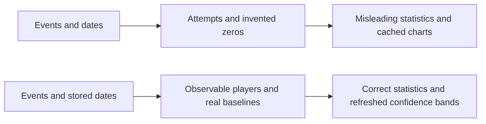

# Analytics Review Fixes Implementation Plan

> Execute inline with systematic-debugging and test-driven-development. User authorized all nine review fixes; preserve existing working-tree plans. No commits or push requested.

**Goal:** Resolve BUG-0012 through BUG-0020 against the analytic-tab design.

**Architecture:** Keep existing Dart math, EventStore, API, and Flutter provider boundaries. Correct source data and statistics before drawing results.

**Tech Stack:** Dart, SQLite, Flutter, Riverpod, fl_chart.

**Spec:** `.cursor/plans/analytic-tab-design.md`; `docs/reviews/2026-10-09-gemini-analytics-review.md`.

## Constraints and review focus

- Seed 42, 1000 player bootstrap resamples, 95% percentile intervals.
- Beta-smoothed level win rates; strict hazard greater than twice median with at least 10 reached.
- Seven real stored baseline days; warmup supports baselines without consuming range limits.
- Preserve censoring, separate cluster identity, refresh all analysis caches, display Greenwood bands.
- Tests must distinguish missing days from stored zero days, repeated attempts from independent players, recent installs from failures, and opposing clusters from one group.

## Before and after

## Tasks

For each task: reproduce with a failing regression, confirm its hypothesis, apply one root-cause fix, run the targeted tests, and update ledger evidence after final verification.

| Done | Bug | Files and regression |
|---|---|---|
| yes | 0012 | survival.dart and analysis_survival_test.dart: exact even-degree upper-tail values |
| yes | 0014 | event_store.dart and store regression: unique cluster group identity |
| yes | 0015 | version_impact.dart, bootstrap.dart and version tests: resample players and Beta rates |
| yes | 0016 | event_store.dart, version_impact.dart and store tests: observable D1 cohorts |
| yes | 0017 | event_store.dart and store tests: pulled-day baselines |
| yes | 0018 | anomalies.dart, event_store.dart and anomaly tests: range eligibility before cap |
| yes | 0019 | levels.dart and level tests: zero median and strict boundary |
| yes | 0013 | app_shell.dart and shell test: refreshed provider results |
| yes | 0020 | survival_tab.dart and survival widget test: confidence bounds and band |

## Final verification

- Run shared and server `dart analyze`, `dart test`; app `flutter analyze`, `flutter test`.
- Inspect final diff and update BUG-0012 through BUG-0020 to RESOLVED only with passing regression evidence.
- Manual follow-up: refresh visited analytics tabs after import; inspect survival confidence bands and group labels on real data.

## Verification evidence

All nine targeted regressions were observed failing before their fixes. Final analyzers clean; shared 65, server 263, app 103 tests passed. Owner chose one complete follow-up day for D1; final-day first-seen players excluded. BUG-0012 through BUG-0020 resolved. No application commits or push.
