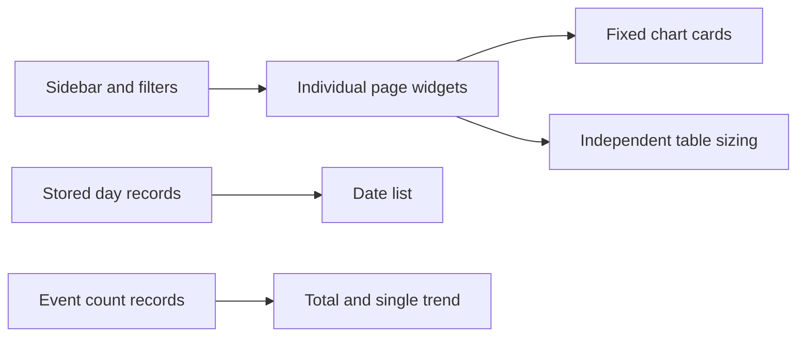
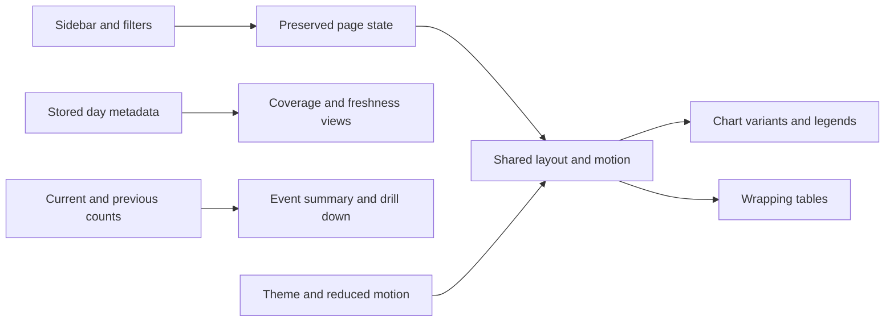
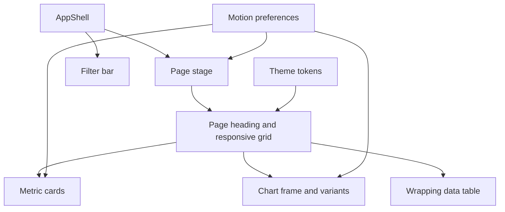
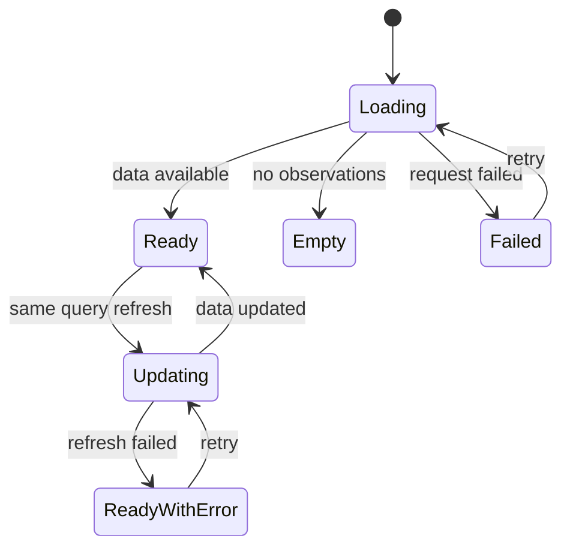

# Analytics Studio UI Upgrade - Design

**Status:** approved by owner on 2026-10-09; implementation plan authored for Gemini
**Date:** 2026-10-09
**Selected direction:** A - Analytics Studio
**Implementation:** not started for this redesign

## 1. Intent and accepted decisions

The owner wants a reliable, informative dashboard with more polished visuals, animation, and smoother interactions. Windows is the first delivery target; layouts must also tolerate narrow windows and larger text.

Accepted scope:

- Retain all four existing Settings themes: Tremor Light, shadcn Neutral, Midnight Game, Material 3 Soft.
- Apply direction A's layout, spacing, hierarchy and restrained motion across those palettes.
- Data health must explain stored coverage, gaps, volume and update times visually.
- Events must explain event volume, mix, trends and comparisons.
- Use different chart types where they answer different questions; distinguish multiple series with more than color.
- Fix overlapping tables and long titles or names that do not wrap.
- Lower analysis population gates from 20 to 10 so the owner can exercise Analytic views with real small samples.

The browser preview illustrates composition and interaction with synthetic data. Its numbers, insight text, decorative sidebar status, and colors are not requirements for real data. Selecting A approved the direction; this document specifies the concrete product behavior.

## 2. Delivery boundaries

| In scope | Boundary |
|---|---|
| Shared page, card, chart, table and motion conventions | Apply to existing pages; keep current routes and analytics meanings |
| Windows responsive layout | Validate small and large windows and text scaling; mobile release is a later task |
| Data health redesign | Read existing stored-day metadata; do not claim knowledge of scheduler success or running tasks |
| Events redesign | Aggregate existing event counts and request previous-period counts when needed |
| Existing Analytic visuals | Add appropriate bars and heatmaps, retain statistical intervals and sample labels |
| Lower population gates | Exactly the changes in section 8; retain method-specific evidence requirements |
| UI bug reproduction | Long identifiers, empty data, single points, all-zero series, loading and errors |
| Theme compatibility | Existing preferences persist; no additional theme or forced palette |

No new external service, chart library, animation package, scheduling control, synthetic production analytics, or prediction model is needed. Existing Flutter, Riverpod and fl_chart remain the foundation.

## 3. Current and target flow

### Current

### Target

## 4. Layout and visual system

Retain the existing navigation destinations and global filter meanings. Direction A provides clear page headings, concise context, aligned card edges, consistent spacing, restrained borders and a readable hierarchy.

- Desktop widths of 1200 logical pixels and above: full sidebar and multi-column content where each card has usable space.
- Widths from 900 through 1199: compact navigation rail and fewer content columns.
- Below 900: drawer navigation, stacked page sections, wrapping filters and a visible Refresh action.
- Choose chart/card columns from available content width, not screen width alone.
- Page padding: 24 on roomy desktop layouts, 16 on narrow layouts. Common gaps: 12 and 16.
- KPI cards reflow without forcing a single orphan card or shrinking text into unreadability.
- Long page titles, event names, legends, notices and action labels wrap inside explicit width constraints.
- Labels always identify the unit: events, players, attempts, minutes, percent or z-score.
- All colors, surface treatments, radii and chart series come from ThemeData and AnalyticsTokens.
- Stable series identity uses a stable ordered series key; it does not change merely because a value rank changes.
- Theme switching interpolates custom token colors as well as standard theme colors, avoiding abrupt mismatched surfaces.

### Shared component boundaries

Shared components own layout, presentation and animation. Page adapters own conversion of existing models into chart/table inputs. Providers own request state. Statistical calculations remain on the server.

## 5. Motion and smooth flow

| Interaction | Behavior | Duration |
|---|---|---|
| Sidebar page change | Short fade and slight vertical movement; preserve page selection and scroll | 180 ms |
| Analytic tab change | Coordinated tab indicator and content transition | 200 ms |
| Card or detail expansion | Animate height without clipping wrapped content | 220 ms |
| Chart first appearance | Reveal line, bar or area once; no continuous decorative motion | 400 ms |
| Updated chart data | Short transition within the same chart and series identity | 350 ms |
| Theme change | Interpolate palette and tokens | 200 ms |
| Hover and selection | Subtle background or border feedback | 120 ms |

- Use ease-out transitions without bounce or large movement.
- Respect the operating system's reduced-motion preference. Disable entrance and chart interpolation; state changes stay immediate.
- Preserve loaded data during same-query refresh. Show an inline updating indication and keep scroll position.
- A changed filter must not present old data as belonging to the new query. Either clearly show it as previous data while updating or replace it with a stable loading state.
- Initial loading uses consistent placeholders sized to the content. Empty and error states contain an explanation and a usable action.
- Refresh waits for the active page's required requests. A success message must not imply that a failed active analysis request succeeded.
- Disable duplicate refresh actions while a refresh is pending.
- Keep page state across navigation; avoid remounting providers solely to animate a transition.
- Hidden pages do not run entrance animations repeatedly or continuously tick animation controllers.
- Numeric labels show actual values immediately. Tooltips must never show interpolated animation frames as final measured observations.

## 6. Chart system and bug fixes

A chart frame provides a wrapping heading, context, units, legend, plot and optional data-table access.

| Data question | Chart |
|---|---|
| Daily count and comparison | Line or area with solid current period and dashed previous period |
| Daily stored volume | Vertical bars, explicit unavailable-day gaps |
| Event popularity | Horizontal ranked bars with full wrapped labels |
| Event contribution | Share bars and numeric percentages |
| Cluster feature profile | Diverging feature heatmap and raw-value table |
| Churn drivers | Diverging horizontal effect-size bars centered at zero |
| Level difficulty and quit risk | Win-rate and hazard views with distinct legends and readable axes |
| Survival | Step curves, confidence bounds and shaded bands |
| Event associations | Ranked lift bars plus existing explanatory rule cards |
| Anomalies | Alert cards with expandable actual-versus-baseline trend |

Requirements:

- Different metrics may need separate panels or axes. Do not imply count, percentage and effect size share a unit.
- Every series has a name; color is supplemented by line pattern, marker or explicit labeling.
- Tooltips show the date or bucket, series, formatted value and unit. They fit the chart or viewport.
- Chart dimensions respond to available width. Axis-label density depends on chart width.
- Empty, single-point, all-zero, identical, negative and very large values have deterministic readable handling.
- Missing observations appear as gaps, not fabricated zero activity.
- Actual stored empty days may display zero.
- Incomplete buckets are identified without double-drawing the same line segment as complete.
- Step survival curves and their confidence bounds remain steps.
- Long chart headings can grow vertically; the plot retains a minimum usable height.
- A chart type switch, where useful on Events, preserves selected event and filters.
- Data views remain available for exact values; chart animation never replaces accessible text.

## 7. Page redesigns

### Data health

Use existing DayStat fields: day, rowCount and pulledAt. This view describes storage, not platform/version-filtered gameplay.

Top summaries:

1. Total stored events across the displayed storage interval.
2. Stored day coverage with numerator, denominator and explicit interval.
3. Latest stored event date.
4. Most recent completed import/pull timestamp, formatted in local time.

Main sections:

- Daily event-volume bars.
- Calendar coverage heatmap with date, event count and availability on hover/focus.
- Gap summary naming missing dates.
- Storage timeline with date, row count, last updated time and availability.

Use the selected date range for the calendar, volume and gap summary. Keep the global latest stored date and update time clearly labeled as whole-storage information. Platform, version and test-device filters do not change this raw-storage page; disable them here and explain its scope.

Coverage denominator includes completed calendar days in the selected range; today's date is shown separately as potentially incomplete. A stored empty day counts as stored coverage. A date with no completed stored-day record is unavailable, including dates before the first available stored day in the selected range. Future days do not count as expected coverage. Show no invented error or success status for a scheduler.

### Events

Keep existing date, platform, version and test-device filtering. Include:

- Total occurrences.
- Distinct event names with occurrences in the selected range.
- Average occurrences per stored day, with its denominator stated.
- Peak stored day and count.
- Daily trend with optional equal-length previous-period comparison.
- Top event ranking and share of total.
- Searchable, sortable event table: full name, occurrences, share, previous-period change.
- Selecting a row shows that event's daily trend and an action to inspect its parameters.

Previous period ends on the day before the selected range and has the same calendar length. Count only available observations and visibly disclose missing days when making a comparison. A previous count of zero produces "new activity" when current is positive; two zeros produce no change; unavailable comparison data shows unavailable rather than an invented percentage.

Use existing /events/count responses, /days metadata and /events/param routes. Event names offered for this table come from the filtered results. Occurrences must not be labeled unique players. Parameter drill-down carries the chosen event and filters into the existing Parameters flow.

### Analytic and existing dashboard pages

Keep the six tabs. Improve their charts with the variants in section 6, shared section headings, clear empty states and readable sample labels. Reuse the wrapping table behavior throughout Overview, Retention, Progression, Funnels, Analytic, Events and Parameters.

The design does not change the definitions of survival, churn, association, level difficulty or anomaly calculations. Previously fixed statistical and refresh regressions remain protected.

## 8. Ten-player policy

| Analysis | New display/population gate | Evidence guards retained |
|---|---|---|
| Clusters | 10 players total | Drop constant features, deterministic k-means, small groups labeled |
| Levels | 10 players total | Wall eligibility still requires 10 reached; existing attempt/transition guards |
| Survival | 10 players total | Groups below 10 still merge into Other |
| Associations | 10 players total | Support minimum 5, lift thresholds, small-sample labels |
| Version impact | 10 players per compared version | Previous eligible version rule, player bootstrap and D1 observability |
| Churn | 10 observable players for population eligibility | Both outcome classes must be present; leaf minimum remains 10 |
| Anomalies | No player-population gate | Seven real baseline observations and existing metric eligibility |

A ten-player cohort cannot automatically yield two valid ten-player tree leaves. Churn driver visuals can appear when computable, while the rules panel explicitly explains insufficient split evidence. Do not lower tree leaf support simply to force a visual result.

All server guards, UI messages, tests and relevant documentation must agree on these boundaries. Nine players fails the new population gate; ten passes it when the method's other requirements are met. Lowering the gate does not imply statistical significance.

## 9. Tables and long content

- Give text columns bounded widths; allow content and row heights to expand naturally.
- Event names, group labels, conditions and feature names wrap. Break long unspaced identifiers at available boundaries.
- Keep numeric columns aligned and readable; do not wrap digits within one value.
- Headers wrap without overlapping sort controls.
- Tables wider than the viewport have a visible horizontal scrollbar with mouse, trackpad and keyboard access.
- Avoid nested competing vertical scroll areas.
- Hover may reveal extra detail, but the primary name is available without hover.
- Maintain row-to-column alignment in heatmaps and statistical tables.
- Empty table messages explain the result; errors expose Retry.
- All existing table-heavy flows participate in the long-name regression suite, including funnel editor and drill-down content where appropriate.

BUG-0022 is the owner-reported overlap/wrapping problem. Its exact failing widgets will be established by constrained-width and long-name reproductions during implementation; unsupported findings will not be invented.

## 10. Error handling and data correctness

Errors distinguish unavailable data, insufficient sample and failed requests. A stale server returning 404 gets a useful message that the endpoint is unavailable and a suggestion to restart/update the server; do not silently replace it with an empty statistical result.

Preserve the last successful data on refresh failure with an explicit error. Filter changes, server URL changes and previous-period requests cannot overwrite a newer query's state. Derive display aggregates from model data, never the mockup's illustrative numbers.

## 11. Acceptance and verification

### Automated

- Server boundary fixtures at 9, 10 and 19 players, including version cohorts.
- Churn fixture at 10 observable players with insufficient tree leaves and useful driver state.
- Preserve all statistical regressions from BUG-0012 through BUG-0020.
- Widget layout at 720, 1024 and 1440 logical-pixel widths.
- Text scaling at 1.0 and 1.5.
- Every existing palette.
- Long spaced names and unbroken identifiers at least 120 characters long.
- Charts with empty, one-point, zero, negative, huge, missing and incomplete observations.
- Series pattern/legend consistency, survival interval rendering and diverging zero axis.
- Navigation state preservation, reduced motion, refresh progress and failed-refresh feedback.
- Data health: missing versus stored-empty days, current day and unavailable historical dates.
- Events: filtered aggregation, searching, sorting, comparison zeros and unavailable periods, parameter handoff.
- Full shared/server/app analyzers and suites.

### Windows runtime

Use a current app build and restart the server after route or threshold changes. Check window resizing, mouse hover, wheel scrolling, keyboard navigation, theme changes, long-name tables, data refresh and real small-cohort Analytic results.

Completion requires no overflow exceptions in these scenarios, informative real data views, visible but restrained animation, and a record of the checks performed. Automated tests do not substitute for the final live visual inspection.

## 12. Recommended implementation waves

| Wave | Deliverable |
|---|---|
| 1 | Reproduce UI failures; shared layout, long-name tables and 10-player policy |
| 2 | Shared chart variants, labels, series identity and motion behavior |
| 3 | Data health dashboard |
| 4 | Events exploration and parameter handoff |
| 5 | Analytic visual upgrades and whole-app motion/refresh integration |
| 6 | Full regression gates, Windows rebuild and live visual checks |

Each wave produces usable existing-page behavior. The detailed task-by-task implementation plan will be written after owner review of this design. Default execution is inline; no delegation is requested.

## 13. Self-review

- Selected direction and existing themes explicitly preserved.
- No production dependencies or synthetic statistics proposed.
- Chart variety maps to existing data and keeps exact values accessible.
- Missing data differs from zero activity.
- Ten-player population policy does not weaken independent method evidence guards.
- Loading, refresh, filter changes, long names and reduced motion have testable outcomes.
- Scope stays within existing analytics UI and the requested minimum-population changes.

