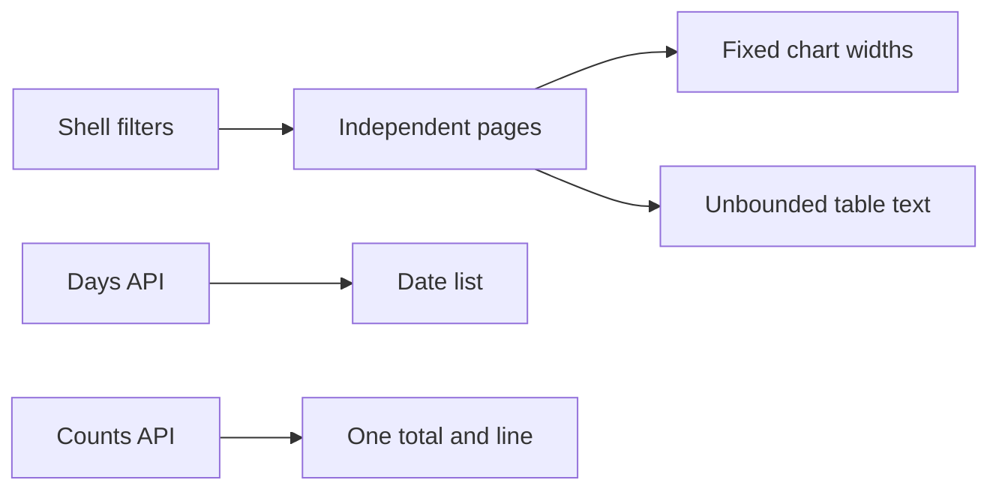
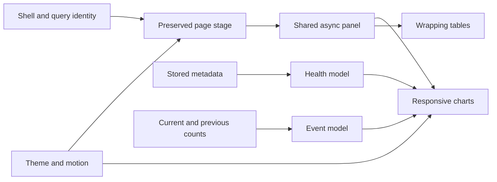
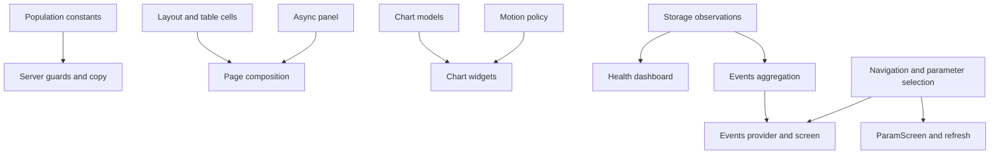
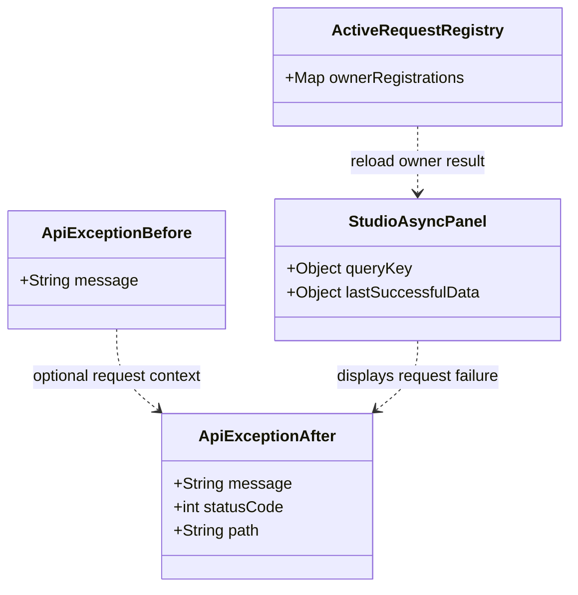

# Analytics Studio UI Upgrade - Implementation Plan

> **For Gemini:** execute the linked wave plans sequentially, inline. Use systematic-debugging for reproduced bugs, test-driven-development for code, executing-plans for task execution, and verification-before-completion before success claims. The project forbids subagent-driven-development; no agent dispatch is authorized.

**Goal:** Deliver approved Analytics Studio direction A across existing themes, repair UI overflow and chart behavior, enrich Data health and Events, and lower analysis population gates to 10.

**Architecture:** Shared layout, table, chart and motion primitives consume existing models. Pure client view-model functions compute storage coverage and event summaries. Providers own query lifetimes; statistical calculations and population guards remain on the Dart server.

**Tech stack:** existing Flutter/Dart workspace; flutter_riverpod 2.6.1, fl_chart 1.2.0 resolved locally, existing http and shared_preferences. No package upgrade or new dependency.

**Spec:** [analytics-studio-ui-design.md](analytics-studio-ui-design.md), approved by owner on 2026-10-09. Read both this master and the wave being executed.

**Execution method:** owner runs Gemini; Codex authors/reviews the plan. Do not implement in the planning session.

## 1. Start here

| Order | Wave plan | Tasks | Independently usable outcome |
|---|---|---|---|
| 1 | [Wave 1](analytics-studio-ui-wave1-implementation.md) | 0-3 | Baseline, 10-player policy, shared layout and safe tables |
| 2 | [Wave 2](analytics-studio-ui-wave2-implementation.md) | 4-6 | Theme motion, chart system and shared async states |
| 3 | [Wave 3](analytics-studio-ui-wave3-implementation.md) | 7-8 | Data health dashboard with real coverage |
| 4 | [Wave 4](analytics-studio-ui-wave4-implementation.md) | 9-11 | Event insights, comparison and parameter handoff |
| 5 | [Wave 5](analytics-studio-ui-wave5-implementation.md) | 12-15 | All Analytic charts, remaining tables and shell flow |
| 6 | [Wave 6](analytics-studio-ui-wave6-implementation.md) | 16-17 | Whole-app regression and actual Windows runtime evidence |

Run only the requested wave. If given this master without a wave number, start Wave 1 and report its completion before continuing. Do not skip foundational tasks to copy the HTML demo.

The steps specify contracts, algorithms, test bodies, edit anchors and composition. They are not a claim that new production code has been precompiled or future test counts are already known. The executor must prove every red/green cycle.

## 2. Global constraints

These apply to every wave:

- Retain all four existing Settings themes: Tremor Light, shadcn Neutral, Midnight Game, Material 3 Soft.
- All colors, surface treatments, radii and chart series come from ThemeData and AnalyticsTokens.
- At least 1200 logical pixels: full sidebar; 900-1199: compact rail; below 900: drawer navigation.
- Page padding: 24 on roomy desktop layouts, 16 on narrow layouts. Common gaps: 12 and 16.
- Motion: navigation180 ms, Analytic tabs200 ms, expansion220 ms, first chart reveal400 ms, data interpolation350 ms, theme200 ms, hover120 ms.
- Respect operating-system reduced motion; no count-up numbers, perpetual shimmer, bounce or decorative loops.
- Missing observations appear as gaps, not fabricated zero activity. Actual stored empty days may display zero.
- Numeric labels and tooltips refer to real measured values. Disable plot interaction during interpolation.
- Keep statistical definitions and BUG-0012 through BUG-0020 regressions.
- Seed42 and 1000 player bootstrap resamples remain intact.
- Analysis population gates become10; survival-group cutoff10, association support5, tree leaf minimum10 and seven real anomaly baseline observations remain intact.
- Windows first. This task does not ship mobile builds.
- No new service, package, scheduling control, dependency upgrade, or synthetic production data.
- Do not rewrite existing test expectations to make failures disappear. Copy-only assertions may change only for the approved copy specified in the owning task; numeric oracle values remain unchanged.
- Never use mockup sample numbers, insight claims, or online status in production.
- Run from PowerShell with the Flutter SDK on PATH. One commit per implementation task; never push.
- Stage only files owned by the current task. Never stage owner changes, generated previews, credentials, configuration, data, AGENTS.md, GEMINI.md, .agents/, or .cursor/memory/.
- Existing dirty files at planning time: .cursor/memory/mem-known-bugs-index.md and .gitignore. Preserve them.
- General project memory is not an implementation deliverable. The bug-lifecycle rule still requires targeted bug-ledger writes with evidence during the same session; preserve existing entries and never stage that ledger automatically. Report new/changed IDs for owner review.
- Read current files before applying edits. If an anchor/signature is absent, stop that task and report the mismatch rather than guessing a replacement.
- If a package API differs, inspect pinned local source and report before changing dependencies.

## 3. Review focus - five easily missed failures

| Risk | Required regression owner |
|---|---|
| Unpulled date versus stored zero versus today's partial snapshot | Tasks7,9,16 |
| 120-character unbroken names and text scale1.5 across themes | Tasks3,12-16 |
| Old result arriving after filter or server URL change | Tasks6,9,15 |
| One point, zero-only chart, negative values, disjoint incomplete segments | Tasks4,5,16 |
| Ten players cannot yield two ten-player leaves or two eligible survival groups | Tasks1,12,13 |

## 4. Current and target flow

### Current



### Target



### Interface dependencies



## 5. File map and public contracts

No consumer refers to an API before its producer task is complete.

| Producer | New file | Responsibility / names |
|---|---|---|
| 1 | shared/lib/src/analysis_minimums.dart | minAnalysisPlayers, minSurvivalGroupPlayers, minChurnRuleLeafPlayers |
| 2 | app/lib/src/widgets/studio_layout.dart | StudioHeading, StudioGrid, StudioMetric |
| 3 | app/lib/src/widgets/studio_table.dart | StudioTable, StudioColumn, StudioRow, StudioTextCell |
| 3 | app/test/support/studio_test_host.dart | pumpStudio, longIdentifier |
| 4 | app/lib/src/widgets/charts/chart_models.dart | ChartPoint, ChartSeries, ChartBounds, ChartSegment, SeriesStyleRegistry, chartBounds, splitSeries |
| 5 | app/lib/src/theme/motion_policy.dart | MotionKind, motionDuration |
| 5 | app/lib/src/widgets/charts/chart_frame.dart | ChartFrame |
| 5 | app/lib/src/widgets/charts/time_series_chart.dart | TimeSeriesChart, TimeChartKind |
| 5 | app/lib/src/widgets/charts/ranked_bar_chart.dart | RankedBarChart, RankedValue |
| 5 | app/lib/src/widgets/charts/diverging_bar_chart.dart | DivergingBarChart |
| 5 | app/lib/src/widgets/charts/chart_motion.dart | ChartMotion |
| 6 | app/lib/src/widgets/studio_async_panel.dart | StudioAsyncPanel |
| 7 | app/lib/src/view_models/storage_observations.dart | DayAvailability, StoredObservation, storedObservations |
| 7 | app/lib/src/view_models/data_health_view_model.dart | DataHealthViewModel, buildDataHealth |
| 8 | app/lib/src/widgets/coverage_calendar.dart | CoverageCalendar |
| 9 | app/lib/src/view_models/events_view_model.dart | EventSummary, EventRowSummary, EventChange, ChangeKind, eventChange, buildEventSummary |
| 9 | app/lib/src/state/events_explorer.dart | EventsQuery, EventsPayload, eventsExplorerProvider, selectedEventProvider |
| 10 | app/lib/src/widgets/event_detail_panel.dart | EventDetailPanel |
| 11 | app/lib/src/state/navigation.dart | AppPage, selectedPageProvider, parameterEventProvider, parameterKeyProvider, analyticTabIndexProvider |
| 12 | app/lib/src/widgets/charts/feature_heatmap.dart | FeatureHeatmap with signed numeric cells and wrapping labels |
| 15 | app/lib/src/shell/page_stage.dart | PageStage |
| 15 | app/lib/src/state/refresh.dart | ActiveRequestRegistry, activeRequestRegistryProvider, refreshActivePage |

Existing modifications are listed per task. No wire-schema migration is required. analytic_shared.dart exports the new constants.

Constructor/method signature blocks are interface contracts, not standalone Dart files to paste verbatim. Immutable widgets should expose const constructors when their fields permit. Test bodies are inserted inside main with the imports listed by their task; complete-file blocks are explicitly labeled. Production composition is described with executable kernels and concrete layout rules, not claimed to be precompiled source.

### Class changes



statusCode and path are optional in Dart; the class diagram omits nullable punctuation for renderer compatibility.

## 6. Commands and result discipline

Task0 records baseline counts. Last verified prior-session counts: shared65/server263/app103 =431. This is historical evidence, not permission to falsify a current count.

Use separate commands; stop after a failure:

```powershell
$env:Path = "D:\flutter\bin;$env:Path"
Set-Location D:\Projects\AnalyticTracker\shared
dart analyze
dart test
Set-Location D:\Projects\AnalyticTracker\server
dart analyze
dart test
Set-Location D:\Projects\AnalyticTracker\app
flutter analyze
flutter test
Set-Location D:\Projects\AnalyticTracker
git diff --check
```

Every task:
1. Add its regression body and imports.
2. Run the targeted command; inspect expected failure.
3. Implement only the owning contract and integration.
4. Re-run targeted tests and relevant package analyzer/full suite.
5. Inspect the diff; preserve numeric oracles and owner files.
6. Commit owned files with the task's message.
7. Report red failure, green command, counts and remaining runtime checks.

A missing new symbol may be the initial red signal. After its interface exists, demonstrate the behavioral failure. A missing import alone does not reproduce the bug.

## 7. Completion reports

After each wave report base/head SHAs, tasks/files, failed-then-passed regression names, commands/exit codes/counts, remaining findings and spec deviations. Separate runtime observations from tests.

Final local report: .cursor/plans/analytics-studio-ui-verification.md. Do not update project-memory success claims automatically. If live tooling is unavailable, mark checks pending and give manual steps; never tick from a build log.

## 8. Planning self-review

Spec coverage is mapped in Wave6. Every public contract has a producer; every consumer names dependencies. Local fl_chart source confirms duration on LineChart/BarChart and FlSpot.nullSpot. No future code or proposed tests have been executed in this planning session.
