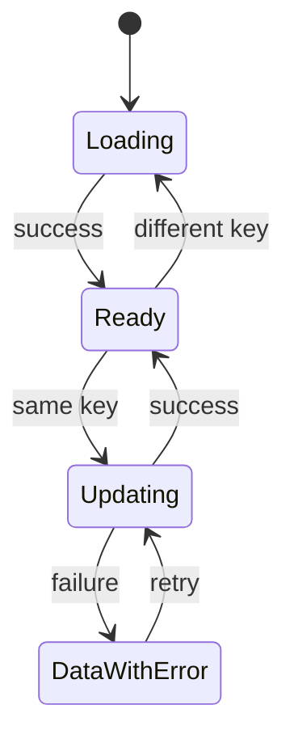

# Analytics Studio UI - Wave 2 Implementation Plan

> Read the master plan and design. Wave1 must pass before tasks4-6. Execute inline and commit per task.

**Goal:** Give existing and future pages one reliable chart, motion and async presentation system.
**Architecture:** Pure chart models prepare finite domains and non-overlapping segments. Flutter chart widgets draw them, respecting theme and reduced motion. Async presentation retains data only for the same query.
**Tech stack:** existing Flutter/fl_chart; no dependencies.
**Spec:** design sections4-6,10-11.

## Task 4 - Pure chart models, domains and stable styles

**Create:** app/lib/src/widgets/charts/chart_models.dart; app/test/chart_models_test.dart.
**Consumes:** finite numbers and explicit observation gaps.
**Produces:**

```dart
class ChartPoint {
  const ChartPoint(this.x, this.value, {required this.label, this.incomplete = false});
  final double x;
  final double? value;
  final String label;
  final bool incomplete;
}
class ChartSeries {
  const ChartSeries({required this.id, required this.label, required this.points});
  final String id;
  final String label;
  final List<ChartPoint> points;
}
class ChartBounds {
  const ChartBounds(this.minX, this.maxX, this.minY, this.maxY);
  final double minX, maxX, minY, maxY;
}
class ChartSegment {
  const ChartSegment(this.points, {required this.incomplete});
  final List<ChartPoint> points;
  final bool incomplete;
}
ChartBounds chartBounds(List<ChartSeries> series, {bool includeZero = true});
List<ChartSegment> splitSeries(List<ChartPoint> points);
class SeriesStyleRegistry {
  void registerAll(Iterable<String> ids);
  int slotFor(String id);
}
```

### Regression bodies

Imports: flutter_test plus chart_models.dart. Wrap these tests in main.

```dart
test('single zero point has a usable nonzero domain', () {
  final b = chartBounds(const [ChartSeries(id: 'a', label: 'A',
    points: [ChartPoint(0, 0, label: 'Oct 01')])]);
  expect(b.minX, 0);
  expect(b.maxX, 1);
  expect(b.minY, 0);
  expect(b.maxY, 1);
});
test('negative and huge values stay inside finite bounds', () {
  final b = chartBounds(const [ChartSeries(id: 'a', label: 'A',
    points: [ChartPoint(0, -2, label: 'a'), ChartPoint(1, 1000000000, label: 'b')])]);
  expect(b.minY, lessThanOrEqualTo(-2));
  expect(b.maxY, greaterThanOrEqualTo(1000000000));
  expect(b.minY.isFinite && b.maxY.isFinite, isTrue);
});
test('segments do not double-draw incomplete edges', () {
  final segments = splitSeries(const [
    ChartPoint(0, 1, label: 'a'),
    ChartPoint(1, 2, label: 'b', incomplete: true),
    ChartPoint(2, 3, label: 'c'),
    ChartPoint(3, 4, label: 'd'),
  ]);
  final edgeCounts = <String, int>{};
  for (final s in segments) {
    for (var i = 1; i < s.points.length; i++) {
      final key = '${s.points[i - 1].x}:${s.points[i].x}';
      edgeCounts[key] = (edgeCounts[key] ?? 0) + 1;
    }
  }
  expect(edgeCounts, {'0.0:1.0': 1, '1.0:2.0': 1, '2.0:3.0': 1});
  expect(segments.where((s) => s.incomplete).expand((s) => s.points)
    .map((p) => p.x).toSet(), {0.0, 1.0, 2.0});
});
test('missing observation breaks the connection', () {
  final segments = splitSeries(const [
    ChartPoint(0, 4, label: 'stored'),
    ChartPoint(1, null, label: 'not stored'),
    ChartPoint(2, 8, label: 'stored'),
  ]);
  expect(segments, hasLength(2));
  expect(segments.map((s) => s.points.length), [1, 1]);
});
test('series style survives rank changes', () {
  final registry = SeriesStyleRegistry();
  registry.registerAll(['b', 'a']);
  final a = registry.slotFor('a');
  final b = registry.slotFor('b');
  registry.registerAll(['a', 'b', 'c']);
  expect(registry.slotFor('a'), a);
  expect(registry.slotFor('b'), b);
  expect(a, isNot(b));
});
test('invalid measured values are rejected before painting', () {
  expect(() => chartBounds([ChartSeries(id: 'x', label: 'X',
    points: [ChartPoint(0, double.infinity, label: 'bad')])]), throwsArgumentError);
});
```

Expected-value reasoning: every finite adjacent edge appears once. Edges touching an incomplete point are dashed; a missing point contributes no edge. Zero-only domains cannot have identical min/max. Style registration sorts only new IDs, preserving old assignments.

- [ ] Run app: flutter test test/chart_models_test.dart; observe red.
- [ ] Implement the following domain algorithm exactly in meaning:
  - validate unique nonempty series IDs, finite x and finite non-null values; strictly increasing x within each series;
  - collect non-null observations for y; gaps can still establish x extent;
  - empty x gives0..1; a single x gives x..x+1;
  - y starts at measured extrema and includes zero when requested;
  - empty/all-zero y gives0..1;
  - nonzero span pads5% above max and below min, except retain zero baseline for all-positive count charts;
  - identical nonzero values use padding max(abs(value)*0.05,1), retaining measured value;
  - no NaN/infinity leaves this helper.
- [ ] splitSeries scans each contiguous non-null run. Start a new segment whenever edge status changes; share only the boundary point, not a duplicate edge. One-point runs produce a visible single-point segment.
- [ ] SeriesStyleRegistry implementation:

```dart
final Map<String, int> _slots = {};
void registerAll(Iterable<String> ids) {
  final fresh = ids.toSet().where((id) => !_slots.containsKey(id)).toList()..sort();
  for (final id in fresh) {
    _slots[id] = _slots.length;
  }
}
int slotFor(String id) => _slots.putIfAbsent(id, () => _slots.length);
```

- [ ] Run targeted tests, app analyze/full test.
- [ ] Commit: feat(ui): define safe chart domains gaps and stable series styles.

## Task 5 - Motion policy and responsive chart variants

**Create**
- app/lib/src/theme/motion_policy.dart.
- app/lib/src/widgets/charts/{chart_frame,time_series_chart,ranked_bar_chart,diverging_bar_chart,chart_motion}.dart.
- app/test/{motion_policy,studio_charts}_test.dart.

**Modify:** app/lib/src/theme/analytics_tokens.dart; app/lib/main.dart; app/lib/src/widgets/metric_line_chart.dart; app/lib/src/pages/overview_page.dart; app/lib/src/widgets/funnel_trend_view.dart only to preserve nulls and responsive chart layout.

Also modify app/lib/src/pages/analytic/anomalies_tab.dart in this task only to remove the fixed220-high outer SizedBox around MetricLineChart. Otherwise the new wrapping heading plus minimum plot height can break an intermediate wave. The full anomaly redesign remains Task14.

**Consumes:** Task4 models and registry, theme tokens, Task3 test host.
**Exact widget contracts:**

```dart
enum MotionKind { navigation, tab, expansion, chartEnter, chartUpdate, theme, hover }
Duration motionDuration(BuildContext context, MotionKind kind);
enum TimeChartKind { line, area, bars }
ChartFrame({Key? key, required String title, String? subtitle,
  required String unit, List<Widget> legend = const [],
  List<Widget> actions = const [], required Widget child, Widget? dataView,
  double plotHeight = 240});
TimeSeriesChart({Key? key, required List<ChartSeries> series,
  required String unit, TimeChartKind kind = TimeChartKind.line,
  bool percentage = false, String Function(num)? valueFormatter});
class RankedValue {
  const RankedValue(this.id, this.label, this.value, {this.detail});
  final String id, label;
  final double value;
  final String? detail;
}
RankedBarChart({Key? key, required List<RankedValue> values, required String unit,
  String Function(num)? valueFormatter});
DivergingBarChart({Key? key, required List<RankedValue> values, required String unit,
  String Function(num)? valueFormatter});
ChartMotion({Key? key, required Object dataRevision, required Widget child});
```

ChartFrame uses a Card and LayoutBuilder. Heading/subtitle/legend/actions are not inside a fixed-height plot box. Only the plot has plotHeight, at least200. Include an accessible "View data" ExpansionTile if dataView supplied.

motionDuration returns zero if MediaQuery.disableAnimationsOf(context) OR MediaQuery.accessibleNavigationOf(context). Otherwise return the master durations. Add themeAnimationDuration200 ms to MaterialApp, using zero under reduced motion if the root MediaQuery exists; do not overwrite saved theme selection.

AnalyticsTokens.lerp must interpolate every Color field, radius and chart list values. Current palettes have chart lists; handle different lengths safely by reusing the nearest last element, not out-of-range indexing. displayFont is discrete at t0.5. Keep no-other defaults and existing palette values.

### Token interpolation regression

Append to app/test/theme_test.dart:

```dart
test('custom palette colors interpolate instead of jumping', () {
  final a = buildTheme(AppStyle.tremor).extension<AnalyticsTokens>()!;
  final b = buildTheme(AppStyle.midnight).extension<AnalyticsTokens>()!;
  final halfway = a.lerp(b, 0.5);
  expect(halfway.sidebar, Color.lerp(a.sidebar, b.sidebar, 0.5));
  expect(halfway.chart.first, Color.lerp(a.chart.first, b.chart.first, 0.5));
  expect(halfway.radius, (a.radius + b.radius) / 2);
});
```

Add missing imports from app_style, analytics_tokens and material; do not alter existing palette or preference assertions.

### Chart behavior regression

Import models, time_series_chart, chart_frame, support host, fl_chart and flutter_test/material.

```dart
testWidgets('responsive chart preserves real zero and missing gaps', (t) async {
  await pumpStudio(t, const ChartFrame(
    title: 'Actual counts', unit: 'events',
    child: TimeSeriesChart(unit: 'events', series: [
      ChartSeries(id: 'current', label: 'Current', points: [
        ChartPoint(0, 4, label: '2026-10-01'),
        ChartPoint(1, null, label: '2026-10-02'),
        ChartPoint(2, 0, label: '2026-10-03'),
      ]),
    ]),
  ), width: 720);
  final chart = t.widget<LineChart>(find.byType(LineChart));
  final finiteSpots = chart.data.lineBarsData.expand((b) => b.spots)
    .where((s) => !s.isNull()).toList();
  expect(finiteSpots.where((s) => s.x == 1), isEmpty);
  expect(finiteSpots.any((s) => s.x == 2 && s.y == 0), isTrue);
  expect(t.takeException(), isNull);
});
testWidgets('reduced motion uses immediate chart updates', (t) async {
  await pumpStudio(t, const TimeSeriesChart(unit: 'events', series: [
    ChartSeries(id: 'a', label: 'A',
      points: [ChartPoint(0, 1, label: '2026-10-01')]),
  ]), reducedMotion: true);
  final chart = t.widget<LineChart>(find.byType(LineChart));
  expect(chart.duration, Duration.zero);
  expect(t.takeException(), isNull);
});
```

Add separate bodies for one point, empty series, negative diverging values, long titles/legends and all-zero bars. Assert signed values on both sides of zero, not just existence of BarChart.

### Rendering kernels

Use local fl_chart1.2.0 APIs: LineChart(data, duration: motionDuration(context, MotionKind.chartUpdate)), BarChart(data, duration: motionDuration(context, MotionKind.chartUpdate)), FlSpot.nullSpot. Do not use old swapAnimationDuration.

```dart
final spots = [
  for (final p in segment.points)
    p.value == null ? FlSpot.nullSpot : FlSpot(p.x, p.value!),
];
final dashPatterns = <List<int>?>[null, [6, 4], [2, 4], [8, 3, 2, 3]];
final cycle = slot ~/ tokens.chart.length;
final reference = series.id == 'previous' || series.id == 'alert-baseline';
final pattern = segment.incomplete ? const <int>[1, 4]
    : reference ? const <int>[6, 4] : dashPatterns[cycle % dashPatterns.length];
final line = LineChartBarData(
  spots: spots,
  color: tokens.chart[slot % tokens.chart.length],
  dashArray: pattern,
  dotData: FlDotData(show: spots.length == 1),
  barWidth: 2.5,
);
```

Because a series can have several segments, map each rendered bar index back to its original series ID. Legends are per series, not per segment. Deduplicate boundary-point tooltip entries for the same series/x. Incomplete status must supplement the series pattern without implying a separate cohort.

The current palettes have four chart colors. When colors repeat, dash pattern changes by color cycle; do not use slot.isOdd alone, which would repeat both color and pattern for series0 and4. Include a six-series regression:

```dart
testWidgets('six series remain distinguishable when palette colors repeat', (t) async {
  await pumpStudio(t, TimeSeriesChart(unit: 'players', series: [
    for (var i = 0; i < 6; i++) ChartSeries(id: 'g$i', label: 'Group $i', points: [
      ChartPoint(0, i.toDouble(), label: 'Day 0'),
      ChartPoint(1, i + 1.0, label: 'Day 1'),
    ]),
  ]));
  final data = t.widget<LineChart>(find.byType(LineChart)).data;
  expect(data.lineBarsData[0].color, data.lineBarsData[4].color);
  expect(data.lineBarsData[4].dashArray, isNot(data.lineBarsData[0].dashArray));
});
```

Use the same color-cycle pattern rule in the specialized survival renderer. For an unusually large group set, retain full legends and data tables; never hide groups solely to fit a palette.

Axes:
- tick capacity max2,floor(plotWidth/88); stride ceil(pointCount/capacity);
- select ticks from actual ChartPoint.x positions and labels, skipping unknown/fractional ticks rather than assuming sparse level IDs are list indices;
- reserve y-axis space from measured labels/text scale;
- count/percent/unit formatting comes from format.dart;
- percentage plots use0..1; signed effect sizes include zero symmetrically;
- hover text fits viewport, includes source date, name and real value;
- data table exposes every observation including unavailable labels.

Horizontal ranked bars can use Flutter Rows and FractionallySizedBox rather than forcing a vertical BarChart into rotation. Wrap names in bounded columns, put value/unit in a separate readable column. Diverging bars use a central zero guide, left for negative, right for positive. Do not replace a negative effect with its absolute value.

Forward valueFormatter to numeric labels and tooltips. Count bars default to fmtCount; effect-size/lift adapters specify fmtDecimal with2 digits so0.95 cannot round to1.0 and0.67 cannot round to0.7. Exact data tables keep the same precision/unit contract.

ChartMotion:
- Own a controller for a one-time400 ms reveal.
- dataRevision changes trigger350 ms update; no perpetual motion.
- Keep geometry/labels stable while revealing the plotted marks.
- Ignore plot input until animation completes.
- Respect TickerMode and reduced motion; dispose controllers.
- Preserve chart key for updates within the same series identity; use a new identity when changing the measured metric, not on every build.
- Sort drawing series by stable ID so rank changes cannot make fl_chart interpolate one cohort into another. When the series-ID set changes, reveal/crossfade the new composition rather than morphing unrelated bar indices.
- Derive dataRevision from values, not freshly allocated List identity. A suitable local expression with dart:convert imported is:

```dart
final revision = jsonEncode([
  for (final s in sortedSeries) {
    'id': s.id,
    'points': [for (final p in s.points)
      {'x': p.x, 'value': p.value, 'label': p.label, 'incomplete': p.incomplete}],
  },
]);
```

sortedSeries is a local copy of the input series sorted by id. Do not mutate caller-owned lists. Pass this stable String to ChartMotion.dataRevision.

Legacy MetricLineChart:
- retain constructor names and width/height optional arguments so existing callers compile;
- add optional String unit='events' and bool percentage=false, and forward valueFormatter to TimeSeriesChart;
- change values to List<num?>, accepting existing List<int>/List<double>;
- assert days/values lengths match and incomplete indices are in bounds;
- make legacy height a minimum plot/card preference, not a fixed overall height that clips a wrapping heading;
- delegate to ChartFrame and TimeSeriesChart;
- use a wrapping constrained parent rather than fixed460 width in responsive page grids.
- when parent width is finite, fill that available width; legacy width is a fallback only for an unbounded-width host. An explicit width double.infinity must never result in an infinite layout size.

FunnelTrendView currently maps unobservable conversion through a fallback. Keep null conversion as a ChartPoint null value; do not turn it into0. Existing trend/CSV expectations remain.

FunnelTrendView chart observations use fractions0..1 for percentage=true, unit='%', with valueFormatter=(v) => '${(v * 100).toStringAsFixed(1)}%'. Remove the current multiplication by100 only when building chart values; keep displayed percentages and CSV semantics unchanged. Total-conversion null remains null. For selected-step conversion, zero entrants or an absent step gives null, not0.

Set Overview chart units explicitly: DAU/new users -> players; sessions -> sessions; uninstalls -> removals. Do not label every metric as events merely because the legacy adapter has that default.

- [ ] Observe targeted red before implementation.
- [ ] Integrate Overview charts through StudioGrid, removing the fixed-width Wrap that exceeds narrow content.
- [ ] Run motion_policy_test.dart, studio_charts_test.dart, theme_test.dart, funnel_trend_widgets_test.dart, funnel_trend_view_test.dart and full app gates.
- [ ] Commit: feat(ui): add themed animated chart variants with gap-safe rendering.

## Task 6 - Query-aware loading, refresh and errors

**Create:** app/lib/src/widgets/studio_async_panel.dart; app/test/studio_async_panel_test.dart.
**Modify:** app/lib/src/api_client.dart; app/lib/src/widgets/error_retry.dart; app/test/api_client_test.dart.
**Consumes:** AsyncValue, stable query key and a builder; Task5 motion.
**Produces:**

```dart
StudioAsyncPanel<T>({Key? key, required Object queryKey,
  required AsyncValue<T> value, required Widget Function(T) builder,
  required VoidCallback onRetry, Widget? loading});
```

queryKey must include baseUrl plus every filter/local selection affecting the result. Examples: (baseUrl,f), (baseUrl,f,by), (baseUrl,f,targetVersion). It cannot be a freshly allocated List.

Regression body using ValueNotifier and StatefulBuilder-equivalent ValueListenableBuilder:

```dart
testWidgets('same-query failure retains data and shows error', (t) async {
  final state = ValueNotifier<AsyncValue<int>>(const AsyncData(7));
  addTearDown(state.dispose);
  await t.pumpWidget(MaterialApp(home: Scaffold(
    body: ValueListenableBuilder<AsyncValue<int>>(
      valueListenable: state,
      builder: (_, value, _) => StudioAsyncPanel<int>(
        queryKey: 'A', value: value, onRetry: () {},
        builder: (n) => Text('Measured $n'),
      ),
    ),
  )));
  state.value = AsyncError(StateError('refresh failed'), StackTrace.empty);
  await t.pumpAndSettle();
  expect(find.text('Measured 7'), findsOneWidget);
  expect(find.textContaining('refresh failed'), findsOneWidget);
  expect(find.text('Retry'), findsOneWidget);
});
```

Add a second test using query-key ValueNotifier:
- start key(baseURL1,A) with value7;
- change key(baseURL2,A) and AsyncLoading;
- assert Measured7 absent;
- load8 and assert Measured8.
A filter-key change receives the same assertion.

Implementation state machine:



Store last successful T only for the matching queryKey. Clear immediately in didUpdateWidget when query key changes. Same-key refresh shows data and a small "Updating" label/progress indicator. Same-key failure shows data plus an error/retry banner. Initial failure uses ErrorRetry. Do not allow initial loading to spin forever in tests via a shimmer loop.

Extend ApiException without breaking existing callers:

```dart
class ApiException implements Exception {
  ApiException(this.message, {this.statusCode, this.path});
  final String message;
  final int? statusCode;
  final String? path;
  @override
  String toString() => message;
}
```

At non2xx responses in _send, preserve existing error-message parsing but attach res.statusCode and request path. ErrorRetry for404 adds:
"This endpoint is unavailable. Restart the server with the current project version."
Do not reinterpret404 as no data.

Append a test that ApiClient.survival against MockClient404 throws ApiException with statusCode404 and path analysis/survival; assert message semantics remain compatible with existing non-JSON error tests. Mock only the HTTP boundary; keep real parsing/providers.

- [ ] Run targeted red, implement and rerun.
- [ ] Run app analyze/full test.
- [ ] Commit: fix(ui): preserve same-query data and expose actionable request errors.

## Wave 2 exit

- [ ] Theme interpolation and reduced-motion tests pass.
- [ ] Empty/single/zero/missing/negative charts are readable.
- [ ] Incomplete edges drawn once; tooltips retain series identity.
- [ ] Same-query error retains data; new query/server never presents old data.
- [ ] Full app gates reported; stop before Wave3.
