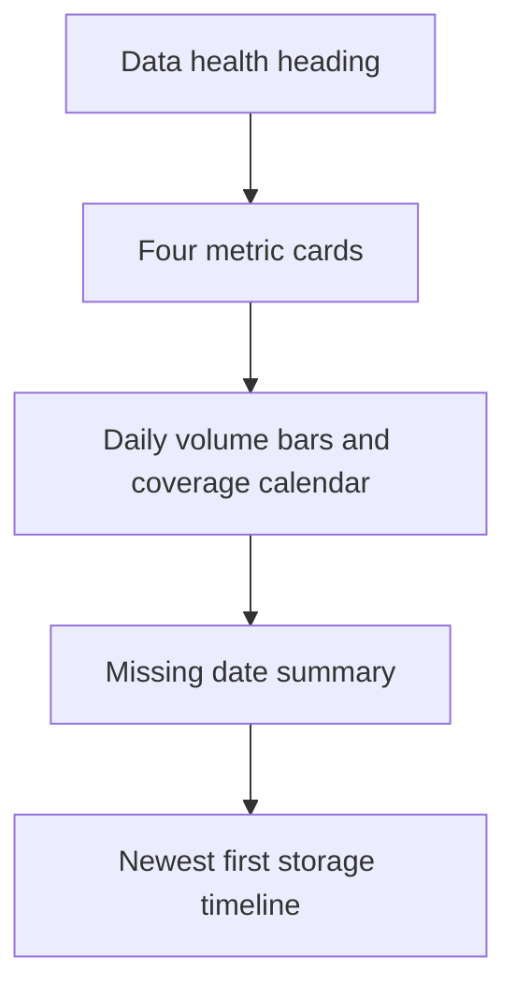

# Analytics Studio UI - Wave 3 Implementation Plan

> Execute tasks7-8 after Waves1-2 pass. Read master constraints and design section7 Data health.

**Goal:** Replace the date list with trustworthy volume, coverage, freshness and timeline views.
**Architecture:** Pure storage observations distinguish missing, stored-zero, current-day and future data; one view model drives all visual sections.
**Tech stack:** existing DayStat, Flutter widgets and Wave2 chart primitives.
**Spec:** sections5-7,9-11.

## Task 7 - Storage observations and Data health view model

**Create:** app/lib/src/view_models/{storage_observations,data_health_view_model}.dart; app/test/data_health_view_model_test.dart.
**Consumes:** List<DayStat>, Filters, injected DateTime now.
**Produces exact types:**

```dart
enum DayAvailability { stored, missing, incomplete, future }
class StoredObservation {
  const StoredObservation({required this.day, required this.count,
    required this.availability, this.updatedAt});
  final String day;
  final int? count;
  final DayAvailability availability;
  final DateTime? updatedAt;
}
List<StoredObservation> storedObservations(List<DayStat> stored, Filters f,
    {required DateTime now});

class DataHealthViewModel {
  const DataHealthViewModel({
    required this.timeline, required this.totalEvents,
    required this.storedDaysCount, required this.completedExpectedDays,
    required this.completedStoredDays, required this.missingDays,
    required this.latestStoredDay, required this.latestUpdate,
  });
  final List<StoredObservation> timeline;
  final int totalEvents, storedDaysCount, completedExpectedDays, completedStoredDays;
  final List<String> missingDays;
  final String? latestStoredDay;
  final DateTime? latestUpdate;
  double? get coverage => completedExpectedDays == 0
      ? null : completedStoredDays / completedExpectedDays;
}
DataHealthViewModel buildDataHealth(List<DayStat> stored, Filters f,
    {required DateTime now});
```

### Complete regression file

```dart
import 'package:analytic_app/src/view_models/data_health_view_model.dart';
import 'package:analytic_app/src/view_models/storage_observations.dart';
import 'package:analytic_shared/analytic_shared.dart';
import 'package:flutter_test/flutter_test.dart';

void main() {
  test('stored zero counts toward coverage while missing does not', () {
    const rows = [
      DayStat(day: '2026-10-03', rowCount: 0, pulledAt: '2026-10-04T01:00:00Z'),
      DayStat(day: '2026-10-01', rowCount: 12, pulledAt: '2026-10-02T01:00:00Z'),
    ];
    final m = buildDataHealth(rows,
      const Filters(from: '2026-10-01', to: '2026-10-04'),
      now: DateTime(2026, 10, 10));
    expect(m.totalEvents, 12);
    expect(m.storedDaysCount, 2);
    expect(m.completedExpectedDays, 4);
    expect(m.completedStoredDays, 2);
    expect(m.coverage, 0.5);
    expect(m.missingDays, ['2026-10-02', '2026-10-04']);
    expect(m.timeline.map((d) => d.count), [12, null, 0, null]);
    expect(m.timeline[2].availability, DayAvailability.stored);
    expect(m.latestStoredDay, '2026-10-03');
    expect(m.latestUpdate, DateTime.utc(2026, 10, 4, 1));
  });
  test('today and future dates do not inflate completed coverage', () {
    final m = buildDataHealth(const [
      DayStat(day: '2026-10-09', rowCount: 3, pulledAt: '2026-10-09T01:00:00Z'),
    ], const Filters(from: '2026-10-08', to: '2026-10-10'),
      now: DateTime(2026, 10, 9, 12));
    expect(m.completedExpectedDays, 1);
    expect(m.completedStoredDays, 0);
    expect(m.missingDays, ['2026-10-08']);
    expect(m.totalEvents, 3);
    expect(m.timeline[1].availability, DayAvailability.incomplete);
    expect(m.timeline[1].count, 3);
    expect(m.timeline[2].availability, DayAvailability.future);
    expect(m.timeline[2].count, isNull);
  });
  test('global freshness is independent of displayed interval and filters', () {
    final m = buildDataHealth(const [
      DayStat(day: '2026-10-01', rowCount: 12, pulledAt: '2026-10-05T09:00:00Z'),
      DayStat(day: '2026-10-08', rowCount: 20, pulledAt: '2026-10-08T09:00:00Z'),
    ], const Filters(from: '2026-10-01', to: '2026-10-02', platform: 'IOS',
      version: 'unknown', includeTest: false), now: DateTime(2026, 10, 9));
    expect(m.totalEvents, 12);
    expect(m.latestStoredDay, '2026-10-08');
    expect(m.latestUpdate, DateTime.utc(2026, 10, 8, 9));
  });
  test('invalid legacy timestamps remain unknown without losing counts', () {
    final m = buildDataHealth(const [
      DayStat(day: '2026-10-01', rowCount: 4, pulledAt: 'a'),
    ], const Filters(from: '2026-10-01', to: '2026-10-01'),
      now: DateTime(2026, 10, 9));
    expect(m.totalEvents, 4);
    expect(m.latestUpdate, isNull);
  });
}
```

Expected-value reasoning: four completed calendar dates contain two records; the record with zero events is still a stored day. Missing is null, not0. On Oct9, only Oct8 is a completed expected day in Oct8-10. Whole-storage freshness uses rows outside the visible range.

- [ ] Run flutter test test/data_health_view_model_test.dart; observe red.
- [ ] Implement observation conversion with this kernel:

```dart
final today = formatDay(DateTime(now.year, now.month, now.day));
final byDay = {for (final row in stored) row.day: row};
return [
  for (final day in daysBetween(f.from, f.to))
    StoredObservation(
      day: day,
      count: day.compareTo(today) > 0 ? null : byDay[day]?.rowCount,
      availability: day.compareTo(today) > 0
          ? DayAvailability.future
          : day == today
              ? DayAvailability.incomplete
              : byDay.containsKey(day)
                  ? DayAvailability.stored : DayAvailability.missing,
      updatedAt: DateTime.tryParse(byDay[day]?.pulledAt ?? ''),
    ),
];
```

The API has unique day rows. Preserve order using daysBetween; do not rely on input order.

buildDataHealth:
- completedExpectedDays = timeline days strictly before today;
- completedStoredDays = those days with availability stored;
- missingDays = completed days with availability missing;
- storedDaysCount = observations with non-null count, including today's stored snapshot;
- totalEvents = sum non-null counts in displayed interval;
- latestStoredDay = maximum stored day in whole input, not maximum pulledAt;
- latestUpdate = max successfully parsed timestamp from whole input, not last list item;
- coverage is null when no completed expected day exists.
Do not apply gameplay platform/version/test flags to storage rows.

- [ ] Run targeted tests and full app gates.
- [ ] Commit: feat(ui): model stored coverage and freshness without invented zeros.

## Task 8 - Data health dashboard and calendar

**Create:** app/lib/src/widgets/coverage_calendar.dart; app/test/data_health_dashboard_test.dart.
**Modify:** app/lib/src/screens/days_screen.dart; app/lib/src/widgets/filter_bar.dart; app/lib/src/shell/app_shell.dart; app/test/days_screen_test.dart; app/test/filter_bar_test.dart.

**Consumes:** Task7 model, Task2 StudioHeading/Grid/Metric, Task3 StudioTable, Task5 charts, Task6 StudioAsyncPanel.
**Produces:** CoverageCalendar({Key? key, required List<StoredObservation> observations}); revised DaysScreen with optional now callback for deterministic tests; FilterBar gains storageScope=false and refreshing=false, retaining onRefresh callback.

### Regression body

Imports: shared, flutter_test/material/Riverpod, days_screen, providers, host, storage_observations and coverage_calendar.

```dart
testWidgets('health exposes missing versus stored-empty days visually', (t) async {
  await pumpStudio(t, DaysScreen(now: () => DateTime(2026, 10, 10)),
    overrides: [
      filtersProvider.overrideWith(() => FiltersNotifier(() => DateTime(2026, 10, 10))),
      daysProvider.overrideWith((ref) async => const [
        DayStat(day: '2026-10-01', rowCount: 12, pulledAt: '2026-10-02T01:00:00Z'),
        DayStat(day: '2026-10-03', rowCount: 0, pulledAt: '2026-10-04T01:00:00Z'),
      ]),
    ]);
  final container = ProviderScope.containerOf(t.element(find.byType(DaysScreen)));
  container.read(filtersProvider.notifier).setRange('2026-10-01', '2026-10-04');
  await t.pumpAndSettle();
  expect(find.textContaining('50%'), findsWidgets);
  expect(find.byType(CoverageCalendar), findsOneWidget);
  expect(find.byTooltip('2026-10-03: stored, 0 events'), findsOneWidget);
  expect(find.byTooltip('2026-10-02: missing'), findsOneWidget);
  expect(t.takeException(), isNull);
});
```

Add width720/1024/1440 and text-scale1/1.5 cases using host; empty store still says "No data yet"; API failure still has Retry. Existing days_screen_test fixtures currently contain non-date timestamps a/b: keep the malformed-timestamp test from Task7 and use ISO dates for assertions about displayed update times.

### Composition order



Build DaysScreen:
1. Watch global Filters and daysProvider; queryKey = (baseUrl, f.from, f.to).
2. Apply StudioAsyncPanel; builder derives buildDataHealth with now callback.
3. Heading "Data health"; subtitle "Stored raw data coverage. Gameplay filters do not apply."
4. Metric cards:
   - "Events stored" = totalEvents with displayed interval.
   - "Completed-day coverage" = completedStoredDays / completedExpectedDays and percentage, or "No completed days".
   - "Latest stored day" = global latestStoredDay, or unavailable.
   - "Last import / pull" = global latestUpdate.toLocal formatted date/time, or "Unknown".
5. TimeSeriesChart kind bars; ChartPoint value=count?.toDouble, incomplete=status incomplete. Unstored dates retain a gap.
6. CoverageCalendar and gap summary.
7. StudioTable timeline descending, columns Day, Events, Last updated, Status. Missing count displays "--", stored zero "0", current day "May be incomplete". No scheduler-health claim.

CoverageCalendar:
- Group by calendar month; seven weekday columns with leading blank alignment cells.
- Use LayoutBuilder and a non-scrolling GridView with shrinkWrap:true inside the page's main scroll.
- Stored volume uses themed intensity; zero-stored uses a distinct border; missing uses hatch/border + text/semantic label; current day gets a partial marker; future is muted.
- Every cell exposes a Tooltip and Semantics with full date/status/count.
- Numeric counts remain available without hover through the timeline.
- No color-only distinction.
- Avoid month headers splitting a cell row unexpectedly.

Exact tooltip copies used by tests:
- "YYYY-MM-DD: stored, N events"
- "YYYY-MM-DD: missing"
- "YYYY-MM-DD: may be incomplete, N events" or "YYYY-MM-DD: may be incomplete, not stored"
- "YYYY-MM-DD: future"

FilterBar:
- Add optional bool storageScope=false, bool refreshing=false.
- Date selection remains available.
- Disable platform/version/test controls on Data health and show storage-scope note.
- Do not modify their saved filter selections while disabled; switching back restores them.
- Refresh button onPressed is null while refreshing and shows a finite loading state.
- Shell passes storageScope when current selected page is Data health. Keep existing _index until Task11 introduces shared navigation; that later task must switch the condition to AppPage.dataHealth.

Regression for filter restoration: start f.platform IOS and includeTest true; navigate Data health, assert controls disabled but f unchanged; navigate Events, assert controls enabled and IOS/test state retained.

- [ ] Run targeted red before dashboard code.
- [ ] Implement composition, calendar and scoped filter behavior.
- [ ] Remove the old ListTile-only list; retain pull-to-refresh if useful, in addition to the desktop toolbar action.
- [ ] Run targeted health/filter/shell tests and full app gates.
- [ ] Commit: feat(ui): add Data health volume coverage and storage timeline.

## Wave 3 exit

- [ ] No missing day has a zero count.
- [ ] Today/future do not inflate completed coverage.
- [ ] Storage scope and global freshness are explicitly labeled.
- [ ] Calendar, bars, status and table are accessible under all themes.
- [ ] Full app gates and remaining live checks reported; stop before Wave4.
