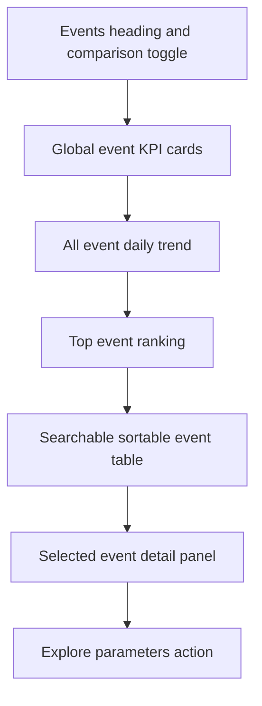

# Analytics Studio UI - Wave 4 Implementation Plan

> Execute tasks9-11 after Waves1-3. Read master and design section7 Events.

**Goal:** Explain event volume and mix, support honest previous-period comparison, and connect event inspection to Parameters.
**Architecture:** One query provider loads current counts, stored-day metadata and optional previous counts. Pure aggregation feeds global summaries and per-event details.
**Tech stack:** existing API routes and Wave2 chart widgets.
**Spec:** sections5-7,9-11.

## Task 9 - Event aggregation and query provider

**Create:** app/lib/src/view_models/events_view_model.dart; app/lib/src/state/events_explorer.dart; app/test/events_view_model_test.dart; app/test/events_explorer_provider_test.dart.
**Consumes:** EventCount, DayStat, Filters.previousPeriod(), Task7 observations, ApiClient.counts and daysProvider.
**Produces types:**

```dart
enum ChangeKind { percent, newActivity, unchanged, unavailable }
class EventChange {
  const EventChange(this.kind, {this.fraction});
  final ChangeKind kind;
  final double? fraction;
}
class EventRowSummary {
  const EventRowSummary({required this.name, required this.current,
    required this.previous, required this.share, required this.change,
    required this.daily});
  final String name;
  final int current;
  final int? previous;
  final double share;
  final EventChange change;
  final List<ChartPoint> daily;
}
class EventSummary {
  const EventSummary({required this.total, required this.previousTotal, required this.distinctNames,
    required this.storedDayCount, required this.averagePerStoredDay,
    required this.peakDay, required this.peakCount,
    required this.currentSeries, required this.previousSeries,
    required this.rows, required this.comparisonAvailable,
    required this.missingDays});
  final int total, distinctNames, storedDayCount;
  final int? previousTotal;
  final double? averagePerStoredDay;
  final String? peakDay;
  final int? peakCount;
  final List<ChartPoint> currentSeries, previousSeries;
  final List<EventRowSummary> rows;
  final bool comparisonAvailable;
  final List<String> missingDays;
}
EventChange eventChange(int current, int? previous, {required bool comparable});
EventSummary buildEventSummary({
  required List<EventCount> current, List<EventCount>? previous,
  required List<DayStat> stored, required Filters filters,
  required DateTime now,
});
typedef EventsQuery = ({Filters filters, bool compare});
class EventsPayload {
  const EventsPayload({required this.current, required this.days,
    this.previous, this.previousError});
  final List<EventCount> current;
  final List<DayStat> days;
  final List<EventCount>? previous;
  final Object? previousError;
}
```

eventsExplorerProvider = FutureProvider.family<EventsPayload,EventsQuery>.
selectedEventProvider = StateProvider<String?>, default null. This selection controls the detail panel, not global KPI definitions.

### Complete pure test file

```dart
import 'package:analytic_app/src/view_models/events_view_model.dart';
import 'package:analytic_shared/analytic_shared.dart';
import 'package:flutter_test/flutter_test.dart';

void main() {
  test('volume shares and average use actual stored observations', () {
    final r = buildEventSummary(
      current: const [
        EventCount(day: '2026-10-01', eventName: 'pet_buy', count: 5),
        EventCount(day: '2026-10-01', eventName: 'level_1_fail', count: 1),
        EventCount(day: '2026-10-03', eventName: 'level_1_fail', count: 2),
      ],
      stored: const [
        DayStat(day: '2026-10-01', rowCount: 6, pulledAt: '2026-10-02T01:00:00Z'),
        DayStat(day: '2026-10-02', rowCount: 0, pulledAt: '2026-10-03T01:00:00Z'),
        DayStat(day: '2026-10-03', rowCount: 2, pulledAt: '2026-10-04T01:00:00Z'),
      ],
      filters: const Filters(from: '2026-10-01', to: '2026-10-04'),
      now: DateTime(2026, 10, 10),
    );
    expect(r.total, 8);
    expect(r.distinctNames, 2);
    expect(r.storedDayCount, 3);
    expect(r.averagePerStoredDay, closeTo(8 / 3, 1e-12));
    expect(r.peakDay, '2026-10-01');
    expect(r.peakCount, 6);
    expect(r.currentSeries.map((p) => p.value), [6.0, 0.0, 2.0, null]);
    final pet = r.rows.firstWhere((row) => row.name == 'pet_buy');
    expect(pet.share, 0.625);
    expect(pet.daily.map((p) => p.value), [5.0, 0.0, 0.0, null]);
    expect(r.comparisonAvailable, isFalse);
  });
  test('zero and unavailable comparisons have explicit meanings', () {
    expect(eventChange(5, 0, comparable: true).kind, ChangeKind.newActivity);
    expect(eventChange(0, 0, comparable: true).kind, ChangeKind.unchanged);
    expect(eventChange(15, 10, comparable: true).fraction, 0.5);
    expect(eventChange(0, 10, comparable: true).fraction, -1);
    expect(eventChange(5, null, comparable: false).kind, ChangeKind.unavailable);
  });
  test('same-length previous period retains all gameplay filters', () {
    const f = Filters(from: '2026-10-01', to: '2026-10-04',
      platform: 'IOS', version: '2.0', includeTest: true);
    expect(f.previousPeriod().toQuery(), {
      'from': '2026-09-27', 'to': '2026-09-30',
      'platform': 'IOS', 'version': '2.0', 'test': '1',
    });
  });
}
```

Expected-value reasoning: totals6+0+2=8; average denominator3 stored days includes stored zero, excludes missing Oct4; pet share5/8. A50% increase is fraction0.5, not50.

### Aggregation rules and implementation kernels

```dart
EventChange eventChange(int current, int? previous, {required bool comparable}) {
  if (!comparable || previous == null) {
    return const EventChange(ChangeKind.unavailable);
  }
  if (previous == 0) {
    return EventChange(current == 0 ? ChangeKind.unchanged : ChangeKind.newActivity);
  }
  return EventChange(ChangeKind.percent, fraction: (current - previous) / previous);
}
```

buildEventSummary:
1. Convert both intervals with storedObservations; filter incoming count rows to their actual interval.
2. For stored dates, an event absent from counts is0. For unrecorded dates it is null. Today's stored observations are incomplete.
3. Aggregate current and previous totals independently, including previous-only names in previousTotal. DistinctNames counts positive current names only. Table rows use the union of current and available previous names; a previous-only name has current0/share0 and a legitimate -100% change only when observation is complete. Do not use unfiltered /events/names.
4. averagePerStoredDay uses count of non-null current observations; if0, return null. Label denominator in the screen; today, when stored, is a snapshot and gets a visible incomplete note.
5. Peak considers only non-null days. If every known day is0, show peak count0; if no observations, both peak fields null. Tie uses earliest date.
6. Default rows sort current descending then name ascending. Only positive-current names contribute to distinctNames; previous-only rows do not inflate this KPI.
7. comparisonAvailable requires previous not null, every current and previous date stored and completed, and equal-length periods. Any missing day or today disables percent/change badges; still show available previous trend observations and a coverage explanation.
8. Previous chart x aligns by offset to current x, while each point label contains its actual previous date. Tooltip must not label previous values with the current date.
9. New-only current names get previous0 only when the complete previous interval was observed.
10. If total0, shares are0, not NaN.
11. Exact real values remain in row data. Client aggregation does not create unique-player counts.

### Query implementation

Keep real ApiClient and immutable record keys:

```dart
final eventsExplorerProvider = FutureProvider.family<EventsPayload, EventsQuery>((ref, q) async {
  final api = ref.watch(apiClientProvider);
  final f = q.filters;
  Future<List<EventCount>> load(Filters x) => api.counts(x.from, x.to,
    platform: x.platform, version: x.version, includeTest: x.includeTest);

  Object? previousError;
  final previousFuture = q.compare
      ? load(f.previousPeriod()).catchError((Object e) {
          previousError = e;
          return <EventCount>[];
        })
      : Future.value(<EventCount>[]);
  final requiredResults = await Future.wait<Object>([
    load(f), ref.watch(daysProvider.future),
  ]);
  final previousRows = await previousFuture;
  return EventsPayload(
    current: requiredResults[0] as List<EventCount>,
    days: requiredResults[1] as List<DayStat>,
    previous: !q.compare || previousError != null ? null : previousRows,
    previousError: previousError,
  );
});
final selectedEventProvider = StateProvider<String?>((ref) => null);
```

Both required futures have error handlers through Future.wait; optional previous failure is attached immediately. Do not suppress current/day-metadata failures. Previous failure leaves current results usable with a warning.

Provider test: MockClient below the real ApiClient, ProviderContainer overriding apiClientProvider, actual shared JSON payloads:
- requests for current Oct1-4 and previous Sep27-30 contain platformIOS/version2.0/test1 exactly;
- compare:false causes no previous request;
- previous500 yields current total8 and previousError, not an empty whole page;
- use two Completers for old/new range responses; new query completes first, then old query. A host watching the new key must stay on new data.
- changing baseUrlProvider invalidates the provider and days metadata; no first-server rows remain.
Close ProviderContainer and ApiClient. New functions earn tests for complete versus missing previous coverage and today's partial data.

Add this provider regression body with dart:convert, HTTP/testing, providers/events_explorer, shared, Riverpod and Flutter-test imports. It exercises the real API parsing, filtering parameters and optional-failure branch:

```dart
test('optional previous failure preserves parsed current observations', () async {
  const f = Filters(from: '2026-10-01', to: '2026-10-04',
    platform: 'IOS', version: '2.0', includeTest: true);
  final client = ApiClient('http://fixture', client: MockClient((request) async {
    if (request.url.path == '/days') {
      return http.Response(jsonEncode([
        for (final day in daysBetween('2026-09-27', '2026-10-04'))
          DayStat(day: day, rowCount: day == '2026-10-01' ? 8 : 0,
            pulledAt: '2026-10-05T01:00:00Z').toJson(),
      ]), 200);
    }
    expect(request.url.path, '/events/count');
    final previous = request.url.queryParameters['from'] == '2026-09-27';
    expect(request.url.queryParameters, previous
      ? {'from': '2026-09-27', 'to': '2026-09-30', 'platform': 'IOS', 'version': '2.0', 'test': '1'}
      : f.toQuery());
    if (previous) return http.Response('comparison failed', 500);
    return http.Response(jsonEncode([
      const EventCount(day: '2026-10-01', eventName: 'pet_buy', count: 8).toJson(),
    ]), 200);
  }));
  addTearDown(client.close);
  final container = ProviderContainer(overrides: [apiClientProvider.overrideWithValue(client)]);
  addTearDown(container.dispose);
  final payload = await container.read(eventsExplorerProvider((filters: f, compare: true)).future);
  expect(payload.current.single.eventName, 'pet_buy');
  expect(payload.current.single.count, 8);
  expect(payload.previous, isNull);
  expect(payload.previousError, isA<ApiException>().having((e) => e.statusCode, 'status', 500));
});
```

Also add a previous-only-name aggregation fixture: current pet_buy5, previous pet_buy4 and discontinued_event3, both intervals fully stored. Assert previousTotal7, distinctNames1, discontinued_event row current0/share0/previous3/change fraction-1. These are independent hand values; do not calculate expected totals with buildEventSummary.

- [ ] Observe targeted red.
- [ ] Implement pure types/algorithm and provider.
- [ ] Run events_view_model_test.dart and events_explorer_provider_test.dart, app analyze/full test.
- [ ] Commit: feat(ui): aggregate event insights with coverage-aware comparison.

## Task 10 - Informative Events screen and detail panel

**Create:** app/lib/src/widgets/event_detail_panel.dart; app/test/events_explorer_screen_test.dart.
**Modify:** app/lib/src/screens/counts_screen.dart.

**Consumes:** Task9 data, selectedEventProvider, Task2 layout, Task3 tables, Task5 charts, Task6 async panel.
**Produces:** EventDetailPanel({Key? key, required EventRowSummary event,
  required Filters filters, required VoidCallback onClose,
  ValueChanged<String>? onExploreParameters});
CountsScreen gains optional ValueChanged<String>? onExploreParameters and DateTime Function()? now, with const constructor support. Existing const CountsScreen() calls remain valid.

Screen composition:



All primary cards/chart/table describe all events under current global filters. Selection shows a separate clearly labeled detail. Do not silently change the global cards to a selected name while displaying the full-table denominator.

Layout:
- Total occurrences, Event types, Average per stored day, Peak stored day.
- Total-occurrence change uses eventChange(model.total, model.previousTotal, comparable: model.comparisonAvailable); never sum only the previous counts of currently active names.
- Explain counts are occurrences, not unique players.
- Compare previous period toggle defaults true; use EventsQuery compare field.
- Main trend: current solid, previous dashed; compact legend and actual-date tooltips.
- Chart type selector line/area/bars, local state; it must not reset selectedEvent or search.
- Top10 ranked events with full wrapped names.
- StudioTable: Event name width260; Occurrences numeric; Share numeric; Change numeric or status text.
- Search case-insensitive over full names; sort count/name/share/change. Unavailable changes sort last. Equal values break ties by name.
- Change sort order: new activity first, then numeric changes descending with unchanged treated as0, unavailable last; names break ties. Ascending reverses the comparable ranks but still places unavailable last.
- Row click stores exact full name in selectedEventProvider.
- Selection no longer in filtered data: clear the stale detail selection with a post-frame effect, not by mutating providers during build.
- Details show that row's daily counts and actual total/share. Do not use another API request to fetch counts already in payload.
- Close panel clears selection, preserving table search/sort.
- Search no match: "No event names match this search." Distinguish from no stored observations and no event occurrences.
- Previous error: show current page + comparison warning/Retry; retry invalidates current eventsExplorerProvider query, not a stale key.
- Comparison toggle off removes the previous series and displays "Comparison off" instead of an error or unavailable-data warning.
- Incomplete/current or missing coverage suppresses misleading percentage changes.

### Regression body

Use a local MockClient returning real count/day JSON, apiClientProvider override, filters override and host. Fixture is Task9's counts; add longIdentifier as one positive event. Reuse the same fixture data literally in this file rather than importing another test's main.

```dart
testWidgets('search selection and chart switch preserve long event detail', (t) async {
  await pumpEventsFixture(t, width: 720, longName: longIdentifier);
  await t.enterText(find.byKey(const ValueKey('events-search')), 'legendary');
  await t.pumpAndSettle();
  expect(find.text(longIdentifier), findsWidgets);
  await t.tap(find.byKey(ValueKey('event-row-$longIdentifier')));
  await t.pumpAndSettle();
  expect(find.byType(EventDetailPanel), findsOneWidget);
  await t.tap(find.text('Bars'));
  await t.pumpAndSettle();
  expect(find.byType(EventDetailPanel), findsOneWidget);
  expect(find.text(longIdentifier), findsWidgets);
  expect(t.takeException(), isNull);
});
```

Define pumpEventsFixture in this test file:
- now is fixed Oct10 via CountsScreen optional now callback;
- filtersOct1-4;
- all four stored current days + all four stored previous days;
- positive rows pet5, fail3, longName2;
- current total10, types3, average2.5; previous pet4, fail2, longName0 gives total6 and complete observation;
- all DayStat timestamps valid ISO;
- API handlers reject unexpected paths/query parameters;
- no whole-page/provider mock that would bypass the aggregation.

The complete helper is below. Add imports for dart:convert, api_client.dart, providers.dart, filters state, counts_screen.dart, event_detail_panel.dart, http/testing.dart, http/http.dart as http, support/studio_test_host.dart and Flutter test/material/Riverpod/shared.

```dart
class EventFixtureFilters extends FiltersNotifier {
  @override
  Filters build() => const Filters(from: '2026-10-01', to: '2026-10-04');
}
Future<void> pumpEventsFixture(WidgetTester t, {
  double width = 720, required String longName,
}) async {
  final client = ApiClient('http://fixture', client: MockClient((request) async {
    Object payload;
    if (request.url.path == '/days') {
      payload = [
        for (final day in daysBetween('2026-09-27', '2026-10-04'))
          DayStat(day: day, rowCount: day == '2026-10-01' ? 8 :
            day == '2026-10-03' ? 2 : day == '2026-09-27' ? 6 : 0,
            pulledAt: '2026-10-05T01:00:00Z').toJson(),
      ];
    } else if (request.url.path == '/events/count') {
      final q = request.url.queryParameters;
      final previous = q['from'] == '2026-09-27';
      expect(q, previous
          ? {'from': '2026-09-27', 'to': '2026-09-30'}
          : {'from': '2026-10-01', 'to': '2026-10-04'});
      final rows = previous ? [
        const EventCount(day: '2026-09-27', eventName: 'pet_buy', count: 4),
        const EventCount(day: '2026-09-27', eventName: 'level_1_fail', count: 2),
      ] : [
        const EventCount(day: '2026-10-01', eventName: 'pet_buy', count: 5),
        const EventCount(day: '2026-10-01', eventName: 'level_1_fail', count: 1),
        const EventCount(day: '2026-10-03', eventName: 'level_1_fail', count: 2),
        EventCount(day: '2026-10-01', eventName: longName, count: 2),
      ];
      payload = [for (final row in rows) row.toJson()];
    } else {
      throw StateError('Unexpected fixture request ${request.url}');
    }
    return http.Response(jsonEncode(payload), 200,
      headers: {'content-type': 'application/json'});
  }));
  addTearDown(client.close);
  await pumpStudio(t, CountsScreen(now: () => DateTime(2026, 10, 10)),
    width: width, overrides: [
      apiClientProvider.overrideWithValue(client),
      filtersProvider.overrideWith(EventFixtureFilters.new),
    ]);
}
```

If the screen requests additional metadata, explicitly answer that endpoint using the actual route contract. Do not let the mock return a default success for unknown paths.

Assert exact10/3/2.5 and pet50% share independently. Add previous failure and no-search-results tests. Use ValueKeys on search/row/detail, not title text that also appears in a chart axis.

Implementation composition kernel:

```dart
final q = (filters: f, compare: compare);
return StudioAsyncPanel<EventsPayload>(
  queryKey: (ref.watch(baseUrlProvider), q),
  value: ref.watch(eventsExplorerProvider(q)),
  onRetry: () => ref.invalidate(eventsExplorerProvider(q)),
  builder: (payload) {
    final model = buildEventSummary(current: payload.current,
      previous: payload.previous, stored: payload.days,
      filters: f, now: (widget.now ?? DateTime.now)());
    return buildEventsContent(model, payload.previousError);
  },
);
```

Define buildEventsContent as a private method on the screen state with the exact EventSummary and Object? arguments shown. Its child list follows the composition above.

- [ ] Observe targeted red before UI code.
- [ ] Implement screen/detail; no synthetic insights or percentages.
- [ ] Run targeted tests and full app gates.
- [ ] Commit: feat(ui): add event summaries ranking search and animated detail.

## Task 11 - Events to Parameters navigation

**Create:** app/lib/src/state/navigation.dart; app/test/events_parameter_handoff_test.dart.
**Modify:** app/lib/src/shell/app_shell.dart; app/lib/src/screens/param_screen.dart; app/test/app_shell_test.dart.

**Exact state contracts**

```dart
enum AppPage { overview, retention, progression, funnels, analytic,
  events, parameters, dataHealth, settings }
final selectedPageProvider = StateProvider<AppPage>((ref) => AppPage.overview);
final parameterEventProvider = StateProvider<String?>((ref) => null);
final parameterKeyProvider = StateProvider<String>((ref) => '');
final analyticTabIndexProvider = StateProvider<int>((ref) => 0);
```

Replace shell-local _index with selectedPageProvider. Navigation labels/order stay unchanged; full sidebar, later rail and later drawer all share this state.

CountsScreen onExploreParameters callback:

```dart
void openParameters(String event) {
  if (ref.read(parameterEventProvider) != event) {
    ref.read(parameterEventProvider.notifier).state = event;
    ref.read(parameterKeyProvider.notifier).state = '';
  }
  ref.read(selectedPageProvider.notifier).state = AppPage.parameters;
}
```

Do not mutate global filters during handoff. Construct the CountsScreen with this callback in the shell's child list. Use stable keys so local search/chart selection survives rebuilds.

ParamScreen:
- read/watch parameterEventProvider and parameterKeyProvider;
- retain manual event picking and manual key input;
- selecting a different event clears the committed parameter key;
- reflect provider key changes in the text controller using a listener, not controller mutation on every build;
- use paramKeysProvider to offer actual keys and an explicit no-keys hint; preserve manual entry;
- when keys unavailable, distinguish loading/error/empty. For empty and test devices excluded, explain "No parameters for this event in this date range. Test-device events are hidden.";
- do not auto-enable test devices or choose a fake key;
- value query remains existing paramProvider with current filters.
- EventPicker wraps full names, menu width is bounded and dropdown isExpanded where hosted with a finite width.

### Regression

Use real API MockClient handlers for counts/days/event names/param keys/param values and an AppShell host with required Overview/filter providers fixture overrides.

Steps:
1. Set filtersOct1-4, platformIOS, version2.0, includeTest:true.
2. Navigate Events, select the long event row, press "Explore parameters".
3. Assert selectedPageProvider AppPage.parameters and parameterEventProvider exactly longIdentifier.
4. Assert Filters.toQuery unchanged.
5. Choose actual key "id"; assert the /events/param request contains name=longIdentifier, key=id and all original filters.
6. Navigate Overview then back Parameters; committed key and event remain selected.
7. Change event; assert key clears and the next query cannot reuse id from the old event.

The behavior assertion code:

```dart
expect(container.read(selectedPageProvider), AppPage.parameters);
expect(container.read(parameterEventProvider), longIdentifier);
expect(container.read(filtersProvider).toQuery(), {
  'from': '2026-10-01', 'to': '2026-10-04',
  'platform': 'IOS', 'version': '2.0', 'test': '1',
});
```

- [ ] Observe red using the current shell/ParamScreen before state changes.
- [ ] Implement callback and shared selection state.
- [ ] Run events_parameter_handoff_test.dart, app_shell_test.dart, filter_bar_test.dart and full app gates.
- [ ] Commit: feat(ui): carry event selection and filters into Parameters.

## Wave 4 exit

- [ ] All aggregate values derive from real filtered counts.
- [ ] Comparison zeros/missing/partial/error states have explicit meanings.
- [ ] Search/sort/detail survive chart changes and navigation.
- [ ] Parameter handoff preserves full names and filters.
- [ ] Full app gates reported; stop before Wave5.
