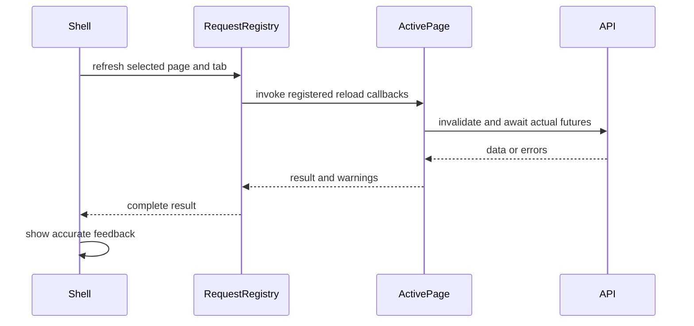

# Analytics Studio UI - Wave 5 Implementation Plan

> Execute tasks12-15 only after Waves1-4 pass. Read the approved design and master contracts.

**Goal:** Upgrade all six Analytic tabs and complete whole-app responsive navigation, table repair and truthful refresh flow.
**Architecture:** Existing analysis models feed shared visual components. A preserved page stage manages visibility/tickers; active request owners register their own refresh callbacks.
**Tech stack:** existing Flutter/Riverpod/fl_chart.
**Spec:** sections4-6,8-11.

## Task 12 - Cluster heatmap and diverging churn drivers

**Create:** app/lib/src/widgets/charts/feature_heatmap.dart; app/test/analytic_studio_cluster_churn_test.dart.
**Modify:** app/lib/src/pages/analytic/{clusters,churn}_tab.dart; existing cluster/churn tests for scoped presentation assertions only.

**Consumes:** ClusterResult clusters.z/means, ChurnDriver.cohensD; Task3 table; Task5 divergent bars; Task6 async panel.
**Produces:** FeatureHeatmap({Key? key, required List<String> rowLabels,
  required List<String> columnLabels, required List<List<double?>> values}).

### Regression bodies

Import existing fixture constants with library prefixes:
analytic_clusters_test.dart as clusterFixture; analytic_churn_test.dart as churnFixture.
Import the two tab widgets, providers/models, host and FeatureHeatmap/DivergingBarChart.

```dart
testWidgets('cluster heatmap shows actual z values and wraps names', (t) async {
  final r = ClusterResult.fromJson({
    ...clusterFixture.result.toJson(),
    'clusters': [
      for (final c in clusterFixture.result.clusters)
        {...c.toJson(), 'label': longIdentifier},
    ],
  });
  await pumpStudio(t, const ClustersTab(),
    overrides: [clustersProvider.overrideWith((ref, f) async => r)]);
  expect(find.byType(FeatureHeatmap), findsOneWidget);
  expect(find.text(longIdentifier), findsWidgets);
  expect(find.text('-0.70'), findsWidgets);
  expect(find.text('1.40'), findsWidgets);
  expect(t.takeException(), isNull);
});
testWidgets('churn bars retain the sign of every driver', (t) async {
  await pumpStudio(t, const ChurnTab(), overrides: [
    churnProvider.overrideWith((ref, f) async => churnFixture.churnResult),
  ]);
  final chart = t.widget<DivergingBarChart>(find.byType(DivergingBarChart));
  expect(chart.values.map((v) => v.value), containsAll([0.95, -0.72]));
  expect(t.takeException(), isNull);
});
```

Importing a test fixture library does not run its main; do not call its main or reuse its expected-value calculations. The asserted z/effect values are existing hand-checked literal fixture values.

### Cluster implementation

- StudioAsyncPanel queryKey(baseUrl,f), StudioHeading and responsive cards.
- Replace fixed320 card width with available StudioGrid cell width.
- Keep group size/share, separation score/word, raw means, small-sample badges and constant-feature reason.
- Add FeatureHeatmap above the exact raw-value StudioTable. Heatmap numbers are signed z values, not raw means; names and units make the distinction explicit.
- FeatureHeatmap uses bounded row-name220 and feature columns120; horizontal scroll owns one controller. Missing z displays "--", zero neutral.
- Positive z uses tokens.chart[0], negative z tokens.chart[1] where available; numeric sign remains visible. Do not imply high sessions is universally good.
- Scale intensity by clamped abs(z)/3; never change the displayed numeric value by clamping.
- Legend "Below average / Average / Above average".
- Preserve full feature names; strip only existing ev: display prefix.
- Raw table still contains current raw means and All players row. Remove its outer horizontal scroller when StudioTable owns scrolling.

Mapping kernels:

```dart
FeatureHeatmap(
  rowLabels: [for (final c in r.clusters) c.label],
  columnLabels: [for (final key in r.features) featureName(key)],
  values: [
    for (final c in r.clusters)
      [for (final key in r.features) c.z[key]],
  ],
);
```

### Churn implementation

```dart
DivergingBarChart(
  unit: "Cohen's d",
  valueFormatter: (v) => fmtDecimal(v, digits: 2),
  values: [
    for (final d in r.drivers)
      RankedValue(d.feature, featureName(d.feature), d.cohensD),
  ],
);
```

- Label positive direction "Higher among churned"; negative "Higher among stayed".
- Keep numeric drivers table as StudioTable, including means/ratio/active%/sample.
- Rules cards use wrapping label and badge groups, animated height220 ms.
- Reason one_outcome_class shows both counts and explanation, never a fake zero-effect comparison chart.
- Ten eligible observations can show drivers while rules explain the two-leaf requirement.
- Subgroups below10 retain sample badges.
- Copy-only text counts may change because a name now appears in multiple views. Scope old tests to the card/table under test rather than weakening their meaningful content assertions.

- [ ] Watch targeted behavioral red.
- [ ] Implement heatmap and tab composition.
- [ ] Run analytic_studio_cluster_churn_test.dart, existing cluster/churn tests, and full app gates.
- [ ] Commit: feat(ui): visualize cluster profiles and signed churn effects.

## Task 13 - Level views, survival bands and statistical tables

**Create:** app/test/analytic_studio_levels_survival_test.dart.
**Modify:** app/lib/src/pages/analytic/{levels,survival}_tab.dart; existing level/survival tests.

**Consumes:** LevelStats, SurvivalCurve/Point, LogRankTest, VersionImpactResult; registry, ChartFrame, ChartMotion, StudioTable/AsyncPanel.
**Produces:** existing widgets with unchanged API/model semantics.

Regression additions:
1. Existing survival fixture: assert shaded band still joins0.75/0.95 around0.85.
2. Rename group to longIdentifier and add second curve with a distinct ID/long name; at720/text1.5 no layout exception; both legends visible with distinct style slots/patterns.
3. Existing levels fixture: assert displayed win-rate series values0.88/0.40 and hazard0.04/0.70; neither is the raw win rate0.9/0.375.
4. Provide a ten-player SurvivalResult with one Other curve; show that single curve and explain pooled groups, not "need20".
5. Version result with no D1 row from recent cohorts remains free of a fabricated0% D1 row.

Concrete assertion kernel within the existing survival widget test:

```dart
final chart = tester.widget<LineChart>(find.byType(LineChart).first);
expect(chart.data.betweenBarsData, isNotEmpty);
final band = chart.data.betweenBarsData.first;
expect(chart.data.lineBarsData[band.fromIndex].spots.last.y, 0.75);
expect(chart.data.lineBarsData[band.toIndex].spots.last.y, 0.95);
expect(chart.data.lineBarsData.any((b) => b.spots.last.y == 0.85), isTrue);
```

### Levels layout

- StudioHeading summary and responsive grid.
- Smoothed win-rate view and quit-hazard view use clear distinct legends and percent units.
- Add grouped completed/failed bars using actual completes/fails, not percentages disguised as counts.
- Wall markers remain based on returned wall boolean. Do not rerun threshold math in Flutter.
- Sparse levels use their real IDs; do not index a level by rounded chart x assuming contiguous1..N.
- Axis density follows plot width.
- Convert level stats, exit events and transition tables to StudioTable.
- Wrap event and transition names; two side-by-side panels stack when content width below720.
- Label completed/failed attempt counts separately from unique reached players.

### Survival layout

- Keep specialized fl_chart step renderer; TimeSeriesChart does not replace survival confidence semantics.
- Wrap it in ChartFrame and ChartMotion.
- All central/lower/upper bars for a curve use isStepLineChart:true.
- Shade BetweenBarsData between the correct bounds; three bars per curve remain indexed consistently.
- StyleRegistry assigns colors/patterns by stable group identity, not player-count rank.
- Tooltip suppresses duplicate bound/segment entries; central tooltip includes group/day/survival and confidence interval.
- Preserve LogRankTest values and significant flag exactly.
- Heading actions wrap: group selector version/platform/cluster; version selector below or beside heading depending on content width.
- Survival curves and version impact are independent AsyncPanels. A survival gate/empty result must not automatically hide a valid version impact result.
- Both panels register for active Survival-tab refresh in Task15.
- Use StudioTable for group summaries and version metrics; metric/group names width220-260, numeric values readable, headers wrap.
- No observable D1 comparison produces no D1 row; explain unavailable follow-up in card context when appropriate.
- No previous eligible version has a specific message, not an empty-baseline comparison heading.

Preserve the original statistical regressions, not just widget assertions. If a newly formatted value changes precision, test the model-derived semantic value while asserting its approved format, never rewrite the statistical oracle.

- [ ] Observe targeted red for long legends/heading actions and preserved interval data.
- [ ] Implement layouts and wrapping tables.
- [ ] Run existing level/survival tests plus new test file, and full app gates.
- [ ] Commit: feat(ui): improve level comparisons and survival uncertainty views.

## Task 14 - Association ranking and anomaly baseline details

**Create:** app/test/analytic_studio_association_anomaly_test.dart.
**Modify:** app/lib/src/pages/analytic/{associations,anomalies}_tab.dart.

**Consumes:** AssociationRule lift/support/confidence; AnomalyAlert value/median/history; chart models and layout/async/motion widgets.
**Produces:** existing tab APIs with better views; no statistical method changes.

### Regression bodies

Use existing app/test/analytic_associations_test.dart and analytic_anomalies_test.dart fixture contents; their constants may be local, so copy complete model constructors into the new test, preserving literal values. For a focused anomaly regression use this complete constructor:

```dart
const alert = AnomalyAlert(
  series: 'sessions', day: '2026-10-08', value: 20,
  median: 10, mad: 0, z: 6, message: 'Sessions changed',
  history: [
    AnomalyAlertPoint(day: '2026-10-06', value: 10),
    AnomalyAlertPoint(day: '2026-10-07', value: 10),
    AnomalyAlertPoint(day: '2026-10-08', value: 20),
  ],
);
```

Pump AnomaliesTab with anomaliesProvider returning
AnomalyResult(days:8,alerts:[alert],reason:null). Tap the alert card and assert:

```dart
final chart = tester.widget<TimeSeriesChart>(find.byType(TimeSeriesChart));
expect(chart.series.map((s) => s.id), containsAll(['actual', 'alert-baseline']));
expect(chart.series.firstWhere((s) => s.id == 'actual').points.map((p) => p.value),
  [10.0, 10.0, 20.0]);
expect(chart.series.firstWhere((s) => s.id == 'alert-baseline').points.map((p) => p.value),
  [10.0, 10.0, 10.0]);
```

Expected-value reasoning: the reference is the returned median10 for this alert, not a fabricated rolling history. Label it "Alert baseline median". It is not a per-day recalculated historical baseline.

Associations:
- Add a ranked lift view (unit "lift") plus existing explanatory cards.
- Pass valueFormatter: (v) => '${fmtDecimal(v, digits: 2)}x' to the ranked lift view, preserving small lift values such as0.67.
- Pair label is full antecedent + " to " + consequent; wrapped, not ellipsized.
- Every card retains support, confidence, lift and smallSample.
- Less likely pairs retain their actual positive lift below1; do not force negative bars or label them as more likely.
- Mention reference lift1 in legend/caption.
- Empty copy: "No associations meet the support and lift thresholds in this range."
- All metadata chips flow through Wrap. Never use a Row that reserves insufficient text width.

Anomalies:
- Detail keyed by stable(series,day), not array index that can refer to a different alert after refresh.
- AnimatedSize expansion220 ms, scroll position retained.
- Actual series and constant alert-baseline series have distinct styles.
- Unit mapping: DAU/new_players -> players; sessions -> sessions; level completion rate -> percent; other events -> events.
- Preserve true calendar gaps in history; generate missing dates as null ChartPoint, not interpolate activity.
- Draw target marker at the alert date/value; label exact value, median, z.
- No alerts must not assert every series had a valid baseline. Copy: "No alerts available for this range. Series with insufficient baseline history are not evaluated."
- Keep short-range reason and baseline requirement. Do not drop seven-day guard for visual testing.

Add long-antecedent/consequent and long-series fixtures at720/text1.5. Assert full string presence, metadata presence, no exception, correct lift/median values.

- [ ] Run new tests red, implement composition.
- [ ] Run new tests plus existing association/anomaly tests and full app gates.
- [ ] Commit: feat(ui): add association lift ranking and anomaly reference trends.

## Task 15 - Responsive shell, retained state and active refresh

**Create:** app/lib/src/shell/page_stage.dart; app/lib/src/state/refresh.dart; app/test/{page_stage,active_refresh,studio_navigation}_test.dart.
**Modify**
- app/lib/src/shell/app_shell.dart; app/lib/src/pages/analytic/analytic_page.dart; app/lib/src/widgets/filter_bar.dart.
- app/lib/src/pages/{overview_page,retention_page,progression_page,funnel_page}.dart.
- app/lib/src/screens/{counts_screen,param_screen,days_screen,settings_screen}.dart.
- app/lib/src/pages/analytic/{clusters,churn,levels,survival,associations,anomalies}_tab.dart.
- app/lib/src/widgets/{bar_row,event_picker,funnel_editor,funnel_drilldown_panel,funnel_trend_view,funnel_chart}.dart for remaining wrapping/animation defects.
- app/test/app_shell_test.dart and corresponding existing editor/drill-down tests.

**Consumes:** Task11 navigation state; Task5 motion; Task6 async presentation; existing provider families.
**Produces:**

This integration task has three independently verified sub-deliverables. Execute15A,15B,15C in that order and commit each. Do not combine all shell/refresh/editor work into one untested edit.

| Subtask | Owned changes | Test and commit boundary |
|---|---|---|
| 15A | PageStage, responsive shell navigation, explicit Analytic controller; page_stage_test.dart and studio_navigation_test.dart | State/ticker/breakpoint tests, full app gates; commit feat(ui): preserve pages across responsive navigation |
| 15B | refresh.dart, active_refresh_test.dart, owner registrations in data-producing pages, FilterBar pending state and shell feedback | Slow/error/current-tab refresh tests, full app gates; commit fix(ui): await active page requests and report refresh failures |
| 15C | Remaining BarRow/EventPicker/Settings/funnel editor/drill-down/chart wrapping and corresponding regressions | Existing validation/CSV tests plus long-text reproductions, full app gates; commit fix(ui): finish long-text and chart layout across legacy flows |

15A leaves the existing refresh method in place until15B replaces it; it may not call unimplemented registry APIs. 15B leaves matching semantics and editor controls untouched until15C. Run targeted red before each subtask's implementation, not after all three.

```dart
PageStage({Key? key, required int index, required List<Widget> pages});
class ActiveRequestRegistry {
  void register({required AppPage page, required Object owner,
    required Object queryKey, int? analyticTab,
    required Future<RefreshResult> Function() reload});
  void remove(Object owner);
  Future<RefreshResult> reload(AppPage page, {required int analyticTab});
  void dispose();
}
class RefreshResult {
  const RefreshResult({this.errors = const [], this.warnings = const []});
  final List<Object> errors;
  final List<String> warnings;
  bool get succeeded => errors.isEmpty && warnings.isEmpty;
}
final activeRequestRegistryProvider = Provider<ActiveRequestRegistry>((ref) {
  final registry = ActiveRequestRegistry();
  ref.onDispose(registry.dispose);
  return registry;
});
Future<RefreshResult> refreshActivePage(WidgetRef ref, AppPage page,
    {required int analyticTab});
```

The registry constructor initializes an empty owner map. Its dispose method clears registrations; no request is started by construction.

### Page stage

- Lazily mount each page on first visit; cache its slot by stable index/PageStorageKey.
- Keep mounted pages in a Stack with Offstage, IgnorePointer, ExcludeSemantics and TickerMode.
- Hidden pages retain state/scroll but receive no input, accessible focus, or ticking animation.
- Animate only incoming page opacity and small vertical translation over180 ms.
- Changing breakpoint must reuse the same PageStage and children, not replace the whole shell subtree.
- Rapid navigation never overlays two interactive pages.
- Chart reveal state is not reset by page switching.

Core slot composition:

```dart
Offstage(
  offstage: i != index,
  child: TickerMode(enabled: i == index,
    child: IgnorePointer(ignoring: i != index,
      child: ExcludeSemantics(excluding: i != index,
        child: KeyedSubtree(
          key: PageStorageKey('studio-page-$i'),
          child: pages[i],
        ),
      ),
    ),
  ),
)
```

Wrap the active slot with a stateful incoming animation; maintain the child's key/state.

AnalyticPage:
- replace DefaultTabController with an explicit controller initialized from analyticTabIndexProvider;
- animation duration200 ms or zero reduced motion;
- persist settled index; clamp0..5;
- listen for external analyticTabIndexProvider updates and move the controller when needed; suppress feedback loops when the controller writes back the same index;
- each tab has a stable keep-alive slot and active TickerMode;
- quick tab changes preserve local detail selection, scroll and controls;
- avoid writes on every animation tick; store index when it changes/settles;
- body and tabs lengths remain6.

### Refresh design and ownership



Do not hardcode one refresh completion as daysProvider only. Every data-producing page registers its own current query; private Funnel result/drill-down widgets register their exact current def/breakdown/interval/segment/player arguments.

Registry rules:
- owner is a stable identity per widget instance; remove on disposal;
- updating a widget query replaces its owner's callback;
- only selected page and current Analytic tab reload;
- snapshot callbacks for one click; report page name even if user navigates away mid-refresh;
- callbacks read current Filters/baseURL when invoked, avoiding stale captured filter values;
- individual request errors are aggregated, not swallowed;
- Events optional previousError becomes a warning, not unconditional success;
- registration may not invoke API or setState in build;
- use a reusable registration widget/mixin with didUpdateWidget/dispose if needed, kept in refresh.dart; it is production ownership, not a test-only hook.

Registry implementation kernel, inside refresh.dart with navigation.dart imported:

```dart
typedef RequestRegistration = ({
  AppPage page, int? analyticTab, Object queryKey,
  Future<RefreshResult> Function() reload,
});

class ActiveRequestRegistry {
  final Map<Object, RequestRegistration> _owners = {};
  void register({required AppPage page, required Object owner,
    required Object queryKey, int? analyticTab,
    required Future<RefreshResult> Function() reload}) {
    _owners[owner] = (page: page, analyticTab: analyticTab,
      queryKey: queryKey, reload: reload);
  }
  void remove(Object owner) => _owners.remove(owner);
  void dispose() => _owners.clear();
  Future<RefreshResult> reload(AppPage page, {required int analyticTab}) async {
    final selected = _owners.values.where((r) => r.page == page &&
      (page != AppPage.analytic || r.analyticTab == analyticTab)).toList();
    if (selected.isEmpty) {
      return RefreshResult(errors: [StateError('No active data requests for ${page.name}')]);
    }
    final results = await Future.wait([
      for (final request in selected) Future<RefreshResult>.sync(request.reload)
        .catchError((Object error) => RefreshResult(errors: [error])),
    ]);
    return RefreshResult(
      errors: [for (final result in results) ...result.errors],
      warnings: [for (final result in results) ...result.warnings],
    );
  }
}
```

The declarations earlier in this task specify the same public interface; do not create two classes. Keep refresh feedback and widget registration outside this plain registry. Do not register a callback only after success, because initial loading/error must also be retryable.

Keep invalidation of all current data provider families, including eventsExplorerProvider, to prevent stale caches on revisiting pages. Then await only active page callbacks. shared days/filter-options metadata refresh joins active completion when used. Never wait for hidden unrelated analysis tasks.

| Active page | Awaited requests |
|---|---|
| Overview | overview plus filter options |
| Retention | retention plus filter options |
| Progression | progression plus filter options |
| Funnels | saved definitions, current result, visible drill-down or timeline only |
| Analytic Clusters/Churn/Levels/Associations/Anomalies | matching analysis result |
| Analytic Survival | survival and version impact independently |
| Events | eventsExplorer query including day metadata; optional comparison warnings surfaced |
| Parameters | available event keys and committed value query if selected |
| Data health | days metadata |
| Settings | no page data request; hide data refresh or report metadata-only explicitly |

Shell _refresh:
- refreshing flag true before awaiting; prevent repeated clicks;
- retain current data via StudioAsyncPanel;
- on success "Refreshed <page>";
- on warning "Updated <page>; some comparison data is unavailable";
- on failure "Could not refresh <page>" and show Retry; no success snackbar;
- finally clear refreshing only if mounted.
- filter changes update query key, never mix old filter results into a new scope.

### Refresh regression kernel

Append a slow/failing analysis test to app_shell_test.dart with a MockClient at the HTTP boundary and all non-analysis requests answered:

```dart
final pending = Completer<http.Response>();
// Handler for active /analysis/survival returns pending.future.
await tester.tap(find.byTooltip('Refresh'));
await tester.pump();
expect(find.textContaining('Refreshed'), findsNothing);
expect(tester.widget<IconButton>(find.byTooltip('Refresh')).onPressed, isNull);
pending.complete(http.Response('Server failed', 500));
await tester.pumpAndSettle();
expect(find.textContaining('Could not refresh Analytic'), findsOneWidget);
expect(find.textContaining('Refreshed Analytic'), findsNothing);
```

Use distinct initial-success and refresh-pending responses; otherwise the page never initially loads. Seed version impact separately and verify its failure also blocks a full-success message. Preserve prior regression that all five formerly omitted provider families reload.

### Responsive shell and remaining wrapping

- Width at least1200: current full sidebar.
- Width900-1199: NavigationRail using same selectedPageProvider.
- Below900: AppBar with menu and NavigationDrawer or Drawer; current page heading visible.
- Stable _items order/names, no footer index off-by-one.
- FilterBar wraps labels/actions, scopes Data health controls, disables duplicate refresh.
- Tab bar horizontally scrollable where six labels cannot fit.
- Settings style cards use constraints; four theme preference keys untouched.
- BarRow primary label wraps instead of ellipsis.
- EventPicker receives finite width and isExpanded; long menu/selected labels remain readable.
- Funnel editor conditions, exclusions, event alternatives and action groups reflow without changing validation, persistence or match semantics.
- Drill-down full event/parameter text accessible; timeline rows wrap at bounded widths. Keep raw player IDs available for copying even if a secondary display is abbreviated.
- FunnelChart/FunnelTrendView headings/legends use ChartFrame and responsive layout where their data permits. Preserve nullable conversions, compare segments and CSV behavior.
- All remaining page async branches use StudioAsyncPanel with a complete queryKey.

### Navigation regression

Use actual shell with fixture providers:
1. Visit Events, type search and select Bars; scroll down.
2. Visit Analytic, select Anomalies, expand one alert.
3. Return Events; search/chart mode/scroll preserved.
4. Resize1440 to1024 to720; navigation changes full/rail/drawer, selected page and state unchanged.
5. Return Analytic; selected tab and expanded stable alert retained.
6. Offstage pages cannot receive taps/focus and their ticker-enabled flag is false.
7. Repeat with reduced motion; transitions settle immediately.

- [ ] Observe red for active-request success timing, state resets and width overflow.
- [ ] Implement page stage, registry, shell integration and remaining wrapping.
- [ ] Run new and relevant existing shell/filter/editor/drill-down/trend/style tests.
- [ ] Run full shared/server/app gates.
- [ ] Verify the three separate15A/15B/15C commits exist with their test evidence before reporting Task15 complete.

## Wave 5 exit

- [ ] Six tabs have appropriate charts, full labels and exact data access.
- [ ] Ten-player views do not invent tree rules or significant comparisons.
- [ ] Current-tab refresh awaits its own real requests and errors.
- [ ] State survives navigation and window size changes.
- [ ] Legacy funnel/CSV/provider regressions pass.
- [ ] Full gates reported; stop before final runtime Wave6.
