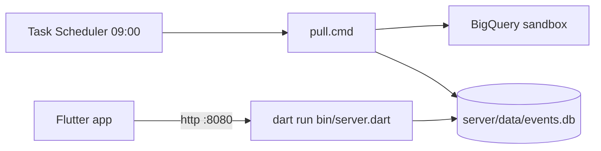

# AnalyticTracker v1 (Flutter + local Dart server) Implementation Plan

> **For agentic workers:** Implement task-by-task with superpowers:executing-plans (inline, no subagent-driven-development — project rule). Steps use checkbox (`- [ ]`) syntax for tracking. Executor: Gemini 3.8. Do every step in order. Do not skip the "run test, expect FAIL" steps. Do not invent APIs not shown here; if a package API differs from this plan, STOP and report instead of improvising.

**Goal:** A local Dart server that pulls Firebase→BigQuery (sandbox) raw events daily into SQLite and serves aggregate queries, plus a Flutter app (Windows, Android, iOS, Web) that charts them.

**Architecture:** Dart pub workspace with three packages: `shared` (models + day utilities), `server` (BigQuery pull, SQLite store, shelf HTTP API), `app` (Flutter client). Windows Task Scheduler runs `pull.dart` daily; pull fills any missing days oldest-first and re-pulls the last 3 days (late events). The app talks only to the local server over HTTP; the BigQuery key never leaves the server PC.

**Tech Stack:** Dart ≥3.6, Flutter ≥3.27, `sqlite3`, `shelf`, `shelf_router`, `googleapis`, `googleapis_auth`, `path`, `flutter_riverpod` 2.x, `http`, `fl_chart`, `shared_preferences`, `test`, `flutter_test`.

**Spec:** [.cursor/plans/flutter-local-server-stack.md](flutter-local-server-stack.md)

## Global Constraints

- Repo root: `D:\Projects\AnalyticTracker`. Packages live at `shared/`, `server/`, `app/`. Package names: `analytic_shared`, `analytic_server`, `analytic_app`.
- Dart SDK constraint `^3.6.0` in every pubspec (pub workspaces need 3.6+).
- Day strings are ISO `YYYY-MM-DD` everywhere (DB, API, app). BigQuery table names are `events_YYYYMMDD`; convert only via `dayFromTableName` / `tableNameFromDay`.
- Date arithmetic on day strings uses UTC (`addDays`) — never add `Duration(days:)` to a local `DateTime`.
- Storage: one SQLite file (default `server/data/events.db`), WAL mode.
- Raw events kept forever; `params_json` / `user_props_json` store flattened JSON objects `{"key": value}`.
- Re-pull window: last **3** days relative to today (UTC).
- Service-account key and `config.json` are never committed. Only `config.example.json` is.
- Client never calls BigQuery. Only the server does.
- No auth in v1 (LAN only).
- Add packages with `dart pub add` / `flutter pub add` (latest compatible), except `flutter_riverpod` which is pinned to `^2.6.1` (v3 changes retry defaults and APIs used here).
- Run `flutter pub get` from the repo root (the workspace contains a Flutter package, so plain `dart pub get` fails).

## Review Focus

1. **Late-arriving events:** the daily table of the last 3 days can still grow → those days must be re-pulled and *replaced*, never duplicated. Test: Task 3 `replaceDay twice keeps second set only`, Task 5 `re-pulls recent days without duplicates`.
2. **One day's BigQuery fetch fails:** other days must still be pulled, the failed day must stay missing and be retried next run, and the process exits non-zero. Test: Task 5 `failure on one day does not block others; retried next run`.
3. **Malformed query params from the app/URL** (bad date, from > to, param key with SQL/JSON-path characters, empty funnel steps) → HTTP 400 with JSON `{"error": ...}`, never 500 or SQL injection. Test: Task 7 bad-request tests; Task 4 `rejects unsafe param key`.
4. **Mixed parameter value types** (BigQuery `int_value` arrives as string, double, all-null value) → flattened to correct JSON types. Test: Task 2 flatten tests.
5. **Pull runs while the server is reading** → WAL + `busy_timeout` so neither crashes with `database is locked`. Test: Task 3 `file db uses WAL`.

---

## File structure

| Path | Responsibility |
|---|---|
| `pubspec.yaml` | Workspace root (lists members) |
| `.gitignore` | Ignore secrets, data, logs, build output |
| `shared/lib/analytic_shared.dart` | Barrel export |
| `shared/lib/src/days.dart` | Day string validation, table-name conversion, day arithmetic, gap detection |
| `shared/lib/src/models.dart` | `DayStat`, `EventCount`, `ParamBucket`, `FunnelStep` with JSON |
| `server/lib/analytic_server.dart` | Barrel export |
| `server/lib/src/raw_event.dart` | `RawEvent` value class + `rawEventFromCells` |
| `server/lib/src/flatten.dart` | BigQuery param array → flat JSON object |
| `server/lib/src/event_store.dart` | SQLite schema, writes, aggregate queries |
| `server/lib/src/event_source.dart` | `EventSource` interface |
| `server/lib/src/bigquery_source.dart` | `EventSource` backed by BigQuery REST |
| `server/lib/src/pull.dart` | `runPull` gap-fill + refresh logic |
| `server/lib/src/config.dart` | `config.json` loading + validation |
| `server/lib/src/api.dart` | shelf router, validation, CORS, error mapping |
| `server/bin/pull.dart` | CLI: daily pull |
| `server/bin/server.dart` | CLI: HTTP server |
| `server/tools/pull.cmd`, `server/tools/register-pull-task.ps1` | Task Scheduler wiring |
| `server/config.example.json` | Config template |
| `app/lib/main.dart` | Bootstrap: load saved URL, ProviderScope |
| `app/lib/src/api_client.dart` | HTTP client for server API |
| `app/lib/src/providers.dart` | Riverpod providers |
| `app/lib/src/widgets/*.dart` | `RangeBar`, `ErrorRetry`, `BarRow`, `EventPicker` |
| `app/lib/src/screens/*.dart` | Home shell + 5 screens |
| `docs/run-local.md` | How to configure, pull, serve, schedule, run app |

---

### Task 1: Workspace + shared package

**Files:**
- Create: `pubspec.yaml`, `.gitignore`
- Create: `shared/pubspec.yaml`, `shared/lib/analytic_shared.dart`, `shared/lib/src/days.dart`, `shared/lib/src/models.dart`
- Test: `shared/test/days_test.dart`, `shared/test/models_test.dart`

**Interfaces:**
- Consumes: nothing.
- Produces:
  - `bool isValidDay(String s)`
  - `String formatDay(DateTime d)` — uses the DateTime's own y/m/d fields
  - `String addDays(String day, int n)` — UTC arithmetic
  - `String? dayFromTableName(String table)` — `events_20261005` → `2026-10-05`, else `null`
  - `String tableNameFromDay(String day)`
  - `List<String> daysBetween(String from, String to)` — inclusive, ascending; empty if from > to
  - `List<String> missingDays(Iterable<String> days)` — gaps between min and max
  - `class DayStat {String day; int rowCount; String pulledAt}`, `class EventCount {String day; String eventName; int count}`, `class ParamBucket {String value; int count}`, `class FunnelStep {String eventName; int users}` — each with `const` ctor (named required params), `factory fromJson(Map<String, dynamic>)`, `Map<String, dynamic> toJson()`; JSON keys equal the Dart field names.

- [ ] **Step 1: Create workspace root files**

`pubspec.yaml`:
```yaml
name: analytic_tracker_workspace
publish_to: none
environment:
  sdk: ^3.6.0
workspace:
  - shared
```
(Only `shared` for now — `pub get` fails if a listed member folder doesn't exist. Task 2 adds `- server`, Task 8 adds `- app`.)

`.gitignore`:
```gitignore
.dart_tool/
build/
**/pubspec_overrides.yaml
server/config.json
server/secrets/
server/data/
server/logs/
*.db
*.db-wal
*.db-shm
```

`shared/pubspec.yaml`:
```yaml
name: analytic_shared
publish_to: none
resolution: workspace
environment:
  sdk: ^3.6.0
```

Then: `cd shared` and run `dart pub add dev:test dev:lints`.

`shared/analysis_options.yaml`:
```yaml
include: package:lints/recommended.yaml
```

- [ ] **Step 2: Write failing tests**

`shared/test/days_test.dart`:
```dart
import 'package:analytic_shared/analytic_shared.dart';
import 'package:test/test.dart';

void main() {
  group('isValidDay', () {
    test('accepts real dates', () {
      expect(isValidDay('2026-10-05'), isTrue);
      expect(isValidDay('2024-02-29'), isTrue);
    });
    test('rejects malformed or impossible dates', () {
      for (final s in [
        '2026-02-30',
        '2026-13-01',
        '20261005',
        '2026-1-05',
        '',
        '2026-10-05x',
        '2026-10-05T00:00:00Z',
      ]) {
        expect(isValidDay(s), isFalse, reason: s);
      }
    });
  });

  test('formatDay pads fields', () {
    expect(formatDay(DateTime(2026, 3, 7)), '2026-03-07');
  });

  group('addDays', () {
    test('crosses month, year and DST boundaries', () {
      expect(addDays('2026-10-05', 1), '2026-10-06');
      expect(addDays('2026-03-01', -1), '2026-02-28');
      expect(addDays('2026-12-31', 1), '2027-01-01');
      expect(addDays('2026-10-25', 1), '2026-10-26');
      expect(addDays('2026-03-29', 1), '2026-03-30');
    });
  });

  group('table names', () {
    test('dayFromTableName parses daily tables only', () {
      expect(dayFromTableName('events_20261005'), '2026-10-05');
      expect(dayFromTableName('events_intraday_20261005'), isNull);
      expect(dayFromTableName('events_20261399'), isNull);
      expect(dayFromTableName('pseudonymous_users_20261005'), isNull);
    });
    test('tableNameFromDay', () {
      expect(tableNameFromDay('2026-10-05'), 'events_20261005');
    });
  });

  group('daysBetween', () {
    test('inclusive ascending', () {
      expect(daysBetween('2026-09-29', '2026-10-02'),
          ['2026-09-29', '2026-09-30', '2026-10-01', '2026-10-02']);
    });
    test('single day', () {
      expect(daysBetween('2026-10-01', '2026-10-01'), ['2026-10-01']);
    });
    test('empty when from after to', () {
      expect(daysBetween('2026-10-02', '2026-10-01'), isEmpty);
    });
  });

  group('missingDays', () {
    test('finds gaps regardless of input order', () {
      expect(missingDays(['2026-10-01', '2026-10-04', '2026-10-02']),
          ['2026-10-03']);
    });
    test('empty for fewer than two days', () {
      expect(missingDays([]), isEmpty);
      expect(missingDays(['2026-10-01']), isEmpty);
    });
  });
}
```

`shared/test/models_test.dart`:
```dart
import 'package:analytic_shared/analytic_shared.dart';
import 'package:test/test.dart';

void main() {
  test('DayStat round trip', () {
    const d = DayStat(day: '2026-10-01', rowCount: 3, pulledAt: '2026-10-02T01:00:00.000Z');
    expect(DayStat.fromJson(d.toJson()).toJson(), d.toJson());
    expect(d.toJson(), {'day': '2026-10-01', 'rowCount': 3, 'pulledAt': '2026-10-02T01:00:00.000Z'});
  });
  test('EventCount round trip', () {
    const c = EventCount(day: '2026-10-01', eventName: 'stg_start', count: 5);
    expect(EventCount.fromJson(c.toJson()).toJson(), {'day': '2026-10-01', 'eventName': 'stg_start', 'count': 5});
  });
  test('ParamBucket round trip', () {
    const b = ParamBucket(value: '1', count: 2);
    expect(ParamBucket.fromJson(b.toJson()).toJson(), {'value': '1', 'count': 2});
  });
  test('FunnelStep round trip', () {
    const f = FunnelStep(eventName: 'stg_cmp', users: 7);
    expect(FunnelStep.fromJson(f.toJson()).toJson(), {'eventName': 'stg_cmp', 'users': 7});
  });
}
```

- [ ] **Step 3: Run tests, expect FAIL**

Run (from repo root): `flutter pub get` then `cd shared; dart test`
Expected: compile errors — `isValidDay` / `DayStat` not defined.

- [ ] **Step 4: Implement**

`shared/lib/analytic_shared.dart`:
```dart
export 'src/days.dart';
export 'src/models.dart';
```

`shared/lib/src/days.dart`:
```dart
final _dayRe = RegExp(r'^\d{4}-\d{2}-\d{2}$');
final _tableRe = RegExp(r'^events_(\d{4})(\d{2})(\d{2})$');

String formatDay(DateTime d) =>
    '${d.year.toString().padLeft(4, '0')}-'
    '${d.month.toString().padLeft(2, '0')}-'
    '${d.day.toString().padLeft(2, '0')}';

DateTime _parseUtc(String day) => DateTime.parse('${day}T00:00:00Z');

/// True only for a real calendar date written exactly as YYYY-MM-DD.
bool isValidDay(String s) {
  if (!_dayRe.hasMatch(s)) return false;
  final d = DateTime.tryParse('${s}T00:00:00Z');
  return d != null && formatDay(d) == s;
}

/// Day arithmetic in UTC so DST never shifts the date.
String addDays(String day, int n) =>
    formatDay(_parseUtc(day).add(Duration(days: n)));

String? dayFromTableName(String table) {
  final m = _tableRe.firstMatch(table);
  if (m == null) return null;
  final day = '${m[1]}-${m[2]}-${m[3]}';
  return isValidDay(day) ? day : null;
}

String tableNameFromDay(String day) => 'events_${day.replaceAll('-', '')}';

List<String> daysBetween(String from, String to) {
  final out = <String>[];
  for (var d = from; d.compareTo(to) <= 0; d = addDays(d, 1)) {
    out.add(d);
  }
  return out;
}

List<String> missingDays(Iterable<String> days) {
  final sorted = days.toSet().toList()..sort();
  if (sorted.length < 2) return const [];
  final have = sorted.toSet();
  return daysBetween(sorted.first, sorted.last)
      .where((d) => !have.contains(d))
      .toList();
}
```

`shared/lib/src/models.dart`:
```dart
class DayStat {
  const DayStat({required this.day, required this.rowCount, required this.pulledAt});
  final String day;
  final int rowCount;
  final String pulledAt;

  factory DayStat.fromJson(Map<String, dynamic> j) => DayStat(
        day: j['day'] as String,
        rowCount: j['rowCount'] as int,
        pulledAt: j['pulledAt'] as String,
      );
  Map<String, dynamic> toJson() => {'day': day, 'rowCount': rowCount, 'pulledAt': pulledAt};
}

class EventCount {
  const EventCount({required this.day, required this.eventName, required this.count});
  final String day;
  final String eventName;
  final int count;

  factory EventCount.fromJson(Map<String, dynamic> j) => EventCount(
        day: j['day'] as String,
        eventName: j['eventName'] as String,
        count: j['count'] as int,
      );
  Map<String, dynamic> toJson() => {'day': day, 'eventName': eventName, 'count': count};
}

class ParamBucket {
  const ParamBucket({required this.value, required this.count});
  final String value;
  final int count;

  factory ParamBucket.fromJson(Map<String, dynamic> j) =>
      ParamBucket(value: j['value'] as String, count: j['count'] as int);
  Map<String, dynamic> toJson() => {'value': value, 'count': count};
}

class FunnelStep {
  const FunnelStep({required this.eventName, required this.users});
  final String eventName;
  final int users;

  factory FunnelStep.fromJson(Map<String, dynamic> j) =>
      FunnelStep(eventName: j['eventName'] as String, users: j['users'] as int);
  Map<String, dynamic> toJson() => {'eventName': eventName, 'users': users};
}
```

- [ ] **Step 5: Run tests, expect PASS**

Run: `cd shared; dart test; dart analyze`
Expected: all tests pass; `No issues found!`

- [ ] **Step 6: Commit**

```bash
git add pubspec.yaml .gitignore shared/
git commit -m "feat(shared): workspace root and shared day utils + models"
```

---

### Task 2: Server package — RawEvent + param flattening

**Files:**
- Modify: `pubspec.yaml` (add `- server` to `workspace:`)
- Create: `server/pubspec.yaml`, `server/analysis_options.yaml`, `server/lib/analytic_server.dart`, `server/lib/src/raw_event.dart`, `server/lib/src/flatten.dart`
- Test: `server/test/flatten_test.dart`, `server/test/raw_event_test.dart`, `server/test/helpers.dart`

**Interfaces:**
- Consumes: nothing from Task 1 yet.
- Produces:
  - `String flattenParams(String? bqJson)` — BigQuery `TO_JSON_STRING(event_params)` or `TO_JSON_STRING(user_properties)` → JSON object string; `'{}'` for null/empty/`null`/non-array.
  - `class RawEvent {String day; int tsMicros; String eventName; String userPseudoId; String paramsJson; String userPropsJson; String platform; String appVersion}` — const ctor, all named required.
  - `RawEvent rawEventFromCells(String day, List<Object?> cells)` — cell order: `event_timestamp, event_name, user_pseudo_id, params, props, platform, app_version`; params/props are raw BigQuery JSON (flattened inside); nulls → `''` for strings; null timestamp or event name → `FormatException`.
  - Test helper `RawEvent ev(String day, int ts, String name, String user, [Map<String, Object?> params])` in `server/test/helpers.dart`.

- [ ] **Step 1: Create package**

Root `pubspec.yaml` workspace list becomes:
```yaml
workspace:
  - shared
  - server
```

`server/pubspec.yaml`:
```yaml
name: analytic_server
publish_to: none
resolution: workspace
environment:
  sdk: ^3.6.0
dependencies:
  analytic_shared:
    path: ../shared
```

Then `cd server` and run:
```
dart pub add sqlite3 shelf shelf_router googleapis googleapis_auth path
dart pub add dev:test dev:lints
```

`server/analysis_options.yaml`:
```yaml
include: package:lints/recommended.yaml
```

- [ ] **Step 2: Write failing tests**

`server/test/helpers.dart`:
```dart
import 'dart:convert';

import 'package:analytic_server/analytic_server.dart';

RawEvent ev(String day, int ts, String name, String user,
        [Map<String, Object?> params = const {}]) =>
    RawEvent(
      day: day,
      tsMicros: ts,
      eventName: name,
      userPseudoId: user,
      paramsJson: jsonEncode(params),
      userPropsJson: '{}',
      platform: 'ANDROID',
      appVersion: '1.0.0',
    );
```

`server/test/flatten_test.dart`:
```dart
import 'dart:convert';

import 'package:analytic_server/analytic_server.dart';
import 'package:test/test.dart';

void main() {
  test('flattens mixed value types', () {
    const bq = '[{"key":"stg","value":{"string_value":null,"int_value":"12","float_value":null,"double_value":null}},'
        '{"key":"id","value":{"string_value":"pet_01","int_value":null,"float_value":null,"double_value":null}},'
        '{"key":"heat","value":{"string_value":null,"int_value":null,"float_value":null,"double_value":0.5}},'
        '{"key":"empty","value":{"string_value":null,"int_value":null,"float_value":null,"double_value":null}}]';
    expect(jsonDecode(flattenParams(bq)),
        {'stg': 12, 'id': 'pet_01', 'heat': 0.5, 'empty': null});
  });

  test('accepts numeric int_value and float_value', () {
    const bq = '[{"key":"a","value":{"int_value":7}},{"key":"b","value":{"float_value":"1.25"}}]';
    expect(jsonDecode(flattenParams(bq)), {'a': 7, 'b': 1.25});
  });

  test('user_properties shape with set_timestamp_micros', () {
    const bq = '[{"key":"ftu","value":{"string_value":"1","set_timestamp_micros":"1759622400000000"}}]';
    expect(jsonDecode(flattenParams(bq)), {'ftu': '1'});
  });

  test('null, empty, and non-array input give empty object', () {
    for (final s in [null, '', 'null', '[]', '{}', '"x"']) {
      expect(flattenParams(s), '{}', reason: '$s');
    }
  });

  test('skips entries without a string key', () {
    const bq = '[{"value":{"int_value":"1"}},{"key":5,"value":{"int_value":"1"}},{"key":"ok","value":{"int_value":"2"}}]';
    expect(jsonDecode(flattenParams(bq)), {'ok': 2});
  });
}
```

`server/test/raw_event_test.dart`:
```dart
import 'package:analytic_server/analytic_server.dart';
import 'package:test/test.dart';

void main() {
  test('maps BigQuery cells to RawEvent', () {
    final e = rawEventFromCells('2026-10-05', [
      '1759622400000000',
      'stg_start',
      'u1',
      '[{"key":"stg","value":{"int_value":"3"}}]',
      null,
      'ANDROID',
      '1.2.0',
    ]);
    expect(e.day, '2026-10-05');
    expect(e.tsMicros, 1759622400000000);
    expect(e.eventName, 'stg_start');
    expect(e.userPseudoId, 'u1');
    expect(e.paramsJson, '{"stg":3}');
    expect(e.userPropsJson, '{}');
    expect(e.platform, 'ANDROID');
    expect(e.appVersion, '1.2.0');
  });

  test('null optional cells become empty strings', () {
    final e = rawEventFromCells('2026-10-05', ['1', 'x', null, null, null, null, null]);
    expect(e.userPseudoId, '');
    expect(e.platform, '');
    expect(e.appVersion, '');
  });

  test('missing timestamp or name throws FormatException', () {
    expect(() => rawEventFromCells('2026-10-05', [null, 'x', 'u', null, null, null, null]),
        throwsFormatException);
    expect(() => rawEventFromCells('2026-10-05', ['1', null, 'u', null, null, null, null]),
        throwsFormatException);
  });
}
```

- [ ] **Step 3: Run tests, expect FAIL**

Run: `flutter pub get` (repo root), then `cd server; dart test`
Expected: compile errors — `flattenParams` / `RawEvent` not defined.

- [ ] **Step 4: Implement**

`server/lib/analytic_server.dart`:
```dart
export 'src/flatten.dart';
export 'src/raw_event.dart';
```

`server/lib/src/flatten.dart`:
```dart
import 'dart:convert';

/// Converts BigQuery `TO_JSON_STRING(event_params)` (array of
/// `{key, value: {string_value, int_value, float_value, double_value}}`)
/// into a flat JSON object `{"key": value}`.
String flattenParams(String? bqJson) {
  if (bqJson == null || bqJson.isEmpty) return '{}';
  final Object? decoded;
  try {
    decoded = jsonDecode(bqJson);
  } on FormatException {
    return '{}';
  }
  if (decoded is! List) return '{}';
  final out = <String, Object?>{};
  for (final item in decoded) {
    if (item is! Map) continue;
    final key = item['key'];
    if (key is! String) continue;
    out[key] = _pickValue(item['value']);
  }
  return jsonEncode(out);
}

Object? _pickValue(Object? v) {
  if (v is! Map) return null;
  final s = v['string_value'];
  if (s != null) return s;
  final i = v['int_value'];
  if (i != null) return i is String ? (int.tryParse(i) ?? i) : i;
  final d = v['double_value'] ?? v['float_value'];
  if (d != null) return d is String ? (double.tryParse(d) ?? d) : d;
  return null;
}
```

`server/lib/src/raw_event.dart`:
```dart
import 'flatten.dart';

class RawEvent {
  const RawEvent({
    required this.day,
    required this.tsMicros,
    required this.eventName,
    required this.userPseudoId,
    required this.paramsJson,
    required this.userPropsJson,
    required this.platform,
    required this.appVersion,
  });

  final String day;
  final int tsMicros;
  final String eventName;
  final String userPseudoId;
  final String paramsJson;
  final String userPropsJson;
  final String platform;
  final String appVersion;
}

/// Cell order must match the SELECT in BigQuerySource:
/// event_timestamp, event_name, user_pseudo_id, params, props, platform, app_version.
RawEvent rawEventFromCells(String day, List<Object?> cells) {
  String? s(int i) => cells[i]?.toString();
  final ts = int.tryParse(s(0) ?? '');
  if (ts == null) throw FormatException('event_timestamp missing on $day');
  final name = s(1);
  if (name == null || name.isEmpty) throw FormatException('event_name missing on $day');
  return RawEvent(
    day: day,
    tsMicros: ts,
    eventName: name,
    userPseudoId: s(2) ?? '',
    paramsJson: flattenParams(s(3)),
    userPropsJson: flattenParams(s(4)),
    platform: s(5) ?? '',
    appVersion: s(6) ?? '',
  );
}
```

- [ ] **Step 5: Run tests, expect PASS**

Run: `cd server; dart test; dart analyze`
Expected: all pass; no issues.

- [ ] **Step 6: Commit**

```bash
git add pubspec.yaml server/
git commit -m "feat(server): RawEvent and BigQuery param flattening"
```

---

### Task 3: EventStore — schema and writes

**Files:**
- Create: `server/lib/src/event_store.dart`
- Modify: `server/lib/analytic_server.dart` (add export)
- Test: `server/test/event_store_write_test.dart`

**Interfaces:**
- Consumes: `RawEvent` (Task 2); `DayStat` (Task 1).
- Produces (class `EventStore`):
  - `factory EventStore.open(String path)` — creates parent dirs, WAL mode
  - `factory EventStore.inMemory()`
  - `void replaceDay(String day, List<RawEvent> events, {DateTime? now})` — atomic: deletes the day's rows, inserts all, upserts `pulled_days`; throws `ArgumentError` (and changes nothing) if any event's `day` differs
  - `Set<String> pulledDays()`
  - `List<DayStat> days()` — ascending by day
  - `int rowCount(String day)`
  - `String journalMode()`
  - `void close()`

- [ ] **Step 1: Write failing tests**

`server/test/event_store_write_test.dart`:
```dart
import 'dart:io';

import 'package:analytic_server/analytic_server.dart';
import 'package:path/path.dart' as p;
import 'package:test/test.dart';

import 'helpers.dart';

void main() {
  late EventStore store;
  setUp(() => store = EventStore.inMemory());
  tearDown(() => store.close());

  test('replaceDay records rows and pulled day', () {
    store.replaceDay('2026-10-01', [ev('2026-10-01', 1, 'a', 'u1'), ev('2026-10-01', 2, 'b', 'u1')],
        now: DateTime.utc(2026, 10, 2, 1));
    expect(store.pulledDays(), {'2026-10-01'});
    final d = store.days().single;
    expect(d.toJson(), {'day': '2026-10-01', 'rowCount': 2, 'pulledAt': '2026-10-02T01:00:00.000Z'});
    expect(store.rowCount('2026-10-01'), 2);
  });

  test('replaceDay twice keeps second set only', () {
    store.replaceDay('2026-10-01', [ev('2026-10-01', 1, 'a', 'u1'), ev('2026-10-01', 2, 'a', 'u2')]);
    store.replaceDay('2026-10-01', [ev('2026-10-01', 1, 'a', 'u1'), ev('2026-10-01', 2, 'a', 'u2'), ev('2026-10-01', 3, 'a', 'u3')]);
    expect(store.rowCount('2026-10-01'), 3);
    expect(store.days().single.rowCount, 3);
  });

  test('replaceDay with empty list marks day pulled with 0 rows', () {
    store.replaceDay('2026-10-01', const []);
    expect(store.days().single.rowCount, 0);
  });

  test('event from another day rolls back whole write', () {
    store.replaceDay('2026-10-01', [ev('2026-10-01', 1, 'a', 'u1')]);
    expect(
      () => store.replaceDay('2026-10-01', [ev('2026-10-01', 1, 'a', 'u1'), ev('2026-10-02', 2, 'a', 'u1')]),
      throwsArgumentError,
    );
    expect(store.rowCount('2026-10-01'), 1);
    expect(store.days().single.rowCount, 1);
    expect(store.pulledDays(), {'2026-10-01'});
  });

  test('days are sorted ascending', () {
    store.replaceDay('2026-10-03', const []);
    store.replaceDay('2026-10-01', const []);
    expect(store.days().map((d) => d.day), ['2026-10-01', '2026-10-03']);
  });

  test('file db uses WAL and creates parent dirs', () {
    final dir = Directory.systemTemp.createTempSync('at_store_');
    addTearDown(() => dir.deleteSync(recursive: true));
    final path = p.join(dir.path, 'nested', 'events.db');
    final fileStore = EventStore.open(path);
    expect(fileStore.journalMode(), 'wal');
    fileStore.replaceDay('2026-10-01', [ev('2026-10-01', 1, 'a', 'u1')]);
    fileStore.close();
    final reopened = EventStore.open(path);
    expect(reopened.rowCount('2026-10-01'), 1);
    reopened.close();
  });
}
```

- [ ] **Step 2: Run tests, expect FAIL**

Run: `cd server; dart test test/event_store_write_test.dart`
Expected: compile error — `EventStore` not defined.

- [ ] **Step 3: Implement**

Add to `server/lib/analytic_server.dart`:
```dart
export 'src/event_store.dart';
```

`server/lib/src/event_store.dart`:
```dart
import 'dart:io';

import 'package:analytic_shared/analytic_shared.dart';
import 'package:sqlite3/sqlite3.dart';

import 'raw_event.dart';

class EventStore {
  EventStore._(this._db) {
    _db.execute('PRAGMA busy_timeout = 5000;');
    _db.execute('''
      CREATE TABLE IF NOT EXISTS events (
        id INTEGER PRIMARY KEY,
        day TEXT NOT NULL,
        ts_micros INTEGER NOT NULL,
        event_name TEXT NOT NULL,
        user_pseudo_id TEXT NOT NULL,
        params_json TEXT NOT NULL,
        user_props_json TEXT NOT NULL,
        platform TEXT NOT NULL,
        app_version TEXT NOT NULL
      );
    ''');
    _db.execute('CREATE INDEX IF NOT EXISTS idx_events_day_name ON events(day, event_name);');
    _db.execute('CREATE INDEX IF NOT EXISTS idx_events_user ON events(user_pseudo_id);');
    _db.execute('''
      CREATE TABLE IF NOT EXISTS pulled_days (
        day TEXT PRIMARY KEY,
        row_count INTEGER NOT NULL,
        pulled_at TEXT NOT NULL
      );
    ''');
  }

  factory EventStore.open(String path) {
    File(path).parent.createSync(recursive: true);
    final db = sqlite3.open(path);
    db.execute('PRAGMA journal_mode = WAL;');
    return EventStore._(db);
  }

  factory EventStore.inMemory() => EventStore._(sqlite3.openInMemory());

  final Database _db;

  /// Atomically replaces every row of [day] with [events].
  void replaceDay(String day, List<RawEvent> events, {DateTime? now}) {
    _db.execute('BEGIN IMMEDIATE;');
    try {
      _db.execute('DELETE FROM events WHERE day = ?;', [day]);
      final stmt = _db.prepare(
        'INSERT INTO events (day, ts_micros, event_name, user_pseudo_id, '
        'params_json, user_props_json, platform, app_version) '
        'VALUES (?, ?, ?, ?, ?, ?, ?, ?);',
      );
      try {
        for (final e in events) {
          if (e.day != day) {
            throw ArgumentError('event day ${e.day} does not match $day');
          }
          stmt.execute([
            e.day, e.tsMicros, e.eventName, e.userPseudoId,
            e.paramsJson, e.userPropsJson, e.platform, e.appVersion,
          ]);
        }
      } finally {
        stmt.dispose();
      }
      _db.execute(
        'INSERT INTO pulled_days (day, row_count, pulled_at) VALUES (?, ?, ?) '
        'ON CONFLICT(day) DO UPDATE SET row_count = excluded.row_count, '
        'pulled_at = excluded.pulled_at;',
        [day, events.length, (now ?? DateTime.now()).toUtc().toIso8601String()],
      );
      _db.execute('COMMIT;');
    } catch (_) {
      _db.execute('ROLLBACK;');
      rethrow;
    }
  }

  Set<String> pulledDays() =>
      {for (final r in _db.select('SELECT day FROM pulled_days;')) r['day'] as String};

  List<DayStat> days() => [
        for (final r in _db.select(
            'SELECT day, row_count, pulled_at FROM pulled_days ORDER BY day;'))
          DayStat(
            day: r['day'] as String,
            rowCount: r['row_count'] as int,
            pulledAt: r['pulled_at'] as String,
          ),
      ];

  int rowCount(String day) =>
      _db.select('SELECT COUNT(*) AS c FROM events WHERE day = ?;', [day]).first['c'] as int;

  String journalMode() =>
      (_db.select('PRAGMA journal_mode;').first.values.first as String).toLowerCase();

  void close() => _db.dispose();
}
```

If `sqlite3` fails to load with `Failed to load dynamic library 'sqlite3.dll'`: download the "Precompiled Binaries for Windows" x64 zip from https://sqlite.org/download.html, put `sqlite3.dll` in `server/` (and on `PATH` for Task Scheduler), then re-run. Do not change code for this.

- [ ] **Step 4: Run tests, expect PASS**

Run: `cd server; dart test test/event_store_write_test.dart; dart analyze`
Expected: all pass; no issues.

- [ ] **Step 5: Commit**

```bash
git add server/lib server/test
git commit -m "feat(server): SQLite EventStore with atomic day replace"
```

---

### Task 4: EventStore — aggregate queries

**Files:**
- Modify: `server/lib/src/event_store.dart` (add methods before `close()`)
- Test: `server/test/event_store_query_test.dart`

**Interfaces:**
- Consumes: `EventStore` (Task 3), `EventCount`, `ParamBucket`, `FunnelStep` (Task 1).
- Produces (methods on `EventStore`):
  - `List<String> eventNames()` — distinct, sorted
  - `List<EventCount> counts(String from, String to, {String? name})` — ordered by day, eventName; inclusive range
  - `List<ParamBucket> paramBreakdown(String eventName, String key, String from, String to, {int limit = 50})` — null param → value `'(none)'`; ordered count desc then value asc (NULL first); throws `ArgumentError` if `key` doesn't match `^[A-Za-z0-9_]+$`
  - `List<FunnelStep> funnel(List<String> steps, String from, String to)` — ordered funnel per user by `ts_micros`; step k counts users who did steps 1..k in order; throws `ArgumentError` if `steps` empty

- [ ] **Step 1: Write failing tests**

`server/test/event_store_query_test.dart`:
```dart
import 'package:analytic_server/analytic_server.dart';
import 'package:test/test.dart';

import 'helpers.dart';

const d1 = '2026-10-01';
const d2 = '2026-10-02';

EventStore seeded() {
  final s = EventStore.inMemory();
  s.replaceDay(d1, [
    ev(d1, 100, 'stg_start', 'u1', {'stg': 1}),
    ev(d1, 200, 'stg_cmp', 'u1', {'stg': 1}),
    ev(d1, 300, 'stg_start', 'u2', {'stg': 2}),
    ev(d1, 400, 'stg_fail', 'u2', {'stg': 2}),
  ]);
  s.replaceDay(d2, [
    ev(d2, 500, 'stg_cmp', 'u3', {'stg': 3}),
    ev(d2, 600, 'stg_start', 'u1', {'stg': 1}),
    ev(d2, 700, 'stg_start', 'u3'),
  ]);
  return s;
}

void main() {
  late EventStore store;
  setUp(() => store = seeded());
  tearDown(() => store.close());

  test('eventNames distinct sorted', () {
    expect(store.eventNames(), ['stg_cmp', 'stg_fail', 'stg_start']);
  });

  test('counts per day and event', () {
    expect(store.counts(d1, d2).map((c) => c.toJson()).toList(), [
      {'day': d1, 'eventName': 'stg_cmp', 'count': 1},
      {'day': d1, 'eventName': 'stg_fail', 'count': 1},
      {'day': d1, 'eventName': 'stg_start', 'count': 2},
      {'day': d2, 'eventName': 'stg_cmp', 'count': 1},
      {'day': d2, 'eventName': 'stg_start', 'count': 2},
    ]);
  });

  test('counts filtered by name and range', () {
    expect(store.counts(d1, d1, name: 'stg_start').map((c) => c.toJson()).toList(), [
      {'day': d1, 'eventName': 'stg_start', 'count': 2},
    ]);
  });

  test('paramBreakdown groups values, missing as (none)', () {
    expect(store.paramBreakdown('stg_start', 'stg', d1, d2).map((b) => b.toJson()).toList(), [
      {'value': '1', 'count': 2},
      {'value': '(none)', 'count': 1},
      {'value': '2', 'count': 1},
    ]);
  });

  test('rejects unsafe param key', () {
    for (final k in ['stg; DROP TABLE events', 'a.b', r'$', '', 'a"b']) {
      expect(() => store.paramBreakdown('stg_start', k, d1, d2), throwsArgumentError, reason: k);
    }
  });

  test('funnel is ordered per user', () {
    expect(store.funnel(['stg_start', 'stg_cmp'], d1, d2).map((f) => f.toJson()).toList(), [
      {'eventName': 'stg_start', 'users': 3},
      {'eventName': 'stg_cmp', 'users': 1},
    ]);
  });

  test('funnel respects range: cmp before start does not count', () {
    expect(store.funnel(['stg_start', 'stg_cmp'], d2, d2).map((f) => f.users).toList(), [2, 0]);
  });

  test('funnel rejects empty steps', () {
    expect(() => store.funnel([], d1, d2), throwsArgumentError);
  });
}
```

- [ ] **Step 2: Run tests, expect FAIL**

Run: `cd server; dart test test/event_store_query_test.dart`
Expected: compile errors — `eventNames` etc. not defined.

- [ ] **Step 3: Implement** — add to `EventStore` (above `close()`), plus a top-level `final _keyRe = RegExp(r'^[A-Za-z0-9_]+$');` in the same file:

```dart
  List<String> eventNames() => [
        for (final r in _db.select('SELECT DISTINCT event_name FROM events ORDER BY event_name;'))
          r['event_name'] as String,
      ];

  List<EventCount> counts(String from, String to, {String? name}) {
    final filter = name == null ? '' : ' AND event_name = ?';
    final rows = _db.select(
      'SELECT day, event_name, COUNT(*) AS c FROM events '
      'WHERE day BETWEEN ? AND ?$filter '
      'GROUP BY day, event_name ORDER BY day, event_name;',
      [from, to, if (name != null) name],
    );
    return [
      for (final r in rows)
        EventCount(day: r['day'] as String, eventName: r['event_name'] as String, count: r['c'] as int),
    ];
  }

  List<ParamBucket> paramBreakdown(String eventName, String key, String from, String to,
      {int limit = 50}) {
    if (!_keyRe.hasMatch(key)) {
      throw ArgumentError('param key must match [A-Za-z0-9_]+');
    }
    final rows = _db.select(
      'SELECT CAST(json_extract(params_json, ?) AS TEXT) AS v, COUNT(*) AS c FROM events '
      'WHERE event_name = ? AND day BETWEEN ? AND ? '
      'GROUP BY v ORDER BY c DESC, v LIMIT ?;',
      ['\$.$key', eventName, from, to, limit],
    );
    return [
      for (final r in rows)
        ParamBucket(value: (r['v'] as String?) ?? '(none)', count: r['c'] as int),
    ];
  }

  /// Ordered funnel: a user reaches step k only after reaching steps 1..k-1
  /// earlier (by ts_micros) within [from, to].
  List<FunnelStep> funnel(List<String> steps, String from, String to) {
    if (steps.isEmpty) throw ArgumentError('steps must not be empty');
    final distinct = steps.toSet().toList();
    final marks = List.filled(distinct.length, '?').join(', ');
    final rows = _db.select(
      'SELECT user_pseudo_id, event_name FROM events '
      'WHERE day BETWEEN ? AND ? AND event_name IN ($marks) '
      'ORDER BY user_pseudo_id, ts_micros, id;',
      [from, to, ...distinct],
    );
    final byUser = <String, List<String>>{};
    for (final r in rows) {
      byUser.putIfAbsent(r['user_pseudo_id'] as String, () => []).add(r['event_name'] as String);
    }
    final reached = List.filled(steps.length, 0);
    for (final names in byUser.values) {
      var next = 0;
      for (final name in names) {
        if (next < steps.length && name == steps[next]) {
          reached[next]++;
          next++;
        }
      }
    }
    return [
      for (var i = 0; i < steps.length; i++) FunnelStep(eventName: steps[i], users: reached[i]),
    ];
  }
```

Note: the `?` placeholder for the JSON path is safe because the key is regex-validated first and bound as a parameter, never concatenated into SQL.

- [ ] **Step 4: Run tests, expect PASS**

Run: `cd server; dart test; dart analyze`
Expected: all pass; no issues.

- [ ] **Step 5: Commit**

```bash
git add server/lib server/test
git commit -m "feat(server): EventStore counts, param breakdown, funnel queries"
```

---

### Task 5: Pull logic (gap fill + refresh + failure isolation)

**Files:**
- Create: `server/lib/src/event_source.dart`, `server/lib/src/pull.dart`
- Modify: `server/lib/analytic_server.dart` (add exports)
- Test: `server/test/pull_test.dart`

**Interfaces:**
- Consumes: `EventStore.replaceDay`, `EventStore.pulledDays` (Task 3); `addDays` (Task 1); `RawEvent` (Task 2).
- Produces:
  - `abstract interface class EventSource { Future<List<String>> listDays(); Future<List<RawEvent>> fetchDay(String day); }` — `listDays` returns ISO days that have a daily table.
  - `class PullResult { final List<String> pulled; final Map<String, String> failed; bool get ok; }`
  - `Future<PullResult> runPull(EventSource source, EventStore store, {required String today, int refreshRecentDays = 3, void Function(String) log = print})` — todo = available days that are not yet pulled OR are `>= addDays(today, -refreshRecentDays)`; processed ascending (oldest first); a failing day is logged into `failed` and the loop continues. `listDays` errors propagate.

- [ ] **Step 1: Write failing tests**

`server/test/pull_test.dart`:
```dart
import 'package:analytic_server/analytic_server.dart';
import 'package:test/test.dart';

import 'helpers.dart';

class FakeSource implements EventSource {
  FakeSource(this.data, {Set<String>? failDays}) : failDays = failDays ?? {};
  final Map<String, List<RawEvent>> data;
  final Set<String> failDays;
  final fetched = <String>[];

  @override
  Future<List<String>> listDays() async => data.keys.toList()..sort();

  @override
  Future<List<RawEvent>> fetchDay(String day) async {
    fetched.add(day);
    if (failDays.contains(day)) throw StateError('boom $day');
    return data[day]!;
  }
}

Map<String, List<RawEvent>> daysData(List<String> days) =>
    {for (final d in days) d: [ev(d, 1, 'a', 'u1'), ev(d, 2, 'b', 'u1')]};

void main() {
  late EventStore store;
  setUp(() => store = EventStore.inMemory());
  tearDown(() => store.close());
  void quiet(String _) {}

  test('empty store pulls every day oldest first', () async {
    final src = FakeSource(daysData(['2026-10-03', '2026-09-01', '2026-10-01']));
    final r = await runPull(src, store, today: '2026-12-01', log: quiet);
    expect(src.fetched, ['2026-09-01', '2026-10-01', '2026-10-03']);
    expect(r.pulled, ['2026-09-01', '2026-10-01', '2026-10-03']);
    expect(r.ok, isTrue);
    expect(store.pulledDays(), {'2026-09-01', '2026-10-01', '2026-10-03'});
  });

  test('skips pulled old days, re-pulls recent days', () async {
    store.replaceDay('2026-09-01', const []);
    store.replaceDay('2026-10-04', const []);
    final src = FakeSource(daysData(['2026-09-01', '2026-09-02', '2026-10-04']));
    await runPull(src, store, today: '2026-10-06', log: quiet);
    expect(src.fetched, ['2026-09-02', '2026-10-04']);
    expect(store.rowCount('2026-10-04'), 2);
  });

  test('re-pulls recent days without duplicates', () async {
    final src = FakeSource(daysData(['2026-10-05']));
    await runPull(src, store, today: '2026-10-06', log: quiet);
    await runPull(src, store, today: '2026-10-06', log: quiet);
    expect(src.fetched, ['2026-10-05', '2026-10-05']);
    expect(store.rowCount('2026-10-05'), 2);
  });

  test('failure on one day does not block others; retried next run', () async {
    final data = daysData(['2026-10-01', '2026-10-02', '2026-10-03']);
    final failing = FakeSource(data, failDays: {'2026-10-02'});
    final r1 = await runPull(failing, store, today: '2026-12-01', log: quiet);
    expect(r1.pulled, ['2026-10-01', '2026-10-03']);
    expect(r1.failed.keys, ['2026-10-02']);
    expect(r1.failed['2026-10-02'], contains('boom'));
    expect(r1.ok, isFalse);
    expect(store.pulledDays(), {'2026-10-01', '2026-10-03'});

    final healthy = FakeSource(data);
    final r2 = await runPull(healthy, store, today: '2026-12-01', log: quiet);
    expect(healthy.fetched, ['2026-10-02']);
    expect(r2.ok, isTrue);
  });

  test('event from wrong day counts as failure, not crash', () async {
    final src = FakeSource({'2026-10-01': [ev('2026-10-02', 1, 'a', 'u1')]});
    final r = await runPull(src, store, today: '2026-12-01', log: quiet);
    expect(r.failed.keys, ['2026-10-01']);
    expect(store.pulledDays(), isEmpty);
  });
}
```

- [ ] **Step 2: Run tests, expect FAIL**

Run: `cd server; dart test test/pull_test.dart`
Expected: compile errors — `EventSource` / `runPull` not defined.

- [ ] **Step 3: Implement**

Add to `server/lib/analytic_server.dart`:
```dart
export 'src/event_source.dart';
export 'src/pull.dart';
```

`server/lib/src/event_source.dart`:
```dart
import 'raw_event.dart';

abstract interface class EventSource {
  /// ISO days (YYYY-MM-DD) that have a finished daily table, any order.
  Future<List<String>> listDays();

  /// All events of one day. Every returned event has `day == day`.
  Future<List<RawEvent>> fetchDay(String day);
}
```

`server/lib/src/pull.dart`:
```dart
import 'package:analytic_shared/analytic_shared.dart';

import 'event_source.dart';
import 'event_store.dart';

class PullResult {
  PullResult(this.pulled, this.failed);
  final List<String> pulled;
  final Map<String, String> failed;
  bool get ok => failed.isEmpty;
}

/// Pulls every available day not yet stored, plus the last [refreshRecentDays]
/// days (BigQuery daily tables still receive late events). Oldest first,
/// because the BigQuery sandbox deletes the oldest tables first (60 days).
Future<PullResult> runPull(
  EventSource source,
  EventStore store, {
  required String today,
  int refreshRecentDays = 3,
  void Function(String) log = print,
}) async {
  final available = await source.listDays();
  final have = store.pulledDays();
  final cutoff = addDays(today, -refreshRecentDays);
  final todo = available
      .where((d) => !have.contains(d) || d.compareTo(cutoff) >= 0)
      .toSet()
      .toList()
    ..sort();

  final pulled = <String>[];
  final failed = <String, String>{};
  for (final day in todo) {
    try {
      final events = await source.fetchDay(day);
      store.replaceDay(day, events);
      pulled.add(day);
      log('pulled $day: ${events.length} rows');
    } catch (e) {
      failed[day] = '$e';
      log('FAILED $day: $e');
    }
  }
  return PullResult(pulled, failed);
}
```

- [ ] **Step 4: Run tests, expect PASS**

Run: `cd server; dart test; dart analyze`
Expected: all pass; no issues.

- [ ] **Step 5: Commit**

```bash
git add server/lib server/test
git commit -m "feat(server): daily pull with gap fill, refresh window, failure isolation"
```

---

### Task 6: Config + BigQuerySource + pull CLI

**Files:**
- Create: `server/lib/src/config.dart`, `server/lib/src/bigquery_source.dart`, `server/bin/pull.dart`, `server/config.example.json`
- Modify: `server/lib/analytic_server.dart` (add exports)
- Test: `server/test/config_test.dart`

**Interfaces:**
- Consumes: `EventSource`, `runPull` (Task 5); `rawEventFromCells` (Task 2); `dayFromTableName`, `tableNameFromDay`, `formatDay` (Task 1); `EventStore.open` (Task 3).
- Produces:
  - `class Config { String projectId; String datasetId; String? location; String keyFile; String dbPath; int port; static Config load(String path); static Config fromJson(Map<String, dynamic> json, {required String baseDir}); }` — relative `keyFile`/`dbPath` resolved against `baseDir` (the config file's directory); `port` default 8080; `dbPath` default `data/events.db`; invalid → `FormatException` whose message names the field.
  - `class BigQuerySource implements EventSource { static Future<BigQuerySource> connect(Config c); void close(); }`

- [ ] **Step 1: Write failing tests**

`server/test/config_test.dart`:
```dart
import 'dart:convert';
import 'dart:io';

import 'package:analytic_server/analytic_server.dart';
import 'package:path/path.dart' as p;
import 'package:test/test.dart';

void main() {
  final base = p.join(Directory.systemTemp.path, 'cfg');

  test('applies defaults and resolves relative paths', () {
    final c = Config.fromJson({
      'projectId': 'pvm-prod',
      'datasetId': 'analytics_123',
      'keyFile': 'secrets/key.json',
    }, baseDir: base);
    expect(c.projectId, 'pvm-prod');
    expect(c.datasetId, 'analytics_123');
    expect(c.location, isNull);
    expect(c.port, 8080);
    expect(c.keyFile, p.normalize(p.join(base, 'secrets/key.json')));
    expect(c.dbPath, p.normalize(p.join(base, 'data/events.db')));
  });

  test('keeps absolute paths and explicit values', () {
    final abs = p.join(Directory.systemTemp.path, 'k.json');
    final c = Config.fromJson({
      'projectId': 'p',
      'datasetId': 'd',
      'keyFile': abs,
      'dbPath': 'x.db',
      'location': 'US',
      'port': 9000,
    }, baseDir: base);
    expect(c.keyFile, abs);
    expect(c.location, 'US');
    expect(c.port, 9000);
  });

  test('missing or wrong-typed fields name the field', () {
    expect(() => Config.fromJson({'projectId': 'p', 'keyFile': 'k'}, baseDir: base),
        throwsA(isA<FormatException>().having((e) => e.message, 'message', contains('datasetId'))));
    expect(() => Config.fromJson({'projectId': 'p', 'datasetId': 'd', 'keyFile': 'k', 'port': '80'}, baseDir: base),
        throwsA(isA<FormatException>().having((e) => e.message, 'message', contains('port'))));
  });

  test('load reads file and resolves against its directory', () {
    final dir = Directory.systemTemp.createTempSync('at_cfg_');
    addTearDown(() => dir.deleteSync(recursive: true));
    final f = File(p.join(dir.path, 'config.json'))
      ..writeAsStringSync(jsonEncode({'projectId': 'p', 'datasetId': 'd', 'keyFile': 'k.json'}));
    expect(Config.load(f.path).keyFile, p.normalize(p.join(dir.path, 'k.json')));
  });

  test('load rejects non-object JSON', () {
    final dir = Directory.systemTemp.createTempSync('at_cfg_');
    addTearDown(() => dir.deleteSync(recursive: true));
    final f = File(p.join(dir.path, 'config.json'))..writeAsStringSync('[]');
    expect(() => Config.load(f.path), throwsFormatException);
  });
}
```

- [ ] **Step 2: Run tests, expect FAIL**

Run: `cd server; dart test test/config_test.dart`
Expected: compile error — `Config` not defined.

- [ ] **Step 3: Implement config**

Add to `server/lib/analytic_server.dart`:
```dart
export 'src/bigquery_source.dart';
export 'src/config.dart';
```

`server/lib/src/config.dart`:
```dart
import 'dart:convert';
import 'dart:io';

import 'package:path/path.dart' as p;

class Config {
  Config._({
    required this.projectId,
    required this.datasetId,
    required this.location,
    required this.keyFile,
    required this.dbPath,
    required this.port,
  });

  final String projectId;
  final String datasetId;
  final String? location;
  final String keyFile;
  final String dbPath;
  final int port;

  static Config load(String path) {
    final raw = jsonDecode(File(path).readAsStringSync());
    if (raw is! Map<String, dynamic>) {
      throw const FormatException('config root must be a JSON object');
    }
    return fromJson(raw, baseDir: p.dirname(p.absolute(path)));
  }

  static Config fromJson(Map<String, dynamic> json, {required String baseDir}) {
    String req(String k) {
      final v = json[k];
      if (v is! String || v.isEmpty) {
        throw FormatException('config: "$k" must be a non-empty string');
      }
      return v;
    }

    String? opt(String k) {
      final v = json[k];
      if (v == null) return null;
      if (v is! String || v.isEmpty) {
        throw FormatException('config: "$k" must be a non-empty string');
      }
      return v;
    }

    String resolve(String v) => p.normalize(p.isAbsolute(v) ? v : p.join(baseDir, v));

    final port = json['port'] ?? 8080;
    if (port is! int || port <= 0 || port > 65535) {
      throw const FormatException('config: "port" must be an integer 1-65535');
    }
    return Config._(
      projectId: req('projectId'),
      datasetId: req('datasetId'),
      location: opt('location'),
      keyFile: resolve(req('keyFile')),
      dbPath: resolve(opt('dbPath') ?? 'data/events.db'),
      port: port,
    );
  }
}
```

- [ ] **Step 4: Run config tests, expect PASS**

Run: `cd server; dart test test/config_test.dart`
Expected: PASS.

- [ ] **Step 5: Implement BigQuerySource**

`server/lib/src/bigquery_source.dart`:
```dart
import 'dart:io';

import 'package:analytic_shared/analytic_shared.dart';
import 'package:googleapis/bigquery/v2.dart';
import 'package:googleapis_auth/auth_io.dart';

import 'config.dart';
import 'event_source.dart';
import 'raw_event.dart';

class BigQuerySource implements EventSource {
  BigQuerySource._(this._client, this._api, this._c);

  final AutoRefreshingAuthClient _client;
  final BigqueryApi _api;
  final Config _c;

  static const _pageSize = 10000;

  static Future<BigQuerySource> connect(Config c) async {
    final creds = ServiceAccountCredentials.fromJson(await File(c.keyFile).readAsString());
    final client = await clientViaServiceAccount(creds, [BigqueryApi.bigqueryScope]);
    return BigQuerySource._(client, BigqueryApi(client), c);
  }

  @override
  Future<List<String>> listDays() async {
    final days = <String>[];
    String? token;
    do {
      final res = await _api.tables.list(_c.projectId, _c.datasetId,
          maxResults: 1000, pageToken: token);
      for (final t in res.tables ?? const <TableListTables>[]) {
        final id = t.tableReference?.tableId;
        final day = id == null ? null : dayFromTableName(id);
        if (day != null) days.add(day);
      }
      token = res.nextPageToken;
    } while (token != null);
    days.sort();
    return days;
  }

  @override
  Future<List<RawEvent>> fetchDay(String day) async {
    final table = '`${_c.projectId}.${_c.datasetId}.${tableNameFromDay(day)}`';
    final sql = 'SELECT event_timestamp, event_name, user_pseudo_id, '
        'TO_JSON_STRING(event_params) AS params, '
        'TO_JSON_STRING(user_properties) AS props, '
        'platform, app_info.version AS app_version '
        'FROM $table';

    final first = await _api.jobs.query(
      QueryRequest(
        query: sql,
        useLegacySql: false,
        location: _c.location,
        timeoutMs: 30000,
        maxResults: _pageSize,
      ),
      _c.projectId,
    );
    final jobId = first.jobReference!.jobId!;
    final location = first.jobReference?.location ?? _c.location;

    var complete = first.jobComplete ?? false;
    var rows = first.rows;
    var token = first.pageToken;
    while (!complete) {
      final r = await _api.jobs.getQueryResults(_c.projectId, jobId,
          location: location, timeoutMs: 30000, maxResults: _pageSize);
      complete = r.jobComplete ?? false;
      rows = r.rows;
      token = r.pageToken;
    }

    final out = <RawEvent>[];
    void addRows(List<TableRow>? rs) {
      for (final row in rs ?? const <TableRow>[]) {
        out.add(rawEventFromCells(day, [for (final cell in row.f!) cell.v]));
      }
    }

    addRows(rows);
    while (token != null) {
      final r = await _api.jobs.getQueryResults(_c.projectId, jobId,
          location: location, pageToken: token, maxResults: _pageSize);
      addRows(r.rows);
      token = r.pageToken;
    }
    return out;
  }

  void close() => _client.close();
}
```

`server/bin/pull.dart`:
```dart
import 'dart:io';

import 'package:analytic_server/analytic_server.dart';
import 'package:analytic_shared/analytic_shared.dart';

/// Usage: dart run bin/pull.dart [config.json]
/// Exit codes: 0 ok, 1 some days failed, 2 aborted (config/auth/list error).
Future<void> main(List<String> args) async {
  final stamp = DateTime.now().toIso8601String();
  EventStore? store;
  BigQuerySource? source;
  try {
    final config = Config.load(args.isNotEmpty ? args.first : 'config.json');
    store = EventStore.open(config.dbPath);
    source = await BigQuerySource.connect(config);
    final result = await runPull(source, store,
        today: formatDay(DateTime.now().toUtc()),
        log: (m) => stdout.writeln('[$stamp] $m'));
    stdout.writeln('[$stamp] done: ${result.pulled.length} pulled, ${result.failed.length} failed');
    exitCode = result.ok ? 0 : 1;
  } catch (e, st) {
    stderr.writeln('[$stamp] pull aborted: $e\n$st');
    exitCode = 2;
  } finally {
    source?.close();
    store?.close();
  }
}
```

`server/config.example.json`:
```json
{
  "projectId": "your-firebase-project-id",
  "datasetId": "analytics_123456789",
  "location": "US",
  "keyFile": "secrets/service-account.json",
  "dbPath": "data/events.db",
  "port": 8080
}
```
(`location` must equal the BigQuery dataset location shown in BigQuery console → dataset → Details; remove the line if unsure.)

- [ ] **Step 6: Analyze + full tests**

Run: `cd server; dart analyze; dart test`
Expected: no issues; all pass. If `dart analyze` reports that a `googleapis` member used above does not exist (e.g. `TableListTables`, `QueryRequest.location`), STOP and report the exact error — do not guess replacements.

- [ ] **Step 7: Manual verification against real BigQuery (owner prerequisites)**

Prerequisites (owner does these, executor only checks they exist):
1. Firebase console → Project settings → Integrations → BigQuery → linked, Analytics export **Daily** on.
2. Google Cloud console → IAM → service account with roles **BigQuery Data Viewer** + **BigQuery Job User**; JSON key saved as `server/secrets/service-account.json`.
3. `server/config.json` copied from `config.example.json` with real `projectId` / `datasetId`.

Run: `cd server; dart run bin/pull.dart config.json`
Expected: lines `pulled 2026-..-..: N rows` for each existing daily table, then `done: X pulled, 0 failed`; exit code 0 (`echo $LASTEXITCODE` in PowerShell → `0`). Run it a second time: only the last 3 days are pulled again.

If no daily table exists yet (export just linked), expected output is `done: 0 pulled, 0 failed`.

- [ ] **Step 8: Commit**

```bash
git add server/lib server/bin server/test server/config.example.json
git commit -m "feat(server): config loading, BigQuery source, pull CLI"
```

---

### Task 7: HTTP API + server CLI

**Files:**
- Create: `server/lib/src/api.dart`, `server/bin/server.dart`
- Modify: `server/lib/analytic_server.dart` (add export)
- Test: `server/test/api_test.dart`

**Interfaces:**
- Consumes: `EventStore` query methods (Tasks 3–4); `isValidDay` (Task 1); `Config` (Task 6).
- Produces: `Handler buildHandler(EventStore store)` with routes (all JSON, all with CORS `Access-Control-Allow-Origin: *`):

| Route | Query params | 200 body |
|---|---|---|
| `GET /days` | — | `[DayStat.toJson]` |
| `GET /events/names` | — | `["name", ...]` |
| `GET /events/count` | `from`, `to`, optional `name` | `[EventCount.toJson]` |
| `GET /events/param` | `name`, `key`, `from`, `to` | `[ParamBucket.toJson]` |
| `GET /funnel` | `steps` (comma-separated, 1–10), `from`, `to` | `[FunnelStep.toJson]` |
| `OPTIONS *` | — | empty 200 (CORS preflight) |

Validation errors → `400 {"error": "<message>"}`. Unknown route → 404.

- [ ] **Step 1: Write failing tests**

`server/test/api_test.dart`:
```dart
import 'dart:convert';

import 'package:analytic_server/analytic_server.dart';
import 'package:shelf/shelf.dart';
import 'package:test/test.dart';

import 'helpers.dart';

const d1 = '2026-10-01';
const d2 = '2026-10-02';

void main() {
  late EventStore store;
  late Handler handler;

  setUp(() {
    store = EventStore.inMemory();
    store.replaceDay(d1, [
      ev(d1, 100, 'stg_start', 'u1', {'stg': 1}),
      ev(d1, 200, 'stg_cmp', 'u1', {'stg': 1}),
      ev(d1, 300, 'stg_start', 'u2', {'stg': 2}),
    ]);
    store.replaceDay(d2, [ev(d2, 600, 'stg_start', 'u3', {'stg': 1})]);
    handler = buildHandler(store);
  });
  tearDown(() => store.close());

  Future<Response> send(String path, {String method = 'GET'}) async =>
      await handler(Request(method, Uri.parse('http://localhost$path')));

  Future<(int, Object?)> getJson(String path) async {
    final res = await send(path);
    return (res.statusCode, jsonDecode(await res.readAsString()));
  }

  test('GET /days', () async {
    final (status, body) = await getJson('/days');
    expect(status, 200);
    expect((body as List).map((e) => e['day']), [d1, d2]);
  });

  test('GET /events/names', () async {
    final (status, body) = await getJson('/events/names');
    expect(status, 200);
    expect(body, ['stg_cmp', 'stg_start']);
  });

  test('GET /events/count with name filter', () async {
    final (status, body) = await getJson('/events/count?from=$d1&to=$d2&name=stg_start');
    expect(status, 200);
    expect(body, [
      {'day': d1, 'eventName': 'stg_start', 'count': 2},
      {'day': d2, 'eventName': 'stg_start', 'count': 1},
    ]);
  });

  test('GET /events/param', () async {
    final (status, body) = await getJson('/events/param?name=stg_start&key=stg&from=$d1&to=$d2');
    expect(status, 200);
    expect(body, [
      {'value': '1', 'count': 2},
      {'value': '2', 'count': 1},
    ]);
  });

  test('GET /funnel', () async {
    final (status, body) = await getJson('/funnel?steps=stg_start,stg_cmp&from=$d1&to=$d2');
    expect(status, 200);
    expect(body, [
      {'eventName': 'stg_start', 'users': 3},
      {'eventName': 'stg_cmp', 'users': 1},
    ]);
  });

  group('bad requests return 400 JSON', () {
    for (final path in [
      '/events/count?to=$d2',
      '/events/count?from=bad&to=$d2',
      '/events/count?from=2026-02-30&to=$d2',
      '/events/count?from=$d2&to=$d1',
      '/events/param?name=stg_start&from=$d1&to=$d2',
      '/events/param?name=stg_start&key=stg%3BDROP&from=$d1&to=$d2',
      '/events/param?key=stg&from=$d1&to=$d2',
      '/funnel?steps=%20,%20&from=$d1&to=$d2',
      '/funnel?from=$d1&to=$d2',
      '/funnel?steps=a,b,c,d,e,f,g,h,i,j,k&from=$d1&to=$d2',
    ]) {
      test(path, () async {
        final (status, body) = await getJson(path);
        expect(status, 400);
        expect((body as Map)['error'], isA<String>());
      });
    }
  });

  test('CORS header on responses and OPTIONS preflight', () async {
    final res = await send('/days');
    expect(res.headers['access-control-allow-origin'], '*');
    final pre = await send('/events/count', method: 'OPTIONS');
    expect(pre.statusCode, 200);
    expect(pre.headers['access-control-allow-methods'], contains('GET'));
  });

  test('unknown route is 404', () async {
    expect((await send('/nope')).statusCode, 404);
  });
}
```

- [ ] **Step 2: Run tests, expect FAIL**

Run: `cd server; dart test test/api_test.dart`
Expected: compile error — `buildHandler` not defined.

- [ ] **Step 3: Implement**

Add to `server/lib/analytic_server.dart`:
```dart
export 'src/api.dart';
```

`server/lib/src/api.dart`:
```dart
import 'dart:convert';

import 'package:analytic_shared/analytic_shared.dart';
import 'package:shelf/shelf.dart';
import 'package:shelf_router/shelf_router.dart';

import 'event_store.dart';

const _maxFunnelSteps = 10;

const _corsHeaders = {
  'access-control-allow-origin': '*',
  'access-control-allow-methods': 'GET, OPTIONS',
  'access-control-allow-headers': 'content-type',
};

class _BadRequest implements Exception {
  _BadRequest(this.message);
  final String message;
}

Response _json(Object? body, {int status = 200}) => Response(status,
    body: jsonEncode(body), headers: {'content-type': 'application/json'});

String _required(Map<String, String> q, String key) {
  final v = q[key]?.trim();
  if (v == null || v.isEmpty) throw _BadRequest('"$key" is required');
  return v;
}

(String, String) _range(Map<String, String> q) {
  final from = _required(q, 'from');
  final to = _required(q, 'to');
  if (!isValidDay(from)) throw _BadRequest('"from" must be a date YYYY-MM-DD');
  if (!isValidDay(to)) throw _BadRequest('"to" must be a date YYYY-MM-DD');
  if (from.compareTo(to) > 0) throw _BadRequest('"from" must be on or before "to"');
  return (from, to);
}

Middleware _cors() => (inner) => (req) async {
      if (req.method == 'OPTIONS') return Response.ok('', headers: _corsHeaders);
      final res = await inner(req);
      return res.change(headers: _corsHeaders);
    };

Middleware _errors() => (inner) => (req) async {
      try {
        return await inner(req);
      } on _BadRequest catch (e) {
        return _json({'error': e.message}, status: 400);
      } on ArgumentError catch (e) {
        return _json({'error': '${e.message}'}, status: 400);
      }
    };

Handler buildHandler(EventStore store) {
  final r = Router()
    ..get('/days', (Request req) => _json([for (final d in store.days()) d.toJson()]))
    ..get('/events/names', (Request req) => _json(store.eventNames()))
    ..get('/events/count', (Request req) {
      final q = req.url.queryParameters;
      final (from, to) = _range(q);
      final name = q['name']?.trim();
      return _json([
        for (final c in store.counts(from, to, name: (name == null || name.isEmpty) ? null : name))
          c.toJson(),
      ]);
    })
    ..get('/events/param', (Request req) {
      final q = req.url.queryParameters;
      final name = _required(q, 'name');
      final key = _required(q, 'key');
      final (from, to) = _range(q);
      return _json([for (final b in store.paramBreakdown(name, key, from, to)) b.toJson()]);
    })
    ..get('/funnel', (Request req) {
      final q = req.url.queryParameters;
      final steps = _required(q, 'steps')
          .split(',')
          .map((s) => s.trim())
          .where((s) => s.isNotEmpty)
          .toList();
      if (steps.isEmpty) throw _BadRequest('"steps" must list at least one event');
      if (steps.length > _maxFunnelSteps) {
        throw _BadRequest('"steps" allows at most $_maxFunnelSteps events');
      }
      final (from, to) = _range(q);
      return _json([for (final f in store.funnel(steps, from, to)) f.toJson()]);
    });

  return const Pipeline().addMiddleware(_cors()).addMiddleware(_errors()).addHandler(r.call);
}
```

Note `/funnel?steps=%20,%20`: `q['steps']` is `" , "` → `_required` trims to `","` (non-empty) → split + trim + filter gives `[]` → 400 "must list at least one event".

`server/bin/server.dart`:
```dart
import 'dart:io';

import 'package:analytic_server/analytic_server.dart';
import 'package:shelf/shelf.dart';
import 'package:shelf/shelf_io.dart' as shelf_io;

/// Usage: dart run bin/server.dart [config.json]
Future<void> main(List<String> args) async {
  final config = Config.load(args.isNotEmpty ? args.first : 'config.json');
  final store = EventStore.open(config.dbPath);
  final handler = const Pipeline().addMiddleware(logRequests()).addHandler(buildHandler(store));
  final server = await shelf_io.serve(handler, InternetAddress.anyIPv4, config.port);
  stdout.writeln('AnalyticTracker server on http://0.0.0.0:${server.port} (db: ${config.dbPath})');
  ProcessSignal.sigint.watch().listen((_) async {
    await server.close(force: true);
    store.close();
    exit(0);
  });
}
```

- [ ] **Step 4: Run tests, expect PASS**

Run: `cd server; dart test; dart analyze`
Expected: all pass; no issues.

- [ ] **Step 5: Manual smoke**

Run: `cd server; dart run bin/server.dart config.json` (needs `config.json`; key file is not read by the server). In another shell: `curl.exe "http://localhost:8080/days"` → JSON array. `curl.exe "http://localhost:8080/events/count?from=bad&to=2026-10-01"` → `{"error":"\"from\" must be a date YYYY-MM-DD"}`. Stop with Ctrl+C.

- [ ] **Step 6: Commit**

```bash
git add server/lib server/bin server/test
git commit -m "feat(server): HTTP API with validation, CORS, and server CLI"
```

---

### Task 8: Flutter app scaffold + ApiClient + providers

**Files:**
- Modify: `pubspec.yaml` (add `- app` to `workspace:`)
- Create (via `flutter create`): `app/`
- Modify: `app/pubspec.yaml`
- Delete: `app/test/widget_test.dart` (generated; references `MyApp`)
- Create: `app/lib/src/api_client.dart`, `app/lib/src/providers.dart`
- Test: `app/test/api_client_test.dart`

**Interfaces:**
- Consumes: `DayStat`, `EventCount`, `ParamBucket`, `FunnelStep` (Task 1); server routes (Task 7).
- Produces:
  - `class ApiException implements Exception { final String message; }` (`toString()` returns `message`)
  - `class ApiClient { ApiClient(String baseUrl, {http.Client? client}); Future<List<DayStat>> days(); Future<List<String>> eventNames(); Future<List<EventCount>> counts(String from, String to, {String? name}); Future<List<ParamBucket>> param(String name, String key, String from, String to); Future<List<FunnelStep>> funnel(String stepsCsv, String from, String to); }`
  - `const defaultBaseUrl = 'http://localhost:8080'; const baseUrlPrefKey = 'baseUrl';`
  - `class BaseUrlNotifier extends Notifier<String> { BaseUrlNotifier(String initial); void set(String v); }`
  - `baseUrlProvider`, `apiClientProvider`, `daysProvider`, `eventNamesProvider`
  - `countsProvider` family key `({String from, String to, String? name})`
  - `paramProvider` family key `({String name, String key, String from, String to})`
  - `funnelProvider` family key `({String steps, String from, String to})` — `steps` is a comma-joined String, NOT a List (a List breaks record equality → endless refetch).

- [ ] **Step 1: Create the Flutter project**

Run from repo root:
```
flutter create --org com.hung --project-name analytic_app --platforms windows,android,ios,web app
```
Delete `app/test/widget_test.dart`.

Root `pubspec.yaml` workspace list becomes:
```yaml
workspace:
  - shared
  - server
  - app
```

In `app/pubspec.yaml`: set `environment: sdk: ^3.6.0` (keep the generated upper part otherwise), add a top-level line `resolution: workspace`, and add under `dependencies:`:
```yaml
  analytic_shared:
    path: ../shared
```
Then `cd app` and run:
```
flutter pub add flutter_riverpod:^2.6.1 http fl_chart shared_preferences
```
Then from repo root: `flutter pub get`.

- [ ] **Step 2: Write failing tests**

`app/test/api_client_test.dart`:
```dart
import 'dart:convert';

import 'package:analytic_app/src/api_client.dart';
import 'package:flutter_test/flutter_test.dart';
import 'package:http/http.dart' as http;
import 'package:http/testing.dart';

http.Response jsonRes(Object body, [int status = 200]) =>
    http.Response(jsonEncode(body), status, headers: {'content-type': 'application/json'});

void main() {
  test('days hits /days and parses', () async {
    final mock = MockClient((req) async {
      expect(req.url.toString(), 'http://host:8080/days');
      return jsonRes([
        {'day': '2026-10-01', 'rowCount': 3, 'pulledAt': 'x'}
      ]);
    });
    final days = await ApiClient('http://host:8080', client: mock).days();
    expect(days.single.rowCount, 3);
  });

  test('trailing slash in base url is fine', () async {
    final mock = MockClient((req) async {
      expect(req.url.toString(), 'http://host:8080/events/names');
      return jsonRes(['a']);
    });
    expect(await ApiClient('http://host:8080/', client: mock).eventNames(), ['a']);
  });

  test('counts sends query params, omits null name', () async {
    final seen = <Map<String, String>>[];
    final mock = MockClient((req) async {
      expect(req.url.path, '/events/count');
      seen.add(req.url.queryParameters);
      return jsonRes([
        {'day': '2026-10-01', 'eventName': 'stg_start', 'count': 4}
      ]);
    });
    final c = ApiClient('http://host:8080', client: mock);
    final r = await c.counts('2026-10-01', '2026-10-02', name: 'stg_start');
    await c.counts('2026-10-01', '2026-10-02');
    expect(r.single.count, 4);
    expect(seen, [
      {'from': '2026-10-01', 'to': '2026-10-02', 'name': 'stg_start'},
      {'from': '2026-10-01', 'to': '2026-10-02'},
    ]);
  });

  test('param and funnel parse', () async {
    final mock = MockClient((req) async {
      if (req.url.path == '/events/param') {
        expect(req.url.queryParameters['key'], 'stg');
        return jsonRes([
          {'value': '1', 'count': 2}
        ]);
      }
      expect(req.url.queryParameters['steps'], 'a,b');
      return jsonRes([
        {'eventName': 'a', 'users': 5},
        {'eventName': 'b', 'users': 2}
      ]);
    });
    final c = ApiClient('http://host:8080', client: mock);
    expect((await c.param('stg_start', 'stg', '2026-10-01', '2026-10-02')).single.value, '1');
    expect((await c.funnel('a,b', '2026-10-01', '2026-10-02')).map((f) => f.users), [5, 2]);
  });

  test('400 surfaces server error message', () async {
    final mock = MockClient((_) async => jsonRes({'error': '"from" must be a date YYYY-MM-DD'}, 400));
    expect(
      ApiClient('http://host:8080', client: mock).counts('x', 'y'),
      throwsA(isA<ApiException>().having((e) => e.message, 'message', '"from" must be a date YYYY-MM-DD')),
    );
  });

  test('non-JSON error body falls back to HTTP status', () async {
    final mock = MockClient((_) async => http.Response('Route not found', 404));
    expect(
      ApiClient('http://host:8080', client: mock).days(),
      throwsA(isA<ApiException>().having((e) => e.message, 'message', 'HTTP 404')),
    );
  });

  test('network failure becomes readable ApiException', () async {
    final mock = MockClient((_) async => throw http.ClientException('Connection refused'));
    expect(
      ApiClient('http://host:8080', client: mock).days(),
      throwsA(isA<ApiException>().having((e) => e.message, 'message', contains('Cannot reach server'))),
    );
  });
}
```

- [ ] **Step 3: Run tests, expect FAIL**

Run: `cd app; flutter test test/api_client_test.dart`
Expected: compile error — `api_client.dart` missing.

- [ ] **Step 4: Implement**

`app/lib/src/api_client.dart`:
```dart
import 'dart:async';
import 'dart:convert';

import 'package:analytic_shared/analytic_shared.dart';
import 'package:http/http.dart' as http;

class ApiException implements Exception {
  ApiException(this.message);
  final String message;
  @override
  String toString() => message;
}

class ApiClient {
  ApiClient(String baseUrl, {http.Client? client})
      : _base = Uri.parse(baseUrl.endsWith('/') ? baseUrl : '$baseUrl/'),
        _http = client ?? http.Client();

  final Uri _base;
  final http.Client _http;

  Future<List<dynamic>> _getList(String path, [Map<String, String> query = const {}]) async {
    final resolved = _base.resolve(path);
    final uri = query.isEmpty ? resolved : resolved.replace(queryParameters: query);
    final http.Response res;
    try {
      res = await _http.get(uri).timeout(const Duration(seconds: 15));
    } catch (e) {
      throw ApiException('Cannot reach server at $_base ($e)');
    }
    Object? body;
    try {
      body = res.body.isEmpty ? null : jsonDecode(res.body);
    } on FormatException {
      body = null;
    }
    if (res.statusCode != 200) {
      if (body is Map && body['error'] is String) throw ApiException(body['error'] as String);
      throw ApiException('HTTP ${res.statusCode}');
    }
    if (body is! List) throw ApiException('Unexpected response from $path');
    return body;
  }

  Future<List<DayStat>> days() async =>
      [for (final j in await _getList('days')) DayStat.fromJson(j as Map<String, dynamic>)];

  Future<List<String>> eventNames() async =>
      [for (final j in await _getList('events/names')) j as String];

  Future<List<EventCount>> counts(String from, String to, {String? name}) async => [
        for (final j in await _getList('events/count', {
          'from': from,
          'to': to,
          if (name != null) 'name': name,
        }))
          EventCount.fromJson(j as Map<String, dynamic>),
      ];

  Future<List<ParamBucket>> param(String name, String key, String from, String to) async => [
        for (final j in await _getList('events/param', {'name': name, 'key': key, 'from': from, 'to': to}))
          ParamBucket.fromJson(j as Map<String, dynamic>),
      ];

  Future<List<FunnelStep>> funnel(String stepsCsv, String from, String to) async => [
        for (final j in await _getList('funnel', {'steps': stepsCsv, 'from': from, 'to': to}))
          FunnelStep.fromJson(j as Map<String, dynamic>),
      ];
}
```

Paths have no leading `/` on purpose: `Uri.resolve('days')` keeps any base path such as `http://pc:8080/api/`.

`app/lib/src/providers.dart`:
```dart
import 'package:analytic_shared/analytic_shared.dart';
import 'package:flutter_riverpod/flutter_riverpod.dart';

import 'api_client.dart';

const defaultBaseUrl = 'http://localhost:8080';
const baseUrlPrefKey = 'baseUrl';

class BaseUrlNotifier extends Notifier<String> {
  BaseUrlNotifier(this._initial);
  final String _initial;

  @override
  String build() => _initial;

  void set(String value) => state = value;
}

final baseUrlProvider =
    NotifierProvider<BaseUrlNotifier, String>(() => BaseUrlNotifier(defaultBaseUrl));

final apiClientProvider = Provider<ApiClient>((ref) => ApiClient(ref.watch(baseUrlProvider)));

final daysProvider = FutureProvider<List<DayStat>>((ref) => ref.watch(apiClientProvider).days());

final eventNamesProvider =
    FutureProvider<List<String>>((ref) => ref.watch(apiClientProvider).eventNames());

final countsProvider =
    FutureProvider.family<List<EventCount>, ({String from, String to, String? name})>(
        (ref, q) => ref.watch(apiClientProvider).counts(q.from, q.to, name: q.name));

final paramProvider =
    FutureProvider.family<List<ParamBucket>, ({String name, String key, String from, String to})>(
        (ref, q) => ref.watch(apiClientProvider).param(q.name, q.key, q.from, q.to));

/// `steps` is comma-joined on purpose: records holding a List never compare equal.
final funnelProvider =
    FutureProvider.family<List<FunnelStep>, ({String steps, String from, String to})>(
        (ref, q) => ref.watch(apiClientProvider).funnel(q.steps, q.from, q.to));
```

- [ ] **Step 5: Run tests, expect PASS**

Run: `cd app; flutter test test/api_client_test.dart; flutter analyze`
Expected: all pass. `flutter analyze` may still report errors in `lib/main.dart` (generated counter app) — ignore only those; Task 9 replaces `main.dart`.

- [ ] **Step 6: Commit**

```bash
git add pubspec.yaml app/
git commit -m "feat(app): Flutter scaffold, ApiClient, Riverpod providers"
```

---

### Task 9: Flutter screens

**Files:**
- Replace: `app/lib/main.dart`
- Create: `app/lib/src/widgets/range_bar.dart`, `app/lib/src/widgets/error_retry.dart`, `app/lib/src/widgets/bar_row.dart`, `app/lib/src/widgets/event_picker.dart`
- Create: `app/lib/src/screens/home_shell.dart`, `days_screen.dart`, `counts_screen.dart`, `param_screen.dart`, `funnel_screen.dart`, `settings_screen.dart` (all under `app/lib/src/screens/`)
- Test: `app/test/days_screen_test.dart`, `app/test/funnel_screen_test.dart`

**Interfaces:**
- Consumes: all providers from Task 8; `formatDay`, `daysBetween`, `missingDays` (Task 1).
- Produces: widgets `AnalyticApp`, `HomeShell`, `DaysScreen`, `CountsScreen`, `ParamScreen`, `FunnelScreen`, `SettingsScreen`, `RangeBar`, `ErrorRetry`, `BarRow`, `EventPicker`; function `DateTimeRange defaultRange()`. Screens return body content only (no `Scaffold`) — `HomeShell` owns the `Scaffold`.

- [ ] **Step 1: Write failing tests**

`app/test/days_screen_test.dart`:
```dart
import 'package:analytic_app/src/api_client.dart';
import 'package:analytic_app/src/providers.dart';
import 'package:analytic_app/src/screens/days_screen.dart';
import 'package:analytic_shared/analytic_shared.dart';
import 'package:flutter/material.dart';
import 'package:flutter_riverpod/flutter_riverpod.dart';
import 'package:flutter_test/flutter_test.dart';

Widget host(Override o) => ProviderScope(
      overrides: [o],
      child: const MaterialApp(home: Scaffold(body: DaysScreen())),
    );

void main() {
  testWidgets('shows stored days and the missing gap', (t) async {
    await t.pumpWidget(host(daysProvider.overrideWith((ref) async => const [
          DayStat(day: '2026-10-01', rowCount: 10, pulledAt: 'a'),
          DayStat(day: '2026-10-03', rowCount: 5, pulledAt: 'b'),
        ])));
    await t.pumpAndSettle();
    expect(find.text('2 days stored · 1 missing'), findsOneWidget);
    expect(find.text('Missing: 2026-10-02'), findsOneWidget);
    expect(find.text('2026-10-03'), findsOneWidget);
    expect(find.text('5 events'), findsOneWidget);
  });

  testWidgets('empty store shows hint', (t) async {
    await t.pumpWidget(host(daysProvider.overrideWith((ref) async => const <DayStat>[])));
    await t.pumpAndSettle();
    expect(find.textContaining('No data yet'), findsOneWidget);
  });

  testWidgets('server error shows message and Retry', (t) async {
    await t.pumpWidget(host(daysProvider.overrideWith(
        (ref) async => throw ApiException('Cannot reach server at http://x/'))));
    await t.pumpAndSettle();
    expect(find.textContaining('Cannot reach server'), findsOneWidget);
    expect(find.text('Retry'), findsOneWidget);
  });
}
```

`app/test/funnel_screen_test.dart`:
```dart
import 'package:analytic_app/src/providers.dart';
import 'package:analytic_app/src/screens/funnel_screen.dart';
import 'package:analytic_shared/analytic_shared.dart';
import 'package:flutter/material.dart';
import 'package:flutter_riverpod/flutter_riverpod.dart';
import 'package:flutter_test/flutter_test.dart';

void main() {
  testWidgets('submitting steps shows users and percent of first step', (t) async {
    String? requested;
    await t.pumpWidget(ProviderScope(
      overrides: [
        funnelProvider.overrideWith((ref, q) async {
          requested = q.steps;
          return const [
            FunnelStep(eventName: 'stg_start', users: 200),
            FunnelStep(eventName: 'stg_cmp', users: 50),
          ];
        }),
      ],
      child: const MaterialApp(home: Scaffold(body: FunnelScreen())),
    ));
    expect(find.textContaining('Enter steps'), findsOneWidget);

    await t.enterText(find.byType(TextField), ' stg_start , stg_cmp ,');
    await t.testTextInput.receiveAction(TextInputAction.done);
    await t.pumpAndSettle();

    expect(requested, 'stg_start,stg_cmp');
    expect(find.text('1. stg_start'), findsOneWidget);
    expect(find.text('200 · 100%'), findsOneWidget);
    expect(find.text('50 · 25%'), findsOneWidget);
  });
}
```

- [ ] **Step 2: Run tests, expect FAIL**

Run: `cd app; flutter test test/days_screen_test.dart test/funnel_screen_test.dart`
Expected: compile errors — screens missing.

- [ ] **Step 3: Implement widgets**

`app/lib/src/widgets/range_bar.dart`:
```dart
import 'package:analytic_shared/analytic_shared.dart';
import 'package:flutter/material.dart';

/// Last 30 days ending today (local calendar dates).
DateTimeRange defaultRange() {
  final now = DateTime.now();
  return DateTimeRange(
    start: DateTime(now.year, now.month, now.day - 29),
    end: DateTime(now.year, now.month, now.day),
  );
}

class RangeBar extends StatelessWidget {
  const RangeBar({super.key, required this.range, required this.onChanged});
  final DateTimeRange range;
  final ValueChanged<DateTimeRange> onChanged;

  @override
  Widget build(BuildContext context) {
    return OutlinedButton.icon(
      icon: const Icon(Icons.date_range),
      label: Text('${formatDay(range.start)} → ${formatDay(range.end)}'),
      onPressed: () async {
        final now = DateTime.now();
        final picked = await showDateRangePicker(
          context: context,
          firstDate: DateTime(2024),
          lastDate: DateTime(now.year, now.month, now.day),
          initialDateRange: range,
        );
        if (picked != null) onChanged(picked);
      },
    );
  }
}
```

`app/lib/src/widgets/error_retry.dart`:
```dart
import 'package:flutter/material.dart';

class ErrorRetry extends StatelessWidget {
  const ErrorRetry({super.key, required this.error, required this.onRetry});
  final Object error;
  final VoidCallback onRetry;

  @override
  Widget build(BuildContext context) {
    return Center(
      child: Padding(
        padding: const EdgeInsets.all(24),
        child: Column(
          mainAxisSize: MainAxisSize.min,
          children: [
            Text('$error', textAlign: TextAlign.center),
            const SizedBox(height: 12),
            FilledButton(onPressed: onRetry, child: const Text('Retry')),
          ],
        ),
      ),
    );
  }
}
```

`app/lib/src/widgets/bar_row.dart`:
```dart
import 'package:flutter/material.dart';

/// One horizontal bar: label, proportional bar, trailing text.
class BarRow extends StatelessWidget {
  const BarRow({super.key, required this.label, required this.value, required this.max, required this.trailing});
  final String label;
  final int value;
  final int max;
  final String trailing;

  @override
  Widget build(BuildContext context) {
    return Padding(
      padding: const EdgeInsets.symmetric(horizontal: 16, vertical: 6),
      child: Column(
        crossAxisAlignment: CrossAxisAlignment.start,
        children: [
          Row(children: [
            Expanded(child: Text(label, overflow: TextOverflow.ellipsis)),
            Text(trailing),
          ]),
          const SizedBox(height: 4),
          LinearProgressIndicator(value: max <= 0 ? 0 : value / max, minHeight: 8),
        ],
      ),
    );
  }
}
```

`app/lib/src/widgets/event_picker.dart`:
```dart
import 'package:flutter/material.dart';
import 'package:flutter_riverpod/flutter_riverpod.dart';

import '../providers.dart';

/// Dropdown of event names from the server. `null` value = "All events"
/// when [allowAll] is true, otherwise "Pick an event".
class EventPicker extends ConsumerWidget {
  const EventPicker({super.key, required this.value, required this.onChanged, this.allowAll = false});
  final String? value;
  final ValueChanged<String?> onChanged;
  final bool allowAll;

  @override
  Widget build(BuildContext context, WidgetRef ref) {
    final names = ref.watch(eventNamesProvider).valueOrNull ?? const <String>[];
    final items = <DropdownMenuItem<String?>>[
      DropdownMenuItem(value: null, child: Text(allowAll ? 'All events' : 'Pick an event')),
      for (final n in names) DropdownMenuItem(value: n, child: Text(n)),
    ];
    return DropdownButton<String?>(
      value: names.contains(value) ? value : null,
      items: items,
      onChanged: onChanged,
    );
  }
}
```

- [ ] **Step 4: Implement screens**

`app/lib/src/screens/days_screen.dart`:
```dart
import 'package:analytic_shared/analytic_shared.dart';
import 'package:flutter/material.dart';
import 'package:flutter_riverpod/flutter_riverpod.dart';

import '../providers.dart';
import '../widgets/error_retry.dart';

class DaysScreen extends ConsumerWidget {
  const DaysScreen({super.key});

  @override
  Widget build(BuildContext context, WidgetRef ref) {
    return ref.watch(daysProvider).when(
          loading: () => const Center(child: CircularProgressIndicator()),
          error: (e, _) => ErrorRetry(error: e, onRetry: () => ref.invalidate(daysProvider)),
          data: (days) {
            if (days.isEmpty) {
              return const Center(child: Text('No data yet. Run the daily pull on the server PC.'));
            }
            final missing = missingDays(days.map((d) => d.day));
            final newestFirst = days.reversed.toList();
            return RefreshIndicator(
              onRefresh: () => ref.refresh(daysProvider.future),
              child: ListView(
                children: [
                  ListTile(
                    title: Text('${days.length} days stored · ${missing.length} missing'),
                    subtitle: missing.isEmpty ? null : Text('Missing: ${missing.join(', ')}'),
                  ),
                  const Divider(),
                  for (final d in newestFirst)
                    ListTile(title: Text(d.day), trailing: Text('${d.rowCount} events')),
                ],
              ),
            );
          },
        );
  }
}
```

`app/lib/src/screens/counts_screen.dart`:
```dart
import 'dart:math' as math;

import 'package:analytic_shared/analytic_shared.dart';
import 'package:fl_chart/fl_chart.dart';
import 'package:flutter/material.dart';
import 'package:flutter_riverpod/flutter_riverpod.dart';

import '../providers.dart';
import '../widgets/error_retry.dart';
import '../widgets/event_picker.dart';
import '../widgets/range_bar.dart';

class CountsScreen extends ConsumerStatefulWidget {
  const CountsScreen({super.key});
  @override
  ConsumerState<CountsScreen> createState() => _CountsScreenState();
}

class _CountsScreenState extends ConsumerState<CountsScreen> {
  DateTimeRange _range = defaultRange();
  String? _event;

  @override
  Widget build(BuildContext context) {
    final from = formatDay(_range.start);
    final to = formatDay(_range.end);
    final query = (from: from, to: to, name: _event);
    return Column(
      children: [
        Padding(
          padding: const EdgeInsets.all(12),
          child: Wrap(spacing: 12, runSpacing: 8, crossAxisAlignment: WrapCrossAlignment.center, children: [
            EventPicker(value: _event, allowAll: true, onChanged: (v) => setState(() => _event = v)),
            RangeBar(range: _range, onChanged: (r) => setState(() => _range = r)),
          ]),
        ),
        Expanded(
          child: ref.watch(countsProvider(query)).when(
                loading: () => const Center(child: CircularProgressIndicator()),
                error: (e, _) => ErrorRetry(error: e, onRetry: () => ref.invalidate(countsProvider(query))),
                data: (counts) => _CountsChart(days: daysBetween(from, to), counts: counts),
              ),
        ),
      ],
    );
  }
}

class _CountsChart extends StatelessWidget {
  const _CountsChart({required this.days, required this.counts});
  final List<String> days;
  final List<EventCount> counts;

  @override
  Widget build(BuildContext context) {
    final totals = {for (final d in days) d: 0};
    for (final c in counts) {
      totals[c.day] = (totals[c.day] ?? 0) + c.count;
    }
    final sum = totals.values.fold<int>(0, (a, b) => a + b);
    final step = math.max(1, (days.length / 6).ceil()).toDouble();
    const hidden = AxisTitles(sideTitles: SideTitles(showTitles: false));
    return Column(
      children: [
        Text('Total: $sum events'),
        Expanded(
          child: Padding(
            padding: const EdgeInsets.fromLTRB(8, 16, 24, 8),
            child: LineChart(
              LineChartData(
                minY: 0,
                lineBarsData: [
                  LineChartBarData(
                    spots: [
                      for (var i = 0; i < days.length; i++) FlSpot(i.toDouble(), totals[days[i]]!.toDouble()),
                    ],
                    dotData: const FlDotData(show: false),
                  ),
                ],
                titlesData: FlTitlesData(
                  topTitles: hidden,
                  rightTitles: hidden,
                  leftTitles: const AxisTitles(sideTitles: SideTitles(showTitles: true, reservedSize: 44)),
                  bottomTitles: AxisTitles(
                    sideTitles: SideTitles(
                      showTitles: true,
                      interval: step,
                      reservedSize: 24,
                      getTitlesWidget: (value, meta) {
                        final i = value.toInt();
                        if (value != i.toDouble() || i < 0 || i >= days.length) {
                          return const SizedBox.shrink();
                        }
                        return Text(days[i].substring(5), style: const TextStyle(fontSize: 10));
                      },
                    ),
                  ),
                ),
              ),
            ),
          ),
        ),
      ],
    );
  }
}
```

`app/lib/src/screens/param_screen.dart`:
```dart
import 'package:analytic_shared/analytic_shared.dart';
import 'package:flutter/material.dart';
import 'package:flutter_riverpod/flutter_riverpod.dart';

import '../providers.dart';
import '../widgets/bar_row.dart';
import '../widgets/error_retry.dart';
import '../widgets/event_picker.dart';
import '../widgets/range_bar.dart';

class ParamScreen extends ConsumerStatefulWidget {
  const ParamScreen({super.key});
  @override
  ConsumerState<ParamScreen> createState() => _ParamScreenState();
}

class _ParamScreenState extends ConsumerState<ParamScreen> {
  DateTimeRange _range = defaultRange();
  String? _event;
  final _keyCtrl = TextEditingController();
  String _key = '';

  @override
  void dispose() {
    _keyCtrl.dispose();
    super.dispose();
  }

  @override
  Widget build(BuildContext context) {
    return Column(
      children: [
        Padding(
          padding: const EdgeInsets.all(12),
          child: Wrap(spacing: 12, runSpacing: 8, crossAxisAlignment: WrapCrossAlignment.center, children: [
            EventPicker(value: _event, onChanged: (v) => setState(() => _event = v)),
            SizedBox(
              width: 160,
              child: TextField(
                controller: _keyCtrl,
                decoration: const InputDecoration(labelText: 'Param key (e.g. stg)'),
                textInputAction: TextInputAction.done,
                onSubmitted: (v) => setState(() => _key = v.trim()),
              ),
            ),
            RangeBar(range: _range, onChanged: (r) => setState(() => _range = r)),
          ]),
        ),
        Expanded(child: _body()),
      ],
    );
  }

  Widget _body() {
    final event = _event;
    if (event == null || _key.isEmpty) {
      return const Center(child: Text('Pick an event and enter a param key.'));
    }
    final q = (name: event, key: _key, from: formatDay(_range.start), to: formatDay(_range.end));
    return ref.watch(paramProvider(q)).when(
          loading: () => const Center(child: CircularProgressIndicator()),
          error: (e, _) => ErrorRetry(error: e, onRetry: () => ref.invalidate(paramProvider(q))),
          data: (buckets) {
            if (buckets.isEmpty) return const Center(child: Text('No events in range.'));
            final max = buckets.map((b) => b.count).reduce((a, b) => a > b ? a : b);
            return ListView(children: [
              for (final b in buckets) BarRow(label: b.value, value: b.count, max: max, trailing: '${b.count}'),
            ]);
          },
        );
  }
}
```

`app/lib/src/screens/funnel_screen.dart`:
```dart
import 'package:analytic_shared/analytic_shared.dart';
import 'package:flutter/material.dart';
import 'package:flutter_riverpod/flutter_riverpod.dart';

import '../providers.dart';
import '../widgets/bar_row.dart';
import '../widgets/error_retry.dart';
import '../widgets/range_bar.dart';

class FunnelScreen extends ConsumerStatefulWidget {
  const FunnelScreen({super.key});
  @override
  ConsumerState<FunnelScreen> createState() => _FunnelScreenState();
}

class _FunnelScreenState extends ConsumerState<FunnelScreen> {
  DateTimeRange _range = defaultRange();
  final _ctrl = TextEditingController();
  String _steps = '';

  @override
  void dispose() {
    _ctrl.dispose();
    super.dispose();
  }

  void _submit(String raw) {
    final steps = raw.split(',').map((s) => s.trim()).where((s) => s.isNotEmpty).join(',');
    setState(() => _steps = steps);
  }

  @override
  Widget build(BuildContext context) {
    return Column(
      children: [
        Padding(
          padding: const EdgeInsets.all(12),
          child: Column(children: [
            TextField(
              controller: _ctrl,
              decoration: const InputDecoration(labelText: 'Steps, comma separated (e.g. stg_start,stg_cmp)'),
              textInputAction: TextInputAction.done,
              onSubmitted: _submit,
            ),
            const SizedBox(height: 8),
            Align(
              alignment: Alignment.centerLeft,
              child: RangeBar(range: _range, onChanged: (r) => setState(() => _range = r)),
            ),
          ]),
        ),
        Expanded(child: _body()),
      ],
    );
  }

  Widget _body() {
    if (_steps.isEmpty) return const Center(child: Text('Enter steps and press Enter.'));
    final q = (steps: _steps, from: formatDay(_range.start), to: formatDay(_range.end));
    return ref.watch(funnelProvider(q)).when(
          loading: () => const Center(child: CircularProgressIndicator()),
          error: (e, _) => ErrorRetry(error: e, onRetry: () => ref.invalidate(funnelProvider(q))),
          data: (steps) {
            final first = steps.isEmpty ? 0 : steps.first.users;
            String pct(int users) => first == 0 ? '0%' : '${(users * 100 / first).round()}%';
            return ListView(children: [
              for (var i = 0; i < steps.length; i++)
                BarRow(
                  label: '${i + 1}. ${steps[i].eventName}',
                  value: steps[i].users,
                  max: first,
                  trailing: '${steps[i].users} · ${pct(steps[i].users)}',
                ),
            ]);
          },
        );
  }
}
```

`app/lib/src/screens/settings_screen.dart`:
```dart
import 'package:flutter/material.dart';
import 'package:flutter_riverpod/flutter_riverpod.dart';
import 'package:shared_preferences/shared_preferences.dart';

import '../providers.dart';

class SettingsScreen extends ConsumerStatefulWidget {
  const SettingsScreen({super.key});
  @override
  ConsumerState<SettingsScreen> createState() => _SettingsScreenState();
}

class _SettingsScreenState extends ConsumerState<SettingsScreen> {
  late final TextEditingController _ctrl = TextEditingController(text: ref.read(baseUrlProvider));
  String? _error;

  @override
  void dispose() {
    _ctrl.dispose();
    super.dispose();
  }

  Future<void> _save() async {
    final v = _ctrl.text.trim();
    final uri = Uri.tryParse(v);
    if (uri == null || !(uri.scheme == 'http' || uri.scheme == 'https') || uri.host.isEmpty) {
      setState(() => _error = 'Enter a URL like http://192.168.1.20:8080');
      return;
    }
    setState(() => _error = null);
    final prefs = await SharedPreferences.getInstance();
    await prefs.setString(baseUrlPrefKey, v);
    ref.read(baseUrlProvider.notifier).set(v);
    if (mounted) {
      ScaffoldMessenger.of(context).showSnackBar(const SnackBar(content: Text('Saved')));
    }
  }

  @override
  Widget build(BuildContext context) {
    return ListView(
      padding: const EdgeInsets.all(16),
      children: [
        TextField(
          controller: _ctrl,
          decoration: InputDecoration(labelText: 'Server URL', errorText: _error),
          keyboardType: TextInputType.url,
        ),
        const SizedBox(height: 12),
        FilledButton(onPressed: _save, child: const Text('Save')),
        const SizedBox(height: 16),
        const Text('Phones must be on the same Wi-Fi as the server PC. '
            'Use the PC LAN IP, not localhost.'),
      ],
    );
  }
}
```

`app/lib/src/screens/home_shell.dart`:
```dart
import 'package:flutter/material.dart';

import 'counts_screen.dart';
import 'days_screen.dart';
import 'funnel_screen.dart';
import 'param_screen.dart';
import 'settings_screen.dart';

class HomeShell extends StatefulWidget {
  const HomeShell({super.key});
  @override
  State<HomeShell> createState() => _HomeShellState();
}

class _HomeShellState extends State<HomeShell> {
  int _index = 0;
  static const _titles = ['Days', 'Counts', 'Params', 'Funnel', 'Settings'];

  @override
  Widget build(BuildContext context) {
    return Scaffold(
      appBar: AppBar(title: Text(_titles[_index])),
      body: IndexedStack(
        index: _index,
        children: const [DaysScreen(), CountsScreen(), ParamScreen(), FunnelScreen(), SettingsScreen()],
      ),
      bottomNavigationBar: NavigationBar(
        selectedIndex: _index,
        onDestinationSelected: (i) => setState(() => _index = i),
        destinations: const [
          NavigationDestination(icon: Icon(Icons.calendar_month), label: 'Days'),
          NavigationDestination(icon: Icon(Icons.show_chart), label: 'Counts'),
          NavigationDestination(icon: Icon(Icons.bar_chart), label: 'Params'),
          NavigationDestination(icon: Icon(Icons.filter_alt), label: 'Funnel'),
          NavigationDestination(icon: Icon(Icons.settings), label: 'Settings'),
        ],
      ),
    );
  }
}
```

`app/lib/main.dart` (replace entire file):
```dart
import 'package:flutter/material.dart';
import 'package:flutter_riverpod/flutter_riverpod.dart';
import 'package:shared_preferences/shared_preferences.dart';

import 'src/providers.dart';
import 'src/screens/home_shell.dart';

Future<void> main() async {
  WidgetsFlutterBinding.ensureInitialized();
  final prefs = await SharedPreferences.getInstance();
  final saved = prefs.getString(baseUrlPrefKey) ?? defaultBaseUrl;
  runApp(ProviderScope(
    overrides: [baseUrlProvider.overrideWith(() => BaseUrlNotifier(saved))],
    child: const AnalyticApp(),
  ));
}

class AnalyticApp extends StatelessWidget {
  const AnalyticApp({super.key});

  @override
  Widget build(BuildContext context) {
    return MaterialApp(
      title: 'AnalyticTracker',
      theme: ThemeData(colorSchemeSeed: Colors.indigo, useMaterial3: true),
      darkTheme: ThemeData(colorSchemeSeed: Colors.indigo, brightness: Brightness.dark, useMaterial3: true),
      home: const HomeShell(),
    );
  }
}
```

- [ ] **Step 5: Run tests + analyze, expect PASS**

Run: `cd app; flutter test; flutter analyze`
Expected: all tests pass; `No issues found!`. If `flutter analyze` reports an `fl_chart` member missing (e.g. `FlDotData`, `AxisTitles`), STOP and report the exact error and installed `fl_chart` version from `pubspec.lock`.

- [ ] **Step 6: Commit**

```bash
git add app/
git commit -m "feat(app): days, counts, params, funnel, settings screens"
```

---

### Task 10: Platform networking, daily schedule, run guide, end-to-end check

**Files:**
- Modify: `app/android/app/src/main/AndroidManifest.xml`
- Modify: `app/ios/Runner/Info.plist`
- Create: `server/tools/pull.cmd`, `server/tools/register-pull-task.ps1`
- Create: `docs/run-local.md`

**Interfaces:**
- Consumes: `bin/pull.dart`, `bin/server.dart` (Tasks 6–7), app (Task 9).
- Produces: runnable local setup; nothing consumed by code.

- [ ] **Step 1: Android — allow plain HTTP to LAN server**

In `app/android/app/src/main/AndroidManifest.xml`:
- add directly inside `<manifest ...>` (before `<application`): `<uses-permission android:name="android.permission.INTERNET"/>`
- add attribute to the `<application` tag: `android:usesCleartextTraffic="true"`

- [ ] **Step 2: iOS — allow plain HTTP to LAN server**

In `app/ios/Runner/Info.plist`, inside the top-level `<dict>`, add:
```xml
	<key>NSAppTransportSecurity</key>
	<dict>
		<key>NSAllowsArbitraryLoads</key>
		<true/>
		<key>NSAllowsLocalNetworking</key>
		<true/>
	</dict>
	<key>NSLocalNetworkUsageDescription</key>
	<string>Connects to the AnalyticTracker server on your local network.</string>
```

- [ ] **Step 3: Scheduler scripts**

`server/tools/pull.cmd`:
```bat
@echo off
cd /d "%~dp0.."
if not exist logs mkdir logs
call dart run bin/pull.dart config.json >> logs\pull.log 2>&1
exit /b %ERRORLEVEL%
```

`server/tools/register-pull-task.ps1`:
```powershell
# Registers a daily Windows scheduled task that runs the BigQuery pull.
# StartWhenAvailable: if the PC was off at 09:00, run as soon as it is back on.
$cmd = Join-Path $PSScriptRoot 'pull.cmd'
$action = New-ScheduledTaskAction -Execute 'cmd.exe' -Argument "/c `"$cmd`""
$trigger = New-ScheduledTaskTrigger -Daily -At 9:00AM
$settings = New-ScheduledTaskSettingsSet -StartWhenAvailable -ExecutionTimeLimit (New-TimeSpan -Hours 2)
Register-ScheduledTask -TaskName 'AnalyticTrackerPull' -Action $action -Trigger $trigger `
  -Settings $settings -Description 'Daily BigQuery pull for AnalyticTracker' -Force
```

- [ ] **Step 4: Run guide**

`docs/run-local.md`:
````markdown
# Run AnalyticTracker locally



## 1. One-time setup (server PC)

1. Firebase console → Project settings → Integrations → BigQuery → link, enable **Daily** export.
2. Google Cloud console → IAM & Admin → Service accounts → create one with roles **BigQuery Data Viewer** and **BigQuery Job User** → Keys → add JSON key → save as `server/secrets/service-account.json`.
3. Copy `server/config.example.json` to `server/config.json`; set `projectId`, `datasetId` (`analytics_<number>`, see BigQuery console) and `location` (dataset Details).
4. From repo root: `flutter pub get`.

## 2. Pull data

- Manual: `cd server; dart run bin/pull.dart config.json`
- Daily: run `server/tools/register-pull-task.ps1` once in PowerShell. Log: `server/logs/pull.log`.
- Exit codes: 0 ok, 1 some days failed (retried next run), 2 aborted (config/auth).
- **Sandbox deletes BigQuery tables after 60 days.** If the pull fails for 60 days in a row, those days are lost. Check `pull.log` and the app's Days tab ("missing").

## 3. Serve

`cd server; dart run bin/server.dart config.json` → listens on all interfaces, port from config (default 8080).

Phones on Wi-Fi: allow the port once (admin PowerShell):
`New-NetFirewallRule -DisplayName 'AnalyticTracker 8080' -Direction Inbound -Protocol TCP -LocalPort 8080 -Action Allow -Profile Private`

## 4. App

- Windows: `cd app; flutter run -d windows`
- Web: `cd app; flutter run -d chrome`
- Android/iOS: `flutter run` with a device; then Settings tab → server URL `http://<PC LAN IP>:8080` (find IP with `ipconfig`).

## 5. Backup

Stop the server, copy `server/data/events.db` (plus `-wal`/`-shm` if present). This file is the only long-term history.
````

- [ ] **Step 5: End-to-end verification (runtime, required)**

1. `cd server; dart run bin/pull.dart config.json` → `done: N pulled, 0 failed`.
2. `cd server; dart run bin/server.dart config.json`.
3. `cd app; flutter run -d windows`:
   - Days tab lists pulled days with event counts; "0 missing" unless gaps exist.
   - Counts tab: line chart over last 30 days; switching event filter changes total.
   - Params tab: pick `stg_start`, key `stg`, Enter → bars per stage.
   - Funnel tab: `stg_start,stg_cmp` → two rows, second ≤ first.
   - Stop the server → Days tab Retry shows "Cannot reach server…"; restart server → Retry recovers.
4. `cd app; flutter run -d chrome` → Days tab loads (proves CORS).
5. Android device on same Wi-Fi: set server URL to PC LAN IP → Days tab loads (proves cleartext + firewall).
6. `powershell -ExecutionPolicy Bypass -File server/tools/register-pull-task.ps1`, then `Start-ScheduledTask -TaskName AnalyticTrackerPull` → new lines appear in `server/logs/pull.log`.

Report each numbered item as PASS/FAIL with the observed output. Do not mark this task complete on tests alone.

- [ ] **Step 6: Commit**

```bash
git add app/android/app/src/main/AndroidManifest.xml app/ios/Runner/Info.plist server/tools docs/run-local.md
git commit -m "feat: LAN networking config, daily pull task, local run guide"
```
