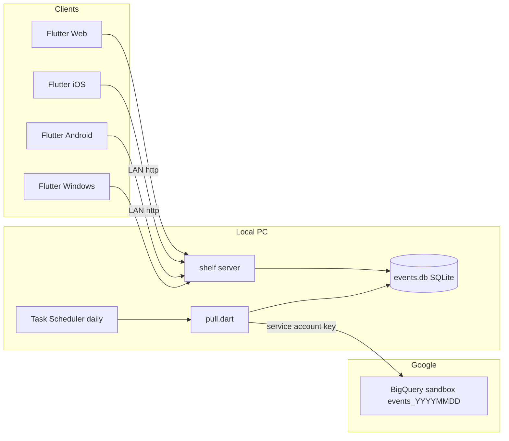
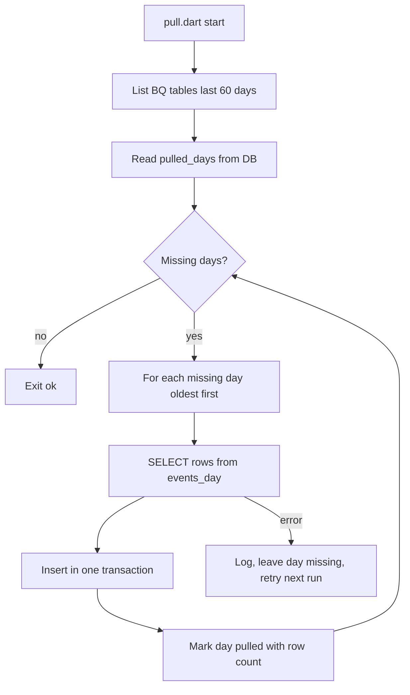

# Plan: Flutter + local server stack (v1)

**Status:** APPROVED by owner 2026-10-06 (server language: Dart). **Date:** 2026-10-06.
**Inputs:** owner decisions in `.cursor/memory/mem-project-intent-and-origin.md` (sandbox BigQuery, own copy of raw events, app independent of Firebase). Owner now asks: Flutter client, **local server first, simple save/load**.

## 1. Recommended stack

| Part | Pick | Why | Alternative |
|---|---|---|---|
| Client | **Flutter 3** (Windows, Android, iOS, Web) | One codebase, all targets | — |
| Client state | `riverpod` | Simple, testable, no codegen required | `provider` |
| Client HTTP | `http` (or `dio`) | Talks to local server | — |
| Charts | `fl_chart` | Free, MIT, line/bar/pie enough for v1 | Syncfusion (licence check) |
| Server language | **Dart** | Same language as client; shared models package | Python (stronger BigQuery tooling) |
| Server HTTP | `shelf` + `shelf_router` | Minimal, official Dart team | Dart Frog |
| BigQuery pull | `googleapis` (BigQuery v2 REST) + `googleapis_auth` service account | Official generated Dart client | Python `google-cloud-bigquery` |
| Storage | **SQLite** via `sqlite3` package, one file `data/events.db` | Single file = simple save/load; `json_extract` queries params; backup = copy file | NDJSON file per day (simpler, slower queries) |
| Schedule | Windows Task Scheduler runs `dart run bin/pull.dart` daily | No daemon logic; server can be off at pull time | Timer inside server |
| Repo layout | Dart pub workspace: `app/`, `server/`, `shared/` | Shared event/summary models | separate repos |
| Auth | none on LAN v1; static API key header later | Local first | Firebase Auth later |

## 2. Architecture

Key file (service account JSON) lives **only** on local PC. Clients never touch BigQuery.

## 3. Daily pull with gap fill

Oldest-first matters: the oldest day dies first at 60-day expiry. Each day is one transaction → rerun is idempotent.

## 4. SQLite schema (v1)

| Table | Columns |
|---|---|
| `events` | `id` PK, `day` TEXT, `ts_micros` INT, `event_name` TEXT, `user_pseudo_id` TEXT, `params_json` TEXT, `user_props_json` TEXT, `platform` TEXT, `app_version` TEXT |
| `pulled_days` | `day` PK, `row_count` INT, `pulled_at` TEXT |

Indexes: `(day, event_name)`, `(user_pseudo_id)`. Params stay JSON (`TO_JSON_STRING(event_params)`) — PVM keys vary per event, so no fixed columns. Query example: `json_extract(params_json, '$.stg')`.

## 5. API (v1)

| Endpoint | Returns |
|---|---|
| `GET /days` | pulled days + row counts (health / gap view) |
| `GET /events/count?from&to&name` | counts per day per event |
| `GET /events/param?name&key&from&to` | breakdown of one param value for one event |
| `GET /funnel?steps=a,b,c&from&to` | users reaching each step |

Server does aggregation (SQL); client only draws.

## 6. Known limits of local-first

- PC off at pull time → Task Scheduler "run when available" + gap fill catches up, but >60 days off = data lost.
- Phones reach server only on same LAN (or via Tailscale later).
- Flutter Web needs CORS headers on the shelf server.
- Moving to VPS later = copy `server/` + `events.db`; no redesign.

## 7. Resolved fork

Server language: **Dart** chosen (over Python).
