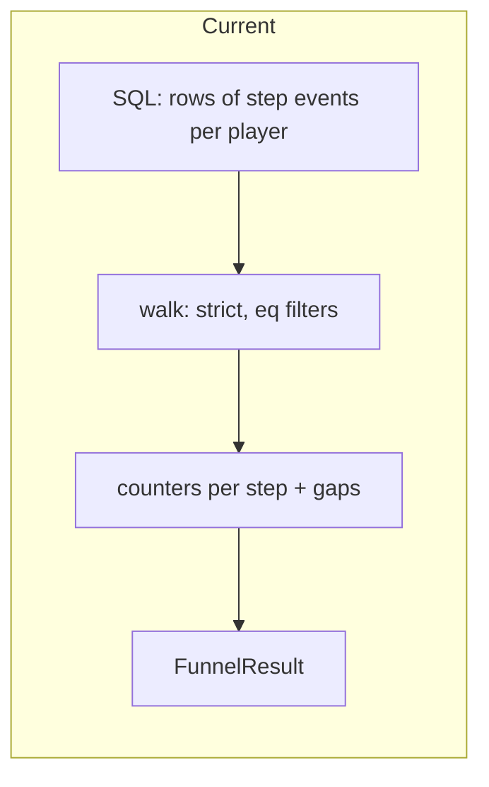
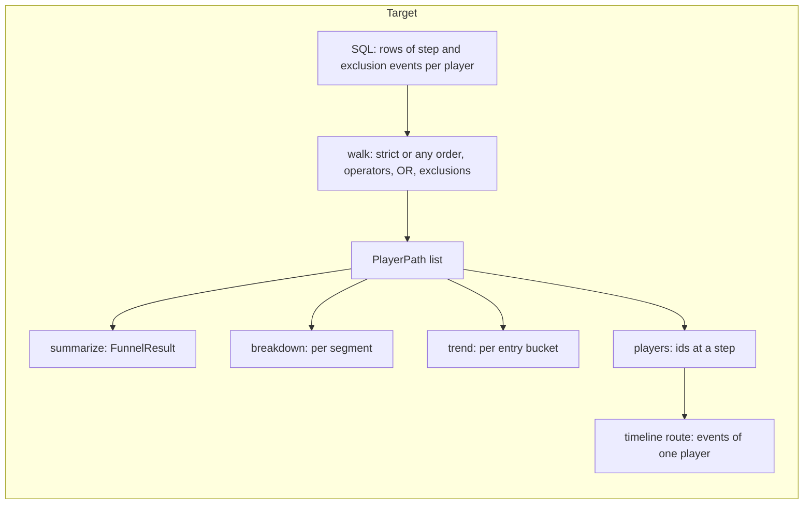
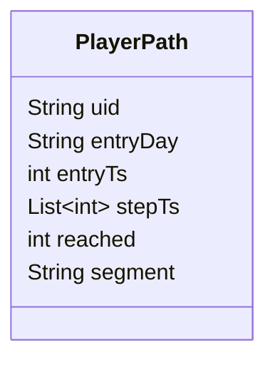

# Spec: Funnel upgrade — richer matching, segments, trend, drill-down (v5)

**Status:** draft for owner review (2026-10-07). Builds on v3 `funnels-and-styles-design.md` §3–§5 (amended 10-07) and v4 `mcp-server-design.md`.
**Delivery:** one umbrella spec, four waves. Each wave gets its own implementation plan (for Gemini), passes the gates (shared / server / app tests + analyze), and is reviewed by Claude before the next wave starts.

## 1. Intent

| | |
|---|---|
| **Problem** | Funnel answers only "how many players passed steps 1..n in strict order, matching `key = value` exactly". It cannot compare groups, show change over time, express "id in (Tut_1, Tut_2)", "lvl >= 5", "A or B", "did not abort in between", or show who dropped and what they did. |
| **Goal** | A designer answers "where do v0.3.x players drop in the tutorial, did it improve since last week, and what did the players who dropped do?" without leaving the app. |
| **Success** | Saved funnel 1 still returns 75 → 22 → 7 → 4 → 3 (30 days, test devices off) after every wave; each new capability is reachable by clicking in the app and through the MCP tools. |

### Owner decisions (2026-10-07)

| Decision | Choice |
|---|---|
| Scope | All four: richer matching, compare segments, trend over time, who dropped + timeline + export |
| Sequencing | Umbrella spec, implemented in waves 1 → 4 |
| Matching (wave 1) | Param operators, OR alternatives, exclusion steps, any-order mode — all four |
| Breakdown dimensions (wave 2) | Platform, app version, step-1 event param, user property |
| Drill-down (wave 4) | Player list per step + in-app event timeline + CSV export |
| Architecture | **A — paths core**: walk once into per-player paths, small aggregators on top; matching stays in Dart |

### Assumptions (owner may correct)

- Breakdown shows the **top 5 segments by entered players + "Other"**; a player without the value goes to **"(none)"**, which counts as a segment.
- Trend groups by the player's **entry day or ISO week (Monday)**, in UTC like the rest of the app.
- **CSV export = copy to clipboard** (works on every platform, adds no dependency; paste into Sheets or Excel). Saving a file can come later.
- Timeline = that player's events from **1 hour before entry to 24 hours after the last matched step**, capped at 300 rows.
- Caps: 10 steps, 3 OR alternatives per step, 3 exclusions per step, 5 param filters per matcher, 20 values in an `in` list.
- Data reality (real DB 2026-10-07): platform is only `ANDROID`; ~20 app versions; user properties hold only Firebase automatic keys (`first_open_time`, `ga_session_id`, `ga_session_number`). The user-property breakdown is built now but has little to show until PVM sets custom user properties.

## 2. Architecture — before / after





`PlayerPath` is in-memory only (server), never serialized:



`reached` = number of steps matched (1..n); `stepTs[k]` = time of the row matched for step k; `segment` = breakdown value taken from the step-1 row, null when no breakdown is requested.

## 3. Wave 1 — richer step matching (model + engine core)

### 3.1 Definition (shared models)

```text
FunnelDef      = { name, windowMinutes: int or null, order: "strict" | "any", steps: [Step] }
Step           = { match: [Matcher] (1..3, ORed), exclude: [Matcher] (0..3) }
Matcher        = { event, params: [ParamFilter] (0..5, ANDed) }
ParamFilter    = { key, op, value } | { key, op: "in", values: [string] (1..20) }
op             = eq | ne | gt | gte | lt | lte | in | contains
```

| Rule | Detail |
|---|---|
| Legacy read | Step JSON `{event, params}` (v3/v4) reads as `match: [{event, params}]`; `paramKey/paramValue` still reads as one filter; filter without `op` reads as `eq`; missing `order` reads as `strict`. Saved funnels keep working without a migration. |
| Write | Always the new shape. |
| `eq`, `ne`, `contains` | Compare the param's text form (same `_paramText` as today), case-sensitive. |
| `gt gte lt lte` | Both sides parsed as numbers; if either is not a number the filter does not match. Value must parse as a number at validation. |
| `in` | Text form equals any of `values`. |
| Missing param | A filter on a missing param never matches — **including `ne`**. |
| Key uniqueness | A key may appear twice in one matcher only with different ops (allows `lvl >= 5` AND `lvl <= 9`). |
| Exclusions | Not allowed on step 1. Not allowed when `order = any` (no "between" there) → validation error. |

### 3.2 Engine semantics

Rows loaded: global filters (date range, platform, version, test devices), non-empty uid, event name in any matcher or exclusion of any step, ordered `ts_micros, id`.

**Strict** (current behaviour, extended):
- Entry = first row matching step 1 (any alternative).
- For k = 2..n, scan forward from the previous matched row, stopping at the window end. At each row check **step k first**: a match → advance. Otherwise, if the row matches an **exclusion of step k** → the player stops at k-1 (counted as dropped at k). No re-entry or retry, as today.

**Any order:**
- Entry = first row matching step 1.
- Steps 2..n are taken in order k = 2..n: each takes the **first unused row** after entry, inside the window, that matches it. One row satisfies at most one step.
- `reached` = largest k such that steps 1..k all matched (prefix), so counts never rise from step to step. Players who did step 4 but not step 3 count up to step 2.
- `medianSeconds` for step k = median of (ts step k − ts entry). The table header says "Median time from step 1" in this mode.

Metrics (players, from previous, from first, dropped, total conversion, biggest drop) keep the v3 §3 definitions, computed from `PlayerPath.reached`.

### 3.3 API, UI, MCP for wave 1

| Layer | Change |
|---|---|
| API | `POST /funnels`, `PUT`, `/funnels/run` accept the new def; 400 with the first validation message. `FunnelResult.steps[]` carries `match` and `exclude` instead of `event` and `params` (the app reads both shapes during the transition). |
| Editor | Funnel row: **Strict order / Any order** toggle next to the window. Step card: alternative rows separated by an "or" label; "Or event" button (max 3). Filter row: key, **operator dropdown**, value (multi-select chips for `in`). Strict mode, step ≥ 2: "Exclude if between" section with the same matcher rows (max 3). |
| Page | Step label = alternatives joined by " or ", filters rendered with their operator; exclusions shown as "not: ad_shown". |
| MCP | `_defSchema` description updated to the new shape (legacy shape still accepted). |

### 3.4 Editor UX — point and click, no syntax (owner 2026-10-07)

Rule: **every part of a step is picked from a list or toggled with a button.** Nobody types an event name, a param key, an operator or a list syntax. Typing is limited to the funnel name, a number for numeric comparisons, and the text for "contains" (with suggestions).

```text
Funnel name [ Tutorial 1 to Level 2        ]   Window [1 day v]   Order (o) Strict  ( ) Any order

Step 1  ─────────────────────────────────────────────── [↑][↓][⧉][🗑]
  Players who did  [ tut                    v ]
     where  [ id        v ] [ is          v ] [ Tut_1  (412)        v ]   [x]
       and  [ step      v ] [ is          v ] [ start  (398)        v ]   [x]
     [+ And condition]
  — or —
  Players who did  [ tut_skip               v ]
     [+ And condition]
  [+ Or another event]

Step 2  ─────────────────────────────────────────────── [↑][↓][⧉][🗑]
  Players who did  [ level_start            v ]
     where  [ lvl       v ] [ is at least v ] [ 5        ] (seen 1 – 40)   [x]
     [+ And condition]
  [+ Or another event]
  Drop the player if, before this step, they did:          (Strict order only)
     [ tut               v ]  where [ step v ] [ is v ] [ abort (37) v ]   [x]
     [+ Add exclusion]

[+ Add step]                                  [Cancel]  [Run]  [Save]
Summary: tut (id is Tut_1, step is start) or tut_skip → level_start (lvl ≥ 5), not tut abort
```

| Control | Behaviour |
|---|---|
| Event | Searchable dropdown of event names in range (existing `/events/names`), with event count. |
| Parameter | Dropdown of keys seen on the chosen event (existing `/events/param-keys`). Disabled until an event is picked. |
| Operator | Dropdown of plain words, not symbols: **is, is not, is one of, contains**, and for numeric params also **greater than, at least, less than, at most**. Numeric = every observed value of that key parses as a number; then numeric words are listed and "is one of"/"contains" stay available. Default: **is**. |
| Value — is / is not | Dropdown of observed values with their counts, most frequent first, searchable when more than 15 values (existing `/events/param` breakdown). |
| Value — is one of | Checklist popup of the same values; selected shown as chips (max 20). |
| Value — greater than / at least / less than / at most | Number field with +/− buttons, prefilled with the median observed value, hint "seen min – max". Non-numbers cannot be entered. |
| Value — contains | Text field with the observed values as suggestions. |
| Changing event | Clears that matcher's conditions (keys may not exist on the new event), with a one-line notice. |
| Changing parameter | Resets operator to "is" and clears the value. |
| Errors | Shown inline under the row in plain words ("Pick a value"); Run and Save are disabled while any row is incomplete. No raw validation codes. |
| Summary line | One plain-language sentence for the whole funnel under the editor, updated live, using the same words as the operator dropdown. The funnel page and step table use the same wording (`≥` etc. only in the compact chart labels). |
| Breakdown key (wave 2) | Same pattern: dropdown of step-1 param keys or user-property keys; never typed. |

No new API route is needed: the operator list comes from the values the editor already fetches.

## 4. Wave 2 — compare segments

Run request gains `breakdown`:

```text
breakdown = { by: "platform" | "version" | "param" | "userProp", key?: string }   key required for param / userProp
```

- Segment value comes from the player's **step-1 matched row**: `platform`, `app_version`, `params_json[key]` text form, or `user_props_json[key]` text form; missing value → `"(none)"`.
- Response adds `segments: [{ value, steps: [{players, fromPrevious, fromFirst, dropped, medianSeconds}], totalConversion }]`, top 5 by entered players (ties → value ascending), then `"Other"` merging the rest (only when there are more than 5). The top-level result stays the all-players result.
- New route `GET /events/user-prop-keys?from&to` → sorted keys seen in `user_props_json`, for the dropdown.

| Layer | Change |
|---|---|
| Page | "Breakdown" dropdown: None / Platform / Version / Event param… (key picked from step-1 param keys) / User property…. With a breakdown: grouped columns per step (one colour per segment, max 6 from the style's chart palette) and a segment table: Segment, Entered, per-step from first, Total conversion. |
| MCP | `run_funnel` gains optional `breakdown`; new `user_prop_keys` tool. |

## 5. Wave 3 — trend over time

Run request gains `interval: "day" | "week"` (absent = no trend).

- Players are bucketed by entry day (week = ISO week starting Monday, labelled by its Monday).
- Response adds `trend: [{ start, players: [int per step], totalConversion, incomplete }]` covering every bucket in the range, including empty ones (players all 0, totalConversion null).
- `incomplete = true` when bucket end + window is after `to` (players who entered late had less time to convert; whole-range window → only the last bucket). The chart draws incomplete points dashed so the dip at the end is not misread.
- Trend and breakdown can be requested together; the trend is computed over all players (not per segment) — per-segment trend is out of scope.

| Layer | Change |
|---|---|
| Page | View switch **Steps / Trend**. Trend: line of total conversion per bucket (reusing `MetricLineChart` with its BUG-0005/0006 tooltip) plus a small entered-players bar row; Day / Week toggle; a step picker changes the line to "from first to step k". |
| MCP | `run_funnel` gains optional `interval`. |

## 6. Wave 4 — who dropped, timeline, CSV

New routes:

| Route | Body / params | Response |
|---|---|---|
| `POST /funnels/players` | run body + `step` (1-based k ≥ 2), `outcome: "converted" \| "dropped"`, optional `segment`, `limit` (default 100, max 500) | `{ total, players: [{ uid, entryTs, reached, lastTs }] }`, ordered by entryTs. `converted` = reached ≥ k; `dropped` = reached = k-1. |
| `GET /players/<uid>/events` | `fromTs`, `toTs` (micros), `test`, `limit` (default 300, max 1000) | `[{ ts, event, params }]` ascending — all events of that player, not only funnel events |

| Layer | Change |
|---|---|
| Page | Clicking a step's column or its "Dropped" cell opens a side panel: tabs Dropped / Converted, list of uid (shortened, full on hover and copy), entry time, last step reached. Clicking a player shows their timeline: time, event, params; rows that matched a funnel step are highlighted with the step number. |
| CSV | "Copy CSV" button on the step table, segment table, trend data and player list → clipboard text with a header row, comma-separated, quoted when needed (RFC 4180). |
| MCP | New tools `funnel_players` and `player_events`. |

Risk: these routes expose per-player event history over the LAN without auth → covered by **BUG-0010** (API token before team use); severity unchanged since the data is pseudonymous ids already in the DB.

## 7. Errors and limits

| Case | Behaviour |
|---|---|
| Invalid def (any rule in §3.1) | 400 `{error}` with the first message, e.g. `Step 3: "lvl >= abc" needs a number` |
| Breakdown key missing or not matching `^[A-Za-z0-9_]+$` | 400 |
| `step` out of range, bad outcome, bad `limit` | 400 |
| Unknown uid | 200 `[]` |
| Performance | Engine loads all matching rows into memory (~5k events/month today). Ceiling: about 1M rows in range; if that is reached, move the walk into a streaming cursor (noted as a `ponytail:` comment in the engine). |

## 8. Testing (per wave)

| Wave | Must-have tests |
|---|---|
| 1 (editor) | Widget tests: operator list shows numeric words only for numeric keys; value control switches per operator (dropdown / checklist / number field / text); changing event clears conditions; Run/Save disabled while a row is incomplete; summary sentence text. |
| 1 | Legacy JSON round-trip (v3 single filter, v4 params list, no `op`, no `order`); every op incl. missing param + `ne`, numeric parse failure; OR alternatives; exclusion before step k drops the player, a row matching both step and exclusion advances; any-order with steps out of order, one row cannot satisfy two steps, prefix counting; validation messages. **Regression:** existing engine tests unchanged and passing; real-DB funnel 1 still 75 → 22 → 7 → 4 → 3. |
| 2 | Segment from step-1 row (not a later row); top 5 + Other merge; "(none)"; segment counts sum to the all-players counts; route validation. |
| 3 | Day and week buckets (Monday start, range starting mid-week), empty buckets present, `incomplete` flag with 1-day window and whole-range window. |
| 4 | converted/dropped lists match step counts (`total` = players(k) or dropped(k)); segment filter; limit; timeline bounds and order; CSV quoting (comma, quote, newline). Widget tests for panel open + copy. |

Runtime check per wave: Windows release build, screenshots of the new UI in two styles, plus the funnel 1 regression number.

## 9. Wave → files (guide for plans)

| Wave | shared | server | app | MCP |
|---|---|---|---|---|
| 1 | `funnel_models.dart` (Matcher, ops, order, legacy read, validate) | `funnel_engine.dart` (paths core + new walk) | `funnel_editor.dart`, `funnel_draft.dart`, `funnel_step_table.dart`, `funnel_chart.dart` labels | `mcp_tools.dart` schema text |
| 2 | breakdown request + segment result models | engine aggregator, `api.dart` user-prop-keys | page breakdown dropdown, grouped chart, segment table | `run_funnel` arg, `user_prop_keys` |
| 3 | interval + trend models | engine aggregator | page view switch, trend chart | `run_funnel` arg |
| 4 | players + timeline models, CSV helper | `api.dart` 2 routes, engine players filter | side panel, timeline, Copy CSV buttons | 2 tools |

## 10. Out of scope

Per-segment trend, saving CSV to a file, retrying entry after a failed attempt, holding a property constant across steps, cohorts saved as segments, user-level (cross-device) identity, mobile layouts.
