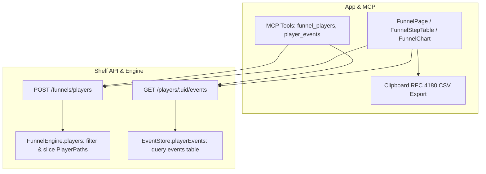

# Funnel Upgrade Wave 4 — Who Dropped, Timeline, CSV — Implementation Plan

> **For agentic workers:** Implement task-by-task with superpowers:executing-plans (inline, no subagent-driven-development — project rule). Steps use checkbox (`- [x]`) syntax for tracking. Executor: Gemini. Do every step in order. Do not skip the "run test, expect FAIL" steps. Do not invent APIs not shown here; if a package or Flutter API differs from this plan, STOP and report the exact error instead of improvising. **Never change an expected value in a test to make it pass** — if a test fails after implementing exactly what is shown, STOP and report. When a step says "replace this exact text" and the text is not found, STOP and report. Do not edit anything under `.cursor/memory/` (Claude updates memory at review).

**Goal:** Provide drop-off drill-down and player journey exploration for funnels: `POST /funnels/players` (player list for converted vs dropped at step $k$), `GET /players/<uid>/events` (player event timeline with funnel step matches highlighted), clipboard CSV export for tables and lists, and MCP tools `funnel_players` and `player_events`.

**Architecture:** Shared models gain `FunnelPlayerItem`, `FunnelPlayersResult`, `PlayerTimelineEvent`, and an RFC 4180 CSV serializer `toCsv`. The server `EventStore` provides `playerEvents` and `FunnelEngine` filters `PlayerPath` records by step outcome (`converted` vs `dropped`), segment, and limit. The API server exposes `POST /funnels/players` and `GET /players/<uid>/events`, while `AnalyticTools` registers `funnel_players` and `player_events` (bringing total tools to 17). The Flutter app integrates Copy CSV buttons across funnel views, and adds an interactive drill-down side panel with Dropped/Converted tabs and in-depth player timeline inspection.



**Tech Stack:** Dart 3.13.5 / Flutter 3.47.6 (`D:\flutter\bin`), Riverpod 2.6.1 (pinned), shelf, sqlite3, `test`, `flutter_test`, `flutter/services.dart` (Clipboard). **No new packages.**

**Spec:** [.cursor/plans/funnel-upgrade-design.md](funnel-upgrade-design.md) — §6 (Wave 4), §7, §8, §9. Read §6 before starting.

## Global Constraints

- Every shell: PowerShell, prefix `$env:Path = "D:\flutter\bin;$env:Path"` once per terminal.
- Gates: `cd shared; dart analyze; dart test` · `cd server; dart analyze; dart test` · `cd app; flutter analyze; flutter test`. Analyzer must say `No issues found!` after every task.
- Baseline gate counts before Wave 4: shared 52, server 173, app 84.
- `converted` = reached $\ge k$; `dropped` = reached $= k - 1$ for step $k \ge 2$.
- Step $k$ is 1-based, must be in range $2 \le k \le \text{steps.length}$. Out of range -> 400.
- `POST /funnels/players` default limit 100, max 500. `GET /players/<uid>/events` default limit 300, max 1000.
- Timeline window: 1 hour before entry (`entryTs - 3600000000`) to 24 hours after last step (`lastTs + 86400000000`).
- Unknown UID -> 200 `[]` (empty list).
- CSV export copies RFC 4180 formatted text to clipboard (escapes quotes, handles commas/newlines).
- No literal `Colors.*` in widgets; use `Theme.of(context)` / `AnalyticsTokens.of(context)`.
- One commit per task, message given in the task. Do not push (owner pushes).

## Review Focus

1. **Step outcome definition** — For step $k \ge 2$, `converted` includes all players reaching $\ge k$; `dropped` strictly includes players whose highest step reached is exactly $k - 1$. Pinned by engine test "players filter separates converted and dropped correctly".
2. **Result ordering and total count** — `POST /funnels/players` returns total count of matching players, but slices the `players` array by `limit`. Players are ordered by `entryTs` ascending. Pinned by engine test "players list ordered by entryTs and limits correctly while returning total".
3. **Segment filtering in players list** — When an optional `segment` is passed, players are filtered by `path.segment == segment`. Pinned by engine test "players list filters by segment value".
4. **Timeline boundary and unknown UID handling** — `GET /players/<uid>/events` queries events in range `[fromTs, toTs]` ascending. An unknown UID returns an empty array with HTTP 200. Pinned by server API test "unknown player uid returns empty list".
5. **RFC 4180 CSV escaping** — Cells containing commas, double quotes, or newlines must be enclosed in quotes with internal quotes doubled (`""`). Pinned by shared test "csv escapes quotes commas and newlines".

## File map

| File | Action | Task |
|---|---|---|
| `shared/lib/src/csv.dart` | Create | 1 |
| `shared/lib/src/funnel_drilldown_models.dart` | Create | 1 |
| `shared/lib/analytic_shared.dart` | Exact edits | 1 |
| `shared/test/csv_test.dart` | Create | 1 |
| `shared/test/funnel_drilldown_models_test.dart` | Create | 1 |
| `server/lib/src/event_store.dart` | Exact edits | 2 |
| `server/lib/src/funnel_engine.dart` | Exact edits | 2 |
| `server/test/event_store_player_events_test.dart` | Create | 2 |
| `server/test/funnel_engine_players_test.dart` | Create | 2 |
| `server/lib/src/api.dart` | Exact edits | 3 |
| `server/lib/src/mcp_tools.dart` | Exact edits | 3 |
| `server/test/api_funnels_players_test.dart` | Create | 3 |
| `server/test/api_player_events_test.dart` | Create | 3 |
| `server/test/mcp_tools_test.dart` | Exact edits | 3 |
| `app/lib/src/api_client.dart` | Exact edits | 4 |
| `app/lib/src/providers.dart` | Exact edits | 4 |
| `app/test/api_client_drilldown_test.dart` | Create | 4 |
| `app/lib/src/widgets/funnel_step_table.dart` | Exact edits | 5 |
| `app/lib/src/widgets/funnel_segment_table.dart` | Exact edits | 5 |
| `app/lib/src/widgets/funnel_trend_view.dart` | Exact edits | 5 |
| `app/test/funnel_csv_test.dart` | Create | 5 |
| `app/lib/src/widgets/funnel_drilldown_panel.dart` | Create | 6 |
| `app/lib/src/pages/funnel_page.dart` | Exact edits | 6 |
| `app/lib/src/widgets/funnel_chart.dart` | Exact edits | 6 |
| `app/test/funnel_drilldown_widgets_test.dart` | Create | 6 |

Existing test files not listed above must not change.

---

### Task 0: Baseline Verification

- [x] **Step 1: Run baseline checks**

```powershell
$env:Path = "D:\flutter\bin;$env:Path"
cd D:\Projects\AnalyticTracker
git status
cd shared; dart analyze; dart test; cd ..\server; dart analyze; dart test; cd ..\app; flutter analyze; flutter test; cd ..
```

Expected: `No issues found!` and all existing tests pass (shared 52, server 173, app 84).

---

### Task 1: Shared Models & CSV Formatter

**Files:**
- Create: `shared/lib/src/csv.dart`
- Create: `shared/lib/src/funnel_drilldown_models.dart`
- Modify: `shared/lib/analytic_shared.dart`
- Test: `shared/test/csv_test.dart`
- Test: `shared/test/funnel_drilldown_models_test.dart`

**Interfaces:**
- Produces: `toCsv(List<String> headers, List<List<dynamic>> rows)`
- Produces: `FunnelPlayerOutcome`, `FunnelPlayerItem`, `FunnelPlayersResult`, `PlayerTimelineEvent`

- [x] **Step 1: Write the failing tests**

Create `shared/test/csv_test.dart`:
```dart
import 'package:analytic_shared/analytic_shared.dart';
import 'package:test/test.dart';

void main() {
  group('toCsv', () {
    test('formats simple grid without quotes', () {
      final res = toCsv(['A', 'B'], [
        ['1', '2'],
        ['3', '4'],
      ]);
      expect(res, equals('A,B\r\n1,2\r\n3,4'));
    });

    test('escapes quotes commas and newlines', () {
      final res = toCsv(['Header', 'Notes'], [
        ['hello, world', 'line1\nline2'],
        ['he said "yes"', 'simple'],
      ]);
      expect(
        res,
        equals('Header,Notes\r\n"hello, world","line1\nline2"\r\n"he said ""yes""",simple'),
      );
    });

    test('handles nulls and numbers', () {
      final res = toCsv(['Name', 'Score', 'Extra'], [
        ['Alice', 42, null],
      ]);
      expect(res, equals('Name,Score,Extra\r\nAlice,42,'));
    });
  });
}
```

Create `shared/test/funnel_drilldown_models_test.dart`:
```dart
import 'package:analytic_shared/analytic_shared.dart';
import 'package:test/test.dart';

void main() {
  group('FunnelPlayerOutcome', () {
    test('parse and wire values', () {
      expect(FunnelPlayerOutcome.parse('converted'), equals(FunnelPlayerOutcome.converted));
      expect(FunnelPlayerOutcome.parse('dropped'), equals(FunnelPlayerOutcome.dropped));
      expect(FunnelPlayerOutcome.converted.wire, equals('converted'));
      expect(FunnelPlayerOutcome.dropped.wire, equals('dropped'));
      expect(() => FunnelPlayerOutcome.parse('invalid'), throwsFormatException);
    });
  });

  group('FunnelPlayerItem and FunnelPlayersResult', () {
    test('JSON serialization round-trip', () {
      const item = FunnelPlayerItem(
        uid: 'user1',
        entryTs: 1000000,
        reached: 2,
        lastTs: 2000000,
        stepTs: [1000000, 2000000],
      );
      final json = item.toJson();
      expect(json['uid'], equals('user1'));
      expect(json['entryTs'], equals(1000000));
      expect(json['reached'], equals(2));
      expect(json['lastTs'], equals(2000000));
      expect(json['stepTs'], equals([1000000, 2000000]));

      final back = FunnelPlayerItem.fromJson(json);
      expect(back, equals(item));

      const result = FunnelPlayersResult(total: 10, players: [item]);
      final rJson = result.toJson();
      expect(rJson['total'], equals(10));
      expect(rJson['players'], hasLength(1));

      final rBack = FunnelPlayersResult.fromJson(rJson);
      expect(rBack.total, equals(10));
      expect(rBack.players.first, equals(item));
    });
  });

  group('PlayerTimelineEvent', () {
    test('JSON serialization round-trip', () {
      final ev = PlayerTimelineEvent(
        ts: 1600000000,
        event: 'level_start',
        params: {'lvl': 5, 'mode': 'hard'},
      );
      final json = ev.toJson();
      expect(json['ts'], equals(1600000000));
      expect(json['event'], equals('level_start'));
      expect(json['params'], equals({'lvl': 5, 'mode': 'hard'}));

      final back = PlayerTimelineEvent.fromJson(json);
      expect(back.ts, equals(1600000000));
      expect(back.event, equals('level_start'));
      expect(back.params['lvl'], equals(5));
    });
  });
}
```

- [x] **Step 2: Run tests to verify they fail**

```powershell
$env:Path = "D:\flutter\bin;$env:Path"
cd D:\Projects\AnalyticTracker\shared
dart test test/csv_test.dart test/funnel_drilldown_models_test.dart
```
Expected: FAIL (compilation errors, files/classes not yet defined).

- [x] **Step 3: Implement minimal code**

Create `shared/lib/src/csv.dart`:
```dart
/// Formats a table of rows into RFC 4180 CSV text.
String toCsv(List<String> headers, List<List<dynamic>> rows) {
  final buf = StringBuffer();
  buf.write(headers.map(_escapeCsvCell).join(','));
  for (final row in rows) {
    buf.write('\r\n');
    buf.write(row.map(_escapeCsvCell).join(','));
  }
  return buf.toString();
}

String _escapeCsvCell(dynamic value) {
  if (value == null) return '';
  final s = value.toString();
  if (s.contains(',') || s.contains('"') || s.contains('\n') || s.contains('\r')) {
    return '"${s.replaceAll('"', '""')}"';
  }
  return s;
}
```

Create `shared/lib/src/funnel_drilldown_models.dart`:
```dart
enum FunnelPlayerOutcome {
  converted('converted'),
  dropped('dropped');

  const FunnelPlayerOutcome(this.wire);
  final String wire;

  static FunnelPlayerOutcome parse(String wire) {
    for (final v in values) {
      if (v.wire == wire) return v;
    }
    throw FormatException('Unknown outcome "$wire"');
  }
}

class FunnelPlayerItem {
  const FunnelPlayerItem({
    required this.uid,
    required this.entryTs,
    required this.reached,
    required this.lastTs,
    this.stepTs = const [],
  });

  final String uid;
  final int entryTs;
  final int reached;
  final int lastTs;
  final List<int> stepTs;

  factory FunnelPlayerItem.fromJson(Map<String, dynamic> j) => FunnelPlayerItem(
        uid: j['uid'] as String,
        entryTs: (j['entryTs'] as num).toInt(),
        reached: (j['reached'] as num).toInt(),
        lastTs: (j['lastTs'] as num).toInt(),
        stepTs: [for (final t in (j['stepTs'] as List?) ?? const []) (t as num).toInt()],
      );

  Map<String, dynamic> toJson() => {
        'uid': uid,
        'entryTs': entryTs,
        'reached': reached,
        'lastTs': lastTs,
        if (stepTs.isNotEmpty) 'stepTs': stepTs,
      };

  @override
  bool operator ==(Object other) =>
      other is FunnelPlayerItem &&
      other.uid == uid &&
      other.entryTs == entryTs &&
      other.reached == reached &&
      other.lastTs == lastTs;

  @override
  int get hashCode => Object.hash(uid, entryTs, reached, lastTs);
}

class FunnelPlayersResult {
  const FunnelPlayersResult({required this.total, required this.players});

  final int total;
  final List<FunnelPlayerItem> players;

  factory FunnelPlayersResult.fromJson(Map<String, dynamic> j) => FunnelPlayersResult(
        total: (j['total'] as num).toInt(),
        players: [
          for (final p in (j['players'] as List?) ?? const [])
            FunnelPlayerItem.fromJson(p as Map<String, dynamic>)
        ],
      );

  Map<String, dynamic> toJson() => {
        'total': total,
        'players': [for (final p in players) p.toJson()],
      };
}

class PlayerTimelineEvent {
  const PlayerTimelineEvent({
    required this.ts,
    required this.event,
    required this.params,
  });

  final int ts;
  final String event;
  final Map<String, dynamic> params;

  factory PlayerTimelineEvent.fromJson(Map<String, dynamic> j) => PlayerTimelineEvent(
        ts: (j['ts'] as num).toInt(),
        event: j['event'] as String,
        params: (j['params'] as Map<String, dynamic>?) ?? const {},
      );

  Map<String, dynamic> toJson() => {
        'ts': ts,
        'event': event,
        'params': params,
      };
}
```

Update `shared/lib/analytic_shared.dart`:
```dart
export 'src/csv.dart';
export 'src/dashboard_models.dart';
export 'src/days.dart';
export 'src/filters.dart';
export 'src/funnel_drilldown_models.dart';
export 'src/funnel_models.dart';
export 'src/models.dart';
```

- [x] **Step 4: Run tests and verify they pass**

```powershell
$env:Path = "D:\flutter\bin;$env:Path"
cd D:\Projects\AnalyticTracker\shared
dart analyze
dart test
```
Expected: `No issues found!`, all tests pass.

- [x] **Step 5: Commit**

```bash
git add shared/lib/src/csv.dart shared/lib/src/funnel_drilldown_models.dart shared/lib/analytic_shared.dart shared/test/csv_test.dart shared/test/funnel_drilldown_models_test.dart
git commit -m "feat(shared): add CSV formatter and funnel drill-down models"
```

---

### Task 2: Server Engine & EventStore Drill-Down

**Files:**
- Modify: `server/lib/src/event_store.dart`
- Modify: `server/lib/src/funnel_engine.dart`
- Test: `server/test/event_store_player_events_test.dart`
- Test: `server/test/funnel_engine_players_test.dart`

**Interfaces:**
- Consumes: `FunnelPlayerItem`, `FunnelPlayersResult`, `PlayerTimelineEvent` from `analytic_shared`
- Produces: `EventStore.playerEvents(String uid, int fromTs, int toTs, {bool includeTest, int limit})`
- Produces: `FunnelEngine.players(FunnelDef def, Filters f, {required int step, required FunnelPlayerOutcome outcome, String? segment, int limit})`

- [x] **Step 1: Write the failing tests**

Create `server/test/event_store_player_events_test.dart`:
```dart
import 'dart:convert';
import 'package:analytic_shared/analytic_shared.dart';
import 'package:analytic_server/src/event_store.dart';
import 'package:analytic_server/src/raw_event.dart';
import 'package:test/test.dart';

void main() {
  late EventStore store;

  setUp(() {
    store = EventStore.inMemory();
  });

  tearDown(() => store.close());

  test('returns player events ascending in ts range and excludes test devices when test is false', () {
    store.replaceDay('2026-10-01', [
      RawEvent(
        day: '2026-10-01',
        tsMicros: 1000,
        eventName: 'start',
        userPseudoId: 'p1',
        paramsJson: jsonEncode({'lvl': 1}),
        userPropsJson: '{}',
        platform: 'ANDROID',
        appVersion: '1.0.0',
      ),
      RawEvent(
        day: '2026-10-01',
        tsMicros: 2000,
        eventName: 'step',
        userPseudoId: 'p1',
        paramsJson: jsonEncode({'debug_event': 1}),
        userPropsJson: '{}',
        platform: 'ANDROID',
        appVersion: '1.0.0',
      ),
      RawEvent(
        day: '2026-10-01',
        tsMicros: 3000,
        eventName: 'finish',
        userPseudoId: 'p1',
        paramsJson: jsonEncode({'lvl': 2}),
        userPropsJson: '{}',
        platform: 'ANDROID',
        appVersion: '1.0.0',
      ),
      RawEvent(
        day: '2026-10-01',
        tsMicros: 4000,
        eventName: 'other',
        userPseudoId: 'p2',
        paramsJson: '{}',
        userPropsJson: '{}',
        platform: 'ANDROID',
        appVersion: '1.0.0',
      ),
    ]);

    final eventsNoTest = store.playerEvents('p1', 500, 3500, includeTest: false);
    expect(eventsNoTest, hasLength(2));
    expect(eventsNoTest[0].event, equals('start'));
    expect(eventsNoTest[1].event, equals('finish'));

    final eventsWithTest = store.playerEvents('p1', 500, 3500, includeTest: true);
    expect(eventsWithTest, hasLength(3));
    expect(eventsWithTest[1].event, equals('step'));

    final empty = store.playerEvents('non_existent', 0, 10000);
    expect(empty, isEmpty);
  });
}
```

Create `server/test/funnel_engine_players_test.dart`:
```dart
import 'dart:convert';
import 'package:analytic_shared/analytic_shared.dart';
import 'package:analytic_server/src/event_store.dart';
import 'package:analytic_server/src/raw_event.dart';
import 'package:test/test.dart';

void main() {
  late EventStore store;

  setUp(() {
    store = EventStore.inMemory();
  });

  tearDown(() => store.close());

  final def = FunnelDef(
    name: 'Test',
    windowMinutes: 1440,
    steps: const [
      FunnelStepDef(event: 'step1'),
      FunnelStepDef(event: 'step2'),
      FunnelStepDef(event: 'step3'),
    ],
  );

  test('players filter separates converted and dropped correctly', () {
    // p1 reaches step 3
    // p2 reaches step 2 and stops
    // p3 reaches step 1 and stops
    store.replaceDay('2026-10-01', [
      RawEvent(day: '2026-10-01', tsMicros: 100, eventName: 'step1', userPseudoId: 'p1', paramsJson: '{}', userPropsJson: '{}', platform: 'ANDROID', appVersion: '1.0'),
      RawEvent(day: '2026-10-01', tsMicros: 200, eventName: 'step2', userPseudoId: 'p1', paramsJson: '{}', userPropsJson: '{}', platform: 'ANDROID', appVersion: '1.0'),
      RawEvent(day: '2026-10-01', tsMicros: 300, eventName: 'step3', userPseudoId: 'p1', paramsJson: '{}', userPropsJson: '{}', platform: 'ANDROID', appVersion: '1.0'),

      RawEvent(day: '2026-10-01', tsMicros: 150, eventName: 'step1', userPseudoId: 'p2', paramsJson: '{}', userPropsJson: '{}', platform: 'ANDROID', appVersion: '1.0'),
      RawEvent(day: '2026-10-01', tsMicros: 250, eventName: 'step2', userPseudoId: 'p2', paramsJson: '{}', userPropsJson: '{}', platform: 'ANDROID', appVersion: '1.0'),

      RawEvent(day: '2026-10-01', tsMicros: 180, eventName: 'step1', userPseudoId: 'p3', paramsJson: '{}', userPropsJson: '{}', platform: 'ANDROID', appVersion: '1.0'),
    ]);

    const f = Filters(from: '2026-10-01', to: '2026-10-01');

    // Step 2 converted: reached >= 2 -> p1, p2
    final conv2 = store.funnelEngine.players(def, f, step: 2, outcome: FunnelPlayerOutcome.converted);
    expect(conv2.total, equals(2));
    expect(conv2.players.map((p) => p.uid).toList(), equals(['p1', 'p2']));

    // Step 2 dropped: reached == 1 -> p3
    final drop2 = store.funnelEngine.players(def, f, step: 2, outcome: FunnelPlayerOutcome.dropped);
    expect(drop2.total, equals(1));
    expect(drop2.players.map((p) => p.uid).toList(), equals(['p3']));

    // Step 3 converted: reached >= 3 -> p1
    final conv3 = store.funnelEngine.players(def, f, step: 3, outcome: FunnelPlayerOutcome.converted);
    expect(conv3.total, equals(1));
    expect(conv3.players.first.uid, equals('p1'));

    // Step 3 dropped: reached == 2 -> p2
    final drop3 = store.funnelEngine.players(def, f, step: 3, outcome: FunnelPlayerOutcome.dropped);
    expect(drop3.total, equals(1));
    expect(drop3.players.first.uid, equals('p2'));
  });

  test('players list ordered by entryTs and limits correctly while returning total', () {
    store.replaceDay('2026-10-01', [
      RawEvent(day: '2026-10-01', tsMicros: 300, eventName: 'step1', userPseudoId: 'p3', paramsJson: '{}', userPropsJson: '{}', platform: 'ANDROID', appVersion: '1.0'),
      RawEvent(day: '2026-10-01', tsMicros: 100, eventName: 'step1', userPseudoId: 'p1', paramsJson: '{}', userPropsJson: '{}', platform: 'ANDROID', appVersion: '1.0'),
      RawEvent(day: '2026-10-01', tsMicros: 200, eventName: 'step1', userPseudoId: 'p2', paramsJson: '{}', userPropsJson: '{}', platform: 'ANDROID', appVersion: '1.0'),
    ]);
    const f = Filters(from: '2026-10-01', to: '2026-10-01');

    final res = store.funnelEngine.players(def, f, step: 2, outcome: FunnelPlayerOutcome.dropped, limit: 2);
    expect(res.total, equals(3));
    expect(res.players, hasLength(2));
    expect(res.players[0].uid, equals('p1'));
    expect(res.players[1].uid, equals('p2'));
  });

  test('players list filters by segment value', () {
    store.replaceDay('2026-10-01', [
      RawEvent(day: '2026-10-01', tsMicros: 100, eventName: 'step1', userPseudoId: 'p1', paramsJson: '{}', userPropsJson: '{}', platform: 'ANDROID', appVersion: '1.0'),
      RawEvent(day: '2026-10-01', tsMicros: 200, eventName: 'step1', userPseudoId: 'p2', paramsJson: '{}', userPropsJson: '{}', platform: 'IOS', appVersion: '1.0'),
    ]);
    const f = Filters(from: '2026-10-01', to: '2026-10-01');
    const breakdown = FunnelBreakdown(by: FunnelBreakdownBy.platform);

    final res = store.funnelEngine.players(
      def,
      f,
      step: 2,
      outcome: FunnelPlayerOutcome.dropped,
      breakdown: breakdown,
      segment: 'IOS',
    );
    expect(res.total, equals(1));
    expect(res.players.first.uid, equals('p2'));
  });
}
```

- [x] **Step 2: Run tests to verify they fail**

```powershell
$env:Path = "D:\flutter\bin;$env:Path"
cd D:\Projects\AnalyticTracker\server
dart test test/event_store_player_events_test.dart test/funnel_engine_players_test.dart
```
Expected: FAIL (methods not defined).

- [x] **Step 3: Implement minimal code**

In `server/lib/src/event_store.dart`:
Add `playerEvents` method right before `close()`:
```dart
  /// Returns chronological events for [uid] within [fromTs, toTs] microseconds.
  List<PlayerTimelineEvent> playerEvents(
    String uid,
    int fromTs,
    int toTs, {
    bool includeTest = false,
    int limit = 300,
  }) {
    final rows = _db.select(
      'SELECT ts_micros, event_name, params_json FROM events '
      'WHERE user_pseudo_id = ? AND ts_micros BETWEEN ? AND ?${testEventsClause(includeTest)} '
      'ORDER BY ts_micros ASC, id ASC LIMIT ?;',
      [uid, fromTs, toTs, limit],
    );
    return [
      for (final r in rows)
        PlayerTimelineEvent(
          ts: r['ts_micros'] as int,
          event: r['event_name'] as String,
          params: (jsonDecode(r['params_json'] as String) as Map<String, dynamic>?) ?? const {},
        ),
    ];
  }
```

In `server/lib/src/funnel_engine.dart`:
Add `players` method:
```dart
  /// Filter players who converted (reached >= step) or dropped (reached == step - 1)
  /// at step [step] (1-based, k >= 2), ordered by entryTs ascending.
  FunnelPlayersResult players(
    FunnelDef def,
    Filters f, {
    required int step,
    required FunnelPlayerOutcome outcome,
    FunnelBreakdown? breakdown,
    String? segment,
    int limit = 100,
  }) {
    if (step < 2 || step > def.steps.length) {
      throw ArgumentError('Step out of range: $step (funnel has ${def.steps.length} steps)');
    }
    if (limit < 1 || limit > 500) {
      throw ArgumentError('Limit must be between 1 and 500 (got $limit)');
    }

    var allPaths = paths(def, f, breakdown: breakdown);
    if (segment != null) {
      allPaths = allPaths.where((p) => p.segment == segment).toList();
    }

    final matched = <PlayerPath>[];
    for (final p in allPaths) {
      final isMatch = outcome == FunnelPlayerOutcome.converted
          ? p.reached >= step
          : p.reached == step - 1;
      if (isMatch) {
        matched.add(p);
      }
    }

    matched.sort((a, b) {
      final cmp = a.stepTs.first.compareTo(b.stepTs.first);
      return cmp != 0 ? cmp : a.uid.compareTo(b.uid);
    });

    final total = matched.length;
    final sliced = matched.take(limit).map((p) => FunnelPlayerItem(
          uid: p.uid,
          entryTs: p.stepTs.first,
          reached: p.reached,
          lastTs: p.stepTs.last,
          stepTs: p.stepTs,
        )).toList();

    return FunnelPlayersResult(total: total, players: sliced);
  }
```

- [x] **Step 4: Run tests and verify they pass**

```powershell
$env:Path = "D:\flutter\bin;$env:Path"
cd D:\Projects\AnalyticTracker\server
dart analyze
dart test
```
Expected: `No issues found!`, all server tests pass.

- [x] **Step 5: Commit**

```bash
git add server/lib/src/event_store.dart server/lib/src/funnel_engine.dart server/test/event_store_player_events_test.dart server/test/funnel_engine_players_test.dart
git commit -m "feat(server): add player events query and funnel players filtering"
```

---

### Task 3: Server API Routes & MCP Tools

**Files:**
- Modify: `server/lib/src/api.dart`
- Modify: `server/lib/src/mcp_tools.dart`
- Test: `server/test/api_funnels_players_test.dart`
- Test: `server/test/api_player_events_test.dart`
- Modify: `server/test/mcp_tools_test.dart`

**Interfaces:**
- Produces API routes: `POST /funnels/players`, `GET /players/<uid>/events`
- Produces MCP tools: `funnel_players`, `player_events` (total 17 tools)

- [x] **Step 1: Write the failing tests**

Create `server/test/api_funnels_players_test.dart`:
```dart
import 'dart:convert';
import 'package:analytic_shared/analytic_shared.dart';
import 'package:analytic_server/src/api.dart';
import 'package:analytic_server/src/event_store.dart';
import 'package:analytic_server/src/raw_event.dart';
import 'package:http/http.dart' as http;
import 'package:shelf/shelf_io.dart' as io;
import 'package:test/test.dart';

void main() {
  late EventStore store;
  late http.Client client;
  late Uri baseUri;
  dynamic server;

  setUp(() async {
    store = EventStore.inMemory();
    server = await io.serve(buildHandler(store), '127.0.0.1', 0);
    baseUri = Uri.parse('http://127.0.0.1:${server.port}');
    client = http.Client();
  });

  tearDown(() async {
    client.close();
    await server.close();
    store.close();
  });

  final def = FunnelDef(
    name: 'Tutorial',
    steps: const [
      FunnelStepDef(event: 'start'),
      FunnelStepDef(event: 'finish'),
    ],
  );

  test('POST /funnels/players returns players list and total', () async {
    store.replaceDay('2026-10-01', [
      RawEvent(day: '2026-10-01', tsMicros: 100, eventName: 'start', userPseudoId: 'p1', paramsJson: '{}', userPropsJson: '{}', platform: 'ANDROID', appVersion: '1.0'),
      RawEvent(day: '2026-10-01', tsMicros: 200, eventName: 'finish', userPseudoId: 'p1', paramsJson: '{}', userPropsJson: '{}', platform: 'ANDROID', appVersion: '1.0'),
      RawEvent(day: '2026-10-01', tsMicros: 150, eventName: 'start', userPseudoId: 'p2', paramsJson: '{}', userPropsJson: '{}', platform: 'ANDROID', appVersion: '1.0'),
    ]);

    final res = await client.post(
      baseUri.replace(path: '/funnels/players'),
      headers: {'content-type': 'application/json'},
      body: jsonEncode({
        'def': def.toJson(),
        'from': '2026-10-01',
        'to': '2026-10-01',
        'step': 2,
        'outcome': 'converted',
      }),
    );
    expect(res.statusCode, equals(200));
    final j = jsonDecode(res.body) as Map<String, dynamic>;
    expect(j['total'], equals(1));
    expect((j['players'] as List).first['uid'], equals('p1'));
  });

  test('POST /funnels/players validates step, outcome, and limit', () async {
    final badStep = await client.post(
      baseUri.replace(path: '/funnels/players'),
      headers: {'content-type': 'application/json'},
      body: jsonEncode({
        'def': def.toJson(),
        'from': '2026-10-01',
        'to': '2026-10-01',
        'step': 1, // must be >= 2
        'outcome': 'converted',
      }),
    );
    expect(badStep.statusCode, equals(400));

    final badOutcome = await client.post(
      baseUri.replace(path: '/funnels/players'),
      headers: {'content-type': 'application/json'},
      body: jsonEncode({
        'def': def.toJson(),
        'from': '2026-10-01',
        'to': '2026-10-01',
        'step': 2,
        'outcome': 'unknown',
      }),
    );
    expect(badOutcome.statusCode, equals(400));

    final badLimit = await client.post(
      baseUri.replace(path: '/funnels/players'),
      headers: {'content-type': 'application/json'},
      body: jsonEncode({
        'def': def.toJson(),
        'from': '2026-10-01',
        'to': '2026-10-01',
        'step': 2,
        'outcome': 'converted',
        'limit': 999, // max 500
      }),
    );
    expect(badLimit.statusCode, equals(400));
  });
}
```

Create `server/test/api_player_events_test.dart`:
```dart
import 'dart:convert';
import 'package:analytic_server/src/api.dart';
import 'package:analytic_server/src/event_store.dart';
import 'package:analytic_server/src/raw_event.dart';
import 'package:http/http.dart' as http;
import 'package:shelf/shelf_io.dart' as io;
import 'package:test/test.dart';

void main() {
  late EventStore store;
  late http.Client client;
  late Uri baseUri;
  dynamic server;

  setUp(() async {
    store = EventStore.inMemory();
    server = await io.serve(buildHandler(store), '127.0.0.1', 0);
    baseUri = Uri.parse('http://127.0.0.1:${server.port}');
    client = http.Client();
  });

  tearDown(() async {
    client.close();
    await server.close();
    store.close();
  });

  test('GET /players/:uid/events returns events ascending', () async {
    store.replaceDay('2026-10-01', [
      RawEvent(day: '2026-10-01', tsMicros: 1000, eventName: 'e1', userPseudoId: 'p1', paramsJson: jsonEncode({'x': 1}), userPropsJson: '{}', platform: 'ANDROID', appVersion: '1.0'),
      RawEvent(day: '2026-10-01', tsMicros: 2000, eventName: 'e2', userPseudoId: 'p1', paramsJson: jsonEncode({'y': 2}), userPropsJson: '{}', platform: 'ANDROID', appVersion: '1.0'),
    ]);

    final res = await client.get(baseUri.replace(
      path: '/players/p1/events',
      queryParameters: {'fromTs': '500', 'toTs': '2500'},
    ));
    expect(res.statusCode, equals(200));
    final list = jsonDecode(res.body) as List;
    expect(list, hasLength(2));
    expect(list[0]['event'], equals('e1'));
    expect(list[1]['event'], equals('e2'));
  });

  test('unknown player uid returns empty list with 200', () async {
    final res = await client.get(baseUri.replace(
      path: '/players/nobody/events',
      queryParameters: {'fromTs': '0', 'toTs': '1000'},
    ));
    expect(res.statusCode, equals(200));
    expect(jsonDecode(res.body), equals([]));
  });

  test('validates fromTs and toTs query params', () async {
    final missing = await client.get(baseUri.replace(path: '/players/p1/events'));
    expect(missing.statusCode, equals(400));

    final invalid = await client.get(baseUri.replace(
      path: '/players/p1/events',
      queryParameters: {'fromTs': 'abc', 'toTs': '100'},
    ));
    expect(invalid.statusCode, equals(400));
  });
}
```

- [x] **Step 2: Run tests to verify they fail**

```powershell
$env:Path = "D:\flutter\bin;$env:Path"
cd D:\Projects\AnalyticTracker\server
dart test test/api_funnels_players_test.dart test/api_player_events_test.dart
```
Expected: FAIL (routes not handled -> 404).

- [x] **Step 3: Implement minimal code in api.dart and mcp_tools.dart**

In `server/lib/src/api.dart`:
Add route handlers to router `r`:
```dart
    ..post('/funnels/players', (Request req) async {
      final body = await _jsonBody(req);
      final def = _parseDef(body['def']);
      final f = _filters({
        for (final k in const ['from', 'to', 'platform', 'version', 'test'])
          if (body[k] is String) k: body[k] as String,
      });

      final stepRaw = body['step'];
      if (stepRaw is! int) throw _BadRequest('"step" must be an integer');
      if (stepRaw < 2 || stepRaw > def.steps.length) {
        throw _BadRequest('Step out of range: $stepRaw');
      }

      final outcomeRaw = body['outcome'];
      if (outcomeRaw is! String) throw _BadRequest('"outcome" is required');
      final FunnelPlayerOutcome outcome;
      try {
        outcome = FunnelPlayerOutcome.parse(outcomeRaw);
      } on FormatException {
        throw _BadRequest('Unknown outcome "$outcomeRaw"');
      }

      int limit = 100;
      if (body['limit'] != null) {
        if (body['limit'] is! int) throw _BadRequest('"limit" must be an integer');
        limit = body['limit'] as int;
        if (limit < 1 || limit > 500) throw _BadRequest('"limit" must be between 1 and 500');
      }

      FunnelBreakdown? breakdown;
      if (body['breakdown'] case final Map<String, dynamic> b) {
        try {
          breakdown = FunnelBreakdown.fromJson(b);
        } on FormatException catch (e) {
          throw _BadRequest(e.message);
        }
        final err = breakdown.validate();
        if (err != null) throw _BadRequest(err);
      }

      final segment = body['segment'] as String?;

      return _json(store.funnelEngine.players(
        def,
        f,
        step: stepRaw,
        outcome: outcome,
        breakdown: breakdown,
        segment: segment,
        limit: limit,
      ).toJson());
    })
    ..get('/players/<uid>/events', (Request req, String uid) {
      final q = req.url.queryParameters;
      final fromTsRaw = q['fromTs'];
      final toTsRaw = q['toTs'];
      if (fromTsRaw == null || toTsRaw == null) {
        throw _BadRequest('"fromTs" and "toTs" are required');
      }
      final fromTs = int.tryParse(fromTsRaw);
      final toTs = int.tryParse(toTsRaw);
      if (fromTs == null || toTs == null) {
        throw _BadRequest('"fromTs" and "toTs" must be integer microseconds');
      }
      if (fromTs > toTs) throw _BadRequest('"fromTs" must be on or before "toTs"');

      int limit = 300;
      if (q['limit'] != null) {
        final l = int.tryParse(q['limit']!);
        if (l == null || l < 1 || l > 1000) {
          throw _BadRequest('"limit" must be between 1 and 1000');
        }
        limit = l;
      }
      final includeTest = q['test'] == '1';

      return _json([
        for (final ev in store.playerEvents(uid, fromTs, toTs, includeTest: includeTest, limit: limit))
          ev.toJson(),
      ]);
    })
```

In `server/lib/src/mcp_tools.dart`:
Add `funnel_players` and `player_events` tools in `_tools()`:
```dart
        (
          Tool(
            name: 'funnel_players',
            description: 'List players who converted or dropped at step k (k >= 2) of a funnel. '
                'Pass id or inline def, step, outcome ("converted" or "dropped"), optional segment, limit (1..500).',
            inputSchema: _filtered({
              'id': Schema.int(description: 'Saved funnel id from list_funnels.'),
              'def': _defSchema,
              'step': Schema.int(description: '1-based step index k >= 2.'),
              'outcome': EnumSchema.untitledSingleSelect(
                description: 'Whether player converted at step k or dropped before it.',
                values: ['converted', 'dropped'],
              ),
              'segment': Schema.string(description: 'Filter to a specific breakdown segment.'),
              'breakdown_by': EnumSchema.untitledSingleSelect(
                description: 'Segment breakdown dimension (needed if filtering by segment).',
                values: ['platform', 'version', 'param', 'userProp'],
              ),
              'breakdown_key': Schema.string(description: 'Breakdown key for param or userProp.'),
              'limit': Schema.int(description: 'Max players to return (default 100, max 500).'),
            }, ['step', 'outcome']),
            annotations: _read,
          ),
          _funnelPlayers,
        ),
        (
          Tool(
            name: 'player_events',
            description: 'Chronological timeline of all events for one player between from_ts and to_ts microseconds.',
            inputSchema: Schema.object(properties: {
              'uid': Schema.string(description: 'Player user_pseudo_id.'),
              'from_ts': Schema.int(description: 'Start time in microseconds.'),
              'to_ts': Schema.int(description: 'End time in microseconds.'),
              'include_test': Schema.bool(description: 'Include test-device events. Default false.'),
              'limit': Schema.int(description: 'Max events (default 300, max 1000).'),
            }, required: ['uid', 'from_ts', 'to_ts']),
            annotations: _read,
          ),
          _playerEvents,
        ),
```
Add handlers `_funnelPlayers` and `_playerEvents`:
```dart
  Future<String> _funnelPlayers(Map<String, Object?> a) async {
    final Map<String, dynamic> defJson;
    if (a['def'] case final Map<String, Object?> d) {
      defJson = Map<String, dynamic>.from(d);
    } else if (a['id'] case final num id) {
      final list = jsonDecode(await _send('GET', 'funnels')) as List;
      final found = list.cast<Map<String, dynamic>>().firstWhere(
            (s) => s['id'] == id.toInt(),
            orElse: () => throw ToolFailure('Funnel ${id.toInt()} not found'),
          );
      defJson = Map<String, dynamic>.from(found['def'] as Map);
    } else {
      throw ToolFailure('Pass either "id" (saved funnel) or "def" (inline).');
    }

    final body = <String, dynamic>{
      'def': defJson,
      ..._filterQuery(a),
      'step': (a['step'] as num).toInt(),
      'outcome': a['outcome'] as String,
      if (a['limit'] != null) 'limit': (a['limit'] as num).toInt(),
      if (a['segment'] != null) 'segment': a['segment'] as String,
    };
    if (a['breakdown_by'] case final String by) {
      body['breakdown'] = {
        'by': by,
        if (a['breakdown_key'] case final String key) 'key': key,
      };
    }
    return _send('POST', 'funnels/players', body: body);
  }

  Future<String> _playerEvents(Map<String, Object?> a) async {
    final uid = a['uid'] as String;
    return _send('GET', 'players/$uid/events', query: {
      'fromTs': (a['from_ts'] as num).toInt().toString(),
      'toTs': (a['to_ts'] as num).toInt().toString(),
      if (a['include_test'] == true) 'test': '1',
      if (a['limit'] != null) 'limit': (a['limit'] as num).toInt().toString(),
    });
  }
```

Update `server/test/mcp_tools_test.dart` to expect 17 tools:
Line 19: change `expect(tools.all, hasLength(15));` to `expect(tools.all, hasLength(17));`.
And add assertions for `funnel_players` and `player_events`.

- [x] **Step 4: Run tests and verify they pass**

```powershell
$env:Path = "D:\flutter\bin;$env:Path"
cd D:\Projects\AnalyticTracker\server
dart analyze
dart test
```
Expected: `No issues found!`, all server tests pass.

- [x] **Step 5: Commit**

```bash
git add server/lib/src/api.dart server/lib/src/mcp_tools.dart server/test/api_funnels_players_test.dart server/test/api_player_events_test.dart server/test/mcp_tools_test.dart
git commit -m "feat(server): add /funnels/players, /players/<uid>/events routes and MCP tools"
```

---

### Task 4: App ApiClient & Providers

**Files:**
- Modify: `app/lib/src/api_client.dart`
- Modify: `app/lib/src/providers.dart`
- Test: `app/test/api_client_drilldown_test.dart`

**Interfaces:**
- Produces: `ApiClient.funnelPlayers`, `ApiClient.playerEvents`
- Produces: `funnelPlayersProvider`, `playerEventsProvider`

- [x] **Step 1: Write the failing tests**

Create `app/test/api_client_drilldown_test.dart`:
```dart
import 'dart:convert';
import 'package:analytic_app/src/api_client.dart';
import 'package:analytic_shared/analytic_shared.dart';
import 'package:http/http.dart' as http;
import 'package:http/testing.dart';
import 'package:test/test.dart';

void main() {
  group('ApiClient drill-down', () {
    test('funnelPlayers posts request body and parses result', () async {
      final mock = MockClient((req) async {
        expect(req.url.path, equals('/funnels/players'));
        final body = jsonDecode(req.body) as Map<String, dynamic>;
        expect(body['step'], equals(2));
        expect(body['outcome'], equals('converted'));
        return http.Response(
          jsonEncode({
            'total': 1,
            'players': [
              {'uid': 'p1', 'entryTs': 100, 'reached': 2, 'lastTs': 200, 'stepTs': [100, 200]}
            ]
          }),
          200,
          headers: {'content-type': 'application/json'},
        );
      });

      final client = ApiClient('http://localhost', client: mock);
      const def = FunnelDef(name: 'F', steps: [FunnelStepDef(event: 'a'), FunnelStepDef(event: 'b')]);
      const f = Filters(from: '2026-10-01', to: '2026-10-01');

      final res = await client.funnelPlayers(def, f, step: 2, outcome: FunnelPlayerOutcome.converted);
      expect(res.total, equals(1));
      expect(res.players.first.uid, equals('p1'));
    });

    test('playerEvents gets player events and parses result', () async {
      final mock = MockClient((req) async {
        expect(req.url.path, equals('/players/p1/events'));
        expect(req.url.queryParameters['fromTs'], equals('100'));
        expect(req.url.queryParameters['toTs'], equals('200'));
        return http.Response(
          jsonEncode([
            {'ts': 100, 'event': 'ev1', 'params': {'k': 'v'}}
          ]),
          200,
          headers: {'content-type': 'application/json'},
        );
      });

      final client = ApiClient('http://localhost', client: mock);
      final events = await client.playerEvents('p1', fromTs: 100, toTs: 200);
      expect(events, hasLength(1));
      expect(events.first.event, equals('ev1'));
    });
  });
}
```

- [x] **Step 2: Run tests to verify they fail**

```powershell
$env:Path = "D:\flutter\bin;$env:Path"
cd D:\Projects\AnalyticTracker\app
flutter test test/api_client_drilldown_test.dart
```
Expected: FAIL (methods not defined).

- [x] **Step 3: Implement minimal code**

In `app/lib/src/api_client.dart`:
Add methods:
```dart
  Future<FunnelPlayersResult> funnelPlayers(
    FunnelDef def,
    Filters f, {
    required int step,
    required FunnelPlayerOutcome outcome,
    FunnelBreakdown? breakdown,
    String? segment,
    int limit = 100,
  }) async =>
      FunnelPlayersResult.fromJson(await _map(
        await _send('POST', 'funnels/players', body: {
          'def': def.toJson(),
          ...f.toQuery(),
          'step': step,
          'outcome': outcome.wire,
          if (breakdown != null) 'breakdown': breakdown.toJson(),
          if (segment != null) 'segment': segment,
          'limit': limit,
        }),
        'funnels/players',
      ));

  Future<List<PlayerTimelineEvent>> playerEvents(
    String uid, {
    required int fromTs,
    required int toTs,
    bool includeTest = false,
    int limit = 300,
  }) async =>
      [
        for (final j in await _getList('players/$uid/events', {
          'fromTs': fromTs.toString(),
          'toTs': toTs.toString(),
          if (includeTest) 'test': '1',
          'limit': limit.toString(),
        }))
          PlayerTimelineEvent.fromJson(j as Map<String, dynamic>),
      ];
```

In `app/lib/src/providers.dart`:
Add providers:
```dart
final funnelPlayersProvider = FutureProvider.autoDispose.family<FunnelPlayersResult, ({
  FunnelDef def,
  Filters filters,
  int step,
  FunnelPlayerOutcome outcome,
  FunnelBreakdown? breakdown,
  String? segment,
  int? limit,
})>((ref, q) => ref.watch(apiClientProvider).funnelPlayers(
  q.def,
  q.filters,
  step: q.step,
  outcome: q.outcome,
  breakdown: q.breakdown,
  segment: q.segment,
  limit: q.limit ?? 100,
));

final playerEventsProvider = FutureProvider.autoDispose.family<List<PlayerTimelineEvent>, ({
  String uid,
  int fromTs,
  int toTs,
  bool includeTest,
  int? limit,
})>((ref, q) => ref.watch(apiClientProvider).playerEvents(
  q.uid,
  fromTs: q.fromTs,
  toTs: q.toTs,
  includeTest: q.includeTest,
  limit: q.limit ?? 300,
));
```

- [x] **Step 4: Run tests and verify they pass**

```powershell
$env:Path = "D:\flutter\bin;$env:Path"
cd D:\Projects\AnalyticTracker\app
flutter analyze
flutter test test/api_client_drilldown_test.dart
```
Expected: `No issues found!`, all tests pass.

- [x] **Step 5: Commit**

```bash
git add app/lib/src/api_client.dart app/lib/src/providers.dart app/test/api_client_drilldown_test.dart
git commit -m "feat(app): add ApiClient methods and providers for funnel drill-down"
```

---

### Task 5: App UI — Copy CSV Buttons

**Files:**
- Modify: `app/lib/src/widgets/funnel_step_table.dart`
- Modify: `app/lib/src/widgets/funnel_segment_table.dart`
- Modify: `app/lib/src/widgets/funnel_trend_view.dart`
- Test: `app/test/funnel_csv_test.dart`

**Interfaces:**
- Produces: Clipboard copy action in `FunnelStepTable`, `FunnelSegmentTable`, and `FunnelTrendView`

- [x] **Step 1: Write the failing tests**

Create `app/test/funnel_csv_test.dart`:
```dart
import 'package:analytic_app/src/widgets/funnel_step_table.dart';
import 'package:analytic_app/src/widgets/funnel_segment_table.dart';
import 'package:analytic_shared/analytic_shared.dart';
import 'package:flutter/material.dart';
import 'package:flutter/services.dart';
import 'package:flutter_test/flutter_test.dart';

void main() {
  testWidgets('FunnelStepTable has Copy CSV button that copies RFC 4180 data', (tester) async {
    const result = FunnelResult(
      steps: [
        FunnelStepResult(index: 0, text: 'step 1', players: 100, fromPrevious: null, fromFirst: 1.0, dropped: null, medianSeconds: null),
        FunnelStepResult(index: 1, text: 'step 2', players: 40, fromPrevious: 0.4, fromFirst: 0.4, dropped: 60, medianSeconds: 12.0),
      ],
      totalConversion: 0.4,
      biggestDropIndex: 1,
    );

    String? copiedText;
    TestDefaultBinaryMessengerBinding.instance.defaultBinaryMessenger
        .setMockMethodCallHandler(SystemChannels.platform, (methodCall) async {
      if (methodCall.method == 'Clipboard.setData') {
        copiedText = (methodCall.arguments as Map)['text'] as String?;
      }
      return null;
    });

    await tester.pumpWidget(const MaterialApp(
      home: Scaffold(body: FunnelStepTable(result: result)),
    ));

    final copyBtn = find.widgetWithText(OutlinedButton, 'Copy CSV');
    expect(copyBtn, findsOneWidget);

    await tester.tap(copyBtn);
    await tester.pump();

    expect(copiedText, contains('Step,Event,Players,From previous,From first,Dropped,Median time'));
    expect(copiedText, contains('1,step 1,100,100.0%,100.0%,,'));
    expect(copiedText, contains('2,step 2,40,40.0%,40.0%,60,12s'));
  });
}
```

- [x] **Step 2: Run test to verify it fails**

```powershell
$env:Path = "D:\flutter\bin;$env:Path"
cd D:\Projects\AnalyticTracker\app
flutter test test/funnel_csv_test.dart
```
Expected: FAIL (button 'Copy CSV' not found).

- [x] **Step 3: Implement minimal code**

In `app/lib/src/widgets/funnel_step_table.dart`:
Add a header row with title and "Copy CSV" `OutlinedButton.icon` that calls `Clipboard.setData(ClipboardData(text: ...))` using `toCsv(...)`, and shows a SnackBar.
Also wrap the table and header in a `Column`.

In `app/lib/src/widgets/funnel_segment_table.dart`:
Add a "Copy CSV" button that serializes segment rows (`Segment,Entered,Step 1...,Total conversion`).

In `app/lib/src/widgets/funnel_trend_view.dart`:
Add a "Copy CSV" button that serializes trend buckets (`Start,Step 1...,Total conversion,Incomplete`).

- [x] **Step 4: Run tests and verify they pass**

```powershell
$env:Path = "D:\flutter\bin;$env:Path"
cd D:\Projects\AnalyticTracker\app
flutter analyze
flutter test test/funnel_csv_test.dart
```
Expected: `No issues found!`, test passes.

- [x] **Step 5: Commit**

```bash
git add app/lib/src/widgets/funnel_step_table.dart app/lib/src/widgets/funnel_segment_table.dart app/lib/src/widgets/funnel_trend_view.dart app/test/funnel_csv_test.dart
git commit -m "feat(app): add Copy CSV buttons to step table, segments, and trend"
```

---

### Task 6: App UI — Drill-down Side Panel & Timeline

**Files:**
- Create: `app/lib/src/widgets/funnel_drilldown_panel.dart`
- Modify: `app/lib/src/widgets/funnel_step_table.dart`
- Modify: `app/lib/src/widgets/funnel_chart.dart`
- Modify: `app/lib/src/pages/funnel_page.dart`
- Test: `app/test/funnel_drilldown_widgets_test.dart`

**Interfaces:**
- Produces: `FunnelDrilldownPanel` with Converted / Dropped tabs, player list, and player timeline view.
- Produces: Click interaction on step table Dropped cells and chart bars to open side panel.

- [x] **Step 1: Write the failing tests**

Create `app/test/funnel_drilldown_widgets_test.dart`:
```dart
import 'package:analytic_app/src/api_client.dart';
import 'package:analytic_app/src/providers.dart';
import 'package:analytic_app/src/widgets/funnel_drilldown_panel.dart';
import 'package:analytic_shared/analytic_shared.dart';
import 'package:flutter/material.dart';
import 'package:flutter_riverpod/flutter_riverpod.dart';
import 'package:flutter_test/flutter_test.dart';

class _FakeApiClient extends Fake implements ApiClient {
  @override
  Future<FunnelPlayersResult> funnelPlayers(
    FunnelDef def,
    Filters f, {
    required int step,
    required FunnelPlayerOutcome outcome,
    FunnelBreakdown? breakdown,
    String? segment,
    int limit = 100,
  }) async =>
      const FunnelPlayersResult(
        total: 1,
        players: [
          FunnelPlayerItem(
            uid: 'player_1234567890',
            entryTs: 1000000,
            reached: 1,
            lastTs: 1000000,
            stepTs: [1000000],
          ),
        ],
      );

  @override
  Future<List<PlayerTimelineEvent>> playerEvents(
    String uid, {
    required int fromTs,
    required int toTs,
    bool includeTest = false,
    int limit = 300,
  }) async =>
      [
        const PlayerTimelineEvent(
          ts: 1000000,
          event: 'step1',
          params: {'step': 'start'},
        ),
      ];
}

void main() {
  testWidgets('FunnelDrilldownPanel renders players and switches to timeline on click', (tester) async {
    const def = FunnelDef(
      name: 'F',
      steps: [FunnelStepDef(event: 'step1'), FunnelStepDef(event: 'step2')],
    );
    const f = Filters(from: '2026-10-01', to: '2026-10-01');

    await tester.pumpWidget(
      ProviderScope(
        overrides: [
          apiClientProvider.overrideWithValue(_FakeApiClient()),
        ],
        child: MaterialApp(
          home: Scaffold(
            body: FunnelDrilldownPanel(
              def: def,
              filters: f,
              step: 2,
              initialOutcome: FunnelPlayerOutcome.dropped,
              onClose: () {},
            ),
          ),
        ),
      ),
    );

    await tester.pumpAndSettle();
    expect(find.textContaining('Dropped'), findsWidgets);
    expect(find.textContaining('player_1234'), findsOneWidget);

    // Tap the player to see timeline
    await tester.tap(find.textContaining('player_1234'));
    await tester.pumpAndSettle();

    expect(find.text('Timeline'), findsOneWidget);
    expect(find.text('step1'), findsOneWidget);
    expect(find.text('Step 1'), findsOneWidget); // Highlight badge
  });
}
```

- [x] **Step 2: Run test to verify it fails**

```powershell
$env:Path = "D:\flutter\bin;$env:Path"
cd D:\Projects\AnalyticTracker\app
flutter test test/funnel_drilldown_widgets_test.dart
```
Expected: FAIL (`FunnelDrilldownPanel` not defined).

- [x] **Step 3: Implement minimal code**

Create `app/lib/src/widgets/funnel_drilldown_panel.dart`:
- Side panel widget with:
  - Header: `Step $step: ${stepDef.event}`, close icon button.
  - TabBar / SegmentedButton: Dropped / Converted.
  - "Copy CSV" button for player list.
  - Player list view with shortened UID, copy UID icon, entry date/time, and reached step.
  - Player detail view (when player selected):
    - Back button `<- Back to list`.
    - Player UID (with copy button).
    - Fetches timeline using `playerEventsProvider`.
    - Event tiles with timestamp, event name, params, and step match badge (e.g. `Step 1`) when `event.ts` matches a step in `player.stepTs`.

In `app/lib/src/widgets/funnel_step_table.dart`:
- Add callback `void Function(int step, FunnelPlayerOutcome outcome)? onSelectStep`.
- When step $\ge 2$:
  - Clicking step row / column or Dropped cell calls `onSelectStep(s.index + 1, FunnelPlayerOutcome.dropped)`.
  - Clicking Players cell calls `onSelectStep(s.index + 1, FunnelPlayerOutcome.converted)`.

In `app/lib/src/widgets/funnel_chart.dart`:
- Add callback `void Function(int step, FunnelPlayerOutcome outcome)? onSelectStep`.
- Clicking a bar or drop area invokes `onSelectStep`.

In `app/lib/src/pages/funnel_page.dart`:
- Manage state `({int step, FunnelPlayerOutcome outcome, String? segment})? _drillDown`.
- When `_drillDown != null`, show `FunnelDrilldownPanel` in a side panel on the right (or modal side sheet) with an `onClose` callback to dismiss.

- [x] **Step 4: Run tests and verify they pass**

```powershell
$env:Path = "D:\flutter\bin;$env:Path"
cd D:\Projects\AnalyticTracker\app
flutter analyze
flutter test
```
Expected: `No issues found!`, all app tests pass.

- [x] **Step 5: Commit**

```bash
git add app/lib/src/widgets/funnel_drilldown_panel.dart app/lib/src/widgets/funnel_step_table.dart app/lib/src/widgets/funnel_chart.dart app/lib/src/pages/funnel_page.dart app/test/funnel_drilldown_widgets_test.dart
git commit -m "feat(app): add drill-down side panel and player event timeline"
```

---

### Task 7: Full Suite Verification & Regression Check

- [x] **Step 1: Run all test suites and analyzers**

```powershell
$env:Path = "D:\flutter\bin;$env:Path"
cd D:\Projects\AnalyticTracker
cd shared; dart analyze; dart test; cd ..\server; dart analyze; dart test; cd ..\app; flutter analyze; flutter test; cd ..
```
Expected: `No issues found!` on all three packages. All tests pass.

- [x] **Step 2: Check funnel 1 regression invariant on real database**

```powershell
$env:Path = "D:\flutter\bin;$env:Path"
cd D:\Projects\AnalyticTracker
dart run server/bin/mcp.dart
```
Verify saved funnel 1 returns 75 → 22 → 7 → 4 → 3 (30 days, test devices off).
Verify `funnel_players` and `player_events` MCP tools return valid responses.

- [x] **Step 3: Commit and report**

```bash
git status
```
Ready for review.

