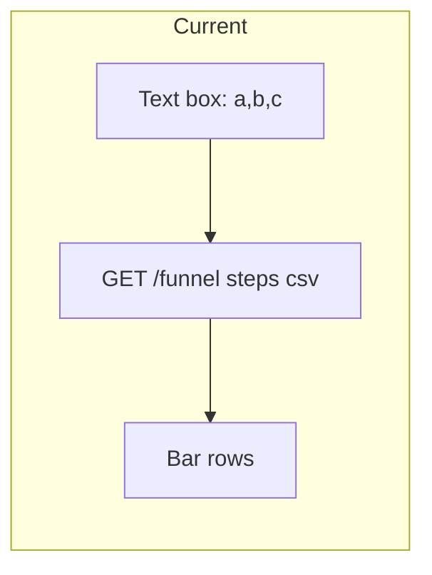
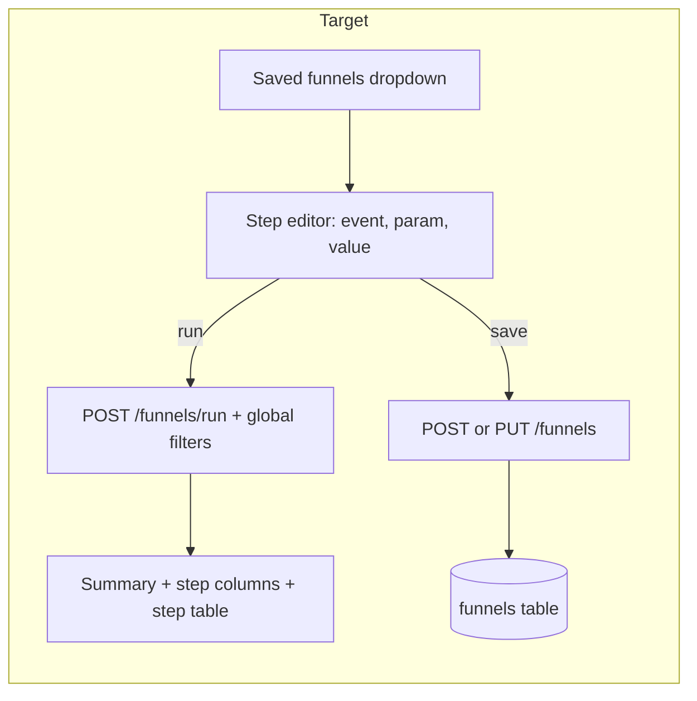
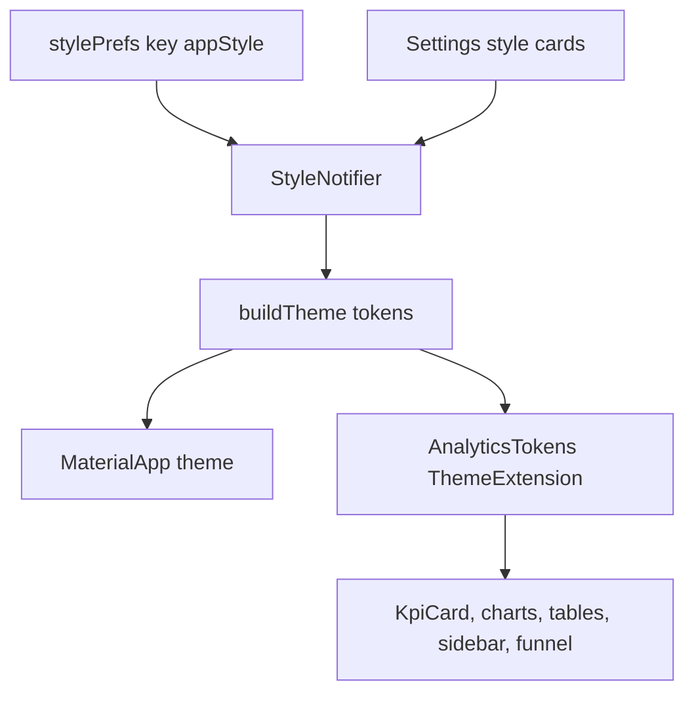

# Spec: GameAnalytics-style Funnels + switchable visual styles (v3)

**Status:** APPROVED by owner 2026-10-06. **Date:** 2026-10-06.
**Builds on:** [gameanalytics-dashboard-design.md](gameanalytics-dashboard-design.md) (v2, implemented).
**Visual reference:** style demo artifact https://claude.ai/artifact/Y3Qpmvo8jHbpuupEfWioDS (all four styles + funnel mock).
**Platform:** Windows first.

## 1. Intent

| | |
|---|---|
| **Problem** | v1/v2 funnel = type comma-separated event names; no param filter, no save, no time window, no timing. UI looks plain. |
| **Goal** | Funnel works like GameAnalytics: pick steps from lists, filter a step by a parameter, save funnels for the team, see conversion / drop-off / time per step. App gets four polished visual styles, switchable in Settings. |
| **Success** | Designer builds "first_open, tut step=1, tut step=3, level_1_start" by clicking only, saves it, teammate opens the same funnel on another PC; style changes instantly from Settings and survives restart. |

### Owner decisions (2026-10-06)

| Decision | Choice |
|---|---|
| Step order | **Strict order** + conversion **time window** |
| Saving | **On server, shared** by the whole team |
| Step filter | **One optional param filter per step** (`key = value`) |
| Styles | **All four**: Tremor Light, shadcn Neutral, Midnight Game, Material 3 Soft; switch in Settings |

### Assumptions (owner may correct)

- Default style **Tremor Light**; style choice stored **per device** (shared_preferences), not shared.
- Window options: **1 hour, 1 day (default), 7 days, Whole range**. Window counted from the player's step-1 time.
- Max **10 steps** per funnel (same cap as v1 route).
- Old v1 `GET /funnel` route stays for compatibility; the Funnel page stops using it.

## 2. Funnel — before / after





## 3. Funnel definition and metrics (authoritative)

`FunnelDef = { name, windowMinutes: int or null, steps: [ { event, paramKey: string or null, paramValue: string or null } ] }`

- A step matches an event row when `event_name = event` and, if `paramKey` set, `CAST(json_extract(params_json, '$.<paramKey>') AS TEXT) = paramValue`. `paramKey` must match `^[A-Za-z0-9_]+$`.
- Rows considered: global filters (date range, platform, version), only events matching some step, ordered by `ts_micros, id` per player; empty `user_pseudo_id` excluded.
- Per player: entry = **first** row matching step 1. Then greedily, for k = 2..n, the first row after the previous matched row (strictly later position in the ordered list) that matches step k and has `ts <= entryTs + window` (no limit when window null). Stop at the first unmatched step.
- Step k **players** = players who matched steps 1..k.
- **From previous** = players(k) / players(k-1); **From first** = players(k) / players(1); **Dropped** = players(k-1) − players(k). Step 1: from previous/dropped = null, from first = 1 (null if players(1) = 0).
- **Median time** for step k ≥ 2 = median of (ts(step k) − ts(step k-1)) in seconds over players who matched step k; null if none. Even count → mean of the two middle values.
- **Total conversion** = players(n) / players(1) (null if players(1) = 0).
- **Biggest drop** = step k ≥ 2 with the lowest *from previous*; ties → earliest k; null if fewer than 2 steps or players(1) = 0.

## 4. Funnel API

| Route | Body / params | Response |
|---|---|---|
| `GET /funnels` | — | `[{"id", "name", "windowMinutes", "steps": [...], "updatedAt"}]` ordered by name |
| `POST /funnels` | `FunnelDef` JSON | created funnel with `id`, 201 |
| `PUT /funnels/<id>` | `FunnelDef` JSON | updated funnel; 404 if unknown |
| `DELETE /funnels/<id>` | — | 204; 404 if unknown |
| `POST /funnels/run` | `{"def": FunnelDef, "from", "to", "platform"?, "version"?}` | `FunnelResult` |
| `GET /events/param-keys` | `name`, `from`, `to` | `["step", "stg", ...]` keys seen on that event, sorted |
| `GET /events/param` | (v1, unchanged) | used to list values for a key |

`FunnelResult = {"steps": [{"index", "event", "paramKey", "paramValue", "players", "fromPrevious", "fromFirst", "dropped", "medianSeconds"}], "totalConversion", "biggestDropIndex"}`.

Validation → 400 `{"error"}`: empty name, 0 or >10 steps, empty event, paramKey without paramValue (or reverse), bad paramKey, windowMinutes not null and ≤ 0, malformed JSON, bad date range. CORS adds `POST, PUT, DELETE` methods.

Storage: new table `funnels (id INTEGER PRIMARY KEY, name TEXT NOT NULL, def_json TEXT NOT NULL, updated_at TEXT NOT NULL)` created by `EventStore` like existing tables. Concurrent edits: last write wins.

## 5. Funnel page (layout matches the demo)

```
[Saved funnels: Onboarding to Level 2 v] [+ New] [Edit] [Delete]
Onboarding to Level 2   [Within 1 day v]  Strict order
Total conversion 45%   Players entered 214   Biggest drop -19% (step 2 to 3)
| 100% | 93% | 75% | 71% | 57% | 45% |   <- columns: kept solid, lost hatched
 1.first_open 2.tut step=1 ...
Table: Step | Event | Filter | Players | From previous | From first | Dropped | Median time
```

Editor (dialog):
- Name text field.
- Step rows: **event** (searchable dropdown from `/events/names`), **param key** (dropdown from `/events/param-keys`, optional), **value** (dropdown from `/events/param` values for that key, optional). Row buttons: move up, move down, duplicate, delete. "Add step" button (disabled at 10).
- Window dropdown. Buttons: Cancel, Run (no save), Save.
- Results always use the global filter bar (date, platform, version).
- Empty state when no saved funnels: "Create your first funnel" button.

## 6. Styles



| Token | Tremor Light | shadcn Neutral | Midnight Game | Material 3 Soft |
|---|---|---|---|---|
| background | #F9FAFB | #FFFFFF | #0B1020 | #F2F4FA |
| sidebar / sidebar text | #FFFFFF / #374151 | #FAFAFA / #3F3F46 | #0E1427 / #AAB4C8 | #E8ECF7 / #3A4256 |
| active nav bg / fg | #EFF6FF / #1D4ED8 | #F4F4F5 / #09090B | #16203A / #67E8F9 | #D6E0FF / #1C3FAA |
| card / border | #FFFFFF / #E5E7EB | #FFFFFF / #E4E4E7 | #131A2E / #1F2A44 | #FFFFFF / none |
| text / muted | #111827 / #6B7280 | #09090B / #71717A | #E5E7EB / #94A3B8 | #1A1F2C / #5B6476 |
| accent (chart 1) | #3B82F6 | #18181B | #22D3EE | #3559E0 |
| chart 2, 3, 4 | #10B981 #8B5CF6 #F59E0B | #2563EB #16A34A #EA580C | #A78BFA #34D399 #FBBF24 | #0E9F8C #C2558E #E08A1E |
| good / bad | #059669 / #E11D48 | #16A34A / #DC2626 | #34D399 / #FB7185 | #0E8A5F / #C2384F |
| grid line | #F1F5F9 | #F4F4F5 | #1A2340 | #EEF1F8 |
| radius | 12 | 10 | 12 | 20 |
| shadow | soft 1px | none (border only) | dark 8px | soft 3px |
| font body / display | Inter / Inter | Geist / Geist | Inter / Chakra Petch | Manrope / Manrope |
| brightness | light | light | dark | light |

- Fonts **bundled as assets** (no runtime download; app must work offline). All are SIL OFL fonts from Google Fonts.
- Every color in widgets comes from `AnalyticsTokens` or `ColorScheme`; no literal `Colors.*` in app widgets (current `KpiCard` green/red moves to good/bad tokens).
- Settings: four style cards (swatches + name + one-line description), selected card highlighted; tap applies immediately and saves.

## 7. Components

| Unit | Responsibility |
|---|---|
| `shared/lib/src/funnel_models.dart` | `FunnelStepDef`, `FunnelDef`, `SavedFunnel`, `FunnelStepResult`, `FunnelResult` + JSON + validation |
| `server/lib/src/funnel_store.dart` | CRUD on `funnels` table |
| `server/lib/src/funnel_engine.dart` | Section 3 computation over `events` |
| `server/lib/src/api.dart` | new routes, JSON body parsing, CORS methods |
| `app/lib/src/theme/app_style.dart` | `AppStyle` enum, token table (section 6), `buildTheme` |
| `app/lib/src/theme/analytics_tokens.dart` | `ThemeExtension<AnalyticsTokens>` |
| `app/lib/src/state/style.dart` | `StyleNotifier` + persistence |
| `app/lib/src/pages/funnel_page.dart` | saved list, results |
| `app/lib/src/widgets/funnel_editor.dart` | editor dialog |
| `app/lib/src/widgets/funnel_chart.dart` | step columns (kept / lost) |
| `app/assets/fonts/*` | bundled TTFs |

## 8. Error / empty states

| Case | Behaviour |
|---|---|
| No saved funnels | Empty state + "Create your first funnel" |
| Step 1 has 0 players | Summary shows "—", columns empty, table zeros, note "No players reached step 1 in this range" |
| Param keys/values unavailable (event absent in range) | Dropdowns show "No values in this range"; event-only step still allowed |
| Save fails (400) | Dialog stays open, error text under the form |
| Server unreachable | `ErrorRetry` like other pages |

## 9. Testing

- Shared: model JSON round trip; validation messages.
- Server: engine cases — strict order (B before A not counted), window boundary (exactly at window counts, 1 µs over does not), whole-range window, param filter match/non-match incl. numeric param vs string value, first-entry rule, median odd/even, total conversion and biggest-drop ties, global filters; store CRUD; route 201/204/404/400 cases; CORS preflight lists POST/PUT/DELETE; param-keys route.
- App: funnel editor (add/reorder/delete/limit 10/save validation), funnel page (empty state, results, biggest drop tag), style switch (Settings tap changes `Theme.of(context).extension<AnalyticsTokens>()` and persists), KpiCard uses tokens.
- Runtime (Windows): build PVM onboarding funnel from real data, save, restart app, funnel still listed; switch all four styles on every page; screenshot each style.

## 10. Out of scope

Any-order mode, funnel compare/segments side by side, CSV export, per-user drill-down, style sync across devices, mobile layouts.
