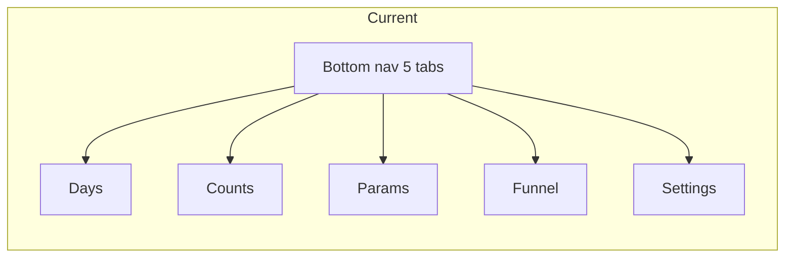
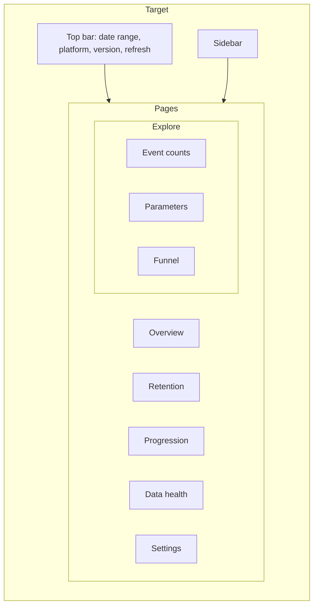
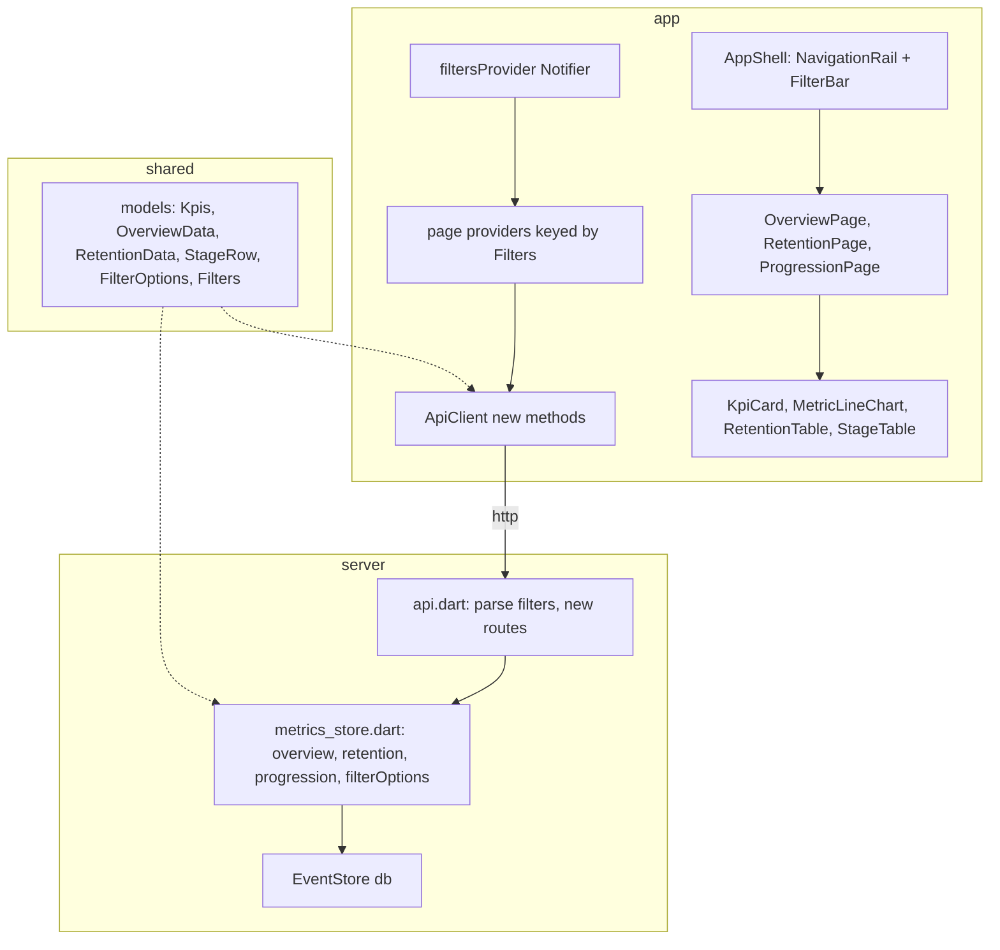

# Spec: GameAnalytics-style dashboards (v2 UI)

**Status:** APPROVED by owner 2026-10-06. **Date:** 2026-10-06.
**Builds on:** [flutter-local-server-stack.md](flutter-local-server-stack.md) (v1, implemented).
**Platform:** Windows first. Other platforms after Windows settles.

## 1. Intent

| | |
|---|---|
| **Audience** | Game designer, PM (not power users). Fixed dashboards, no event names to type. |
| **Model** | GameAnalytics: Overview, Retention, Progression. |
| **Success** | Open app → see installs, active players, D1/D7 retention, and which stage loses players, for any date range / platform / build, without typing anything. |
| **Later (out of scope)** | Query builder (Mixpanel style), saved dashboards, CSV export, country filter, FTU report, mobile layout. |

### Owner decisions (2026-10-06)

| Decision | Choice |
|---|---|
| Style | GameAnalytics, dashboards first |
| Progression source | **New naming only**: `stg_start` / `stg_cmp` / `stg_fail`, stage from param `stg` |
| Retention cohort | Player's **`first_open`** day |
| Global filters | Date range + platform + app version |
| Metric computation | Server SQL per page (new endpoints) |

## 2. Before / after





- Existing Counts / Params / Funnel screens move under an **Explore** group unchanged except: they read the global date range instead of their own `RangeBar`.
- Days screen becomes **Data health** (same content).
- Global filters live in one Riverpod state; every page reads it.

## 3. Layout (Windows)

```
+--------------+-------------------------------------------------------------+
| PVM Analytics| [2026-09-07 -> 2026-10-06 v] [Platform: All v] [Version: All v] [⟳] |
|              +-------------------------------------------------------------+
| > Overview   |  page content                                               |
|   Retention  |                                                             |
|   Progression|                                                             |
|  EXPLORE     |                                                             |
|   Events     |                                                             |
|   Parameters |                                                             |
|   Funnel     |                                                             |
|  ----------  |                                                             |
|   Data health|                                                             |
|   Settings   |                                                             |
+--------------+-------------------------------------------------------------+
```

- Sidebar: `NavigationRail` extended (labels visible), fixed width ~200.
- Date picker presets: Last 7 / 14 / 30 / 60 days, Custom. Default: last 30 days.
- Platform / Version dropdowns fill from `GET /filters`; "All" = no filter.
- Refresh button (existing) also reloads `/filters`.

## 4. Pages

### 4.1 Overview

```
+------------+------------+------------+------------+------------+------------+
| DAU (avg)  | New users  | Sessions   | Sess/DAU   | Playtime/  | Uninstalls |
| 37         | 214        | 511        | 1.4        | DAU 6.2 m  | 128        |
| ▲ 12% vs prev            ...                                               |
+------------+------------+------------+------------+------------+------------+
| [Line chart: DAU per day]            | [Line chart: New users per day]      |
| [Line chart: Sessions per day]       | [Line chart: Uninstalls per day]     |
+--------------------------------------+--------------------------------------+
```

- KPI card: value for range + delta % vs **previous period of same length** (`from - len .. from - 1`). Delta hidden when previous value is 0 or previous period has no data days.
- Charts: one line per metric, every day in range plotted (missing day = 0), hover tooltip shows day + value.

### 4.2 Retention

```
Cohort (first_open) | Players | D1    | D3    | D7    | D14   | D30
2026-10-01          | 41      | 32%   | 20%   |       |       |
2026-09-30          | 12      | 25%   | 8%    | 8%    |       |
...
Weighted avg        | 214     | 28%   | 15%   | 9%    | 5%    | 2%
```

- Cell colour intensity by % (heatmap, one hue).
- Blank cell (not 0%) when `cohort_day + N > last data day` — not yet observable.
- Header line: "D1 28% · D7 9%" summary from weighted averages.

### 4.3 Progression

```
Stage | Players | Starts | Completes | Fails | Win rate | Attempts/clear | Drop-off
1     | 120     | 180    | 110       | 70    | 61%      | 1.4            | 8%
2     | 110     | ...
[Bar chart: players reaching each stage]
```

- Rows ordered by stage number (numeric sort of `stg`).
- Empty state when no `stg_*` events in range: "No stage events yet — builds using `stg_start/stg_cmp/stg_fail` will appear here."

### 4.4 Data health
Current Days screen (pulled days, row counts, missing days) unchanged.

## 5. Metric definitions (authoritative)

All metrics apply the global filters: `day BETWEEN from AND to`, plus `platform = ?` and `app_version = ?` when set. "Player" = distinct `user_pseudo_id` (empty id excluded).

| Metric | Definition |
|---|---|
| DAU (day) | distinct players with any event that day |
| DAU (range KPI) | average of daily DAU over days in range that have data |
| New users | count of `first_open` events |
| Sessions | count of `session_start` events |
| Sessions / DAU | Sessions ÷ sum of daily DAU |
| Playtime / DAU (min) | sum of param `engagement_time_msec` over `user_engagement` events ÷ 60000 ÷ sum of daily DAU |
| Uninstalls | count of `app_remove` events |
| Cohort day | player's earliest `first_open` day (within all stored data); cohort included if its day is in range and its `first_open` event matches platform/version filters |
| Retained DN | cohort players with any event on `cohort_day + N` (exact day, GameAnalytics style) |
| DN observable | `cohort_day + N <= last stored day` (max `pulled_days.day`) |
| Weighted avg DN | sum retained ÷ sum cohort size, over cohorts where DN observable |
| Stage | `CAST(json_extract(params_json,'$.stg') AS INTEGER)`; events with null/non-numeric `stg` ignored |
| Starts / Completes / Fails | count of `stg_start` / `stg_cmp` / `stg_fail` for that stage |
| Players (stage) | distinct players with `stg_start` for that stage |
| Win rate | Completes ÷ (Completes + Fails); blank if both 0 |
| Attempts / clear | Starts by players who completed the stage ÷ number of those players; blank if 0 completers |
| Drop-off | 1 − Players(stage N+1) ÷ Players(stage N); blank for last stage |

## 6. API (new endpoints)

Common query params: `from`, `to` (required, YYYY-MM-DD, from ≤ to), `platform`, `version` (optional). Validation errors → 400 `{"error"}` like v1.

| Route | Response |
|---|---|
| `GET /filters` | `{"platforms": ["ANDROID","IOS"], "versions": ["1.2.0","1.1.0"]}` (versions sorted descending) |
| `GET /overview` | `{"kpis": Kpis, "previous": Kpis or null, "daily": [{"day","dau","newUsers","sessions","uninstalls"}]}` |
| `GET /retention` | `{"offsets": [1,3,7,14,30], "lastDataDay": "YYYY-MM-DD", "cohorts": [{"day","size","retained": [int or null, ...]}], "average": [double or null, ...]}` |
| `GET /progression` | `{"stages": [{"stage","players","starts","completes","fails","winRate","attemptsPerClear","dropOff"}]}` (rates as 0..1 or null) |

`Kpis = {"dau": double, "newUsers": int, "sessions": int, "sessionsPerDau": double or null, "playtimeMinPerDau": double or null, "uninstalls": int}`.
`previous` is null when the previous period has no stored days.

Existing v1 endpoints stay; they gain optional `platform` / `version` filters.

## 7. Components



| Unit | Responsibility |
|---|---|
| `shared/lib/src/filters.dart` | `Filters {from, to, platform?, version?}` value class with `==`, `toQuery()` |
| `shared/lib/src/dashboard_models.dart` | JSON models for section 6 |
| `server/lib/src/metrics_store.dart` | SQL for section 5, takes `Database` from `EventStore` (new `EventStore.metrics` getter) |
| `server/lib/src/api.dart` | Shared filter parsing; 4 new routes |
| `app/lib/src/state/filters.dart` | Global filters Notifier, date presets |
| `app/lib/src/shell/app_shell.dart` | Sidebar + top FilterBar, replaces `HomeShell` |
| `app/lib/src/pages/*` | Overview, Retention, Progression pages |
| `app/lib/src/widgets/*` | `KpiCard`, `MetricLineChart` (with tooltip), `RetentionTable`, `StageTable` |

## 8. Error / empty states

| Case | Behaviour |
|---|---|
| Server unreachable | Page shows `ErrorRetry` (v1) |
| No data in range | Overview cards show 0 / "—", charts flat, banner "No data in this range" |
| Filter value absent in range | Same as no data |
| No `stg_*` events | Progression empty state (4.3) |
| Retention cohorts none | "No installs (first_open) in this range" |

## 9. Testing

- Server: unit tests per metric in section 5 on a seeded in-memory store, including: DAU average skips no-data days; previous period null; retention blank when not observable; cohort uses earliest `first_open`; platform/version filter on cohort; stage cast ignores non-numeric `stg`; win rate / attempts / drop-off blanks.
- API: route tests for params, 400s, JSON shape.
- App: ApiClient parse tests; widget tests for KpiCard delta, RetentionTable blank vs 0%, Progression empty state, filter change refetches.
- Runtime: Windows build against imported real data (5,002 events); compare New users / sessions totals with Firebase console for the same range.

## 10. Open items for owner

- None blocking. Confirm Explore group keeps the old Counts / Params / Funnel screens (assumed yes).
