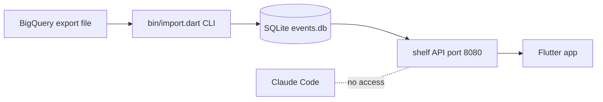
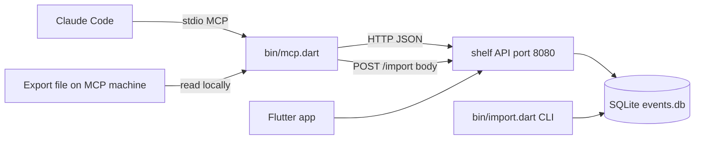
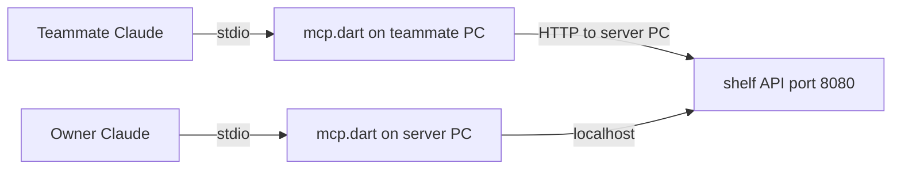
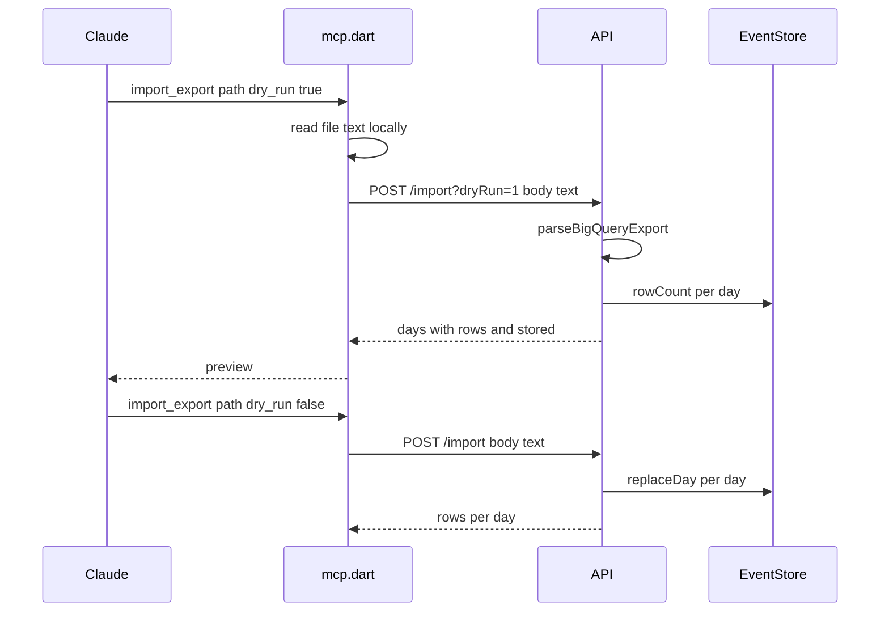

# Spec: AnalyticTracker MCP server (v4)

**Date:** 2026-10-07
**Status:** Approved 2026-10-07 — plan `mcp-server-implementation.md`
**Related:** `flutter-local-server-stack.md` (v1 API), `gameanalytics-dashboard-design.md` §5 (metric definitions), `funnels-and-styles-design.md` §3–4 (funnels, amended 2026-10-07)

## 1. Intent (owner decisions, 2026-10-07)

| Topic | Decision |
|---|---|
| Purpose | Let Claude use the app: **analysis + manage saved funnels + data ops** |
| Users | **Owner now, team later** — local first, but adding teammates must not need a rewrite |
| Approach | **A: Dart stdio MCP that calls the existing HTTP API** (not direct SQLite, not `/mcp` inside shelf) |
| Pull trigger | Out of scope until the IAM blocker is fixed (would only return 403) |
| Raw SQL tool | Out of scope — bypasses the spec metric definitions |
| API auth | Out of scope now; **required before the API is opened to the team** (§7) |

Success = Claude Code, in this repo, answers metric questions with the same numbers the app shows, runs and edits team funnels, and safely previews then applies a manual BigQuery export import.

## 2. Architecture

### Current flow



### Target flow



The MCP is a **pass-through adapter**: each tool maps its arguments to one API call and returns the API's JSON as text. No metric logic or model classes are duplicated, so the MCP cannot drift from what the app shows. Validation stays on the server.

### Team later (no code change)



A teammate runs the same entry point with `--server http://<server-pc>:8080`. Prerequisite: §7 API token.

## 3. Units

| Unit | Path | Role | Depends on |
|---|---|---|---|
| Entry point | `server/bin/mcp.dart` | Parse `--server <url>` (default `http://localhost:8080`), start the stdio MCP server, log to **stderr only** | `mcp_tools.dart`, `dart_mcp` |
| Tool layer | `server/lib/src/mcp_tools.dart` | Tool schemas + one handler per tool that builds one HTTP request. Takes an injected `http.Client` and base URL. No transport code | `http`, `dart_mcp` types |
| MCP server | `server/lib/src/mcp_server.dart` | `MCPServer with ToolsSupport` registering every tool; takes any `StreamChannel<String>` (stdio or in-memory for tests) | `mcp_tools.dart`, `dart_mcp` |
| Import route | `server/lib/src/api.dart` | New `POST /import` | existing `parseBigQueryExport`, `importExport`, `EventStore.rowCount` |
| Registration | `.mcp.json` (repo root) | Registers server `analytic-tracker` for Claude Code in this project | — |

New direct dependencies in `server/pubspec.yaml`: `dart_mcp: ^0.5.2` (official Dart-team package; SDK `^3.7.0`, local SDK 3.13.5), `http` (already transitive via googleapis — make it direct).

`.mcp.json`:

```json
{
  "mcpServers": {
    "analytic-tracker": {
      "command": "cmd",
      "args": ["/c", "dart", "run", "server/bin/mcp.dart", "--server", "http://localhost:8080"]
    }
  }
}
```

`dart` resolves to `D:\flutter\bin\dart.bat`, which Claude Code cannot spawn directly on Windows, hence `cmd /c`. Measured 2026-10-07: `dart run` start → MCP initialize in ~3 s. If that ever exceeds the client's connect timeout, use `dart compile exe` and point `command` at the exe.

## 4. Tools

Common filter arguments for metric tools — `from`, `to` (required, `YYYY-MM-DD`), `platform?`, `version?`, `include_test?` (bool, default false → sent as `test=1` only when true).

| Tool | HTTP call | Arguments beyond filters | Annotation |
|---|---|---|---|
| `data_health` | `GET /days` → `{"days": [...], "missingDays": [...]}` (gaps between first and last stored day) | — (no filters) | readOnly |
| `filter_options` | `GET /filters` | — (no filters) | readOnly |
| `list_events` | `GET /events/names` | — (no filters) | readOnly |
| `overview` | `GET /overview` | — | readOnly |
| `retention` | `GET /retention` | — | readOnly |
| `progression` | `GET /progression` | — | readOnly |
| `event_counts` | `GET /events/count` | `name?` | readOnly |
| `param_keys` | `GET /events/param-keys` | `event` | readOnly |
| `param_values` | `GET /events/param` | `event`, `key` | readOnly |
| `list_funnels` | `GET /funnels` | — (no filters) | readOnly |
| `run_funnel` | `POST /funnels/run` | exactly one of `id` (saved funnel, def fetched via `GET /funnels`) or `def` (FunnelDef JSON) | readOnly |
| `save_funnel` | `POST /funnels`, or `PUT /funnels/<id>` when `id` given | `def`, `id?` | write — shared with team |
| `delete_funnel` | `DELETE /funnels/<id>` | `id` | destructive |
| `import_export` | `POST /import?dryRun=1` or `POST /import` | `path` (file on the MCP's machine), `dry_run` (default **true**) | destructive |

- `def` uses the amended funnel shape: `{name, windowMinutes, steps: [{event, params: [{key, value}]}]}`.
- Tool descriptions state the metric meaning in one line each (e.g. "DAU = distinct non-empty user_pseudo_id per day; test devices excluded unless include_test") so Claude picks the right tool without reading specs.
- Results: the API's JSON body as a single text content item. Large lists are not truncated (current data is small; revisit if a response exceeds ~100 KB).

## 5. `POST /import` (server)



| Case | Response |
|---|---|
| `dryRun=1`, valid | 200 `[{"day", "rows", "stored"}]` sorted by day; DB unchanged |
| apply, valid | 200 `{"<day>": rows}` (existing `importExport` result) |
| malformed text / bad `day` | 400 `{"error"}` with the `FormatException` message |
| empty body | 400 `{"error": "Request body must be a BigQuery export"}` |

The server never receives a file path — the MCP sends file **contents**. This avoids a server-side arbitrary-file-read and lets a teammate import a file from their own PC.

Risk carried into the tool description: each day in the file **replaces all stored rows for that day**. The dry-run `stored` vs `rows` columns make a partial export visible before applying.

## 6. Error handling

| Situation | Tool result |
|---|---|
| API unreachable | `isError`, text: `AnalyticTracker server not reachable at <url>. Start it: cd server; dart run bin/server.dart` |
| API 4xx with `{"error"}` | `isError`, the server's message |
| API other non-2xx | `isError`, `HTTP <status>` |
| `run_funnel` with both / neither `id` and `def` | `isError` before any HTTP call |
| `run_funnel` / `delete_funnel` unknown id | `isError`, `Funnel <id> not found` |
| `import_export` file missing/unreadable | `isError`, the path and OS message |
| Logging | stderr only — stdout is the MCP protocol channel |

## 7. Security

- Local stdio, no new listening port. Write tools are gated by Claude Code's per-tool permission prompt (`destructiveHint` on delete/import).
- Existing gap, unchanged by this spec: the shelf API has **no auth**; anyone on the LAN can already write funnels, and will be able to call `/import`. Acceptable while single-user on one PC. **Before "team later"**: add a shared token header checked by the API and sent by the MCP (separate spec).

## 8. Testing and verification

### Automated (server suite)

| Test file | Covers |
|---|---|
| `server/test/mcp_tools_test.dart` | `MockClient`: each tool's method, path, query/body; `include_test` maps to `test=1`; `run_funnel` id-xor-def; 400 surfaces server message; connection failure message; `import_export` reads file and sends `dryRun=1` by default |
| `server/test/api_import_test.dart` | dry-run counts and DB unchanged; apply replaces days; re-import idempotent; malformed and empty body 400 |
| `server/test/mcp_e2e_test.dart` | In-process `dart_mcp` server over a stream channel pair: `tools/list` returns all 14 tools; one `tools/call` round trip |

Gate: `dart analyze shared server` clean; `dart test` in `server/` passes.

### Runtime (owner-visible)

1. `claude mcp list` shows `analytic-tracker` connected.
2. Ask Claude for DAU and D1 retention, last 30 days, test devices excluded — numbers match the app's Overview / Retention pages.
3. `run_funnel` on saved "Level 1-2 progression" — 79 entered, 4% total.
4. `import_export` dry run on the earlier manual export — preview shown, DB `row_count`s unchanged.
5. Server stopped → tool returns the "not reachable" message.

## 9. Out of scope

`pull_now` / pull status (until IAM), raw SQL, API token (prerequisite for team use, own spec), HTTP/streamable MCP transport, MCP resources/prompts, result truncation/paging.
