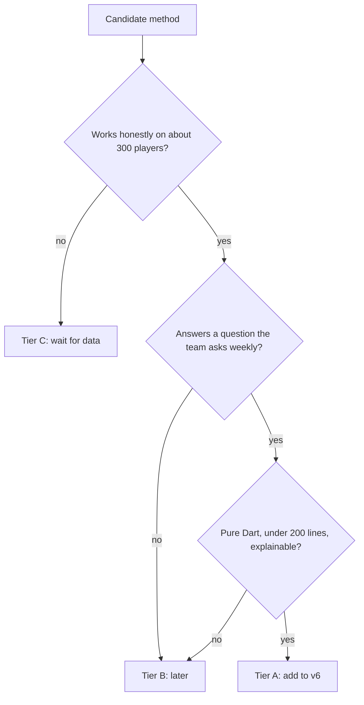
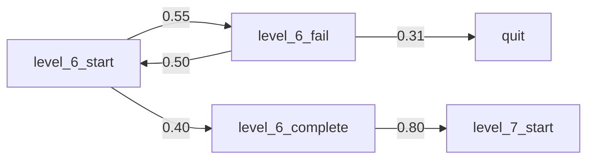
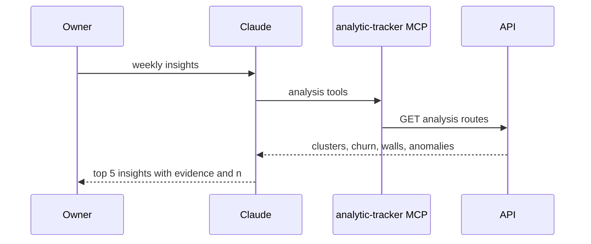

# Research: AI / ML methods for the Analytic tab

**Date:** 2026-10-07 · **Feeds:** `.cursor/plans/analytic-tab-design.md` (v6 spec, draft)
**Already in v6 spec:** k-means player clusters, churn drivers (effect size), event associations (lift), anomaly alerts (robust z).

## 1. The constraint that decides everything

| Fact (2026-10-07) | Value |
|---|---|
| Players / events / days | 282 / 5,002 / 57 |
| Players active 2+ days | 72 |
| Level events | `level_N_start/complete/fail`, levels 0..12+ |
| Monetization signal | `pet_buy` 3 players, `Reward_request_success` 5 players |

Rule of thumb: a supervised model needs roughly **10+ positive cases per input feature** before its output means anything. With 72 multi-day players, a predictive churn model using 15 features would mostly memorize noise. Methods that **describe** data (curves, rates, rules with sample counts) stay honest at this size. Methods that **predict** per player must wait for more data.

## 2. Scorecard

Score 1–3 per column (3 = best). **Fit** = honest at current data size. **Value** = how directly it changes a design decision. **Cost** = Dart effort (3 = cheap).

| # | Method | What it finds (PVM example) | Fit | Value | Cost | Tier |
|---|---|---|---|---|---|---|
| 1 | **Level difficulty + quit wall** (Beta-smoothed win rate, per-level dropout hazard) | "Level 6: 35% win rate, 40% of players who reach it never start level 7" | 3 | 3 | 3 | **A** |
| 2 | **Survival curves** (Kaplan–Meier + log-rank test) | "Players on v1.4 survive past day 3 at 41% vs 28% on v1.3 (p = 0.04)"; handles players who joined recently (censoring) correctly, unlike raw D-N retention | 3 | 3 | 3 | **A** |
| 3 | **Churn rules** (shallow decision tree, depth ≤ 3, min leaf 10) | "IF level_fails on day 1 ≥ 3 AND no rewarded ad → 82% left (n = 17)" — readable rules instead of a black-box score | 2 | 3 | 2 | **A** |
| 4 | **Last actions before quitting** (Markov transition graph + exit-event ranking) | "31% of churned players' last event was `level_6_fail`"; next-event probabilities between events | 3 | 3 | 3 | **A** |
| 5 | **Version impact** (bootstrap confidence intervals, before/after release) | "v1.5 changed level-3 win rate by +12 pts (95% CI +3..+21)" | 2 | 3 | 3 | **A** |
| 6 | **AI narrative** (Claude reads all analysis results via the existing MCP tools and writes plain-language "Top 5 insights this week") | Turns tables into sentences; cross-links findings ("cluster 'Grinders' = the level-6 quit wall") | 3 | 3 | 3 | **A** |
| 7 | Outlier players (Isolation Forest) | Bots, cheaters, untagged test devices | 3 | 2 | 2 | B |
| 8 | Gaussian mixture / HDBSCAN | Soft cluster membership, odd-shaped groups | 2 | 1 | 2 | B |
| 9 | PCA 2D map of players | Scatter plot of clusters | 2 | 1 | 2 | B |
| 10 | DAU forecast (Holt–Winters, weekly season) | "Expected DAU next 7 days" + alert when actual leaves the band | 2 | 2 | 2 | B |
| 11 | Sequential patterns (PrefixSpan) | Frequent multi-step paths | 1 | 2 | 1 | B |
| 12 | Churn probability per player (logistic regression / Cox) | Risk score per player | 1 | 2 | 2 | C |
| 13 | Gradient boosting / XGBoost churn | Higher accuracy; published early-churn studies report ROC-AUC ~0.76 on large datasets | 1 | 2 | 1 | C |
| 14 | LTV prediction, uplift modeling, LSTM/deep sequence models | Spend forecasts, treatment effects | 1 | 1 | 1 | C |

## 3. Tier A details

### 3.1 Level difficulty + quit wall

- Win rate per level = `complete / (complete + fail)`, smoothed with a Beta prior from the all-level average (empirical Bayes), so a level with 3 attempts does not show 0% or 100%.
- Quit hazard per level = players whose **last** level event is level N / players who reached N.
- Output: a chart over levels with two lines (win rate, quit hazard). "Walls" are levels where hazard is more than 2× the median.
- Reads `level_*` names. The existing Progression page uses `stg_*`, which is nearly empty in real data, so this also fills that gap.

### 3.2 Survival curves

- Time = days from first event to last event. Censored = player seen in the last 7 days of data (still playing).
- Kaplan–Meier curve, split by version, platform or cluster. Log-rank test p-value between curves.
- Replaces "is D7 retention better?" guesses with a curve that uses every player, including ones who joined recently.

### 3.3 Churn rules

- Same first-24 h features and churn label as the v6 churn-drivers wave (§5 of the spec).
- CART tree, Gini split, depth ≤ 3, min leaf 10 players, so at most 8 rules. Each leaf is shown as an IF rule with `n` and % left.
- Builds on churn drivers: drivers say which single features differ; rules show combinations.

### 3.4 Last actions before quitting

- Per churned player: last 3 events before their final session ended. Rank events by "share of churned players whose last event was X" vs the same share among players who stayed (lift).
- Transition matrix over the top 15 events + `quit` state, shown as a table of strongest next-steps.

### 3.5 Version impact

- For each metric (D1 survival, level win rates, sessions per player): compare the new version's players vs the previous version's players.
- Bootstrap 1,000 resamples (fixed seed) → 95% CI on the difference. Show only differences whose CI excludes 0, with `n` per side.
- The same bootstrap helper can add confidence intervals to clusters and churn drivers (an honesty upgrade for the whole tab).

### 3.6 AI narrative (the "AI" layer)

| Option | How | Trade-off |
|---|---|---|
| **a. Via MCP (recommended first)** | No app code. Each analysis wave already adds an MCP tool; add one MCP **prompt** `weekly_insights` that tells Claude which tools to call and how to cite `n` | Only people with Claude Code see it |
| b. In-app "Explain" button | Server calls the Claude API with the analysis JSON, caches the text per day | Needs an API key on the server + cost per call; BUG-0010 (no auth) must be fixed first |

## 4. Tier B / C — why not now

| Method | Revisit when |
|---|---|
| Isolation Forest outliers | Team suspects bots/cheaters, or test-device tagging misses devices |
| GMM / HDBSCAN / PCA | k-means clusters look forced (silhouette < 0.25 repeatedly) |
| DAU forecast | 120+ days of data (two full months of weekly cycles beyond the baseline) |
| PrefixSpan | Markov exits (3.4) leave questions about longer paths |
| Per-player churn score, XGBoost, Cox | ~1,000+ players with 2+ active days; then add a holdout test and report ROC-AUC |
| LTV, uplift, deep models | Real IAP volume and A/B tests exist |

## 5. Suggested placement in v6

| v6 wave | Content |
|---|---|
| 1 | Clusters (as spec) |
| 2 | Churn drivers + **churn rules** (shared label + features) |
| 3 | **Level difficulty + quit wall** + **last actions before quitting** |
| 4 | **Survival curves** + **version impact** (shared bootstrap helper) |
| 5 | Associations + anomalies (as spec) |
| any time | **AI narrative** via MCP prompt (grows with each wave's tools) |

## Sources

- [Predicting and understanding early player churn in a F2P mobile game using ML (Univ. Oulu)](https://oulurepo.oulu.fi/handle/10024/63513)
- [Micro- and macro-level churn analysis of large-scale mobile games](https://experts.arizona.edu/en/publications/micro-and-macro-level-churn-analysis-of-large-scale-mobile-games/)
- [Statistical Modelling of Level Difficulty in Puzzle Games (arXiv 2107.03305)](https://arxiv.org/abs/2107.03305)
- [Playtime Measurement with Survival Analysis (arXiv 1701.02359)](https://arxiv.org/pdf/1701.02359)
- [Personalized Game Difficulty Prediction Using Factorization Machines (arXiv 2209.13495)](https://arxiv.org/pdf/2209.13495)
- [GameAnalytics AnalyticsIQ product page](https://platform.softwareone.com/product/gameanalytics-analyticsiq/PCP-6223-2389)
- [GameAnalytics docs](https://docs.gameanalytics.com/)
