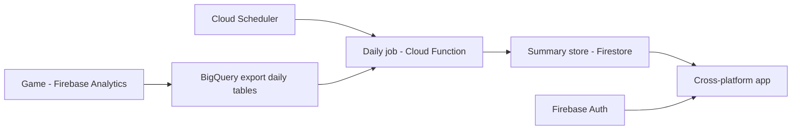

# Research: Cross-platform stack comparison for AnalyticTracker

**Date:** 2026-10-06 · **Status:** research input, no decision made · **Author:** Claude (from training knowledge, cutoff mid-2026 — re-check version/maturity claims marked ⚠ before deciding)

## 1. Requirements the stack is measured against

| # | Requirement | Weight |
|---|---|---|
| R1 | One codebase → Windows, Android, iOS, Web | Must |
| R2 | Good chart + data-table UI (line/bar/funnel, sortable tables, filters) | Must |
| R3 | Firebase Auth + Firestore (or REST) access from client | Must |
| R4 | Learnable by a C#/Unity developer, mostly solo build | High |
| R5 | Low maintenance: stable tooling, big community, easy release | High |
| R6 | Team sharing (web link) + store/desktop installs | Medium |
| R7 | Performance (render a few thousand points smoothly) | Low — dashboards are network-bound |

The client stack does **not** do the daily data pull. That runs as a separate cloud job in every option:

Backend language is a separate, smaller choice (section 4).

## 2. Candidates

### 2.1 Flutter (Dart)

- **What:** Google UI toolkit; renders its own widgets (Skia/Impeller) on every platform.
- **Platforms:** Windows, macOS, Linux, Android, iOS, Web — all stable.
- **Pros**
  - True single codebase for all R1 targets; pixel-identical UI.
  - Official Firebase SDK (FlutterFire): Auth, Firestore, Analytics, Remote Config.
  - Charts: `fl_chart` (free), `syncfusion_flutter_charts` (free community licence for small companies ⚠ check terms), `graphic`. Tables: `data_table_2`, `pluto_grid`/`trina_grid`.
  - Hot reload, strong tooling (VS Code / Android Studio), large community.
  - Dart is close to C#: classes, async/await, generics, null safety. Learning: days–2 weeks.
- **Cons**
  - Web build heavier (first load ~2–4 MB, CanvasKit/WASM); text selection/SEO weaker — acceptable for a logged-in dashboard.
  - Not native widgets (Material/Cupertino look-alikes).
  - New language + ecosystem (pub.dev) to learn.
- **Fit:** R1 ✅ R2 ✅ R3 ✅ R4 ✅ R5 ✅ R6 ✅ R7 ✅ → **best overall**.

### 2.2 Web app / PWA (React + TypeScript)

- **What:** Website; "install" as PWA on desktop/Android; optionally wrapped (Capacitor/Electron/Tauri) for stores.
- **Pros**
  - One URL for the team; deploy = upload (Firebase Hosting free tier); no store review.
  - Largest chart/table ecosystem: Apache ECharts, Recharts, Chart.js, AG Grid, TanStack Table.
  - Firebase JS SDK official and mature.
  - Easiest to add a BigQuery-console-like experience later.
- **Cons**
  - iOS PWA limits: weaker push, storage eviction, no App Store presence without Capacitor wrapper.
  - Desktop/mobile feel less native; offline needs extra work.
  - Two new things for a C# dev: TypeScript + React mental model.
- **Fit:** R1 ⚠ (iOS partial) R2 ✅✅ R3 ✅ R4 ⚠ R5 ✅ R6 ✅✅ R7 ✅ → **strong runner-up**, best if "share a link" matters most.

### 2.3 Rust — Tauri 2

- **What:** Rust backend core + system WebView frontend (HTML/JS/TS UI). Tauri 2 (2024) added Android/iOS.
- **Pros**
  - Tiny desktop binaries (~5–10 MB), low RAM vs Electron.
  - Memory-safe, fast native core; good security model (capability permissions).
  - Frontend can reuse any web chart lib (ECharts etc.).
- **Cons**
  - **Two languages**: Rust (core) + TS/React (UI). UI work is really the web option.
  - Mobile support young ⚠: fewer plugins, more platform friction.
  - Web target = just ship the frontend separately; Rust core doesn't run there.
  - No official Firebase Rust SDK → REST APIs by hand (auth token refresh, Firestore REST).
  - Rust learning curve steep (ownership/borrow checker): weeks–months.
- **Fit:** R1 ⚠ R2 ✅ (via web) R3 ⚠ R4 ❌ R5 ⚠ R6 ✅ R7 ✅✅ → good for small fast desktop apps; overkill here.

### 2.4 Rust — Dioxus / egui (pure Rust UI)

- **What:** Dioxus = React-like Rust UI (web/desktop/mobile); egui = immediate-mode GUI (desktop + WASM).
- **Pros**
  - Single language (Rust), runs on WASM for web.
  - egui excellent for internal tools/debug UIs; `egui_plot` built in.
- **Cons**
  - Young ecosystems ⚠: few polished chart/table widgets; Dioxus mobile experimental.
  - egui looks like a developer tool, not a product.
  - No Firebase SDK; highest effort per feature; steep learning curve.
- **Fit:** R1 ⚠ R2 ⚠ R3 ❌ R4 ❌ R5 ❌ R6 ⚠ R7 ✅✅ → **not recommended**.

### 2.5 .NET MAUI (C#)

- **What:** Microsoft cross-platform native UI (successor of Xamarin.Forms).
- **Pros**
  - C# + Visual Studio/Rider — zero language cost for the owner.
  - Native controls on Windows/Android/iOS/macOS.
  - Charts: LiveCharts2, Syncfusion MAUI (community licence ⚠), Telerik (paid).
- **Cons**
  - **No web target.** Web needs a separate Blazor app (can share C# models/services via a Blazor Hybrid setup, but UI duplicated or Blazor-everywhere).
  - Reputation for tooling bugs, slow builds, platform-specific glitches ⚠.
  - Firebase: community bindings (Plugin.Firebase) — not official; or REST.
- **Fit:** R1 ❌ (web separate) R2 ⚠ R3 ⚠ R4 ✅✅ R5 ⚠ R6 ⚠ R7 ✅ → only if C# outweighs web.

### 2.6 Avalonia (C#)

- **What:** Cross-platform XAML UI framework (WPF-like), own renderer (Skia).
- **Platforms:** Windows/macOS/Linux stable; Android/iOS and Browser (WASM) supported but less mature ⚠.
- **Pros**
  - C#, familiar XAML/MVVM; one codebase incl. web via WASM.
  - More stable desktop story than MAUI; used by JetBrains tools.
  - Charts: LiveCharts2, ScottPlot (Avalonia control), OxyPlot.
- **Cons**
  - Mobile + web less polished; WASM first load large.
  - Smaller community/third-party ecosystem.
  - Firebase via REST or community packages.
- **Fit:** R1 ✅⚠ R2 ⚠ R3 ⚠ R4 ✅✅ R5 ⚠ R6 ⚠ R7 ✅ → **best C# option**.

### 2.7 Unity (C#)

- **Pros:** Known tool + C#; builds every platform; official Firebase Unity SDK.
- **Cons:** Game engine, not app framework — no real table/chart/form widgets, large builds, heavy WebGL, poor text/accessibility, battery cost on mobile. Rebuilding basic dashboard UI by hand.
- **Fit:** R1 ✅ R2 ❌ R3 ✅ R4 ✅ R5 ❌ R6 ❌ R7 ⚠ → **not recommended**.

## 3. Scorecard

Scores 1–5 (5 best).

| Stack | All platforms | Charts/tables | Firebase | Learn (C# dev) | Maintenance | Sharing | **Total /30** |
|---|---|---|---|---|---|---|---|
| Flutter | 5 | 4 | 5 | 4 | 4 | 4 | **26** |
| Web PWA (React/TS) | 3 | 5 | 5 | 3 | 5 | 5 | **26** |
| Avalonia | 4 | 3 | 2 | 5 | 3 | 3 | **20** |
| .NET MAUI | 2 | 3 | 3 | 5 | 2 | 2 | **17** |
| Rust Tauri 2 | 3 | 4 | 2 | 1 | 3 | 4 | **17** |
| Unity | 4 | 1 | 4 | 5 | 1 | 1 | **16** |
| Rust Dioxus/egui | 2 | 2 | 1 | 1 | 2 | 2 | **10** |

Tie-breaker Flutter vs PWA: Flutter wins on native iOS/desktop installs; PWA wins on one-link sharing and chart richness.

## 4. Backend (daily job) language — separate choice

| Option | Pros | Cons |
|---|---|---|
| **Python** Cloud Function | Official `google-cloud-bigquery` + `firebase-admin`; most examples; ~50 lines | Third language if client is Dart/TS |
| **Node/TypeScript** Cloud Function | Same language as a PWA client; official SDKs | — |
| **Dart** (Cloud Run / Dart Frog / Serverpod) | Same language as Flutter, shared models | Fewer GCP examples; BigQuery via REST/`googleapis` package |
| **C#** Cloud Run | Owner's language; official Google.Cloud.BigQuery | Container setup; heavier than a function |
| BigQuery **Scheduled Query** only | Zero code: SQL writes summary table daily | Needs billing; app must then read BigQuery (needs a small API) |

## 5. Recommendation (for discussion, not decided)

1. **Flutter + Python job** — best balance for all-platform + team + solo dev.
2. **React/TS PWA + Node job** — if web-link sharing dominates and iOS app-store presence is unimportant.
3. **Avalonia + C# job** — if staying in C# is the priority.

Rust is a strong language but its strengths (systems performance, memory safety) don't match a network-bound dashboard; cost is learning curve + missing Firebase SDK.

## 6. Open questions for the owner

- Must the iOS version be a real App Store app, or is "open the web link on iPhone" enough? (decides Flutter vs PWA)
- Is learning a new language acceptable, or is C# a hard requirement? (decides Avalonia)
- Will BigQuery billing be enabled? (affects job design + history retention)

## 7. To verify before deciding (⚠ items)

- Current Tauri 2 mobile maturity, Avalonia mobile/WASM maturity, Dioxus mobile status.
- Syncfusion community licence terms for the team size/revenue.
- Flutter Web current bundle size with WASM renderer.
