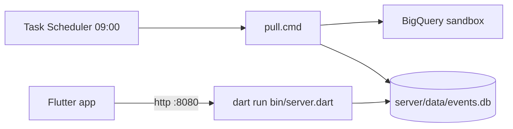

# Run AnalyticTracker locally

## 1. One-time setup (server PC)

1. Firebase console → Project settings → Integrations → BigQuery → link, enable **Daily** export.
2. Google Cloud console → IAM & Admin → Service accounts → create one with roles **BigQuery Data Viewer** and **BigQuery Job User** → Keys → add JSON key → save as `server/secrets/service-account.json`.
3. Copy `server/config.example.json` to `server/config.json`; set `projectId`, `datasetId` (`analytics_<number>`, see BigQuery console) and `location` (dataset Details).
4. Add the Flutter SDK `bin` folder (e.g. `D:\flutter\bin`) to your **user PATH** — the scheduled pull calls `dart`.
5. Windows build only: enable **Developer Mode** (`start ms-settings:developers`) — Flutter plugins need symlinks.
6. From repo root: `flutter pub get`.

## 2. Pull data

- Manual: `cd server; dart run bin/pull.dart config.json`
- Daily: run `server/tools/register-pull-task.ps1` once in PowerShell. Log: `server/logs/pull.log`.
- Exit codes: 0 ok, 1 some days failed (retried next run), 2 aborted (config/auth).
- **Sandbox deletes BigQuery tables after 60 days.** If the pull fails for 60 days in a row, those days are lost. Check `pull.log` and the app's Days tab ("missing").

## 3. Serve

`cd server; dart run bin/server.dart config.json` → listens on all interfaces, port from config (default 8080).

Phones on Wi-Fi: allow the port once (admin PowerShell):
`New-NetFirewallRule -DisplayName 'AnalyticTracker 8080' -Direction Inbound -Protocol TCP -LocalPort 8080 -Action Allow -Profile Private`

## 4. App

- Windows: `cd app; flutter run -d windows`
- Web: `cd app; flutter run -d chrome`
- Android/iOS: `flutter run` with a device; then Settings tab → server URL `http://<PC LAN IP>:8080` (find IP with `ipconfig`).

## 5. Backup

Stop the server, copy `server/data/events.db` (plus `-wal`/`-shm` if present). This file is the only long-term history.

## 6. Claude MCP

Claude Code in this repo can query the dashboard through the `analytic-tracker` MCP server (`.mcp.json`, spec `.cursor/plans/mcp-server-design.md`).

1. Start the API server (section 3) — the MCP calls it; it does not open the database itself.
2. Open Claude Code in `D:\Projects\AnalyticTracker`; approve the `analytic-tracker` project server when asked. `claude mcp list` should show it connected.
3. Tools: `data_health`, `filter_options`, `list_events`, `overview`, `retention`, `progression`, `event_counts`, `param_keys`, `param_values`, `list_funnels`, `run_funnel`, `save_funnel`, `delete_funnel`, `import_export`.
4. `import_export` previews by default (`rows` in file vs `stored` per day). Each day in the file **replaces** that day's stored rows when applied with `dry_run: false`.

Teammate on another PC (after an API token exists — spec §7): same `.mcp.json` entry with `--server http://<server PC LAN IP>:8080`.
